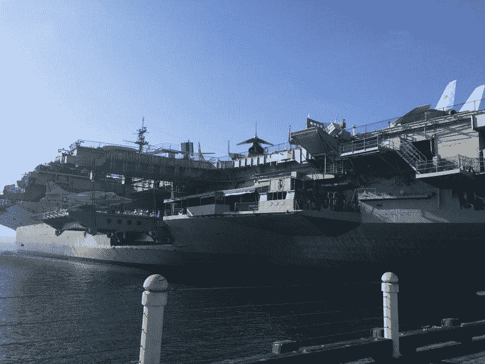
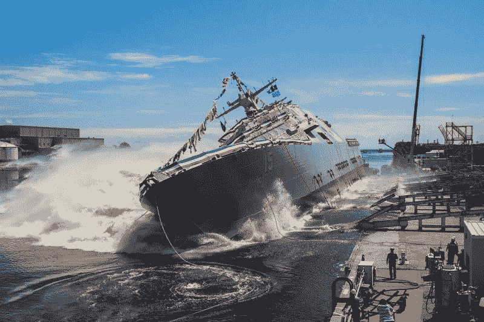
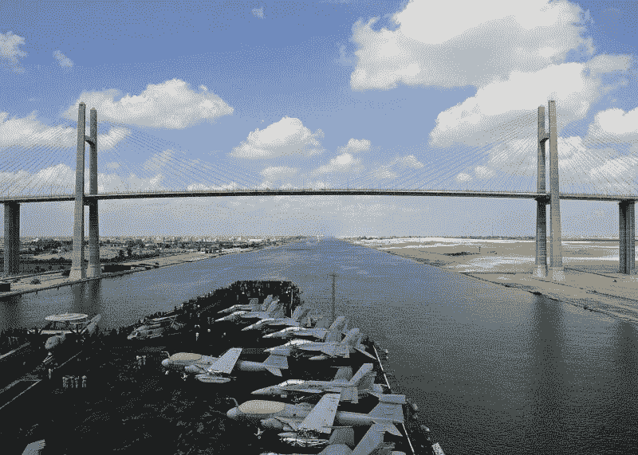
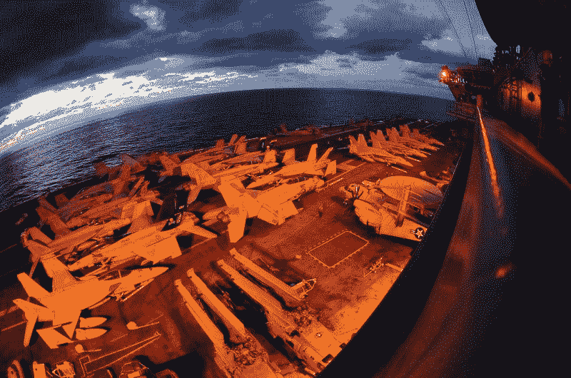
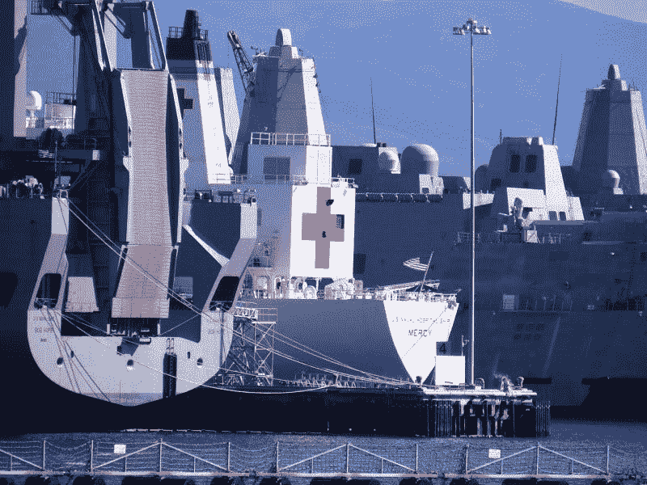

# 亨廷顿·英格尔斯(HII)赚钱了吗？—市场疯人院

> 原文：<https://medium.datadriveninvestor.com/is-huntington-ingalls-hii-making-money-market-mad-house-9685fb63348a?source=collection_archive---------19----------------------->

美国最大的海军造船商**亨廷顿·英格尔斯(HII)** 可以从 DC 局势的正常化中获益。

[**亨廷顿英格尔斯(纽约证券交易所代码:HII)**](https://www.huntingtoningalls.com/who-we-are/) 建造包括核潜艇、航空母舰和海岸警卫队快艇在内的战舰。今天，DC 的常态意味着民主党人和共和党人一起努力提高国防预算和购买更多的武器。

因此，像亨廷顿英格尔斯这样的国防承包商从常态中获利。常态可能会恢复，因为当选总统乔·拜登(特拉华州民主党人)是一名保守的民主党人，他支持高国防开支。

# 正常对亨廷顿·英格尔斯来说是好事

例如，有人猜测拜登会任命米歇尔·弗卢努瓦为美国国防部长。弗卢努瓦是一个臭名昭著的战争鹰派，他支持高额军费开支。可以预见的是，反战媒体如琼斯母亲已经开始攻击弗卢努瓦可能的任命。

值得注意的是，**亨廷顿英格尔斯(HII)** 股价从总统大选前的 2020 年 10 月 29 日的 142.97 美元涨到 2020 年 11 月 23 日的 165.11 美元，2020 年 11 月 30 日跌至 159.52 美元。相反，市场先生在 2020 年 1 月 2 日为 HII 支付了 255.85 美元。

拜登可能同意海军扩张的一个原因是，造船是共和党人将支持的少数几个就业项目之一。亨廷顿英格尔斯公司声称雇佣了 42，000 多名员工。此外，亨廷顿英格尔斯公司声称是弗吉尼亚州和密西西比州最大的工业雇主。

我认为亨廷顿英格尔斯的股价表明，市场先生认为华盛顿 DC 将很快恢复正常。解释一下，亨廷顿英格尔斯的投资者认为，拜登总统将批准海军扩张，国会将为海军扩张提供资金。

密西西比州是一个重要的共和党州，而弗吉尼亚州正再次成为民主党的大本营。因此，前美国参议员拜登将面临强大的压力，要求他通过订购更多军舰来帮助他在参议院的老朋友。

# 什么是亨廷顿英格尔斯？

**亨廷顿英格尔斯(HII)** 是造船商**诺斯罗普·格鲁曼公司**在 2011 年分拆出来的。

亨廷顿英格尔斯工业公司在弗吉尼亚州纽波特纽斯经营着美国海军最古老和最重要的造船厂。亨廷顿英格尔斯公司声称已经建造了超过 70%的美国海军战舰。

亨廷顿英格尔斯是美国海军唯一的航空母舰建造商，也是建造核潜艇的两家公司之一。亨廷顿英格尔斯最近的项目包括美国海岸警卫队的旗舰宙斯盾导弹驱逐舰，以及美国海军和海军陆战队的两栖攻击舰。

 [## 10 月份投资的最佳股票|数据驱动型投资者

### 根据最近的回报，这些股票在 10 月份及以后会有不错的表现。随着市场看到一点…

www.datadriveninvestor.com](https://www.datadriveninvestor.com/2020/10/19/the-best-stocks-to-invest-in-october/) 

# 美国需要航母吗？

其中，亨廷顿·英格尔斯公司拥有建造下一艘美国海军航空母舰“约翰·肯尼迪号”的合同。然而，我认为航空母舰在当今世界可能没有什么价值。

解释一下，我认为航空母舰将是下一场战争中无人机和导弹的[巨型浮动目标。这些航空母舰要么呆在港口，要么在战争开始的日子里被击沉，类似于二战中的战列舰。](https://marketmadhouse.com/350-drone-penetrated-security-5-02-billion-aircraft-carrier/)

值得注意的是，一些国防分析家认为[号航母不能在距离中国海岸 900 海里](https://nationalinterest.org/blog/buzz/china-says-it-could-sink-us-navy-aircraft-carriers-might-not-be-accurate-164390)的范围内活动，因为中国有航母杀手导弹。因此，美国需要更多航母来与中国进行第二次冷战的观点是有争议的。

另一方面，美国可能需要更多的航空母舰，因为像拜登总统这样的鹰派人物会希望将美国的力量投射到全世界。然而，拜登也希望避免更多的地面战争。因此，美国将需要更多的无人驾驶飞机和战斗机的浮动基地，因此美国航空母舰将需要更多的航空母舰。

即使航空母舰是无用的，亨廷顿英格尔斯建造军舰，可以打下一场战争。例如，核潜艇可能变得比以往任何时候都更重要——如果敌人击沉了所有的航空母舰。值得注意的是，亨廷顿·英格尔斯刚刚向舰队交付了最新的弗吉尼亚级核潜艇[蒙大拿号](https://newsroom.huntingtoningalls.com/releases/montana-ssn-794-prepares-for-launch)。

因此，亨廷顿英格尔斯可以从第二次冷战中获利。然而，中国人将不得不同意参与第二次冷战。我个人认为中国人不是俄罗斯人。解释一下，我认为中国人会无视美国，专心赚钱，这让美国的战鹰派很失望。

# 亨廷顿英格尔斯挣多少钱？

亨廷顿·英格尔斯(HII)正在赚钱。截至 2020 年 9 月 30 日，该公司的季度毛利为 4.36 亿美元，营收为 21.34 亿美元。

此外，亨廷顿英格尔斯报告 2020 年 9 月 30 日的季度营业收入为 2.22 亿美元。季度运营收入从 2020 年 6 月 30 日的 5700 万美元。此外，季度毛利从 2020 年 6 月 30 日的 2.64 亿美元增长，季度收入从同日的 20.27 亿美元增长。

斯托克罗估计，在截至 2020 年 9 月 30 日的季度中，亨廷顿英格尔斯的收入[以 4.28%](https://newsroom.huntingtoningalls.com/releases/montana-ssn-794-prepares-for-launch) 的速度增长。因此，亨廷顿英格尔斯报告了疫情的收入增长。

此外，亨廷顿英格尔斯报告称，截至 2020 年 9 月 30 日，季度运营现金流为 2.22 亿美元。季度运营现金流从 2020 年 6 月 30 日的 2.01 亿美元。

因此，亨廷顿英格尔斯报告 2020 年 9 月 30 日的季度末现金流为 1.13 亿美元。不幸的是，我认为公司借了很多钱。为了解释这一点，亨廷顿英格尔斯报告称，2020 年 6 月 30 日的融资现金流为 4.77 亿美元。2020 年 9 月 30 日，融资现金流降至-4200 万美元。

# 亨廷顿英格尔斯有什么价值？

**亨廷顿英格尔斯工业(HII)** 在 2020 年 6 月 30 日有 7.44 亿美元的现金和短期投资，总资产为 84.45 亿美元。因此，亨廷顿·英格尔斯有一定的价值。

亨廷顿英格尔斯的价值案例很容易确定。亨廷顿英格尔斯赚钱，它有一个客户；五角大楼不会缺钱。此外，美国当前的政治领导层似乎致力于维持一支强大的军队。此外，五角大楼到处都是制造新威胁的专家，以证明采购更多武器的合理性。

相反，我不认为美国公众普遍支持庞大的军队。然而，美国公众对军事事务不感兴趣，这使得国会可以在武器上花费巨额资金，而不引起注意。

# 亨廷顿英格尔斯是一个很好的股息股票

此外，**亨廷顿英格尔斯(HII)** 于 2020 年 11 月 25 日支付了 1.14 美元的季度股息。季度股息从 2020 年 8 月 27 日的 1.03 美元。因此，HII 的股息在一个月内增长了 11₵。

归根结底，我认为亨廷顿英格尔斯是一只很好的赚钱股票，它的股息很高。因此，你会从亨廷顿英格尔斯赚钱。

亨廷顿英格尔斯公司存在严重的道德问题，因为它是一家武器制造商。例如，它建造核潜艇。如果你能忍受军工复合体，亨廷顿英格尔斯就是一只好股票。那些不喜欢武器和战争的人需要避开 HII。

*原载于 2020 年 11 月 30 日*[*【https://marketmadhouse.com】*](https://marketmadhouse.com/is-huntington-ingalls-hii-making-money/)*。*

## 访问专家视图— [订阅 DDI 英特尔](https://datadriveninvestor.com/ddi-intel)