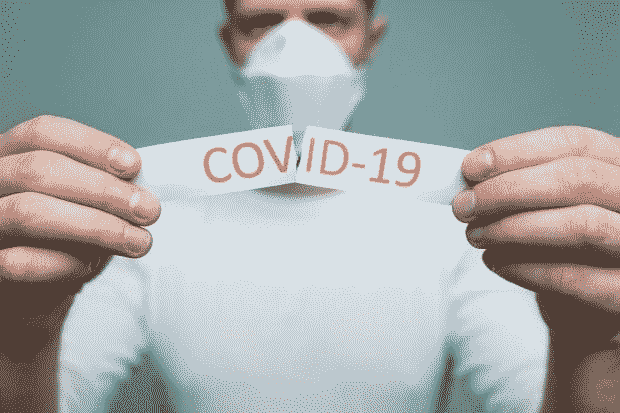
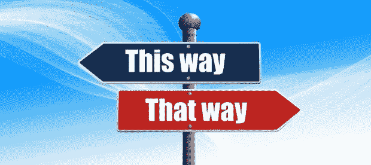

# 不平等就是不平等吗？

> 原文：<https://medium.datadriveninvestor.com/is-inequality-unequal-d16b3311f133?source=collection_archive---------7----------------------->

有一句波兰谚语说，对于一个穷人来说，风总是吹进眼睛里。还有类似的英语谚语，如“穷人必须为所有人买单”、“穷小子永远不会赢”或“祸不单行”但它们都没有很好地概括出一个老生常谈的事实，即对于弱势群体来说，无论发生什么都意味着麻烦。我们当中最富裕的人，往往能够以一种顺风顺水的方式来定位自己。我们中的许多人至少有时可以达到同样的目标，也许偶尔会遭受痛苦，或者找到一个庇护所。弱者，一直都在向上爬。

# 美国有反乌托邦社会吗？

当我读到乔·平斯克最近发表在*《大西洋月刊》*上的文章“[疫情将把美洲一分为二](https://www.theatlantic.com/family/archive/2020/04/two-pandemics-us-coronavirus-inequality/609622/)**”**时，我想起了这句波兰谚语。在他的长篇文章中，平斯克先生煞费苦心地列出了我们当中最贫穷的人在遇到新冠肺炎时面临的所有不利条件。

他们已经有更多的健康问题，他们获得医疗保健的机会不足。他们在疫情开放的服务行业工作。他们的家庭通常将几代同堂的家庭聚集在紧凑的居住空间。这些情况使他们面临更高的感染和死亡风险。当他们工作时，他们的孩子呆在家里无人照看。如果没有互联网服务，或者服务质量较差，他们的孩子会比其他人更落后。他们靠薪水生活，没有钱储备，如果有人失业、生病或死亡，他们会比我们大多数人受到更严重的伤害。

平斯克先生详细阐述了我们在新冠肺炎疫情经历的差异，令人印象深刻。他证实了其他人的谨慎，即弱势群体将比其他人遭受更多的痛苦。他的结论没有任何新闻价值，即新冠肺炎将给我们留下比以前更严重的不平等。在阅读他的报告时，在某个时候，我开始想知道写这些显而易见的东西的目的是什么。

在文章中间，平斯克先生引用了一位残疾女士的话，给了我们一个提示:“没有现金储备，美国的生活总是很艰难。”我们应该假设没有闲钱，其他地方的生活会更好吗？再往前几段，读者会发现，像这样看似无辜的引用，以及一长串的不平等，只是平斯克先生扔给我们的炸弹的火炮准备。他这样做是因为他明确指出，美国的不平等有一种“*通常是反乌托邦的性质。*“反乌托邦”一词源自古希腊语，描述一个不好的地方。在字典中，“反乌托邦”指的是[一个存在巨大苦难或不公正的社会](https://www.lexico.com/en/definition/dystopian)，或者是一个以人类苦难为特征的社会，比如肮脏、压迫、疾病和过度拥挤。换句话说，平斯克先生写的不是新冠肺炎的经历。对他来说，这是一个告诉我们美国有多可怕的借口。

# 了解美国

来自世界各地的数百万人冒着生命危险来到这里。他们被剥夺了平斯克先生已经拥有的智慧吗？或者，他们知道一些平斯克先生遗漏的事情吗？我们必须承认，许多有影响力的人都同意平斯克先生的观点，即美国充满了苦难、不公正和压迫。我们所有痛苦的根源是什么？这个紧迫的问题一点也没有激怒平斯克先生。

平斯克先生的信息让我觉得可疑，因为我没有感觉到其中的人情味。他写的是远方的低收入人群。他没有去那位残疾女士的住处看望她。他没有和她谈论她的困境。对于《大西洋月刊》的作者来说，她是他从专家汇编的报告中获得的统计准确图片的抽象说明，似乎也分析统计数据，但不与有问题的个人交谈。我不知道，但我怀疑来自贫困家庭的孩子不是他在学校的伙伴。很可能，他从未和他声称非常关心的人在同一个团队工作过。

我在芝加哥地区从事服务行业已经超过 30 年了。我有最富有和最贫穷的顾客。在我的工作中，我遇到了平斯克先生非常关心的几千个家庭。他们是我的顾客。在芝加哥最糟糕的街区，我在他们的住处拜访了至少几百人。我们坐在他们的餐桌旁谈论生意。在某个时候，平斯克先生支持的许多人都是我的员工。帮助有需要的人是人类的基本本能；因此，通过一点点指导，我可能比《大西洋月刊》帮助了更多我遇到的男人和女人。我在这篇[文章](https://medium.com/datadriveninvestor/cash-is-king-more-potent-than-we-think-98f422843a7a?source=friends_link&sk=728b7e57c895b1c7342325206bc2b7b5)中举了一个例子。

我也见过许多成功的移民。很明显，几乎不会说英语的低技能移民经常在美国茁壮成长。几代人以来，许多美国人一直坚信，美国的机遇是他们力所不及的。他们没有看到一个讽刺，他们向新来的移民支付租金，并在移民拥有的街角商店或[加油站购物。](https://www.datadriveninvestor.com/glossary/gas/)

我曾经统计过那些成为百万富翁的移民，就我个人而言。做了一些推断，我估计仅仅是在这个国家，一个人成为百万富翁的机会至少比玩乐透好几百倍。我还是偶尔会通过买彩票来做一个高风险高回报但是低水平的投资。但是当我排队花掉我的 1 美元时，我看到在我前面的人递给店员至少几张 20 美元的钞票来购买彩票。我的理性猜测是，许多重度彩票玩家与平斯克先生代表的是同一类人。

在拜访他们的住处时，我没有在他们的桌子上看到大西洋*,但看到了他们的电视，并私下知道他们花在看电视上的钱比我认为合理的要多得多。这就是我所知道的美国。因此，当平斯克先生感叹约 40%的美国成年人手头没有足够的现金来支付 400 美元的意外开支时，他听起来并不令人信服。那些几乎不识字的移民在到达这里几年后买了他们的第一套六层公寓，他们到达时也没有现金。*

# *美国被一分为二*

*美国没有贫富之分。真正的分歧在于理解美国应该是什么样子。平斯克先生对不平等现象感到悲哀，他小心翼翼地避免告诉我们他追求的是什么样的平等。是不是应该像文化大革命时期的中国一样，从上到下每个人都应该穿一样的衣服，吃一样的食物，住一样的地方？还是应该像瑞典那样，他们在玩弄社会主义，像宜家创始人英格瓦·康普拉德这样的企业家需要离开这个国家去创业？*

**

*从本质上来说，人是不同的。有些人渴望拥有一栋巨大的房子，门把手是纯金打造的。其他人满足于简陋的公寓，只要他们能读他们感兴趣的书或听他们喜欢的音乐。可悲的是，一些人满足于整天看电视，只要他们头上有屋顶，不饿。平等不应该意味着所有人都应该有追求自己喜欢的生活方式的同等权利吗？但平等难道不应该意味着我们理解，在困难时期，不是所有人都会过得一样好吗？*

*平斯克先生唤起我们的同情心，认为美国是一个可怕的地方是理所当然的，甚至不问我们为什么会变成这样。他的哀叹暗示我们这些富裕的人应该拿出一点财富来帮助穷人。这让我想起了查尔斯·默里的《T2》一书。我的生活经历与他收集的数据产生了共鸣，也与他的结论产生了共鸣，即在我们的福利政策实施了大约半个世纪之后，我们比以前有更多的美国人生活在经济和道德衰退的状态中。*

*在每个社会中，都有一些人没有分享到大多数人所经历的繁荣。对某些人来说，希望这只是暂时的衰落。慈善机构可以帮助他们和那些永久残疾的人。在美国，无论我们为消除贫困做了什么，都会导致更多的美国人陷入对社会支持的依赖。更少的国家实现了像新冠肺炎那样抵御风暴所需的金融稳定。*

*然而，移民们不断取得的成功证明，尽管有种种缺点，美国仍然是一个为那些敢于尝试的人提供平等机会的国家。摆在我们面前的实际问题是，为什么我们中的许多人甚至在尝试之前就放弃了。读一读平斯克先生对这件事的看法会很有意思。*

*【https://www.datadriveninvestor.com】原载于 2020 年 4 月 22 日**。***