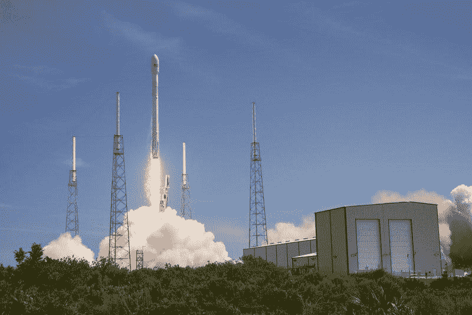
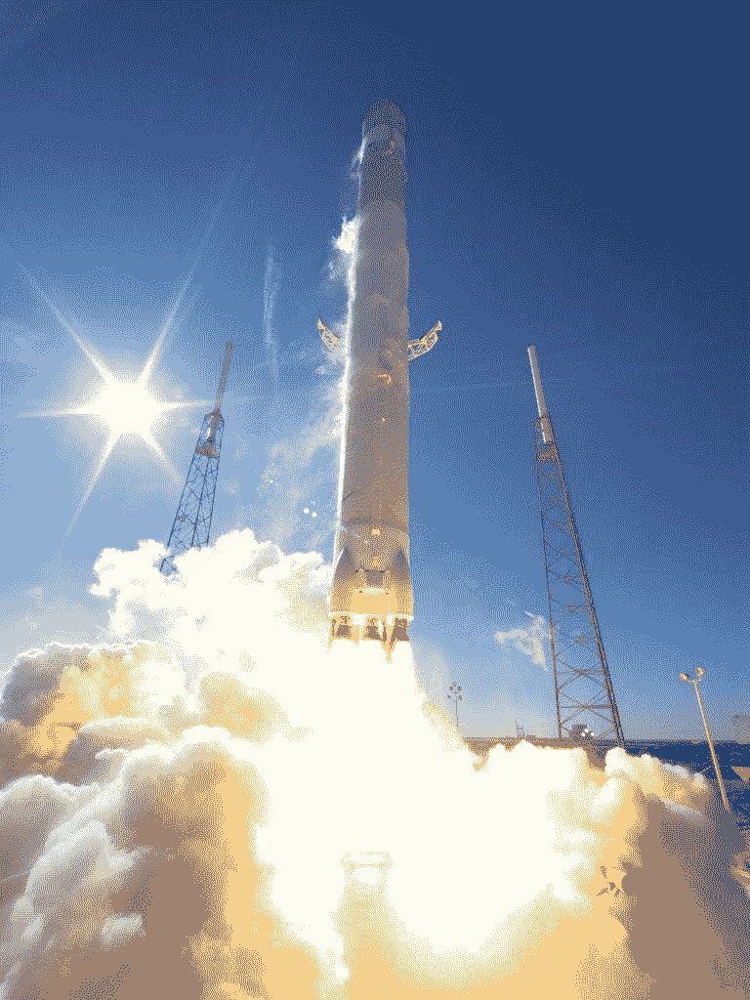
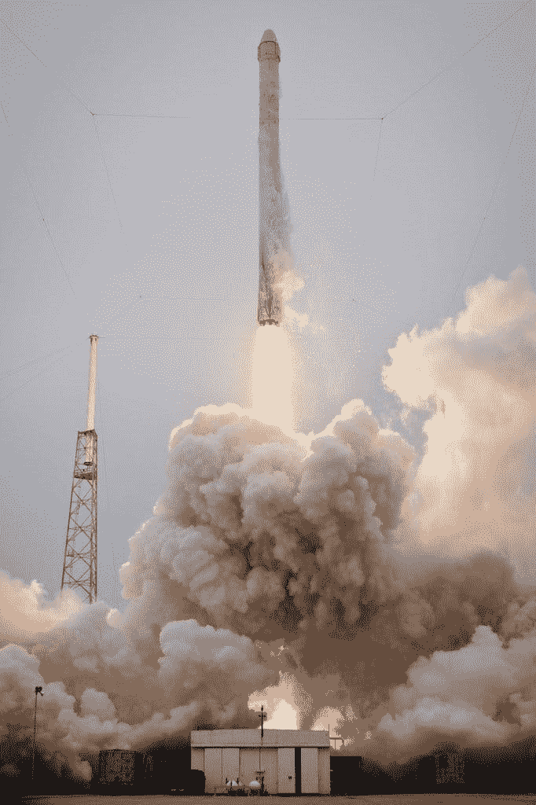

# IRDM 铱星公司赚钱了吗？—市场疯人院

> 原文：<https://medium.datadriveninvestor.com/is-iridium-irdm-making-money-market-mad-house-149bd93c3740?source=collection_archive---------13----------------------->

铱星公司(IRDM)可以向我们展示埃隆·马斯克的 Starlink 计划是否能赚钱。

**铱星通信公司(纳斯达克股票代码:IRDM)** 运营着[一个由 66 颗低地球轨道通信卫星](https://www.iridium.com/network/)组成的网络，为地球上的任何地方提供电话和数字通信。SpaceX 子公司 Starlink 计划通过数千颗低轨卫星在全球范围内提供高速无线互联网。

铱星是 Starlink 的一个很好的基准，因为铱星已经提供卫星宽带、数据、语音、云服务、 [L 波段服务](https://www.iridium.com/services/iridium-certus/)、[物联网](https://www.iridium.com/solutions/iot/) (IoT)、陆地移动电话、海上通信、军事通信、企业解决方案、政府服务和航空通信。

因此，我认为铱星公司已经运营了一个全球卫星无线互联网。因此，铱星显示星联是可行的。

# 灾难能提振铱星的股票吗？

奇怪的是，灾难可以促进铱星公司的业务。解释一下，害怕灾难会切断他们的互联网和电话服务的人们会购买铱星产品。

特别是，我认为一些远程工作的专业人士可以购买**铱星(纳斯达克股票代码:IRDM)** 产品，这样他们就可以继续工作并赚钱。其他人希望在危机中保持娱乐选择，如播客、流媒体视频和视频游戏。

然而，冠状病毒疫情导致铱星公司的股价在 2020 年 3 月 18 日跌至 17.91 美元。相比之下，铱星的股价在 2020 年 2 月 12 日升至 2020 年高点 31.87 美元。

2020 年 9 月 1 日，铱星股价回升至每股 29.12 美元。2020 年，铱从 2020 年 1 月 2 日的 24.84 美元涨到 2020 年 10 月 6 日的 27.86 美元和 2020 年 10 月 8 日的 28.62 美元。

# 铱星公司会从全球变暖灾难中获利吗

我认为铱(IRDM)公司可能会迎来利润丰厚的十年，因为灾难的数量正在增加。

保险信息研究所估计，美国灾难的数量从 2018 年的 55 起增加到 2019 年的 61 起。特别是，2019 年，美国发生了 49 次破坏性雷暴、16 次灾难性冬季风暴、9 次热带气旋、9 次洪水和 9 次野火。许多灾难切断了互联网、无线和电话服务。

例如，*政治*报道，2020 年 8 月，加州遭遇了 19 年来第一次连续停电。这可能有助于铱星公司，因为轮流停电可能会关闭互联网和无线服务。

我认为企业对铱星公司的服务会有更大的需求。**沃尔玛(WMT)**；例如，可以使用铱星公司的云来连接其商店。Starlink 可以通过类似的解决方案获利。

 [## 为什么大多数人在日内交易中亏损(以及如何不成为他们中的一员)|数据驱动的投资者

### 日内交易很难，大多数人都赔钱。我确实有。事实上，我曾经在一个单一的损失更多的钱…

www.datadriveninvestor.com](https://www.datadriveninvestor.com/2020/09/23/why-most-people-lose-money-day-trading-and-how-to-not-be-one-of-them/) 

# 加州燃烧铱利润

国际货币基金组织(IMF)预测，我认为对这种连接的需求将会增长，因为全球变暖将增加与天气相关的灾害的频率。解释更热的天气会导致更多的飓风、干旱、野火和其他灾难。

例如，加州正在经历有史以来最严重的野火季节。据美联社报道，一场名为八月综合火灾的大火比 1932 年到 1999 年间加州所有的火灾烧毁的土地都多。八月的大火正在旧金山湾区和俄勒冈州界之间的地区燃烧。

据加州林业和消防部门估计，2020 年，加州有超过 8200 场野火烧毁了超过 400 万英亩的土地。我相信像加利福尼亚大火这样的灾难会破坏互联网、移动电话和电话服务，从而增加对铱的需求。例如，火灾会摧毁电话线和移动信号塔。

# 铱星赚钱吗？

铱公司(IRDM)几乎不赚钱。例如，铱星公司报告 2020 年 6 月 30 日的季度营业收入为 583 万美元。

季度营业收入从 2020 年 3 月 31 日的 1182 万美元下降到 2019 年 12 月 31 日的 0 美元。此外，铱星公司在 2020 年 12 月 31 日的季度毛利为 1.041 亿美元。季度毛利于 2020 年 3 月 31 日增长至 1.1103 亿美元，于 2020 年 6 月 30 日下降至 1.0497 亿美元。

另一方面，铱星公司报告 2020 年 6 月 30 日季度普通净亏损为-1242 万美元。季度共同净亏损从 2020 年 3 月 31 日的-3，170 万美元和 2019 年 12 月 31 日的-1.0786 亿美元下降。

# 铱星能产生多少现金？

铱星公司(IRDM) 产生了更多的现金。铱星公司报告，截至 2020 年 6 月 30 日，季度运营现金流为 6372 万美元。季度运营现金流从 2020 年 3 月 31 日的 4081 万美元上升至 2019 年 12 月 31 日的 5569 万美元。

铱星公司的季度期末现金流从 2019 年 12 月 31 日的-1.4319 亿美元上升至 2020 年 3 月 31 日的 6729 万美元。2020 年 6 月 30 日，季度终了现金流降至 5183 万美元。

重要的是，我不认为铱星公司在借钱。为了解释这一点，铱星公司在 2020 年 6 月 30 日报告了 306 万澳元的融资现金流。这一数字从 2020 年 3 月 31 日的-1.863 亿美元和 2019 年 12 月 31 日的-1.846 亿美元下降。融资现金流显示铱星公司花了多少钱来偿还债务。

# 铱星公司收入缩水

因此，看起来铱星公司在 2020 年赚了更多的钱。然而，铱星公司的收入在 2020 年已经缩水。

铱星公司的季度收入从 2020 年 3 月 31 日的 1.4529 亿美元下降到 2020 年 6 月 30 日的 1.4017 亿美元。此外，Stockrow 估计，在截至 2020 年 6 月 30 日的季度中，铱星公司的收入增长下降了 [2.05%](https://stockrow.com/IRDM/financials/income/quarterly) 。相比之下，在截至 2020 年 3 月 31 日的季度，铱星的收入增长了 8.68%。

我认为冠状病毒正在侵蚀铱星公司的收入。我的猜测是，由于冠状病毒，铱星公司的一些航空和商业客户赚的钱更少了。

由于冠状病毒，许多航空公司仍在取消航班。加拿大广播公司估计，2020 年 9 月，加拿大航空公司和西捷航空[取消了 439 次航班](https://www.cbc.ca/news/business/airlines-flights-cancelled-covid-1.5729643)。加拿大广播公司声称，仅加拿大航空公司在 2020 年一天就损失了 1900 万美元，收入下降了 95%。

# 铱有什么价值？

我认为铱星公司的潜在价值是巨大的，因为它拥有低轨卫星和通信基础设施。

由于无人机和自动驾驶汽车的使用越来越多，铱星公司的物联网基础设施可能会有利可图。例如，铱星公司的物联网可以运营一支无人驾驶卡车车队。值得注意的是，**沃尔玛(WMT)** 正在测试[自动驾驶的福特全顺货车](https://techcrunch.com/2019/07/27/gatiks-self-driving-vans-have-started-shuttling-groceries-for-walmart/#:~:text=Gatik%20AI%2C%20the%20autonomous%20vehicle,through%20a%20partnership%20with%20Walmart%20.&text=The%20AVs%20will%20aim%20to,slivers%20of%20Walmart's%20overall%20business.)，据 *TechCrunch* 报道，该货车由 Gatik 的技术操控。

然而，目前铱的价值不大。例如，**铱星(IRDM)** 报告 2020 年 6 月 30 日的现金和短期投资为 1.1911 亿美元，总资产为 33.74 亿美元。然而，我不认为这些数字证明了 2020 年 10 月 6 日 27.48 美元的股价是合理的。

# 为什么投资者需要研究铱

我认为**铱星通信(IRDM)** 是一家值得关注的科技公司。铱星公司有一些潜在的有利可图的技术，但我认为高昂的费用限制了它产生现金的能力。

然而，如果你正在寻找一只具有巨大增长潜力的廉价科技股，铱星公司值得一看。铱星公司可以拥有理论上可以产生大量资金的基础设施。

*原载于 2020 年 10 月 8 日 https://marketmadhouse.com***。**

## *访问专家视图— [订阅 DDI 英特尔](https://datadriveninvestor.com/ddi-intel)*