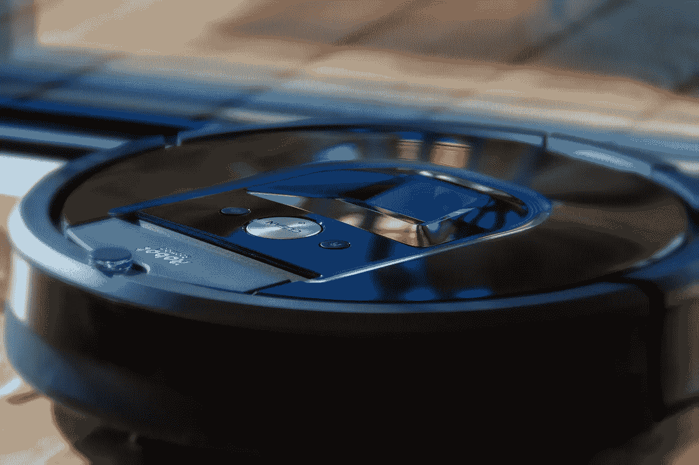
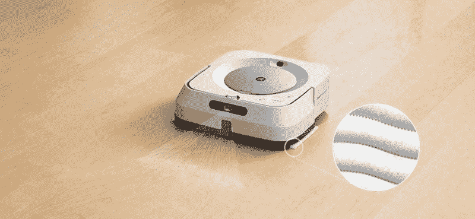
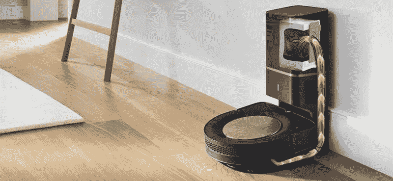
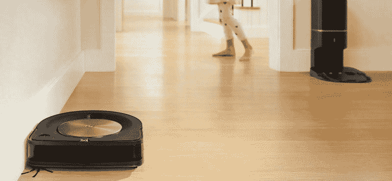
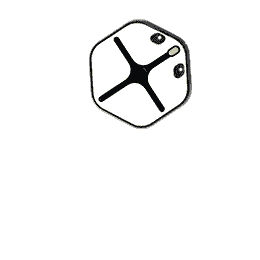

# iRobot 赚钱了吗？—市场疯人院

> 原文：<https://medium.datadriveninvestor.com/is-irobot-making-money-market-mad-house-bb83a47db5d3?source=collection_archive---------28----------------------->

那些担心机器人将取代我们工作的人会想知道 iRobot 公司(纳斯达克股票代码:IRBT)是否赚钱？

iRobot 制造了已经成为社交媒体明星的 [Roomba 机器人吸尘器](https://marketmadhouse.com/is-irobot-making-money/#:~:text=iRobot%20is%20the%20largest%20company,total%20market%20share%20in%202018.)和 [Braava 机器人拖把](https://www.irobot.com/braava)。麻省理工学院人工智能实验室的一组研究人员于 1990 年开始开发和销售消费机器人。

iRobot 的清洁机器人已经成为标志性产品。iRobot 的其他产品包括 2014 年停产的 Mirra 游泳池清洁机器人、Create hobby 机器人和机器人割草机。

除了制造清洁机器人，iRobot 还为警察和军队制造拆弹机器人。iRobot 还生产用于紧急情况的重型机器人，如日本福岛第一核电站的反应堆。然而，iRobot 在 2016 年离开了军用机器人业务。

# iRobot 是好股票吗？

市场先生喜欢 **iRobot(纳斯达克股票代码:IRBT)** 。2020 年，其股价从 2020 年 1 月 2 日的 48.63 美元上涨至 2020 年 7 月 8 日的 87.98 美元。然而，iRobot 的股价在 2020 年 7 月 27 日跌至 72.44 美元，在 2020 年 7 月 30 日升至 73.60 美元。

iRobot 声称已经在全球售出了超过 3000 万台家用机器人。此外, [Barron 声称](https://www.barrons.com/articles/irobot-stock-spikes-as-roomba-vacuum-sales-soar-amid-shutdown-51592243480)由于冠状病毒，iRobots 的销量正在激增。为了解释，害怕从清洁工那里感染冠状病毒的房主正在订购 Roombas 和 Braavas。

一般来说，人们希望他们的家干净，以防止新冠肺炎病毒的传播。然而，许多人太懒或太忙而没有时间打扫，所以他们订购了 iRobot 产品。

不幸的是，我找不到 iRobot 的销售数据。另一方面， [Statista 估计](https://www.statista.com/statistics/1068291/united-states-robotic-vacuum-cleaner-installed-base/) iRobot 在 2019 年拥有美国机器人吸尘器市场 82%的份额。 [Statista 还估计](https://marketmadhouse.com/is-irobot-making-money/#:~:text=iRobot%20is%20the%20largest%20company,total%20market%20share%20in%202018.) iRobot 在 2018 年控制了全球清洁机器人市场 52%的份额。

因此，我不能认为 iRobot 是一只好股票，因为销售数据很少。此外，iRobot 不支付股息，这使它成为普通人的糟糕选择。

 [## 机器人会接管我们的餐馆吗？创业视角|数据驱动的投资者

### Tau Ventures 是硅谷的一个应用人工智能基金，食品自动化是我们的核心关注点之一，包括

www.datadriveninvestor.com](https://www.datadriveninvestor.com/2020/06/21/will-robots-take-over-our-restaurants-a-startup-view/) 

# iRobot 赚钱吗？

iRobot 的收入在冠状病毒疫情期间有所增长。例如，iRobot 报告 2020 年 3 月 31 日的季度收入为 1.9253 亿美元，2020 年 6 月 30 日增长到 2.7988 亿美元。

此外，iRobot 的季度毛利从 2020 年 3 月 31 日的 7，795 万美元上升至 2020 年 6 月 30 日的 1.7801 亿美元。此外，iRobot 报告 2020 年 3 月 31 日的季度运营亏损为-2023 万美元，2020 年 6 月 30 日的季度运营收入为 7028 万美元。

令人印象深刻的是，在截至 2020 年 6 月 30 日的季度中，iRobot 的收入增长率为 7.58%。截至 2020 年 3 月 31 日的季度，iRobot 的收入增长率下降了-18.99%。

最后，iRobot 在 2020 年 3 月 31 日报告了 1814 万澳元的季度普通净亏损。2020 年 9 月 30 日，这一损失增至 5 862 万美元。

# iRobot 产生了多少现金？

相反， **iRobot(纳斯达克股票代码:IRBT)** 的运营在烧钱。例如，iRobot 报告称，2020 年 6 月 30 日季度运营现金流为负 1 258 万美元。

经营现金流从 2020 年 3 月 31 日的 4073 万美元。此外，iRobot 报告 2020 年 3 月 31 日的期末现金流为 2.4877 亿美元。截至 2020 年 6 月 30 日，期末现金流降至-1 803 万美元。

因此，iRobot 在 2020 年 6 月 30 日有 2.4229 亿美元的现金和短期投资。iRobot 的现金和短期投资从 2020 年 3 月 31 日的 2.6353 亿美元。然而，iRobot 在 2019 年 6 月 30 日有 1.5678 亿美元的现金和短期投资。

iRobot 的业务可以产生现金，但我不确定它能否产生足够的现金来支持其运营。因此，我不确定 iRobot 能否作为一家独立公司生存下来。

# iRobot 有什么价值？

截至 2020 年 6 月 30 日，iRobot 的总资产价值为 9.2077 亿美元。iRobot 的总资产从 2020 年 3 月 31 日的 8.2003 亿美元。

此外，截至 2020 年 7 月 29 日，iRobot 的市值为 20.2 亿美元。因此，市场先生认为 iRobot 比我认为的更有价值。

我个人认为 iRobot 从机器人清洁工身上赚的钱还不够多，不能成为一只好股票。然而，我认为 iRobot 有一个潜在的产品可以产生巨大的收入。

# iRobot 的潜在价值

那个产品就是编码的机器人。解释一下 Root 是一个编码机器人。目前，iRobot 正在将 Root 作为玩具或教学辅助工具进行营销。

然而，如果 Root works iRobot 可以将其出售给需要编写代码的个人或公司。例如，一个发明家可以使用 Root 为她的新小工具编写代码。此外，公司可以通过用 Root 替换人类软件工程师和程序员来节省资金。

我不知道 Root 是否足够聪明或强大来编写商业代码。不过，如果是 Root 的话可能会为 iRobot 赚钱。此外，Root 可能是一系列 iRobot 数字机器人中的第一个。

我不知道 Root 是否足够聪明或强大来编写商业代码。然而，如果是的话，Root 可以为 iRobot 赚钱。此外，Root 可能是一系列 iRobot 数字机器人中的第一个。

除了 Root 之外，iRobot 还可以将他们在 Roomba 和 Braava 机器人上使用的技术用于其他目的。例如，iRobot 可以开发地板打蜡机器人，或者商业清洁机器人。

其他设备包括零售商店使用的库存机器人。值得注意的是**，亚马逊(NASDAQ: AMZN)** 的 Kiva 机器人看起来和 Roomba 很像。解释一下，Kiva 是一个机器人平台，它在亚马逊履行中心移动装满商品的货架。 [Pitchbook 声称](https://pitchbook.com/news/articles/ma-flashback-amazon-announces-775m-kiva-systems-acquisition)亚马逊支付 7.75 亿美元收购 Kiva 的制造商 Kiva Systems(现亚马逊机器人)。

iRobot 可以基于 Roomba 平台构建自己的 Kiva 版本。另一个巨大的市场可能是割草机器人。例如，iRobot 可以建造一个更大的商业版 Terra。

# iRobot 的一个奇怪的机会

奇怪的是，反移民情绪和关闭边境可能有助于边境。解释一下，冠状病毒关闭和反移民情绪可能会将大量打扫房屋和商业建筑的非法移民挡在美国之外。

这些移民的供应可能很快就会减少，因为美国已经关闭了墨西哥边境，以限制冠状病毒的传播。此外，他们出于同样的原因关闭了边境。

美国人和加拿大人仍然希望那些房屋和建筑干净，但他们不想自己打扫。因此，更多的美国人会订购 iRobot 产品。

# 比 iRobot 更好的机器人股票

我认为有一个比 **iRobot(纳斯达克股票代码:IRBT)** 更好的机器人股票。这只股票是**英伟达(纳斯达克股票代码:NVDA)** 。NVIDIA 制造机器人运行的芯片和处理器。

与 iRobot 相比，NVIDA 在 2020 年 4 月 30 日拥有 163.54 亿美元的现金和短期投资。这些现金从 2020 年 1 月 31 日的 108.97 亿美元增加到 2020 年 1 月 31 日的 108.97 亿美元。此外，英伟达报告称，截至 2020 年 4 月 30 日，季度毛利为 20.04 亿美元，季度末现金流为 154.94 亿美元。

英伟达于 2020 年 6 月 4 日支付了 16₵股息。最后，2020 年 7 月 29 日，英伟达的市值为 2574.5 亿美元。2020 年 7 月 30 日，市场先生支付了 424.56 美元购买英伟达股票。

归根结底，我不认为 iRobot 是从机器人身上赚钱的股票。然而，英伟达可能就是那只股票。

*原载于 2020 年 7 月 30 日*[*【https://marketmadhouse.com】*](https://marketmadhouse.com/is-irobot-making-money/)*。*

**访问专家视图—** [**订阅 DDI 英特尔**](https://datadriveninvestor.com/ddi-intel)