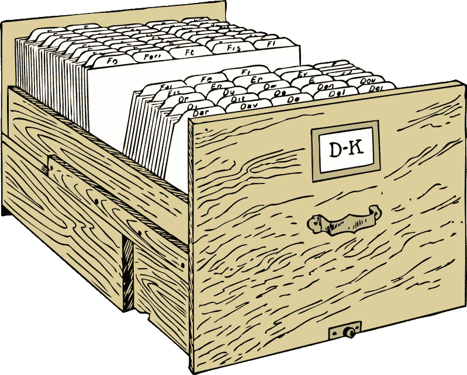
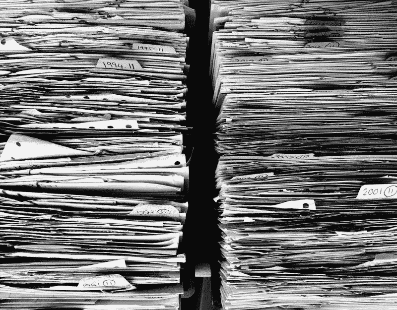
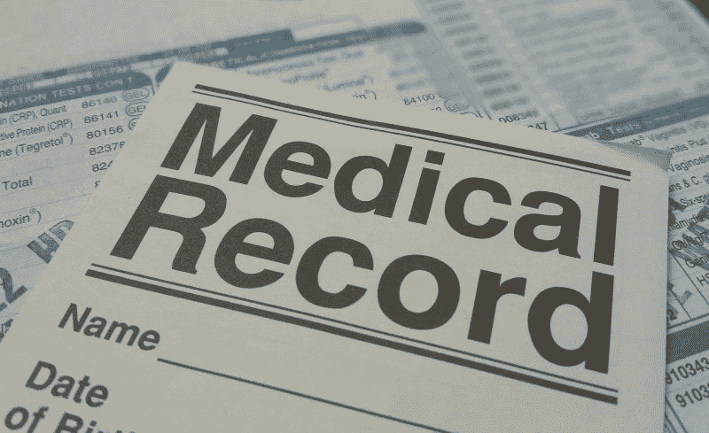

# 铁山赚钱吗？—市场疯人院

> 原文：<https://medium.datadriveninvestor.com/is-iron-mountain-making-money-market-mad-house-9dc4622b9094?source=collection_archive---------4----------------------->

铁山(纽约证券交易所代码:IRM) 可能是当今股票市场的终极反向投资。

解释一下，铁山的[业务](https://www.ironmountain.com)是纸质记录的存储和销毁。传统观点认为，纸质记录在当今世界已经过时。

然而，铁山公司的财务数据让人对这种信念产生了怀疑。例如，Iron Mountain 报告称，2019 年 12 月 31 日的季度收入为 10.8 亿美元，季度毛利为 6.2424 亿美元。此外，在截至 2019 年新年前夕的季度中，铁山的收入增长率为 1.71%。

# 铁山赚了多少钱？

2019 年 12 月 31 日，铁山公司报告季度净营业收入为 2.0607 亿美元，季度共同净收入为 3770 万美元。

此外，Iron Mountain 报告上一季度的期末现金流为 678 万美元，运营现金流为 3.1851 亿美元。因此，铁山公司的业务产生了一些现金。

 [## 数据驱动投资的兴起|数据驱动投资者

### 当 JCPenney 报告其 2015 年 2Q 的财务结果时，市场感到非常震惊。美国零售巨头…

www.datadriveninvestor.com](https://www.datadriveninvestor.com/2019/02/28/the-rise-of-data-driven-investing/) 

相反，铁山公司很少持有这些现金。例如，Iron Mountain 在 2019 年 12 月 31 日报告的现金和短期投资仅为 1.9356 亿美元。

# 铁山有什么价值？

然而，我认为铁山看起来像一个价值投资，因为它的股票在 2020 年 2 月 27 日的交易价格是 31.99 美元。与此同时，Stockrow 估计铁山在 2019 年 12 月 31 日的总资产为 138.17 亿美元。

铁山有一些令人印象深刻的资产，包括[地下](https://marketmadhouse.com/is-iron-mountain-making-money/#Underground%20Storage)，这是一个巨大的地下储存设施，位于宾夕法尼亚州巴特勒县的一个前石灰石矿。地下设施可以将存储在那里的任何媒体数字化，并上传到网络上。储存在地下的物品包括环球音乐收藏和盖蒂图片社的照片。

Iron Mountain 还经营文件的气候控制存储设施，以及单独的胶片和磁带保险库。目前，铁山[在两大洲运营](https://www.ironmountain.com/digital-transformation/data-centers) 15 个仓储中心，总仓储面积达 350 万平方英尺。

# 铁山利用数据中心赚钱

除了物理介质的存储，铁山还运营数据中心，包括位于地下的地下数据中心。此外，Iron Mountain 可以在现场建立数据中心，并以批发方式向公司提供数据中心设施。

铁山超大规模数据中心旨在支持云。铁山的战略数据中心服务于特定的地理市场。有趣的是，铁山声称其数据中心 100%由可再生能源供电。

最后，铁山通过扫描和销毁文件来帮助公司摆脱纸质文件。Iron Mountain 可以通过粉碎来销毁纸质文档，并安全地处理计算机驱动器、磁带等。

# 铁山从论文谬误中赚钱

因此，铁山提供的服务需求正在增长。例如，在人类组织逐渐远离纸张的时候，铁山公司销毁了纸质文件。此外，铁山将信息数字化并存储。

最后，铁山兑现了我喜欢称之为论文谬误。纸张谬误是认为纸张记录是永久的、可靠的、防篡改的。像我这样做过档案员的人都知道论文谬误是一派胡言。

然而，法律要求对电子数据进行物理备份，这种纸上谬论得到了广泛的认同和支持。因此，铁山从流行的误解中赚钱。

# 铁山的价值案例

铁山的价值投资案例很简单。Iron Mountain 是一家默默无闻、枯燥乏味的公司，它提供一种很少有人知道的广泛使用的服务。

此外，铁山公司(纽约证券交易所:IRM) 股票便宜，但铁山公司拥有大量有价值的资产。特别是，我认为铁山的地下储藏设施可能价值数十亿美元。

另外，我怀疑云可以从两个方面增加铁山地下储藏的价值。首先，互联网为存储在铁山设施中的许多媒体创造了一个巨大的数字市场。例如，他们通过苹果商店销售的歌曲。

第二，铁山的石灰石洞穴是数据中心的最佳位置。因此，铁山可以通过出租这些洞穴作为其他公司数据中心的位置来赚很多钱。

因此，我认为铁山是 21 世纪的价值投资，是被低估的股票。

# 铁山是好的分红股吗？

我认为**铁山(纽约证券交易所代码:IRM)** 是一个伟大的股息股票。值得注意的是，铁山将于 2020 年 3 月 13 日支付 61.85₵季度股息。

此外，铁山的股息在 2019 年由 0.85₵增长。解释一下，铁山于 2019 年 9 月 13 日支付了 61.1₵股息，并于 2019 年 12 月 13 日支付了 61.85₵股息。

总体而言，Dividend.com 估计铁山公司截至 2020 年 2 月 27 日的股息收益率为 7.49%，年化股息为 2.47 美元，股息增长 10 年。因此，铁山是一个很好的分红股票。

如果你正在寻找一个廉价的股息和价值的股票有很大的价值潜力铁山可能是一个不错的选择。我认为，由于云计算和流媒体视频等新媒体，铁山可能会经历巨大的增长。

*原载于 2020 年 2 月 27 日 https://marketmadhouse.com***。**