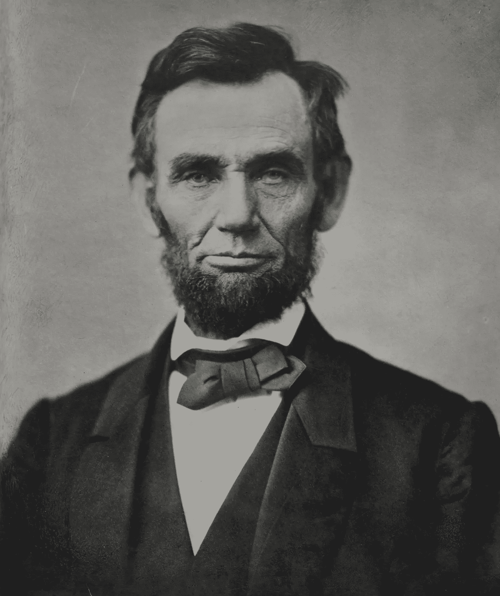

# 长得像总统是一种赞美吗

> 原文：<https://medium.datadriveninvestor.com/is-it-a-compliment-to-look-like-a-president-aab3f726e80c?source=collection_archive---------13----------------------->

令我惊讶的是，很多人光顾我的店，不厌其烦地问我林肯半身像是不是我的。

Photo Library of Congress on Unsplash

我

有些人离开后留下的东西很有趣。在他 40 多年的房地产生意中，房地产人有机会*继承*各种各样的物品:宜家想到的每一件家具，足够宾夕法尼亚大学整个新生班穿的衣服，一只冷冻鹅，1980 年马普尔纽敦班的虎年书，一个养有一群讨厌的食人鱼的鱼缸，至少一个完整的公共图书馆，各种各样的电器——有些还能用——等等。

***房地产男人的故事:***

我是这笔奇怪遗产的勉强受益人；其中大部分很快就会被扔进垃圾箱或慈善机构。

但有一件事我多年来一直骄傲地保留着。几年前，有人留下了一尊林肯的石膏半身像。不管他的鼻子上有一个小芯片。我把他放在我办公室桌子后面显眼的地方，让任何进来的人都能看见。我对林肯没有特别的亲近感，只是在学校里我被教导说，我应该感激他为国家所做的一切。

令我惊讶的是，有很多人光顾我的店，不厌其烦地问我林肯半身像是不是我的。

这是对我们俩的赞美吗？

起初，我本能地表示不同意见，并说了一些谦虚的话，比如:*哦，不，那是林肯，* t *谢谢你把我误认为一个如此美好和重要的人。*

一两年后，我开始说:*为什么是的。你怎么认出我的？大多数人认为是林肯。*

他们经常继续说:*哦，不，你比林肯好看多了。*

一天早上，当我在办公室坐下时，我立刻发现事情似乎失去了平衡。我不太清楚抓住我的那种不安的感觉。办公室里的离子键被打乱了；能量是不同的。

清点了几分钟后，我突然想到。

我的林肯半身像不见了。被偷了，丢了，没了！

我总是怀疑晚上为办公室服务的清洁工。

前一天下午 5:00 离开后，我锁上了办公室

那天早上 10 点我打开了办公室的门。

没有其他人有钥匙。

只有清洁工。

我从未解开这个谜。

林肯半身像再也没有被归还，尽管很多年来我一直看着它展示的地方。

至少在我发现谁有胸像，认为是林肯——或者是我之前，我似乎无法结案。