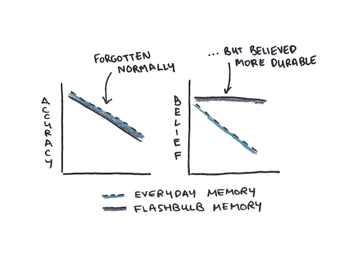
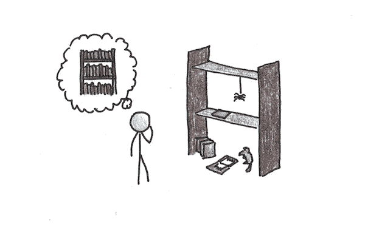
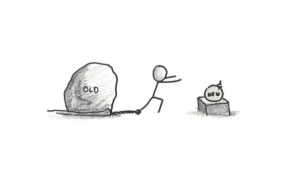
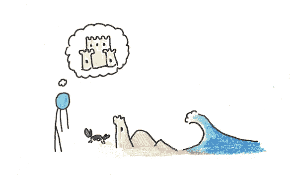

# 维持容易还是重新学习容易？

> 原文：<https://medium.datadriveninvestor.com/is-it-easier-to-maintain-or-relearn-52e2ba508881?source=collection_archive---------3----------------------->

你应该有多担心忘事？

从某种意义上说，遗忘是一个非常现实的问题。我们中有多少人还能通过大学课程的考试？你的书架上有多少布满灰尘的书，你已经忘记了情节？知识，像所有的东西一样，会随着时间而衰减。

如果有一个简单的程序来保证永久记忆就好了。事实上，我们似乎已经有了这样的记忆:初吻、美妙的假期或孩子的出生。

然而，心理学家质疑这些记忆是否像看起来那样持久。9 月 12 日，毁灭性恐怖袭击后的第二天，心理学家让杜克大学的学生记录他们对事件的记忆。后来，他们在 1 周、6 周和 32 周后进行了随访，以观察他们的坚持程度。

他们注意到，虽然这些“闪光灯”记忆的可信度仍然很高，但准确性的下降与日常记忆相似。生动并不能保证永恒。

# 你可能已经忘记了比你意识到的更多的东西

学习中一个很大的讽刺是，那些记得最清楚的人最清楚他们忘记了多少。

众所周知，对于长期记忆来说，检索练习比被动复习更有效[。](https://science.sciencemag.org/content/331/6018/772.abstract)[的研究很清楚](https://link.springer.com/article/10.1007/s10648-012-9202-2)，如果你必须选择如何学习，你应该合上书，试着记住里面的内容，而不是一遍又一遍地重读。

因此，偶尔使用西班牙语技能的人会不断地想起这些技能的不断衰退。学过一次，但从未实践过的人，自信地把它放在他的简历上，因为他对这项技能的记忆仍然与它还新鲜的时候联系在一起。

# 我的维护难题

这对我来说是一个尖锐的问题。

一方面，我很重视遗忘的问题。例如，在我的语言学习之旅后，我制定了一个维护计划:一年内每周练习一次每种语言，之后几年每月练习一次。我已经做了定期编程和艺术项目，以提高我在那里学到的技能。

这种做法有所帮助。我的知识衰退得比其他情况要少得多。但是在我高强度练习后，保持它的锋利是很难的。随着我学到的东西越来越多，这个问题只会越来越严重——通过每周练习来保持一门语言是可行的。保持七是一个严肃的承诺。

这不仅仅是我的懒惰，也是因为我意识到花在维护上的每一个小时都不是用来学习新东西的。优先维护的防御策略最终会变成一件紧身衣，因为你没有时间去学习新的东西。

无可否认，当你选择专业化时，这个问题就消失了。我从不担心我的写作能力会衰退。在这些情况下，相反的问题更加明显——知识维护得如此之好，以至于我使用的例程会钙化，从而使改进更加困难。

然而，对于像我一样喜欢学习各种各样的东西的人来说，维护问题可能是一个棘手的问题。

# 为重新学习辩护

作为一种策略，重新学习意味着接受这样一个事实，即你对旧学科的知识会衰退，在它们达到以前的水平之前需要一段时间的努力。

在过去，我觉得重新学习主要是计划的失败。保持知识所需的努力被认为是[指数衰减](https://en.wikipedia.org/wiki/Forgetting_curve)，这意味着如果你计划得当，你总是可以既学习新东西又保持旧知识。

从那以后，我变得更加怀疑这一点。虽然遗忘曲线肯定是真实的，并且具有明显的指数形状，但这并不自动意味着需要指数[衰减的努力来维持知识](https://psycnet.apa.org/doiLanding?doi=10.1037%2Fa0023436)。此外，这只适用于你可以在抽认卡中轻松表达的那种知识，这可能是我想保留的知识中的一小部分。

相比之下，重新学习有一些有利的论据:

*   重新学习往往比最初学习要快得多。常见的抱怨是你已经“完全忘记”了一个主题，这通常是错误的。
*   **重新学习是间隔练习的一种形式**。[研究表明](https://pubmed.ncbi.nlm.nih.gov/14622045/)传播知识甚至超过你开始遗忘的时间点有助于以后回忆，就像在你忘记之前传播评论一样。
*   **重新学习优先考虑有用的知识**。如果某样东西更有用，你会找到更多的机会再次练习，因此它会(相对)锋利。如果某样东西没那么有用，它会腐烂得更厉害。但这正是我们想要用有限的时间预算来学习新东西。

# 重新学习的主要缺点是

我认为，从理智上讲，对于终身学习来说，再学习是一个完全合理的策略。问题似乎更情绪化。

我以前写过重建信心的[痛苦](https://www.scotthyoung.com/blog/2020/07/20/rebuild-confidence/)。你对某项特定技能的设定点高于现实，所以即使你尽了最大努力使用旧技能似乎也很糟糕。

我记得我的第一份家庭作业是在麻省理工学院的[量子力学](https://www.scotthyoung.com/blog/myprojects/qm/)课上做的，那时我已经学过微积分好几年了。很尴尬。我在许多基本的事情上挣扎，这种消极的感觉可能会让我想放弃。

然而，如果你能克服这种(暂时的)不适应感，重新学习看起来会好很多。学习更高级的科目确实会增加额外的成本，但也可以节省不需要担心主动维护的费用。

# 采取成功再学习的态度

随着学习的进行，我将采取的策略是进攻，而不是防守。我想热情地拥抱再学习的机会。

这有时意味着失败。我记得最近我被邀请参加法语[播客](https://soundcloud.com/user-14364280-725587839/1-scott-young-4-langues-dans-4-pays-en-1-an)。面试比非正式对话更难，所以即使以我最好的法语水平，这也可能有点令人生畏。除此之外，也有将近一年没有练习了，忙于新书和宝宝。

最后，播客进展顺利。但是进攻策略有风险。有时，我可能会摔个嘴啃泥，因为重新学习的负担让我无法表现。

尽管如此，如果我因为害怕没有准备好而对这样的机会采取不拒绝的政策，那么从长远来看，我最终会比把最近做了大量练习作为先决条件的人拥有更好的语言技能。我想我的非正式规则是，如果我在技能巅峰时没有说“不”,我现在也不会说“不”——即使我很有可能会失败。

**同样，我认为从*选择*项目的角度来看，表现得“好像”没有忘记是有帮助的。**上过麻省理工学院的量子力学入门课后，我有了进一步深造的想法。我没有谈到多粒子相互作用，这似乎是我想要理解的量子怪异的关键部分。

然而，实际上，我可能几年内都不会着手这样一个项目。在这种情况下，我的质量管理知识将大大衰退。但是选择项目“好像”没有再学习成本，可能会促使我更经常地做这样的事情。

**最后，我需要接受并预算重新学习**。虽然我认为选择项目时忽略它是明智的，因为否则一些项目可能不那么有吸引力(如果你设想需要几周的时间重新学习)，但我确实认为它应该影响*时间估计*。我确实感觉到我对高等数学的迟钝拖慢了我的质量管理项目，但我仍然很高兴我做到了。

虽然这个策略有困难，但我认为它比试图避免所有遗忘的策略要好。我还有几十年的学习时间，所以我希望这些充满了大量新的有趣的东西，即使这偶尔意味着吞下我的自我，先做一些重建。