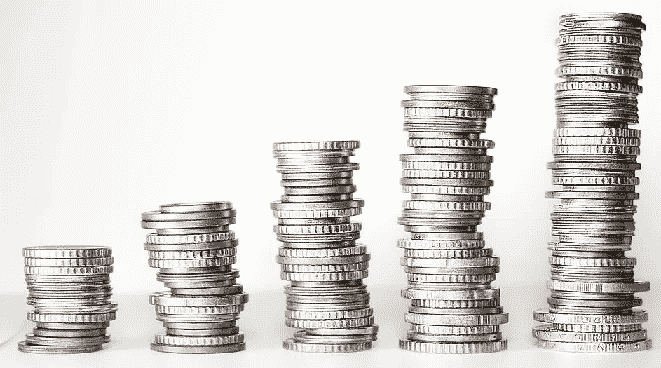
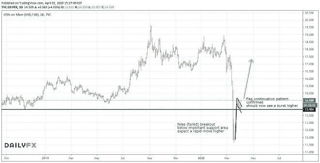

# 白银时代终于到来了吗？

> 原文：<https://medium.datadriveninvestor.com/is-it-finally-time-for-silver-7b6904d47ec?source=collection_archive---------17----------------------->

*首先，快速提醒一下，由于当前的危机，我们最近提供了为期六周的***免费培训和指导。* [立即点击此处认领。](https://go.mangrovetrading.com/corona)*

*现在是了解如何在这些市场中交易和获利的最佳时机。无论是为了获得额外的收入，让你在财务上更有保障，还是为了在这个充满巨大机遇的时期实现利润最大化。*

**

*在我的[上一篇文章](https://mangrovetrading.com/the-end-of-the-us-dollar/)中，我关注了美元的顶部形成。本周，我想将这个主要主题深入到一个具体的机会:**银牌**。*

*我可以给你 100 个白银价格上涨的基本理由，但在我的交易中，我关注的是图表和价格走势中更可靠、更客观的指标。*

* [## 机器学习的外汇交易挑战|数据驱动的投资者

### 机器学习是人工智能的一个分支，之前占据了很多头条。人们是…

www.datadriveninvestor.com](https://www.datadriveninvestor.com/2019/02/18/the-challenge-of-forex-trading-for-machine-learning/) 

在我们看图表之前，有几个基本原因:

1.黄金/白银比率处于几十年来的最高水平——这一比率的高点总是出现在贵金属市场的主要底部。

2.对白银的空头兴趣处于多年来的高点，这通常出现在白银大幅走高之前。

3.美元见顶的迹象可能会导致贵金属价格上涨。

4.所有最近的印钞和 QE 也支持这一观点。

根据图表显示的内容:

1.在主要支撑位下方的失败突破，困住了空头(卖家),这通常会导致反向的大规模快速移动。

2.上周的内部棒线，周线范围很小，包含在前一周的范围内。一旦突破这个区间，这通常会导致快速而剧烈的波动，昨天就出现了强劲的上涨。

3.最近确认了一个小旗形态，表明至少继续上涨 2.50 美元。

从上周开始，我已经持有了相当多的头寸，并在预期继续走高回到 19 美元的情况下更加积极地加仓。

今年肯定会充满不可思议的交易机会。

2020 年刚刚开始，我对世界周期的分析表明，2020 年至 2022 年期间将会非常不稳定，原因有很多。

保重，保持安全，让我们至少充分利用市场将提供给我们的机会。

祝大家一周快乐健康。

你愿意免费参加我们为期六周的“自由交易”培训和指导计划吗？如果您今天注册，您还将获得一个个性化的辅导课程。点击 [***此处***](https://go.mangrovetrading.com/corona)**即可上手。**

*-*

***请注意，一如既往，这不是投资建议，您应该在做出任何投资决定之前咨询您的财务顾问。我不是财务顾问，提供这些信息只是为了提供信息和教育目的。****