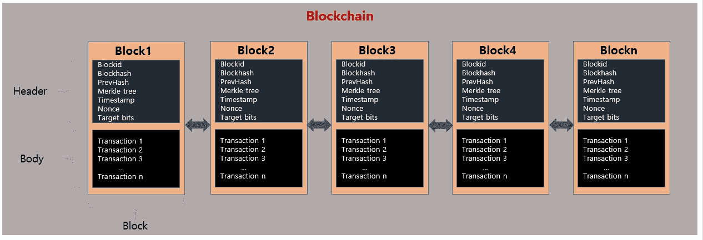
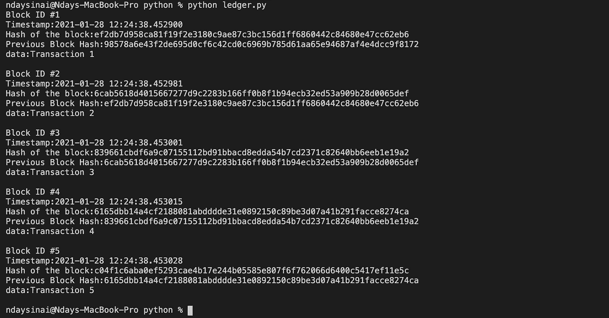
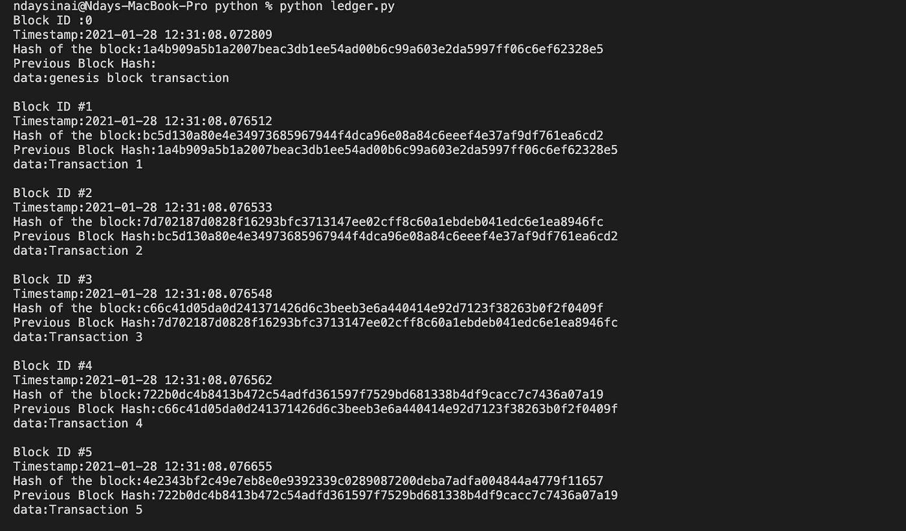

# 从零开始建立一个区块链很难吗？

> 原文：<https://medium.datadriveninvestor.com/is-it-hard-to-build-a-blockchain-from-scratch-23bac74e4f?source=collection_archive---------1----------------------->

> Python 中的第 3 集
> :Python 2 . 7 . 16

网址:[https://open-blockchain-project.com/](https://open-blockchain-project.com/)

改进的 Golang 代码(前端+后端):[https://github.com/ndaysinaiK/baby-blockchain](https://github.com/ndaysinaiK/baby-blockchain/tree/master/baby-blockchain/Simple)

这是我们“从零开始建立一个区块链很难吗？”系列的第三集，请查看[第一](https://medium.com/swlh/is-it-hard-to-build-a-blockchain-from-scratch-2662e9b873b7)和[第二](https://levelup.gitconnected.com/is-it-hard-to-build-a-blockchain-from-scratch-93d95cb45f57)集才能赶上。

首先，我们将使用第一集的图，让我们将它复制并粘贴到这里。

fig1\. Blockchain (by Sinai)

这是我们最喜欢的图形，我们会经常用它来解释区块链技术的基本概念。

在前几集里，我们使用 [**Go**](https://medium.com/swlh/is-it-hard-to-build-a-blockchain-from-scratch-2662e9b873b7) 和 [**Javascript**](https://levelup.gitconnected.com/is-it-hard-to-build-a-blockchain-from-scratch-93d95cb45f57) 构建了两个基本原型，现在让我们使用 **python、**这种发展最快、最受欢迎的编程语言来构建另一个婴儿分类帐。

概括地说，区块链是一个块链，每个块包含一些信息，如图 1 所示。因为我们正在建立一个婴儿分类帐，所以让我们远离复杂的术语和机制，它们将在未来被涵盖。我将使用注释符号( **#** )来解释每一行代码，记住 **#** 之后的所有内容都是注释。

让我们直接开始吧！

**我们先导入两个重要的库**

这两个库用于对生成的每个块进行哈希处理和时间戳标记。

**创建一个叫做 Block 的类**

这个类有一个包含块信息的初始方法，但是没有返回块散列的方法，所以让我们继续在类 block 下创建它。

当部署一个区块链时，它只有一个块，第一个被开采的块，第一个块被称为 **genesis 块**，所有后面的块将被添加到第一个块的顶部，所以让我们创建一个静态方法来返回 genesis 块。

每个块后面跟着下一个块，下一个块是链上最近添加的块，我们必须声明另一个静态方法来返回每个新块，让我们创建它。

创建了块和新的块方法，现在我们需要初始化区块链来接收所有传入的块。请记住，区块链(数字分类账)包含块。

只有 genesis 块在链上，让我们将更多的块添加到我们的分类帐并打印它。

结果如下:

哎呀！第 1 块有一个创世纪块的散列，但是我们看不到分类帐上的第一块。是否显示 genesis 块取决于我们，让我告诉你如何打印它的内容。

在`for loop`之前，添加以下几行:

以下是最终结果:

现在创世纪区块在账本里变得可见了。

恭喜你！你刚刚在 **python** 里做了另一个小区块链。

请继续关注下一个高级概念😁。

**你知道你可以点击 50 次“中等”按钮吗？所以，如果你喜欢这篇文章，就把它打碎吧。👍**

整个代码:

> ***如果您在运行代码时发现任何错别字或错误，请联系我:***

LinkedIn: [西奈 Nday](https://www.linkedin.com/in/sinai-nday-312195160/)