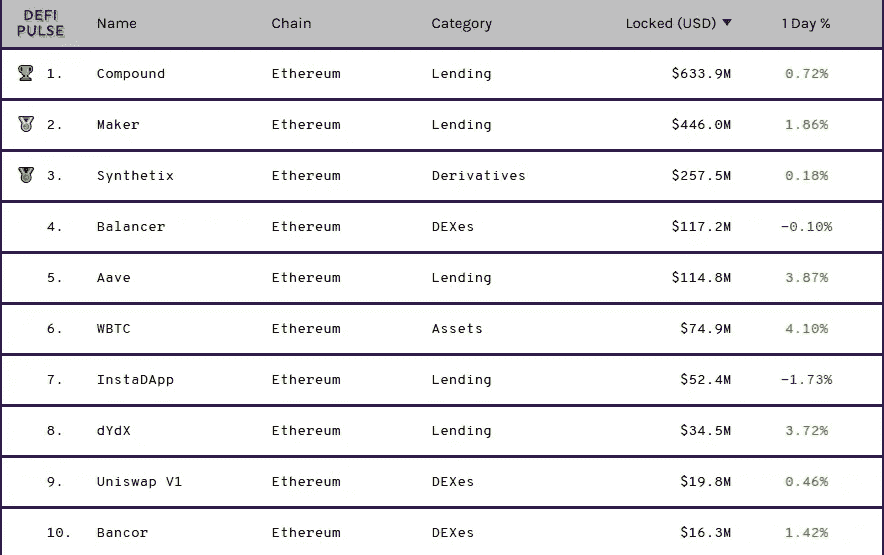

# 现在是用 DeFi 取代银行的时候了吗？

> 原文：<https://medium.datadriveninvestor.com/is-it-now-the-time-to-replace-the-banks-with-defi-376685df0f8c?source=collection_archive---------8----------------------->

## DeFi 也叫分散金融，是为了凌驾于传统银行之上，然而价值数十亿美元的机构仍然对新的金融时代视而不见。

Photo by [Kelly Sikkema](https://unsplash.com/@kellysikkema?utm_source=medium&utm_medium=referral) on [Unsplash](https://unsplash.com?utm_source=medium&utm_medium=referral)

当您想到传统银行时，您会想到哪些服务？

*   核对帐目
*   贷款
*   储蓄账户
*   借记卡和信用卡
*   商户服务(信用卡处理、对账和报告、支票托收)
*   财务服务(工资服务、存款服务等。)

或者任何你能想到的银行提供的金融服务被称为分散金融，简而言之，当你使用区块链来自动化它们时。公平地说，这是一个基本定义，值得进一步解释，以在你的头脑中具体化它的潜力。

DeFi 由许多促成因素组成，如**数字资产、金融智能合同、协议和去中心化应用(DApps** ) *(Defi Pulse，2019)* 。这些促成因素的独特组合使得不同的使用情形成为可能。

最受欢迎的用例是**货币借贷、衍生品交易、分散交易所(DEXes)、互换渠道和支付。**目前，这些替代品大多运行在最著名的公共区块链以太坊上。

 [## 冠状病毒疫情正在重塑区块链吗？该技术如何帮助应对该病毒|数据…

### 当前的冠状病毒疫情已经严重影响了区块链和加密货币行业的方方面面…

www.datadriveninvestor.com](https://www.datadriveninvestor.com/2020/07/15/is-the-coronavirus-pandemic-reshaping-blockchain-and-how-can-the-tech-help-tackle-the-virus/) 

# 银行对 DeFi

从银行和 DeFi 应用程序获得这些服务的主要区别在于，在银行，你有一个中介，一个在银行工作的人，使服务成为可能，并对你的服务细节做出决定。主要是，有大部分的个人主动性和模糊性。

但是，DeFi 服务的详细信息在协议启动时已编入智能合同。那么服务提供商和客户都不能改变结算细节的细节。

更具体地说，如果你在 DeFi 服务中锁定了一个令牌，一年后将获得 5%的回报，智能合约将在一年后通过向你的钱包发送 1.05 令牌来自动结算合同。

目前，DeFi 产品的总价值约为 16.5 亿美元。与传统金融服务的数万亿美元相比，这可能不是一个巨大的数字。然而，考虑到 DeFi 技术仍然非常不成熟，对 DeFi 产品的了解也非常有限，我认为这是一项不容忽视的重大成就。

# 顶级 DeFi 产品

如果我们仔细查看列表顶部，可以列出 10 种 DeFi 产品:

Source [DeFi Pulse](https://defipulse.com/)

正如你在列表中看到的，前 5 名的 DeFi 应用程序拥有大部分的 DeFi 能力，然而这 5 名应用程序提供三种不同的服务，贷款，衍生品交易和分散交易所(DEXes)。

这些服务中的大多数都有自己的 ERC20 代币，并在其代币中分配奖励，从而将这些代币的价值推高。因此，只要产品越来越受欢迎，你不仅会从代币数量的百分比增长中获益，还会从每个代币的美元价值中获益。

当然，代币价值没有持续上涨的承诺，这也可能导致价值损失，即使你在结算当天获得更多代币。

# 一个成功的故事:复合

特别是在这个名单中的顶级 DeFi 产品 Compound，有一个相当成功的故事，考虑到截至 2020 年 6 月 15 日它只有大约 1 亿美元，而仅仅在两周内，它的总锁定价值就达到了 6.5 亿美元。也就是说，仅用了 15 天左右的时间，就几乎达到了 x7。

这一显著的成功主要是由于复利利率优于传统银行提供的几乎为负的利率。

# 下降趋势

尽管 DeFi 产品受益于区块链提供的大多数安全功能，但它们有单独的代码，这带来了不同的漏洞。

它们是更加集中的第二层解决方案。因此，这些应用程序可以被黑客攻击，如果你不相信开发这些解决方案的团队，就不要把你的钱托付给他们，把你的积蓄锁定在他们的解决方案上。

最近，一家 DeFi 流动性提供商平衡器遭到黑客攻击，价值 50 万美元的代币被盗。该团队表示，他们甚至没有意识到这样复杂的攻击是可能的 *(CoinDesk，2020)* 。

如果你对这次攻击的技术细节感兴趣，我建议你看看下面这篇来自 [1inch](https://medium.com/u/2c9a654f35d) 的文章:

 [## 带有 STA 通货紧缩令牌事件的平衡器池

### 今天，至少有两个平衡器多令牌池被利用以下环境中的漏洞消耗了 50 多万美元…

medium.com](https://medium.com/@1inch.exchange/balancer-hack-2020-a8f7131c980e) 

DeFi 的另一个缺点是，它是一项相当不成熟的技术，还没有得到很好的监管。因此，他们仍然能够提供高于传统银行的回报。然而，监管最终也会针对他们，届时，他们不太可能获得这些回报率。此外，一个不受监管的环境通常意味着更多的骗子被吸引到这个领域来狩猎。

# 关键要点

简而言之，DeFi 产品将引领金融服务的范式转变。它是继 ICOs(初始硬币发行)、IEOs(初始交易所发行)、智能合约等之后，区块链生态系统的新热点。

区块链技术发展得越多，我们将会遇到越多令人兴奋的消息，但在尽职调查中多走一步，避免对实验性金融产品的投资超过你承受得起的损失，这仍然至关重要。

因此，宣布 DeFi 应用程序作为传统银行服务的替代方案还为时过早。然而，银行每天都在以惊人的速度发展和进步，它们完全有理由感到威胁。

如果你对区块链创新感兴趣，请查看我下面关于第 2 层区块链扩展及其对零工经济的益处的文章。

 [## 3 第 2 层区块链扩展对 Gig 经济的潜在好处

### 让我们一起来看看区块链应该如何扩展，以及第 2 层扩展对 Gig 有什么影响…

medium.com](https://medium.com/@furkansaatcioglu/3-potential-benefits-of-layer-2-blockchain-scaling-on-the-gig-economy-9c24f77489c1) 

下次见！

*原载于 2020 年 7 月 17 日*[*【https://www.datadriveninvestor.com】*](https://www.datadriveninvestor.com/2020/07/17/is-it-now-the-time-to-replace-the-banks-with-defi/)*。*

[订阅](http://eepurl.com/g6lZYf)我的时事通讯，在你的邮箱里获得未来的文章！

*免责声明:本文仅用于信息或教育目的，并非任何形式的个性化建议。使用这些信息需要您自担风险。*

# 参考

 [## 什么是 DeFi？— DeFi 脉冲

### DeFi 是短语“分散金融”的缩写，通常指数字资产和金融…

defipulse.com](https://defipulse.com/blog/what-is-defi/)  [## 黑客从 DeFi 流动性提供商平衡器——coin desk 中流失 50 万美元

### “我们不知道这种特定类型的攻击是可能的。”分散融资(DeFi)流动性提供商平衡器…

www.coindesk.com](https://www.coindesk.com/hacker-drains-defi-liquidity-balancer) 

**访问专家视图—** [**订阅 DDI 英特尔**](https://datadriveninvestor.com/ddi-intel)