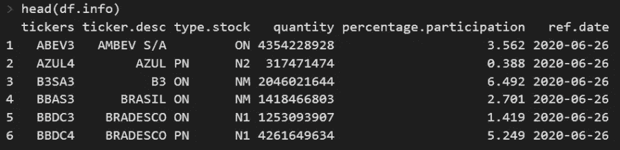
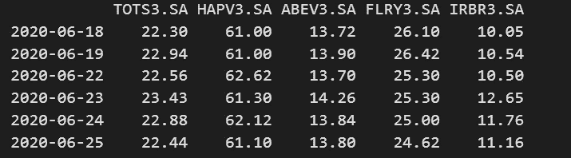
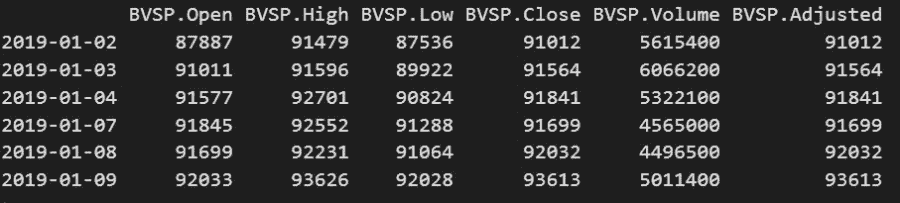
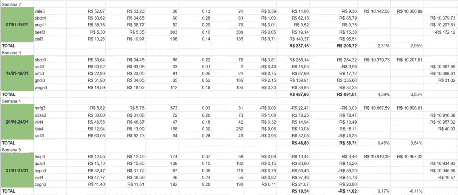
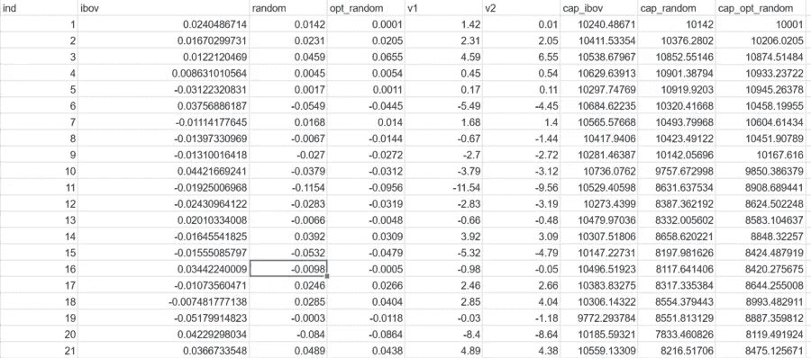
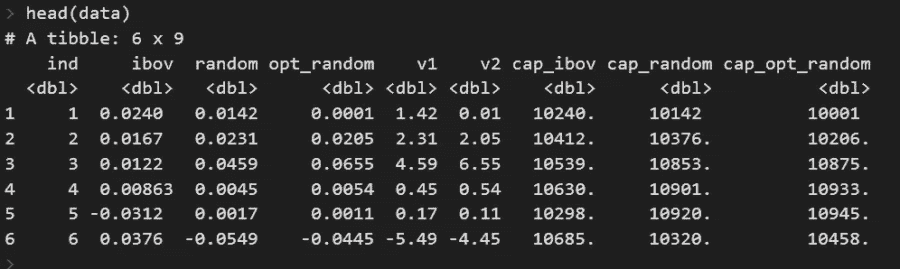
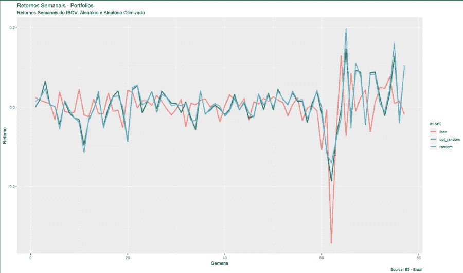
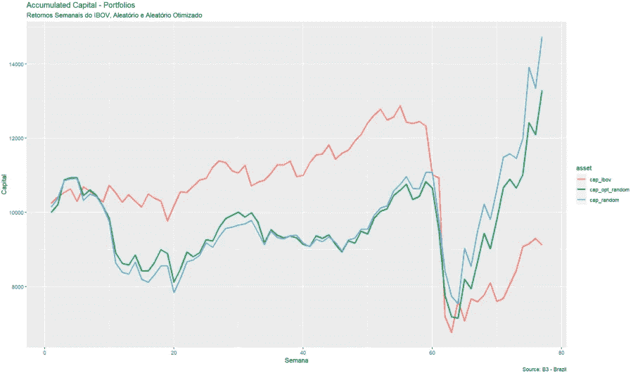

# 我在战胜市场，通过随机选股致富

> 原文：<https://medium.datadriveninvestor.com/is-it-possible-to-beat-the-market-by-randomness-92a46ea8bfcf?source=collection_archive---------0----------------------->

## 随机选股的结果，77 周的实验

Photo by [Patrick Fore](https://unsplash.com/@patrickian4?utm_source=medium&utm_medium=referral) on [Unsplash](https://unsplash.com?utm_source=medium&utm_medium=referral)

在你因为标题开始向我扔石头之前，我想澄清几件事。这篇文章打算教一些 R 中的技巧，比如:从数据集中绘制元素，从股票交易所下载金融数据，从 google 电子表格下载数据，绘制回报图。永远不要用这份出版物来指导你的投资。所以加油吧！

你可能听说过这家英国报纸向三种类型的投资者发出挑战，要求他们就谁能在 2012 年底实现最高盈利展开争论，该报纸全年都在跟踪他们。这没什么不寻常的，除了球队由职业经理人、高中生和一只名叫奥兰多的猫组成。这只猫成了测试冠军。

在@pedrolealdino 和 [@monkeystocks](http://twitter.com/monkeystocks) 的 Twitter 账户上可以看到相同类型的实验，这些账户每周都会绘制行动并公布结果，到目前为止，这些结果也是积极的。伯顿·马尔基尔探索了股票价格完全随机波动的观点，使得股票市场价格变化成为完全不可预测的现象。

我不满足于这样的故事，决定亲自验证一下。我模拟了从 2019 年 1 月 1 日到 2020 年 6 月 19 日每月随机投资组合的抽取，并将其与巴西证券交易所一些公司的指数 IBOV 的回报进行了比较。在接下来的小节中，如果您想使用 r 来复制这个实验，我将一步一步地演示。

# 选择每周的股票

首先，我们需要从股票交易所收集数据，并输入我们的股票市场，以获取这些数据并组成我们的每周投资组合。为此，我们将使用 BatchGetSymbols 包。

Screenshot — Image by Author

在上面的数据中，我们可以看到组成 Bovespa 指数的公司信息，bo vespa 指数是一个广泛用于衡量市场表现的基准，由巴西市场上 75 家“最佳”公司组成。

我们现在希望每周抽彩选出五家公司。我们将使用 sample 函数，应用于我们数据的 tickers 列。默认情况下，元素替换参数已经设置为 false。我们用希望抽取的星期数来定义随机“生成器”的种子。

# 获取股票市场数据

现在我们已经定义了我们的份额，让我们下载交易大厅数据。为此，我们将使用 quantmod 包。巴西股票必须以“，”上市。SA”在收报机的最后。

Screenshot — Image by Author

有了这些数据，我们就可以计算每天的收益了。但首先，让我们从 Bovespa 指数中收集数据。与 quantmod 包一起使用的 IBOV 代码是“^ BVSP”。

Screenshot — Image by Author

# 比较数据

每周，我都会将数据整理到谷歌的电子表格中，这样我就可以日复一日地导入数据并实时更新资产价格。

Screenshot — Image by Author

Screenshot — Image by Author

组织好数据后，我使用 googlesheets4 包将电子表格数据直接导入 r。

Screenshot — Image by Author

现在，我已经将数据从一段时间内积累的回报和利润中分离出来，让我们来绘制结果。

# 绘制结果

为了绘制图表，我使用了 ggplot 包。

Returns over weeks — Image by Author

上面的图表显示了每周的回报。绿线指的是一个优化的投资组合，但我们不会在这篇文章中处理它。红线对应 IBOV，蓝线对应随机选择的系列。现在我们将绘制累计资本，模拟初始投资 10，000.00 雷亚尔。

Accumulated

上图显示了我们初始投资的累计价值 10，000.00 雷亚尔。通过抽签，我们目前已经取得了+47.5%的成绩！！然而，看看 60 号之前的几周，嗯，不太好，对吧？！再次记住，本出版物不是投资建议。这些测试是模拟的，没有任何风险。

谢谢你读到这里！下周见！