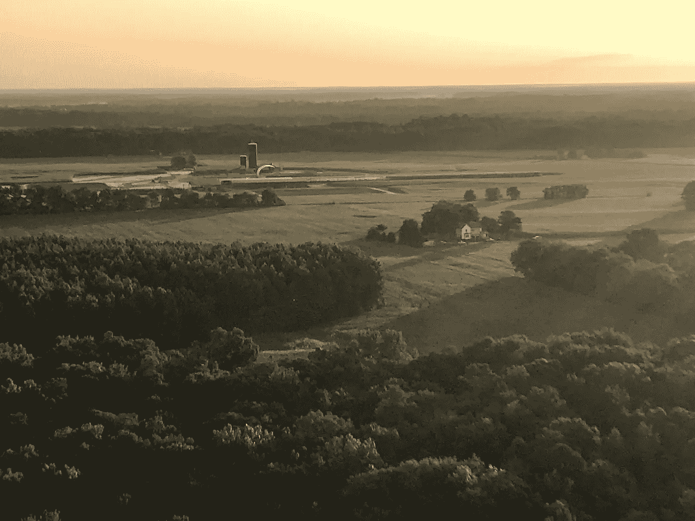
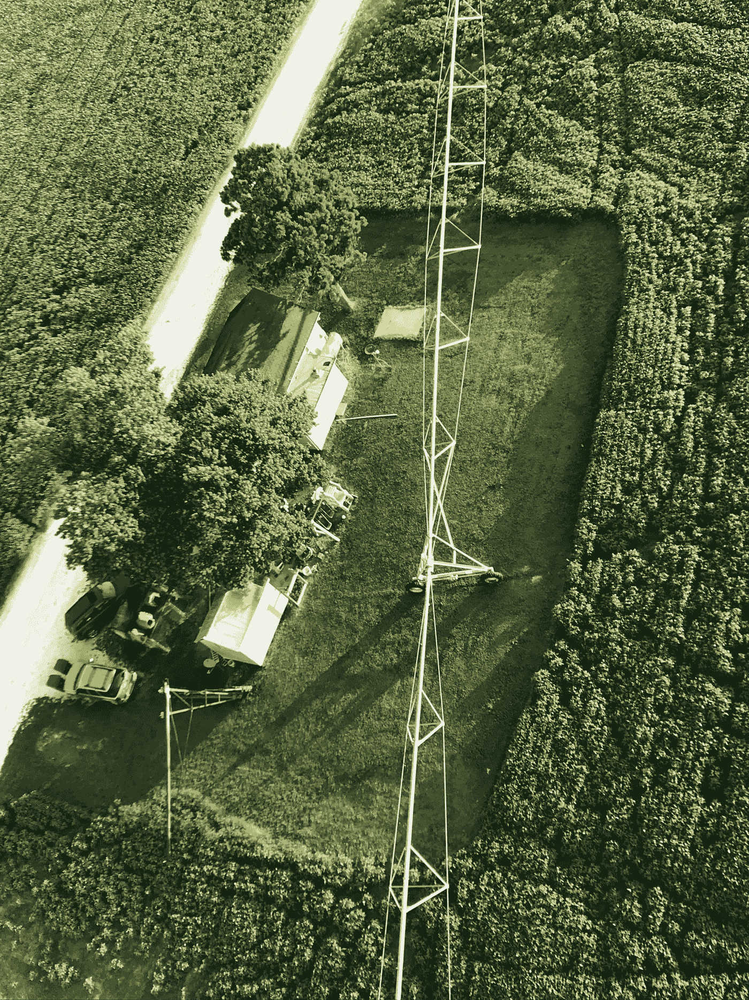

# 没有剥削的农场可能存在吗？

> 原文：<https://medium.datadriveninvestor.com/is-it-possible-to-farm-without-exploitation-e9fefe202349?source=collection_archive---------2----------------------->

## 我赌的是最好的非开发性农业未来。

我花了十年时间在整个农业领域寻找这个问题的答案。

我周游了全国，在世界各地生活过。我见过成百上千的农民，也和他们谈过话。我阅读和研究，我追捕专家，质疑他们的每一个结论。我已经被证明错了很多次。

这个世界充斥着这是不可能的证据。在我所有的执着寻找中，我找到了一个“是”。我把我的职业生涯押在这上面了。

## 什么使得农场具有剥削性？

今天，我只想谈谈这个问题的一个小要素。剥削的部分。

以下是我(到目前为止)了解到的农场剥削的主要方式，以及避免这种剥削需要做的事情(排名不分先后):

*   农业剥削农民:从身体上、精神上和情感上，围绕农业的文化期望经常鼓励农民自己“做所有的事情”。这是剥削。复杂的业务需要多名拥有不同专业知识的员工才能成功。
*   **农业剥削农场工人**:由于一系列广泛争议的原因，农场基本上不支付工人可维持生活的工资，也不保护他们的健康或福利，也不提供成长的机会。有证据表明，在经营中拥有股份的农场工人更公平
*   **农业剥削家庭**:综合上述情况，农民的家庭经常被要求以时间、劳动或生活经历的形式做出牺牲(就像一个从不在身边或总是有压力的父母)。由“家庭”而非雇员经营的农场是剥削性的。
*   农业利用环境:几乎每一种形式的现代农业都是从环境中无偿获取某些东西。根据定义，这是剥削。“再生”等。实践在很大程度上不尽人意。不同的世界观是避免剥削。
*   农业利用其他物种:从牲畜到植物，到野生动物和昆虫，近几十年来产量的提高对其他生物的福祉造成了巨大的损失。禁止开发也需要关心非人类物种的生活质量和寿命。
*   **农业剥削农村社区**:农业和农村是同义词，以至于许多人认为它们是一个群体——尽管农场规模的增长是农村衰落的主要原因。在整合中，财富和权力集中，导致更多的剥削机会。
*   农业利用公共资金:由于生产过剩，许多农作物的市场价格低于生产成本。数十亿纳税人的美元将通过各种各样的项目来填补这个缺口并保持农场的生存。垂直整合和市场导向避免了剥削
*   **农业利用公众认知**:数百年来琥珀色的谷物知识浪潮将家庭农业与爱国主义、自力更生和美国梦紧密联系在一起。这为不作为和不良做法提供了借口。善意和信任必须赢得，而不是期待。

**这种耕作制度*是*剥削**。这很难说。我爱农场和农业世界(他们是我的人民)，我不愿意相信我们的许多食物、燃料和纤维是在一个让人类、家庭、动物、植物和生态系统崩溃的系统中生长的。

但是面对现实是寻找替代方案至关重要的第一步。

现在，当我在处理和寻求理解农业问题时与农民交谈时，我带着这些现实去评估那些声称没有剥削的农场和解决方案。

大约四年前，我发现有人似乎有一个想法，但没有勾选我所确定的任何一个开发框。但是我累了。这是一个新的小农场。还有时间让事情出错。因为通常都是这样。

 [## 利用股市相关性的最佳方式|数据驱动的投资者

### 当阿尔弗雷德·温斯洛·琼斯开创了世界上第一个“对冲”基金(后来“d”被去掉了)时，他让其他投资者大吃一惊…

www.datadriveninvestor.com](https://www.datadriveninvestor.com/2020/02/02/the-best-way-to-use-stock-market-correlations/) 

当事情变得困难时，一点点剥削看起来很容易。“这个月的按揭还款紧张吗？告诉工人们，我们会在有能力的时候付给他们钱。”“不能雇佣我需要的帮手吗？我会连续 22 小时呆在花盆里，不去看我孩子的棒球比赛。“等等。

所以在四年左右的时间里，我一直在观察，大多是在远处。我看着希尔瓦那夸农场的克里斯·纽曼从一个门廊成长为一个后院，再成长为一个拥有 1000 多名顾客和热情追随者的成熟农场。我见证了一个企业、一个想法和一个人的成长。

第一次拜访三年后，我再次去看克里斯。尽管经历了许多考验和磨难，从零开始经营一个农场面临着巨大而令人疲惫的挑战，但他为自己的农场建设一个没有剥削的未来的决心只增不减。

那次访问是一个灵光乍现的时刻。对我来说，一个多年来一直在寻找农业中下一个最好的东西的人来说，他的愿景似乎几乎是不可能的。但不知何故它就要开花结果了。因为有时候一个好主意好得不能再好了。

在我做出这个极其不明智的决定，成为一名自由职业者的过程中，与 [@SylvanaquaFarms](https://www.instagram.com/sylvanaquafarms/) 一起工作的可能性，无论以何种身份，都是非常重要的，但我知道，如果我真的想得到这个问题的答案，答案可能是“是”，如果我打算用我的余生去寻找一个没有剥削的农业未来，而我没有尽我所能让这个变革性的想法成功，那么我将永远后悔。

所有这些都是为了说。我用我的时间、金钱和热情为美国农业的未来打赌，因为没有时间可以浪费。我做了多年的尽职调查。我见过其他选择。就这样了，伙计们。 [@SylvanaquaFarm](https://twitter.com/SylvanaquaFarms) s 是我发现的最好的“是”。

所以如果你想做点什么，加入我吧。你可以现在就为 Sylvanaqua 的未来捐款或投资:

【http://sylvanaqua.com/invest 

如果你在国家议会区，你也可以在那里购物。

**访问专家视图—** [**订阅 DDI 英特尔**](https://datadriveninvestor.com/ddi-intel)