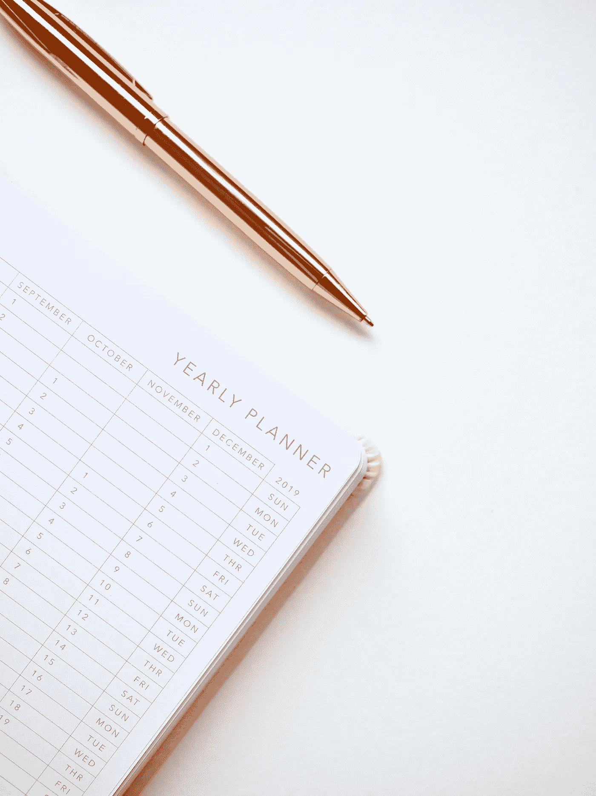
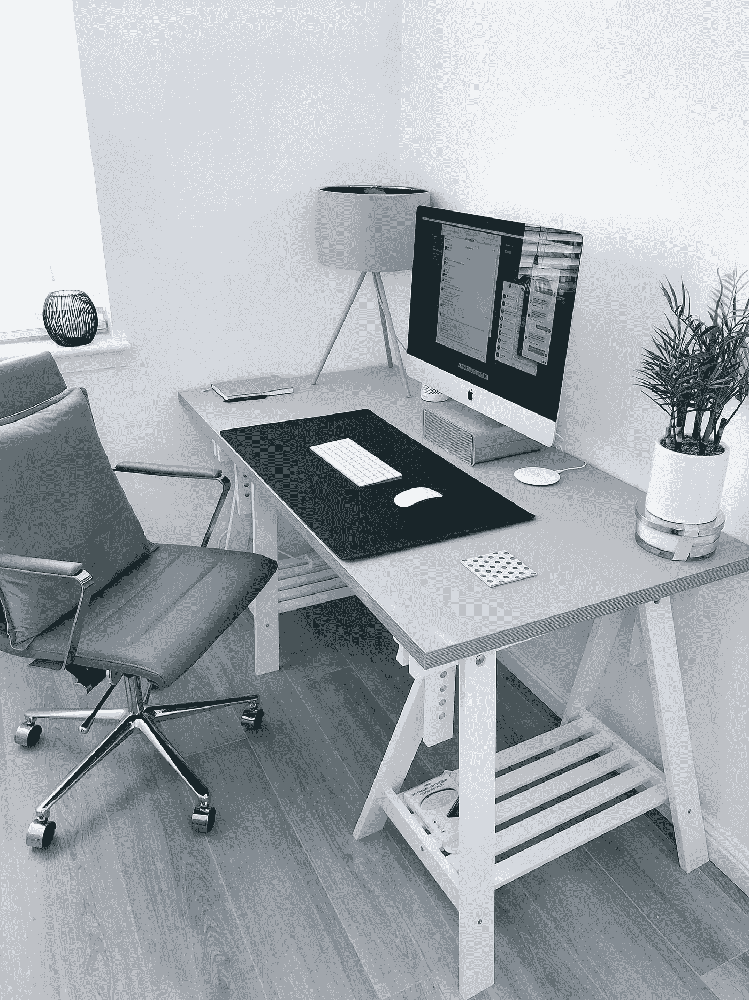

# 如果你很放松，成为 A 型真的那么糟糕吗？

> 原文：<https://medium.datadriveninvestor.com/is-it-really-so-bad-to-be-type-a-if-you-are-relaxed-e91121284afe?source=collection_archive---------13----------------------->

A 型人格通常有负面含义，但如果有可能保持平衡呢？

Photo by [Jess Bailey](https://unsplash.com/@jessbaileydesigns?utm_source=unsplash&utm_medium=referral&utm_content=creditCopyText) on [Unsplash](https://unsplash.com/s/photos/calendar?utm_source=unsplash&utm_medium=referral&utm_content=creditCopyText)

我是其中之一。是的*那些人中的一个，*型A 型人格。当我早上醒来时，打开一个设备是我脑海中的最后一件事。相反，是时候把事情做好了。照顾好自己，带着狗去散步，倒垃圾，打扫卫生，做些零活或其他重要的事情，准备早上的饮料和*，然后*坐下，然后*去拿设备。我列清单，讨厌杂乱。杂乱会分散我的注意力。这是一种干扰。当你想把事情做完时，分心是令人讨厌的。说到把事情做完，拖延是令人沮丧的。当是家庭游戏之夜时，我会参加并且全力以赴。当我对某事充满热情时，就会有动力、雄心和热情。当有事情需要做的时候，我会有目的的走来走去。自信会派上用场，但攻击性就没那么有用了。*

那么，这种 A 型的东西到底是从哪里来的呢？显然在 20 世纪 60 年代有两位 A 型心脏病专家，雷·罗森曼博士和迈耶·弗里德曼博士，他们创造了 A 型人格这个术语。他们认识到，压力最大的患者和那些成就高的人患心血管疾病、中风和心脏病的风险更大。当然，他们自己也是 A 型，否则他们可能不会被驱使去做这项研究。由烟草公司高管慷慨资助的研究希望将心血管疾病归咎于任何东西，接受他们的烟草产品。(A 型心想，*这大概又是一整个兔子洞要下去了，不过我还是坚持题目吧)*。

Photo by [James McDonald](https://unsplash.com/@jamesm?utm_source=unsplash&utm_medium=referral&utm_content=creditCopyText) on [Unsplash](https://unsplash.com/s/photos/desk?utm_source=unsplash&utm_medium=referral&utm_content=creditCopyText)

但是说真的，如果没有那些雄心勃勃的人——列奥纳多·达·芬奇、托马斯·爱迪生、本杰明·富兰克林、亚力山大·葛拉罕·贝尔、爱因斯坦、尼古拉·特斯拉、蒂姆·伯纳斯·李，我们会怎么样呢..？也许我们会睡懒觉，放松一天，只在我们想开门的时候开门营业，成为悠闲平和的嬉皮士，享受在阳光下的海滩上啜饮鸡尾酒…..等等，B 型人格突然听起来更有说服力了！有可能是 A 型人格怎么办，get @%!#搞定了而*还*镇定自若？好吧，也许不像黄瓜一样冷静，但更放松？

直到几年前处理一些个人健康不平衡的问题，我才意识到尽可能没有压力地生活的重要性。这实际上是生活方式改变的必然结果。作为一个 A 型性格的人，如果压力被允许的话，它会打败我。我相信，我们仍然有办法利用雄心勃勃、目标导向和驱动的天赋，同时保持健康的平衡。以下是一些对我有帮助的例子:

# 1.留意

即使当事情变得忙乱或者你觉得自己陷入混乱时，也要意识到自己的想法和行为。这是收听和关注此刻的最佳时机。专注于某样东西——你的呼吸、窗外的一棵树、云彩，闭上眼睛，感受身体内部的感觉。喝一杯凉茶，让自己平静下来。A 型茶的一些很好的选择是洋甘菊、薄荷、绿茶、放松混合物或睡前西番莲和缬草根。

# 2.生态心理学

与自然和元素的联系可能并不适合每个人，但是让我告诉你，它可以让你瞬间恢复平衡。有指导生态心理学活动，帮助人们放松到那一刻。这些当然不是必需的。只要走出去，和你感兴趣的事物联系起来，就能带给你身心的平静。

# 3.全食物生活方式

你知道我会提出来，是吗？这是显而易见的。你滋养自己的方式会对你的平衡状态或缺乏平衡产生影响。这并不意味着吃饭时坐在电脑、电话或其他分心的事物前。这意味着在有意识地吃的同时，花时间真正享受一顿健康、营养的大餐。花点时间以平静、愉快的方式吃饭。

# 4.真正的自我保健

> *注意我说的*真正的自我关怀。*在社交媒体和其他地方流传的时候，这个流行语已经失去了它的光芒。*我* *常说*自我照顾是最好的照顾。如果你不花时间去关心自己的身体、精神和情感，那么你怎么可能有精力或清晰的头脑去成为你想要成为的那个平衡的、雄心勃勃的人呢？在晚上的某个时间关闭设备。获得你需要的适当睡眠。好好滋养自己。设定健康的界限。以一种最适合你的方式移动你的身体，并且不会产生压力。倾听你身体的需求，好好滋养它。*你明白了！把它添加到你的待办事项列表中。**

# *5。放手*

我刚才说了吗？这是我当时直觉想到的。有些事是注定要放下的。对于一些 A 型性格的人来说，这是一个真正的挑战，他们需要 T1 来支撑。一件特别有帮助的事情是改变对某些事情的看法。我发现重新连接大脑活动特别有帮助。(如果我家里有人在读这篇文章，不要担心，因为我不会改变对杂乱的看法)。

# 6.消除压力源

最后，但并非最不重要的一点是消除任何并非绝对必要的压力源。这意味着盘点那些会带来过多压力的人或事。有一种东西叫做*健康压力*。然而，大多数 A 型血的人并不只是处理健康水平的问题。开始寻找生活可以被重新设计以使其更加平衡的方法，这通常对他们最有利。这也意味着消除内部压力。如果你有一些想法，找一个出口来帮助表达你的感受或者健康地释放它们。你可能有各种各样与健康相关的内部压力。找一个精通健康的人，他可以帮助你找到最佳健康的根本问题。

Photo by [Jackie Tsang](https://unsplash.com/@jickii?utm_source=unsplash&utm_medium=referral&utm_content=creditCopyText) on [Unsplash](https://unsplash.com/s/photos/sunny-beach?utm_source=unsplash&utm_medium=referral&utm_content=creditCopyText)

阳光下的鸡尾酒让我着迷。所以，如果你看到我躺在一个阳光明媚的目的地的沙滩上，拿着一把小雨伞，啜饮着一杯别致的饮料，不要对我评头论足。我会不规律地做一个心理清单，创造下一个即将出现的故事。