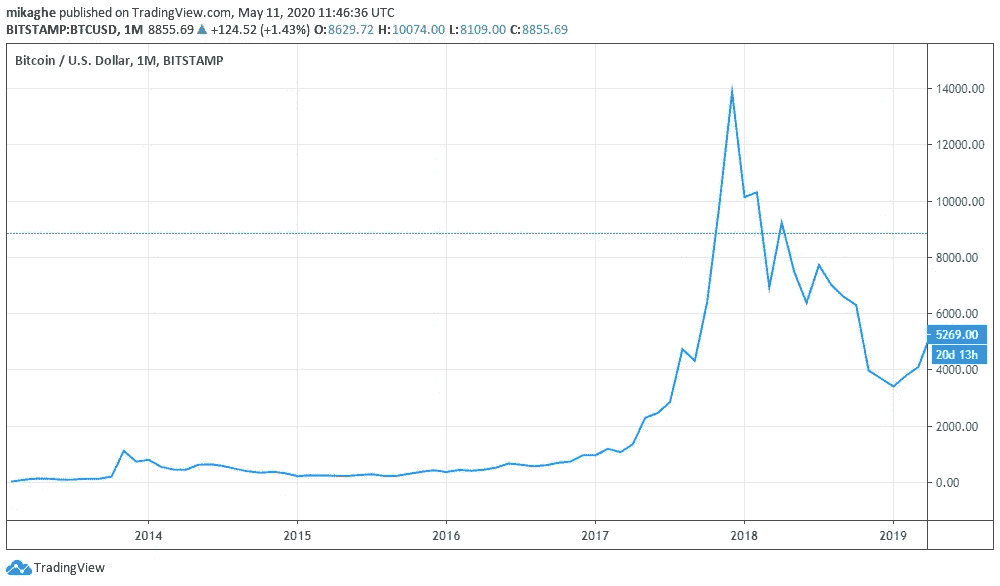
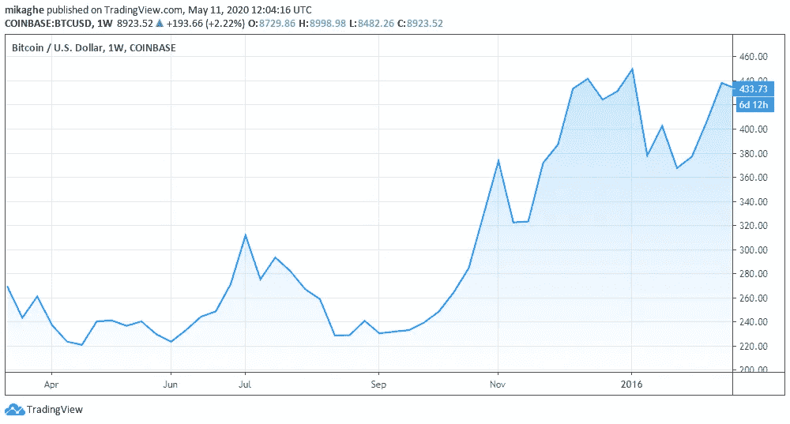

# 现在买比特币还来得及吗？

> 原文：<https://medium.datadriveninvestor.com/is-it-too-late-to-buy-bitcoin-right-now-72ef14b2fe33?source=collection_archive---------17----------------------->

## 加密货币

## 既然第三次减半正在发生

Photo by [Morning Brew](https://unsplash.com/@morningbrew?utm_source=unsplash&utm_medium=referral&utm_content=creditCopyText) on [Unsplash](https://unsplash.com/@morningbrew?utm_source=unsplash&utm_medium=referral&utm_content=creditCopyText)

第三次比特币减半定于 2020 年 5 月 11 日。

在加密货币中，减半是矿工的块奖励减半的事件。这一事件理论上将推动比特币价格上涨。由于比特币的开采成本变得更高，矿商可能会推迟将比特币投入流通，除非它们达到自己想要的价格。从而限制了它的供应，并使加密货币变得更加昂贵。

如果你在过去一周一直关注比特币的价格，你可能会注意到比特币成功地[达到了每枚 1 万美元的价格](https://www.cnbc.com/2020/05/08/bitcoin-btc-cryptocurrency-prices-rise-as-halving-approaches.html)。然而，紧接着是周末的[大幅下跌，价格在几分钟内暴跌超过 10%。](https://www.forbes.com/sites/billybambrough/2020/05/10/sudden-bitcoin-crash-sparks-serious-coinbase-warning/#5f287ca3f840)

 [## 加密货币行业是死是活？数据驱动的投资者

### 九月初，我们在 X-Order 内部就代币市场的未来进行了一场辩论。有趣的是，我们的观点是…

www.datadriveninvestor.com](https://www.datadriveninvestor.com/2019/12/12/will-the-cryptocurrency-industry-be-dead-or-alive/) 

价格波动可能会让任何人，特别是那些对比特币和加密货币整体陌生的人，感到不愿意投资。

如果你想知道这些天是否是购买或囤积更多比特币的好时机，有几件事需要考虑。

## 检查过去发生的事情

比特币在过去经历了两次减半事件，第一次是 2012 年的减半，随后是 2016 年的第二次减半。如果这两次减半事件之间有一个很大的相似之处，那就是比特币总是在减半事件后的 12-15 个月后达到历史新高。

The second halving in July 2016 followed by the famous bull run at the end of 2017

但当查看减半时间前后比特币价格图表上的细节时，你会发现在减半日期后价格略有下降。后来，价格又继续上涨。

There was a significant price fall following the halving from June to September 2016\. The second Bitcoin halving was scheduled on June 9th.

要回答第三次减半后比特币价格是否会上涨的问题，历史表明是可以发生的。但是你不会马上看到突然增加。事实上，**很有可能在减半时间**后不久，价格会先下跌。

## 比特币作为加密货币的现状

历史可能给了我们重要的洞察力，让我们知道即将到来的减半事件会发生什么。然而，另一件更重要的事情是看看现在的情况。今天的现状与 2012 年和 2016 年大不相同。不仅仅是在加密货币领域，而是在更普遍的意义上。

今天世界上发生的事情可能会以不同于以往的方式引导比特币的价格。

首先要考虑的是比特币的受欢迎程度。如今，世界上最大的密码并不像 2012 年那样不为人知。那一年，主要是熟悉区块链技术的人意识到减半，甚至是加密本身。2016 年，比特币越来越受欢迎。然而，它仍然不像今天这样受欢迎，在谷歌搜索结果上，比特币减半的关键词达到了历史新高。

现在市场上有更多的参与者，这意味着你会看到更多有趣的价格行为。随着 T2 交易量的增加，像币安这样的交易所正迎来新用户的激增。因此，矿工这次对比特币价格的影响会小一些。

多年来，比特币作为一种加密货币也已经成熟。交易所现在不太容易被黑客攻击，并且受到监管机构的监督。自 2017 年以来，比特币期货交易一直是一个选项。十年来，比特币也被证明不仅仅是一个泡沫。与更传统的投资形式相比，它的投资回报率也是最高的。

## 新冠肺炎如何影响比特币的第三次减半

今年，第三次比特币减半巧合地发生在世界正在与全球范围的健康和经济危机作斗争的时候。

冠状病毒疫情已经停止了世界大部分经济。随着最近股市暴跌、油价下跌以及经济复苏方式的不确定性，传统投资者开始考虑比特币等非常规选择。

许多人也开始认为比特币可以作为对冲通胀的工具，尤其是在政府不断印钞以刺激经济的情况下。最近，比特币开始吸引机构投资者。最近，亿万富翁兼投资者[保罗·都铎·琼斯](https://www.marketwatch.com/story/hedge-fund-boss-who-called-the-87-crash-and-made-timely-call-on-gold-now-says-if-i-am-forced-to-forecast-my-bet-is-it-will-be-bitcoin-as-the-best-inflation-hedge-2020-05-07)将比特币视为黄金的数字版本。

耐人寻味的是，他暗示比特币是最有可能盈利的投资类型。

用他的话说，

> 利润最大化的最佳策略是拥有最快的马——保罗·都铎·琼斯

另一个关注比特币的著名人物是前高盛对冲基金经理拉乌尔·帕尔。

## 外卖食品

在决定现在购买比特币是否为时已晚时，答案是否定的。但你需要关注短期价格走势，尤其是在减半事件发生后不久。在股价减半后的抛售中，你可能会发现绝佳的买入机会。

你还需要考虑自己的计划。比如你打算什么时候获利或者你期望最终享受投资回报的时间框架。过去的减半图表建议至少等到减半后的 15 个月。另一件要准备的事情是在市场波动中保持坚强的心态。

但最终，如果你相信比特币和区块链的未来，任何时候都是买入的合适时机。