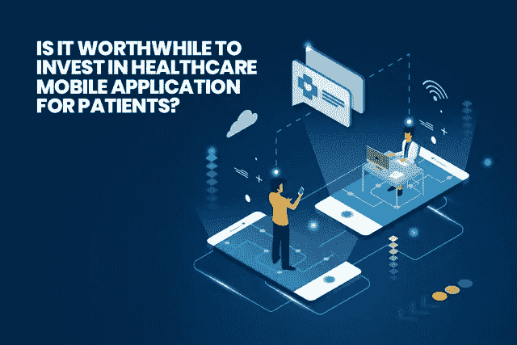
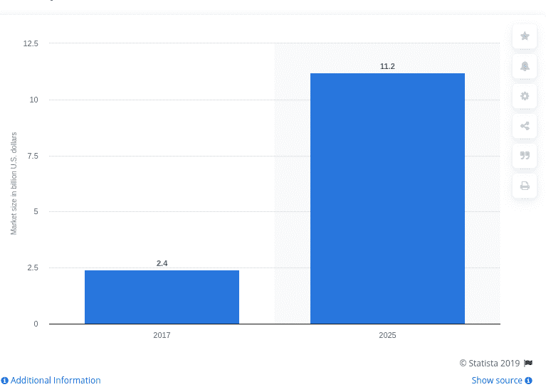
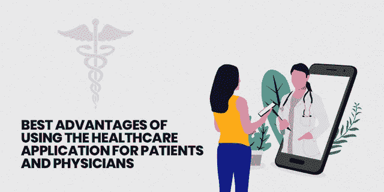

# 为患者投资医疗保健移动应用值得吗？

> 原文：<https://medium.datadriveninvestor.com/is-it-worthwhile-to-invest-in-healthcare-mobile-application-for-patients-22f894df255a?source=collection_archive---------2----------------------->

## 让我们看看为什么移动技术改变了医疗保健行业的场景！

Is It Worthwhile to Invest in Healthcare Mobile Application for Patients?

很久以前，当你需要去医院时，你会想到什么？令人沮丧的候诊室，长长的病人队伍，打扰生病病人的恼人感觉以及匆忙进入医生的房间……我希望这是你在看医生时脑海中描绘的画面。

然而，这一切都要归功于移动应用程序开发行业，它改变了患者从医生那里获得护理的方式。随着移动医疗保健应用的引入，移动设备在医疗保健提供者和患者之间建立了一种新的沟通渠道。毫不奇怪，移动应用程序开发公司已经通过医疗应用程序将医疗保健行业带到了一个新的水平，并鼓励更好的协调。

 [## 大笔资金和尖端技术:人工智能/人工智能投资将如何革新医疗保健…

### 在过去几年人工智能(AI)和机器学习(ML)的显著发展中…

www.datadriveninvestor.com](https://www.datadriveninvestor.com/2018/03/22/big-money-and-cutting-edge-technology-how-investment-in-ai-ml-will-revolutionize-the-healthcare-industry/) 

最近，移动技术极大地改变了医疗保健行业的状况。

# 不，在这里你不需要相信我们的陈述！

> 根据[的事实和数据](https://kaysharbor.com/blog/healthcare/40-amazing-mhealth-statistics-to-blow-your-mind)，2015 年，Play Store 和 App store 中有 420 万个应用，其中仅医疗保健类就有 16.5 万个应用。这些数字正在迅速增加，并积极地赋予病人和医生权力。
> 
> 此外，根据[黑皮书市场研究](https://kaysharbor.com/blog/healthcare/40-amazing-mhealth-statistics-to-blow-your-mind)的调查，2013 年只有 8%的医生使用移动设备来简化事情，这一比例在 2016 年已跃升至 70%。
> 
> GreatCall 坚信手机应用程序有助于患者的健康并提供快速援助。
> 
> [根据最新预测](https://www.statista.com/statistics/877758/global-mobile-medical-apps-market-size/)到 2025 年，全球移动医疗应用市场将增长到 110 亿美元以上。

医疗保健技术的最新进展已经深深震撼了整个行业，并证明这些医疗保健应用程序现在不仅仅是管理患者的记录和协调。尽管知道这一事实，许多医疗保健提供商仍不愿雇佣一家移动应用程序开发公司 来实现数字化。最大的阻力可能是对变革的抵制。如果您也有同样的信念，那么您必须了解为患者和医生开发医疗保健应用程序的好处。

# **患者和医生使用医疗保健应用的最佳优势**

**Advantages of Using the Healthcare Application For Patients &Physicians**

> 让我们了解移动设备如何改变医疗保健行业，并为患者提供更好的护理和关注。

## **1。简化预约安排流程**

为患者推出医疗应用的最大好处之一是为他们提供了一个安全的平台，让他们可以在自己喜欢的时间安排自己选择的医生。

有些时候，病人会跳过同一天与医生预约，最终导致治疗延误。但现在，医疗保健应用程序开发公司设计的应用程序可以提供最大的功能，让患者在安排与专家的预约时可以利用这些功能。

随着医疗应用的推出，患者只需在智能手机上轻轻一点，就可以快速安排预约。此外，提供医疗服务的公司可以使用应用程序来安排员工，并在通过这些应用程序预测预约后分配员工。

> **如今，** [**52%的智能手机用户**](https://www.ortholive.com/blog/mhealth-healthcare-mobile-app-trends-in-2019) **正在他们的移动设备上获取医疗保健相关信息。**

## 2.**减少诊断错误**

> *你注意到这件事了吗，粗心的诊断方法会导致错误的治疗并危及你的生命。*

这是有可能的，尤其是当医疗保健服务提供商使用纸质文件管理患者记录时。用这些文件跟踪患者不仅是医疗行业的巨大负担，也增加了提供错误诊断报告的风险。

> 根据 Skycure 的调查，80%接受调查的医生使用他们的移动设备来辅助他们的日常工作。

这一切都要归功于信息技术，它不仅减轻了管理纸质文件的负担，还能帮助您创建环保文件，这些文件可以安全保存一辈子。此外，医疗保健 [**Android 应用程序开发公司**](https://www.xicom.biz/offerings/android-development/) 可以帮助医生和护士保留准确的患者记录，并消除因最糟糕的笔迹而出现错误的风险。通过流畅的用户界面应用程序交互，医生可以快速查看特定患者的记录，并提供适当的治疗。

## 3.**患者可以更好地跟踪他们的医疗保健**

**Patients Can Keep Track Of Their Healthcare**

> [**40%的医生**](https://www.ortholive.com/blog/mhealth-healthcare-mobile-app-trends-in-2019) **认为移动工具减少了现场临床就诊的比例。**

超过 97，000 个健康和健身应用程序可供下载到您的手机和平板电脑上，跟踪您的健康状况变得比以往任何时候都更加容易。

移动应用程序开发公司开发了如此出色的应用程序，使您能够在自己的水平上监控自己的健康状况。从测量体重到检查血糖水平，计算燃烧卡路里的跑步时间，你的健身应用程序可以为你做所有的事情。

## 4.**增加实时通讯的便利性**

无论是关于预约与专科医生的快速预约、了解医生的经验、了解专科、查看你的医学检验报告还是买药；你需要点击一个应用程序。您只需点击一下移动医疗应用程序，就可以轻松获得所有信息。

另一方面，医生和患者可以共享信息，而无需访问现场诊所。患者可以利用移动应用程序，获得视频咨询或在线咨询，以获得快速而可靠的解决方案。

> ****72%的医生认为，通过可靠的移动应用程序，可以通过电话或视频安全有效地处理紧急护理。****

## **5.医疗费用的大幅下降**

**在医疗保健行业，不断增加的医疗费用和飞涨的账单一直是患者严重关注的问题。而且，有时去一次有名的诊所会让你花费过多。这就是医疗保健应用让您高枕无忧的地方。**

> **虽然一些医疗任务可以通过一个应用程序快速完成，但它将从你的口袋中节省昂贵的负担。**

## **6.**轻松计费****

**支付高额的医疗费用一直是令病人头疼的一件事。然而，随着移动医疗应用的出现，您可以快速结清您的到期账单，而无需排长队。**

**外包软件公司可以开发由安全支付网关支持的应用程序，允许用户在没有任何风险的情况下快速支付一定金额。无论您是通过借记卡还是信用卡支付，移动应用程序都集成了多种支付选项，以确保安全支付账单。**

## **7.**建立信任&更好地协调医患关系****

**医疗保健行业是基于从业者和患者之间的联系。**

> **如果由于语言障碍，患者发现很难与他们选择的医生互动，该怎么办？**

**然而，医疗保健 [**移动应用程序开发公司**](https://www.xicom.biz/services/mobile-app-development/) 可以削减这一障碍，并帮助您立即与您选择的医生建立联系。此外，应用程序使您能够选择您的首选语言，并快速将您的问题或疑问翻译成选定的语言。**

**无论是关于分享医疗信息、报告还是短信，这些应用程序的安全而简单的界面都将帮助您自由交流，并在患者和医生之间建立牢固的联系。通过移动应用程序，医生和患者可以安全地相互交流，没有任何麻烦或中断。**

## **8.**医疗专业人士的福音****

**从医疗保健行业引入医疗应用开始，它们就被证明是医务人员最大的福音。这些应用程序不仅自动化了保存患者记录的过程，还简化了与患者的沟通程序。**

**护士、医生和其他工作人员手动管理患者记录的时代已经过去。这些应用程序让医务人员更容易获得患者的详细信息，并随时了解他们的健康状况。**

**由于我们距离进入 2021 年只有几个小时的时间，许多医生已经采用了最新的技术并使用数字处方。最棒的是，这些处方可以在任何移动设备上访问，医生可以在需要时随时修改。拥有数字处方有很大的好处，并被证明是在紧急情况下最大的优势。**

## **9.**个性化医疗援助****

> ***从你选择的医生那里寻求实时的个体关注是一个真正的挑战。***

**虽然医生已经被安排每天处理大量的患者，因此不可能实时提供个性化的关注。因此，这就是为什么许多医疗服务提供商雇佣 iOS 应用程序开发人员来开发功能丰富的应用程序，使医生能够提供最佳的治疗和最佳的护理。**

> **技术高超的开发人员可以为您提供强大的患者护理工具，在不影响工作量的情况下提供高质量的最佳护理。**

## **10.**医疗保健应用是偏远地区的真正红利****

> **在今天的数字化时代，智能手机正在以多种方式赋予每个人权力，医疗保健也不例外。**

**生活在偏远地区的人们可以利用这些移动应用程序，实时获得最好的医疗服务。移动应用程序是这些地区的真正福音，因为他们必须前往数英里以外的地方与医生联系，以获得优质的治疗。**

**然而在这些 app 的帮助下，一切都变成了只需一键操作的事情。从订购在线药品到获得基本的医疗保健提示，所有这些都可以在移动应用程序的帮助下完成。**

## **11.**提高你的知名度****

****

****Enhance your Visibility****

**自然，如果不能为您的业务增加收益，没有医疗服务提供商愿意 [**雇用应用程序开发人员**](https://www.xicom.biz/solutions/hire-developers/) 并在开发应用程序方面进行巨额投资。**

**除了简化预约程序之外，移动健康应用程序还将通过同时瞄准大量患者来帮助您推广您的品牌。移动应用程序开发公司设计和开发的应用程序可以让您发送推送通知，并为您的客户提供一种直接联系您的方式。**

**随着移动医疗保健应用的推出，医疗保健提供商可以从数字化中显著受益，并能够提升您的服务水平。**

## **拿走**

**毫无疑问，随着数字化的日益普及，医疗保健行业正在经历一场巨大的变革。通过利用最新的技术，现在医生正以最方便的方式为病人提供更有效的治疗。**

> ****随着移动应用让患者的生活变得更加舒适和简单，尽管患者可以实时做出更好的医疗决策。****

## **结尾注释**

**希望你喜欢阅读这篇博客，并理解移动医疗保健应用程序是如何彻底改变医疗保健行业的事实。**

**从简化预约任务到获得在线咨询、管理患者记录到分配员工，移动医疗应用为患者和医务人员带来了无数好处。**

**如果你还没有接触过这项技术，那么 [***雇佣移动应用开发者***](https://www.xicom.biz/offerings/hire-mobile-developers/) 来获得一个应用，让你的医疗服务更上一层楼。**