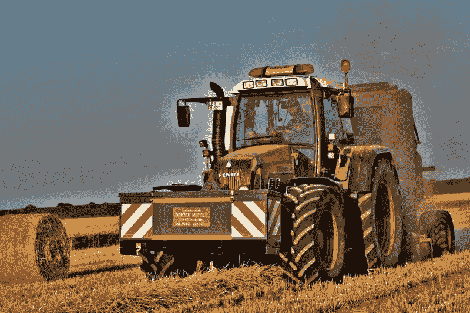
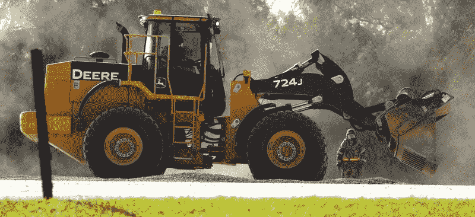
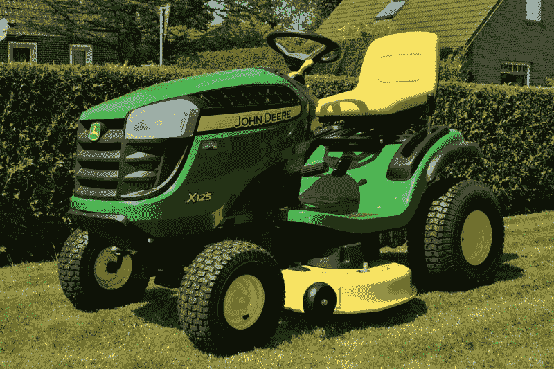
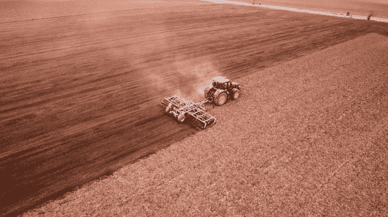
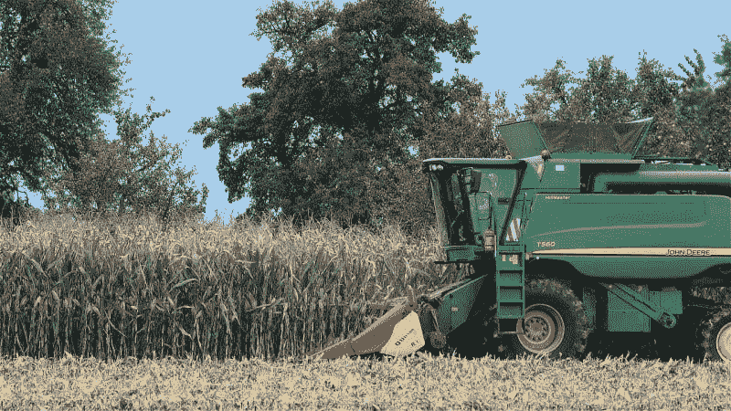

# John Deere 赚钱了吗？—市场疯人院

> 原文：<https://medium.datadriveninvestor.com/is-john-deere-making-money-market-mad-house-ce95a590beea?source=collection_archive---------14----------------------->

标志性拖拉机 John Deere 或者**迪尔&公司**，可能是价值投资。

例如，John Deere 报告 2020 年 1 月 31 日的季度毛利为 25.54 亿美元。此外，John Deere 在同一天报告了 5.69 亿美元的营业收入和 5.18 亿美元的净收入。

重要的是，Deere & Company 报告 2020 年 1 月 31 日的季度收入为 76.31 亿美元。然而，John Deere 的收入正在下降。

# John Deere 的收入正在下降

例如，Deere & Company 的季度收入从 2019 年 10 月 31 日的 98.95 亿美元下降到三个月后的 76.31 亿美元。此外，约翰迪尔的季度收入从 2019 年 1 月 31 日的 79.84 亿美元下降。

值得注意的是，Stockrow 估计 Deere & Company 的收入增长率在截至 2020 年 1 月 31 日的季度下降了 4.42%。此外，截至 2019 年 10 月 31 日，Deere 的收入增长率为 5.09%。

我认为这些数字表明特朗普关税正在影响农场收入和迪尔的销售。值得注意的是，农业局[估计](https://www.fb.org/market-intel/the-verdict-is-in-farm-bankruptcies-up-in-2019)2019 年家庭农场破产数量上升了 20%。

# 美国的农业危机

具体而言，2019 年有 595 个农场家庭申请第 12 章破产，高于 2019 年的 495 个左右。此外，在 2009 年至 2019 年的十年间，有超过 5000 个第 12 章农场破产。

农业局估计，总体而言，2019 年美国农业收入下降了 33%。因此，农民花在拖拉机上的钱少了。所以，John Deere 的客户钱少。

 [## 数据驱动投资的兴起|数据驱动投资者

### 当 JCPenney 报告其 2015 年 2Q 的财务结果时，市场感到非常震惊。美国零售巨头…

www.datadriveninvestor.com](https://www.datadriveninvestor.com/2019/02/28/the-rise-of-data-driven-investing/) 

因此，美国正面临农业危机，这可能会威胁到 Deere & Company 的收入。因此，John Deere 将需要开发新的市场，包括更多的进口和建设。

# John Deere 探索新市场

重要的是， **John Deere (NYSE: DE)** 正在探索新的市场。首先，迪尔正在探索电动拖拉机的可能性。第二，迪尔&公司正在开发自动驾驶拖拉机和人工智能(AI)运行的拖拉机。

特别是，迪尔公司正在测试一种无人驾驶电动拖拉机，他们称之为小丑，*未来农业* [报道](https://www.futurefarming.com/Machinery/Articles/2020/3/John-Deere-We-believe-in-electric-tractors-100-552869E/)。他们正在位于德国凯泽斯劳滕的 John Deere 欧洲技术创新中心开发 Joker。

因此，**迪尔&公司(纽约证券交易所代码:DE)** 正在开发适合大型农业企业的技术。农业综合企业在美国是一个成长中的行业。比如 KVCN，LLC 由房地产亿万富翁谢尔登·索洛(Sheldon Solow)和他的儿子斯特凡·索洛维耶夫(Stefan Soloviev)拥有，在科罗拉多州拥有 8.1 万英亩农田，在堪萨斯州拥有 18214 英亩农田，在新墨西哥州拥有 252450 英亩农田，*韦尔日报* [报道](https://www.vaildaily.com/news/feds-asked-to-direct-union-pacific-to-sell-tennessee-pass-line-to-agriculture-company/)。

据《韦尔日报》报道，事实上，KVCN 有足够的资金来支付 2 . 88 亿美元来购买、重建和重新开放科罗拉多州废弃的田纳西帕斯铁路线。KVCN 子公司计划使用佳能市和韦尔之间的田纳西 Pass 线将农产品运送到**联合太平洋公司(NYSE: UNP)** 横贯大陆的铁路线。希望 UP 能将农产品运送到港口，然后运往亚洲。

# John Deere 不断增长的市场和光明的未来

我认为 KVCN 和 Deere & Company 希望从中国和印度不断增长的人口和收入中获利。具体来说，索洛和他的儿子认为亚洲将会有巨大的新食品市场。

例如，Worldometer 估计印度在 2020 年 3 月有 13.8 亿人口。与此同时，Worldometer 估计，到 2020 年 3 月，中华人民共和国的人口将达到 14.39 亿。换句话说，两个国家都有很多人要养活。

此外，渣打银行估计，到 2030 年，中国和印度将成为世界上最大的两个经济体。具体来说，视觉资本家 [预测](https://www.visualcapitalist.com/worlds-largest-10-economies-2030/?mod=article_inline)到 2030 年，中国的国内生产总值(GDP)将达到 64.2 万亿美元，印度将达到 46.3 万亿美元。相比之下，*视觉资本家*预测美国将在 2030 年拥有 31 万亿美元的 GDP。

因此，Solow & son 希望开发一个价值 110.5 万亿美元，拥有 28.19 亿客户农田和铁路线的市场。我认为迪尔公司(纽约证券交易所代码:DE) 可以通过向 KVCN 出售自动拖拉机来开拓这个市场。

# John Deere 有什么价值？

目前，**约翰迪尔(NYSE: DE)** 很有价值。例如，2020 年 1 月 31 日，Deere 拥有 42.11 亿美元的现金和短期投资，总资产为 728.21 亿美元。

此外，Deere & Company 在超过个国家设有工厂，包括美国、中国、巴西、阿根廷、加拿大、印度、俄罗斯、澳大利亚和欧盟。*因此，Deere 在世界上最重要的农业国家制造农业机械。

除了农业之外，John Deere 还制造建筑、林业、草坪和花园军用以及景观美化设备。因此，我认为 Deere 能够与世界上增长最快的经济体一起成长。

因此，我认为在 2020 年 3 月 20 日市场先生给的 111.63 美元的股价上，John Deere 是一项价值投资。此外，John Deere 制造收割我们食物的机器。

因此，我认为世界各地对 Deere 产品的需求将会持续增长。因此，我认为 John Deere 是一支长期成长股，可以抵御衰退。

# John Deere 是好的分红股票吗？

我认为迪尔公司(NYSE: DE)是一只很棒的分红股票，因为它将在 2020 年 3 月 30 日支付 76₵股息。

总体而言，截至 2020 年 3 月 19 日，John Deere 给股东的股息率为 2.53%，年化派息为 3.04 美元，派息率为 31.74%。Dividend.com[将两年的收入增长归功于](https://marketmadhouse.com/is-john-deere-making-money/#tm=3-comparison-center&r=ES%3A%3ADividendStock%3A%3AStock%23DE--NYSE&only=meta%2Cdata%2Cthead)迪尔。

如果你正在寻找一个具有强大价值特征的好的股息股票，迪尔公司是值得研究的。我认为这家拖拉机制造商在未来的许多年里可以成长和赚钱。

* https://www . Deere . com/assets/pdf/common/our-company/about/ww map _ 2018 . pdf

【https://marketmadhouse.com】原载于 2020 年 3 月 20 日**。**