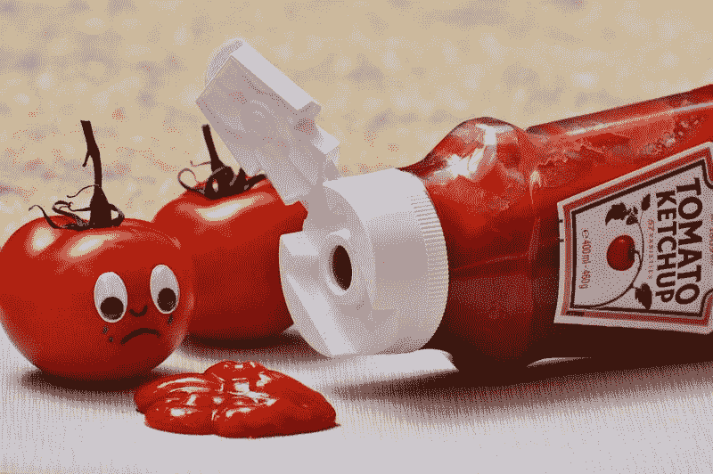
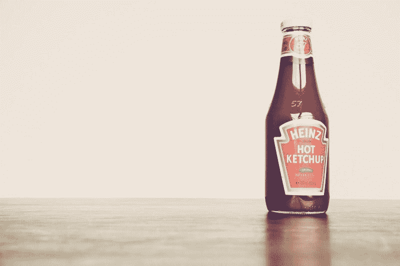
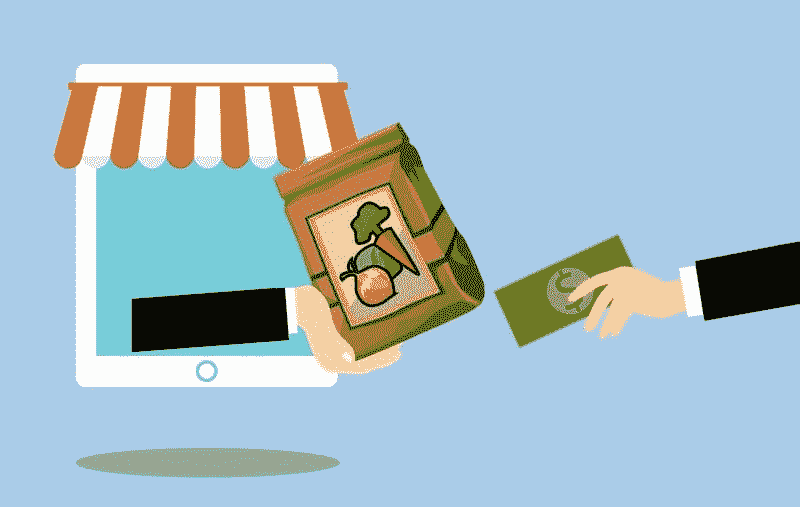
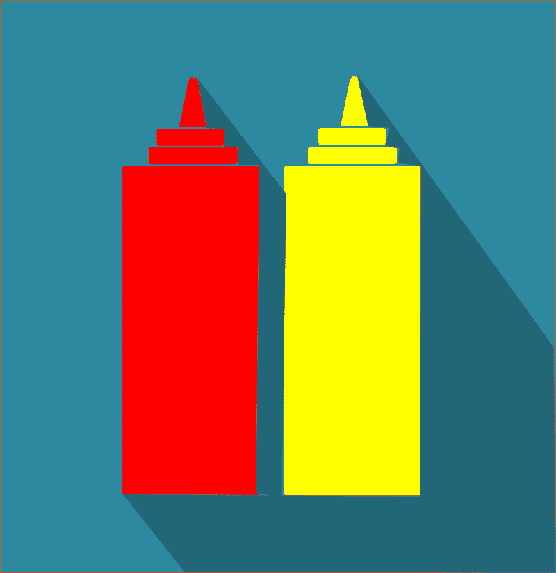

# 卡夫亨氏是垃圾吗？—市场疯人院

> 原文：<https://medium.datadriveninvestor.com/is-kraft-heinz-junk-market-mad-house-c05ed24b1bde?source=collection_archive---------8----------------------->

食品图标和巴菲特的最爱，卡夫亨氏公司(纳斯达克股票代码:KHC)正式成为垃圾股。为了解释，标准普尔将卡夫亨氏的债券降级为垃圾级或 BB+，*雅虎财经* [报道](https://finance.yahoo.com/news/kraft-heinz-cut-junk-fitch-144902320.html)。

具体来说，S&P 将 BB+评级的债券视为投机性投资。新闻界；然而，brands BB+将债务评级为“垃圾债券”。BB+评级意味着卡夫亨氏将支付更多的借款。

BB+评级对卡夫亨氏来说可能很昂贵，因为截至 2019 年 12 月 31 日，该公司的长期债务为 282.16 亿美元，短期债务为 10.28 亿美元。然而，卡夫亨氏仍可能是一项价值投资，因为 Stockrow [估计](https://stockrow.com/KHC/financials/balance/quarterly)在 2019 年新年前夕其总资产为 1014.5 亿美元。

# 卡夫亨氏是价值投资吗？

奇怪的是，BB+评级和 2020 年 3 月 6 日 26.03 美元的股价可能会使**卡夫亨氏(纳斯达克代码:KHC)** 成为价值投资。

我认为卡夫亨氏是一个潜在的价值，因为它报告说，截至 2019 年 12 月 31 日的季度收入为 65.36 亿美元，毛利为 20.17 亿美元。此外，卡夫亨氏公布的季度营业收入为 5.94 亿美元，同期的普通净收入为 1.82 亿美元。

 [## 算法交易的机器学习|数据驱动的投资者

### 当你的一个朋友在脸书上传你的新海滩照，平台建议给你的脸加上标签，这是…

www.datadriveninvestor.com](https://www.datadriveninvestor.com/2019/01/30/machine-learning-for-stock-market-investing/) 

此外，卡夫亨氏仍然通过钱柜运营大量现金。事实上，卡夫亨氏报告的季度运营现金流为 15.62 亿美元，2019 年 12 月 31 日的季度投资现金流为 4 亿美元。然而，卡夫亨氏在同一天公布的期末现金流为-3600 万美元。

因此，卡夫亨氏产生了大量现金。不幸的是，卡夫亨氏将大量现金用于偿还债务。

# 沃伦·巴菲特能拯救卡夫亨氏吗？

卡夫亨氏的诀窍是将价值与债务分开。这可能是一个连沃伦·巴菲特都觉得不可能的把戏。

伯克希尔哈撒韦公司(纽约证券交易所代码:BRK。B) 拥有卡夫亨氏 27%的股份，*商业内幕* [报道](https://markets.businessinsider.com/news/stocks/warren-buffett-loses-billion-2-days-kraft-heinz-disappoints-earnings-2020-2-1028907592)。商业内幕声称，2020 年 2 月卡夫亨氏股价下跌时，巴菲特损失了超过 10 亿美元。卡夫亨氏承认 2019 年第四季度销售额下降 5%后，股价暴跌。

重要的是，巴菲特有办法获得卡夫亨氏的全部价值。我认为伯克希尔哈撒韦公司(纽约证券交易所代码:BRK。A) 可以完全收购卡夫亨氏的剩余股份，使其成为一个完整的子公司。

如果卡夫亨氏首先宣布破产，这可能会消除或减轻卡夫亨氏的债务。或者巴菲特可以购买卡夫亨氏的债务，并从利息中赚钱。不管怎样，沃伦大叔都可以从卡夫亨氏赚很多钱。

此外，媒体推测巴菲特正在寻求大型收购。为什么不呢，卡夫亨氏，一家伯克希尔熟悉并持有部分股份的公司。

# 为什么沃伦·巴菲特想要卡夫亨氏

巴菲特可能想要卡夫亨氏拥有的所有全球品牌。卡夫亨氏的[稳定](https://www.kraftheinzcompany.com/brands.html)品牌包括:亨氏番茄酱、卡夫奶酪、卡夫、通心粉和奶酪、果冻、Grey Poupon 芥末、麦斯威尔咖啡、Planter's 花生、Kool-Aid、Classico、Velveeta、Honing、Capri Sun 和 Weight Watchers。

伯克希尔·哈撒韦可以通过其子公司麦克莱恩分销所有或部分这些品牌。麦克莱恩向商店和餐馆分发食物、小吃、糖果、香烟和其他物品。

伯克希尔可以赚更多钱的一个方法是让麦克莱恩将卡夫亨氏食品配送给 Instacart 或 Amazon Fresh 等配送服务。Instacart 或亚马逊可以将这些食物直接送到顾客家中。

伯克希尔可以赚钱的另一种方式是将卡夫亨氏产品分销给所有无收银员的自动化商店****【纳斯达克股票代码:AMZN】**[**沃尔玛**](https://www.grocerydive.com/news/walmart-opens-cashierless-store-in-florida/570293/) **【纽约证券交易所:WMT】**，以及其他计划开业的零售商。**

**除了麦克莱恩，伯克希尔可以将卡夫亨氏食品直接出售给亚马逊或克罗格(纽约证券交易所代码:KR) [机器人](https://www.bloomberg.com/opinion/articles/2019-07-22/kroger-goes-full-robot-to-take-on-amazon-with-ocado)杂货履行系统。然而，伯克希尔将不得不低价出售卡夫亨氏产品，以从亚马逊或克罗格赚钱。解释一下，克罗格和亚马逊是深度折扣店，通过低价销售大量商品来赚钱。**

# **卡夫亨氏是好的分红股吗？**

**奇怪的是，我认为**卡夫亨氏(NASDAQ: KHC)** 是一只很好的股息股，因为尽管它存在问题，但它将在 2020 年 3 月 12 日支付 40₵股息。**

**总体而言，Dividend.com[估计](https://marketmadhouse.com/is-kraft-heinz-junk/#tm=3-comparison-center&r=ES::DividendStock::Stock%23KHC--NASDAQ&only=meta,data,thead)卡夫亨氏在 2020 年 3 月 6 日交付了 6%的股息收益率，年化派息为 1.60 美元，派息率为 70.34%。此外，尽管卡夫亨氏公司存在问题，但该公司的股息在过去五年中一直在增长。**

****

**因此，投资者仍然可以从卡夫亨氏赚钱。然而，我认为 S&P 对卡夫亨氏的看法是正确的。为了解释这一点，我认为卡夫亨氏是一种高风险的投机性投资，安全边际很低，只有能够承受亏损的投资者才应该购买。**

***原载于 2020 年 3 月 6 日 https://marketmadhouse.com**的* [*。*](https://marketmadhouse.com/is-kraft-heinz-junk/)**