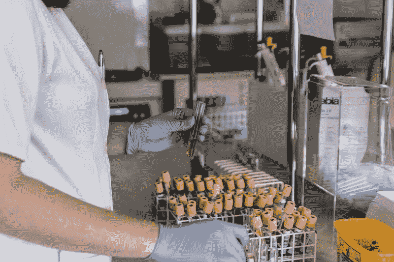
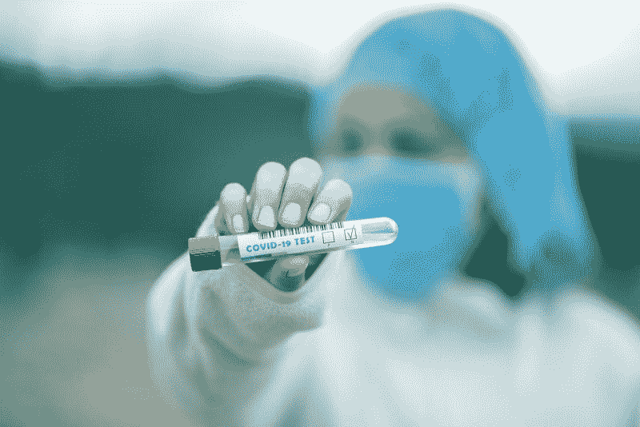
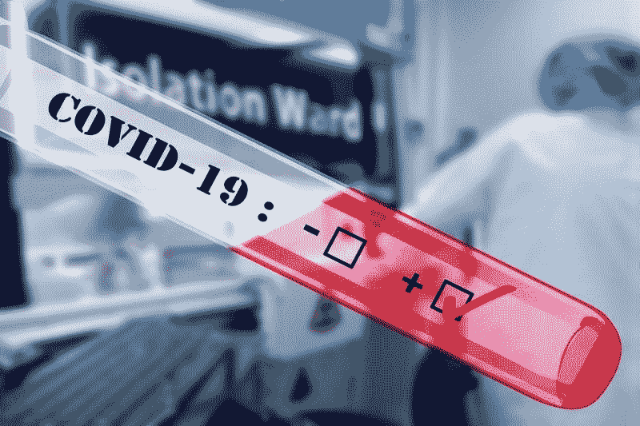

# 美国实验室公司赚钱了吗？—市场疯人院

> 原文：<https://medium.datadriveninvestor.com/is-laboratory-corp-of-america-making-money-market-mad-house-510b028a431e?source=collection_archive---------21----------------------->

实验室公司可能是冠状病毒时代的完美公司。LabCorp 在美国各地经营着医学检测实验室。

例如，LabCorp 每周测试超过 300 万份患者样本。重要的是，LabCorp 提供 LabCorp 现在提供[新冠肺炎 IgG 抗体测试](https://www.labcorp.com/antibody-testing)和 covi 9–19 测试家庭收集试剂盒。

 [## 大笔资金和尖端技术:人工智能/人工智能投资将如何革新医疗保健…

### 在过去几年人工智能(AI)和机器学习(ML)的显著发展中…

www.datadriveninvestor.com](https://www.datadriveninvestor.com/2018/03/22/big-money-and-cutting-edge-technology-how-investment-in-ai-ml-will-revolutionize-the-healthcare-industry/) 

因此，实验室公司可能会赚钱，因为联邦政府健康保险公司承保新型冠状病毒(新冠肺炎)的诊断检测，对患者不收取任何费用。因此，山姆大叔可以用税收来支付 LabCorp 的许多服务。此外，Medicare 部分承保冠状病毒测试和 Medicare.gov 新冠肺炎抗体测试。

# 冠状病毒对 LabCorp 有好处吗？

另一方面，冠状病毒一直对**实验室控股公司(NYSE: LH)** 的股票不利。

例如，LabCorp 在 2020 年 1 月 2 日的股价为 167.48 美元。该股在 2020 年 3 月 23 日跌至 104.32 美元，但在 2020 年 5 月 20 日升至 170.52 美元，并在 2020 年 5 月 22 日跌至 170.16 美元。因此，冠状病毒对实验室公司的股票有利。

但是，愤世嫉俗的人会问 LabCorp 赚钱了吗？毕竟，实验室公司将不得不支付额外的设备来进行所有这些冠状病毒测试。此外，LabCorp 将需要支付昂贵的安全措施，以保护其员工和客户免受新冠肺炎。因此，LabCorp 的费用可能会更高。

# LabCorp 能赚钱吗？

相反，LabCorp 在 2020 年第一季度亏损。例如，截至 2020 年 3 月 31 日，LabCorp 报告季度运营亏损-1.926 亿美元，普通净亏损-3.17 亿美元。

然而，LabCorp 在 2020 年 3 月 31 日的季度收入为 28.23 亿美元，季度毛利为 7.28 亿美元。不幸的是，截至 2019 年 12 月 31 日，这些收入从 29.33 亿美元下降，毛利从 8.207 亿美元下降。

因此，实验室公司的收入和毛利在 2020 年第一季度下降。此外，LabCorp 的季度营业收入从 2020 年 12 月 31 日的 3.364 亿美元降至 2020 年 3 月 31 日的-1.92 亿美元。

因此，LabCorp 在疫情冠状病毒上亏损了。然而，他们在医疗保险开始覆盖冠状病毒检测之前报告了这些数字。

LabCorp 的一个问题是人们没有得到其他种类的测试；比如药检，因为冠状病毒。因此，随着收入下降，LabCorp 的支出可能会增加。

# LabCorp 产生了多少现金？

重要的是， **LabCorp (NYSE: LH)** 正在产生现金。值得注意的是，LabCorp 报告 2020 年 3 月 31 日的季度运营现金流为 2.038 亿美元。然而，该营运现金流从 2020 年 12 月 31 日的 5.698 亿美元。

此外，实验室公司报告 2020 年 3 月 31 日的期末现金流为 3.236 亿美元。有趣的是，截至 2019 年底，期末现金流从-2360 万美元增长。

因此，LabCorp 报告 2020 年 3 月 31 日的现金和短期投资为 3.236 亿美元。然而，这一数字低于 2019 年 12 月 31 日的 3.375 亿美元和 2019 年 3 月 31 日的 3.48 亿美元。

因此，实验室公司的现金较少。有趣的是，截至 2020 年 3 月 31 日，LabCorp 的总资产为 172.98 亿美元，长期债务为 64.89 亿美元。因此，LabCorp 可能面临无法支付的债务。

# LabCorp 是价值投资吗？

我认为**实验室公司(纽约证券交易所代码:LH)** 具有重要价值，尽管它负债累累。例如，LabCorp 在美国运营着 36 个初级实验室。

此外，联邦政府将以医疗保险和医疗补助的形式支付这些实验室服务的费用。例如，2020 年 1 月，医疗补助和医疗保险中心医疗补助和儿童健康保险计划(CHIP)覆盖了 7071.2 万美国人。此外，医疗保险中心和医疗保险 6140 万美国人在 2019 年获得了医疗保险。

Laboratory Corp 拥有数千万用户，他们的费用将由联邦政府承担。因此，我认为实验室公司有很高的安全边际，因为联邦政府将支付其费用。

# LabCorp 是好股票吗？

然而，我认为 LabCorp 是一只糟糕的股票，因为它不支付股息，并为普通投资者提供安全边际。

此外，我认为市场先生在 2020 年 5 月 22 日对 LabCorp 的定价过高，为 170.19 美元。我建议投资者避开 LabCorp，直到市场先生对它进行现实的定价。总之，我认为**实验室公司(纽约证券交易所代码:LH)** 的现实价格可能在 50 美元左右。

*原载于 2020 年 5 月 25 日 https://marketmadhouse.com**[*。*](https://marketmadhouse.com/is-laboratory-corp-of-america-making-money/)*