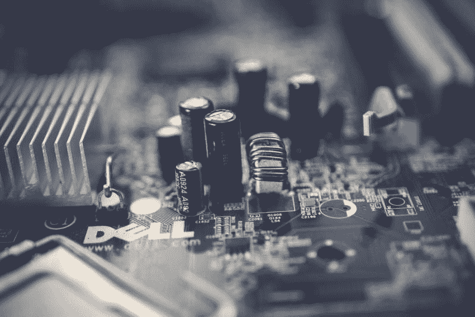
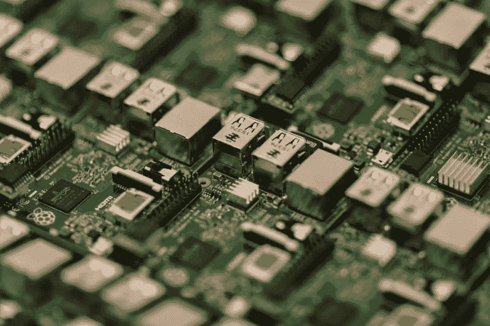
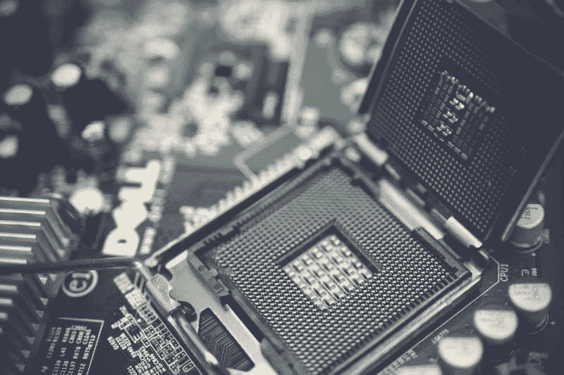

# Lam Research 赚钱了吗？—市场疯人院

> 原文：<https://medium.datadriveninvestor.com/is-lam-research-making-money-market-mad-house-e43f6db9a19d?source=collection_archive---------32----------------------->

**Lam Research (NASDAQ: LCRX)** 是全球增长最快的股票之一。

过去一年，林氏价格由二零二零年二月三日的 308.44 元，升至二零二一年一月十九日的 580.02 元，二零二一年二月二日的 515.05 元，以及二零二一年二月三日的 504.33 元。因此，如果 2020 年至 2021 年存在科技股泡沫， **Lam Research (LCRX)** 可能就是它的典型代表。

那么什么是 Lam 研究，它赚钱吗？Lam Research 制造制造半导体的晶圆制造机器。因此，Lam Research 具有巴菲特式价值投资的一些特征。

为了解释这个问题， [Lam Research 制造机器](https://www.lamresearch.com/products/products-overview/)，这些机器制造部件，这些部件构成了几乎所有的高科技设备。请记住，半导体运行于电脑、智能手机、自动驾驶汽车、视频游戏和几乎所有其他技术设备。

# 半导体值多少钱？

我认为半导体和处理器制造商的成功，如[**【NVDIA(NVDA)**](https://marketmadhouse.com/why-is-nvidia-nvda-surging/)推动了对 Lam 研究的投资。

半导体是一个利润丰厚且不断增长的行业。例如，半导体行业协会(SIA)估计，2020 年全球半导体销售额增长了 6.5%，达到 4390 亿美元。

值得注意的是，半导体销售额在一个月内达到 392 亿美元。SIA 估计是 2020 年 12 月。此外，2020 年第四季度的半导体销售额为 1175 亿美元。2019 年第四季度至 2020 年同期，半导体销量增长了 8.3%。

相比之下，Statista 估计全球半导体市场从 1987 年的 330 亿美元增长到 2021 年 1 月的 4694 亿美元。因此，半导体是世界上增长最快的投资之一。

# Lam 研究赚钱吗？

林氏研究公司正在赚钱。例如，2020 年 12 月 31 日，Lam Research 报告季度毛利为 16.04 亿美元，季度营业收入为 10.1 亿美元。

季度营业收入从 2019 年 12 月 31 日的 6.8651 亿美元上升。相比之下，Lam 的季度毛利从 2019 年 12 月 31 日的 11.80 亿美元上升。

同样，Lam 的季度收入从 2019 年 12 月 31 日的 25.84 亿美元上升至 2020 年 12 月 31 日的 34.56 亿美元。此外，Stockrow 估计，在截至 2020 年 12 月 31 日的季度中，Lam Research 的[收入增长率为 33.78%](https://stockrow.com/LRCX/financials/income/quarterly) 。

令人印象深刻的是，2020 年 Lam 的收入增长率从截至 2019 年 12 月 31 日的季度的 2.41%上升至截至 2020 年 9 月 30 日的季度的 46.7%。因此，我认为 Lam Research 提供了极好的安全边际，因为增长率很高。

# Lam Research 产生了多少现金？

**Lam Research (LRCX)** 产生一些现金。例如，Lam 报告 2020 年 12 月 31 日的季度运营现金流为 3.4464 亿美元。

季度运营现金流从 2019 年 12 月 31 日的 3.0793 亿美元增长。然而，Lam Research 报告称，截至 2020 年 12 月 31 日，季度末现金流为负-4.4255 亿美元。季度期末现金流从 2020 年 9 月 30 日的 43.8252 亿美元下降到 2019 年 12 月 31 日的-15.7204 亿美元。

因此，Lam 研究可以产生大量的现金。此外，Lam Research 借了一些钱，但还了债。例如，Lam Research 报告 2020 年 12 月 31 日的季度融资现金流为-8.6532 亿美元，2020 年 6 月 30 日的季度融资现金流为 2.2545 亿美元。

最后，Lam Research 在 2020 年 12 月 31 日拥有 60.42 亿美元的现金和短期投资。现金和短期投资从 2019 年 12 月 31 日的 46.4 亿美元增长。

# Lam 研究有什么价值？

【2020 年 12 月 31 日，Lam Research (NASDAQ: LRCX) 的总资产价值为 153.7 亿美元。

总资产从 2019 年 12 月 31 日的 119.14 亿美元增长。相反，Lam 的长期债务从 2019 年 12 月 31 日的 37.86 亿美元增长至 2020 年 12 月 31 日的 49.93 亿美元。

因此，Lam Research 的价值和债务都在增加。然而，在 Lam 的财务数据中，我看不出有什么理由证明 Market 先生在 2020 年 2 月 2 日支付的 516.07 美元是合理的。

# Lam Research 是好股票吗？

我认为 Lam Research (LRCX) 太贵了，不值得投资。然而，Lam 是一只优秀的分红股票。

Lam Research 于 2020 年 12 月 8 日支付了 1.30 美元的季度股息。值得注意的是，在 2020 年，该季度股息从 2020 年 6 月 16 日的 1.15 美元增长到 2020 年的 1.15 美元。总体而言，林氏股份在 2021 年 2 月 2 日提供了 4.90 美元的年度股息和 1.01%的股息收益率。

我认为 Lam Research 是一只有趣的股票，市场先生定价过高，但提供了出色的收入和安全边际。Lam 有一些很好的特性，但是它的价格太高，不安全。

*原载于 2021 年 2 月 3 日*[*【https://marketmadhouse.com】*](https://marketmadhouse.com/is-lam-research-making-money/)*。*