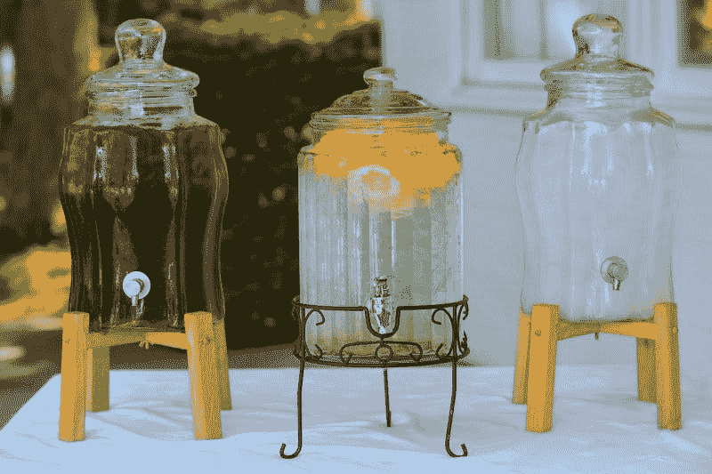

# 柠檬水是好股票吗？—市场疯人院

> 原文：<https://medium.datadriveninvestor.com/is-lemonade-a-good-stock-market-mad-house-ed9d19049936?source=collection_archive---------10----------------------->

在线保险供应商**柠檬水公司(纽约证券交易所:LMND)** 可能是 2020 年最热门的首次公开募股(IPO)。

令人难以置信的是，柠檬水的股价从 2020 年 7 月 1 日的 55₵涨到了 2020 年 7 月 17 日的 85.89 美元。然而，柠檬水的股价在 2020 年 7 月 22 日跌至 78.50 美元。这使得柠檬水在 2020 年 7 月 17 日的市值为 47.1 亿美元，在 2020 年 7 月 22 日的市值为 43.09 亿美元。因此，市场先生喜欢柠檬水，但这只股票有什么价值呢？

不幸的是，柠檬水的财务数据很难找到，因为股票是全新的。然而，有一些柠檬水的财务数据。

# 柠檬水赚了多少钱？

**柠檬水(纽约证券交易所:LMND)**2019 年 12 月 31 日报告的年度总收入为 6750 万美元。这些年收入从 2018 年 12 月 31 日的 2250 万美元增长，[雅虎财经估计](https://finance.yahoo.com/quote/LMND/financials?p=LMND)。

 [## 2020 年最佳短期投资选择精选资源|数据驱动型投资者

### 投资是增加你净财富的一个好方法。如果你通过遵循一个严格的…

www.datadriveninvestor.com](https://www.datadriveninvestor.com/2020/03/28/handpicked-resources-for-the-best-short-term-investment-options-of-2020/) 

然而，柠檬水在 2019 年 12 月 31 日报告了税前年度亏损-1.079 亿美元。税前年度亏损从 2018 年 12 月 31 日的-5，260 万美元上升。

与此同时，柠檬水在 2020 年 3 月 31 日报告了 2010 万美元的负自由现金流。值得注意的是， [Ycharts 报告称](https://ycharts.com/companies/LMND/key_stats)柠檬水在 2020 年 3 月 31 日的季度利润率为-139.3%。

此外，柠檬汽水公司报告称，截至 2020 年 3 月 31 日，现金和短期投资为 3.123 亿美元，总资产价值为 4.012 亿美元。鉴于这些数字，我认为柠檬水有一些价值，但不赚钱。

# 柠檬水是什么？

[**【柠檬水股份有限公司】**](https://marketmadhouse.com/is-lemonade-a-good-stock/#service) 由三家公司组成；柠檬水保险公司、柠檬水保险代理公司和柠檬水有限公司。

为了详细说明柠檬水保险公司发布政策和支付索赔。柠檬水保险代理有限责任公司是一家在线经纪公司，销售和服务公司发行的政策。相反，柠檬汽水有限公司向其他公司提供技术和其他资源。

目前，Lemonade 在大约 20 个州为租房者、房主、公寓和宠物提供健康保险。柠檬水声称世界上最大的再保险公司支持它的政策。然而，柠檬水并没有在其网站上指明这些再保险人。

# 柠檬水的黑仔应用

我认为柠檬水可能会有一个杀手级的应用程序，可以在保险行业赚很多钱。

柠檬水的杀手级应用是一种人工智能(AI ),可以无缝、即时地在线处理索赔。理论上，柠檬水的杀手级应用程序可以通过应用程序支付你的索赔。

因此，柠檬水可以拥有一项其他保险公司可以花大价钱购买的数字技术。此外，这个杀手级应用可以让柠檬水对那些希望通过智能手机获得即时数字服务的年轻消费者更具吸引力。

例如， **Progressive Corp(纽约证券交易所:PGR)** 可以使用 Lemonade 的应用来支付一些索赔。然而，我看不出这样的应用程序可以处理汽车保险索赔。

# 柠檬水在宠物保险里能赚钱吗？

相反，柠檬水可以开发新的保险产品和工具，并销售给其他保险公司。例如，**联合健康集团(NYE: UNH)** 可以将柠檬水为宠物保险开发的工具应用于人类健康保险。

此外，柠檬水可以开发一个平台，其他保险公司可以用来进入宠物保险业务。此外，我认为宠物保险可能是一个增长业务。

柠檬水于 2020 年 7 月 15 日进入宠物保险。因此，现在判断宠物保险是否有利可图还为时过早。然而，宠物保险的潜在市场可能是巨大的。

# 美国人会买宠物保险吗？

例如，美国兽医协会估计 2018 年有 4825.5 万美国家庭养狗。

此外，2018 年有 3289.6 万美国家庭养猫。因此，38.4%的美国家庭养狗，25.4%的美国家庭养猫。

此外，柠檬水首席执行官丹尼尔·施雷伯声称 70%的柠檬水投保人拥有宠物。然而，宠物保险是一个艰难的销售。《纽约时报》估计只有 2%的美国人拥有宠物保险。因此，没有证据表明美国人会购买宠物保险。

我认为宠物保险可以成为新的数字保险工具的一个很好的试验场。此外，宠物保险可能是吸引人们购买其他种类保险的一个途径。例如，柠檬水可以向宠物保单持有人推销健康或人寿保险。

# 柠檬水是好的投资吗？

我认为柠檬水不是一个好的投资，因为没有证据表明它的生意能赚钱。

对于一家公司来说，柠檬水不是一项价值投资，而是一个有趣的想法。因此，柠檬水是一种高风险的投机性投资，而不是价值股。

在这种情况下，我认为承受不起亏损的人(90%的投资者)需要避免喝柠檬水。柠檬水(纽约证券交易所:LMND) 股票对普通人来说太危险了。但是，柠檬水的保险值得调查。

*原载于 2020 年 7 月 22 日*[*【https://marketmadhouse.com】*](https://marketmadhouse.com/is-lemonade-a-good-stock/)*。*

## 访问专家视图— [订阅 DDI 英特尔](https://datadriveninvestor.com/ddi-intel)