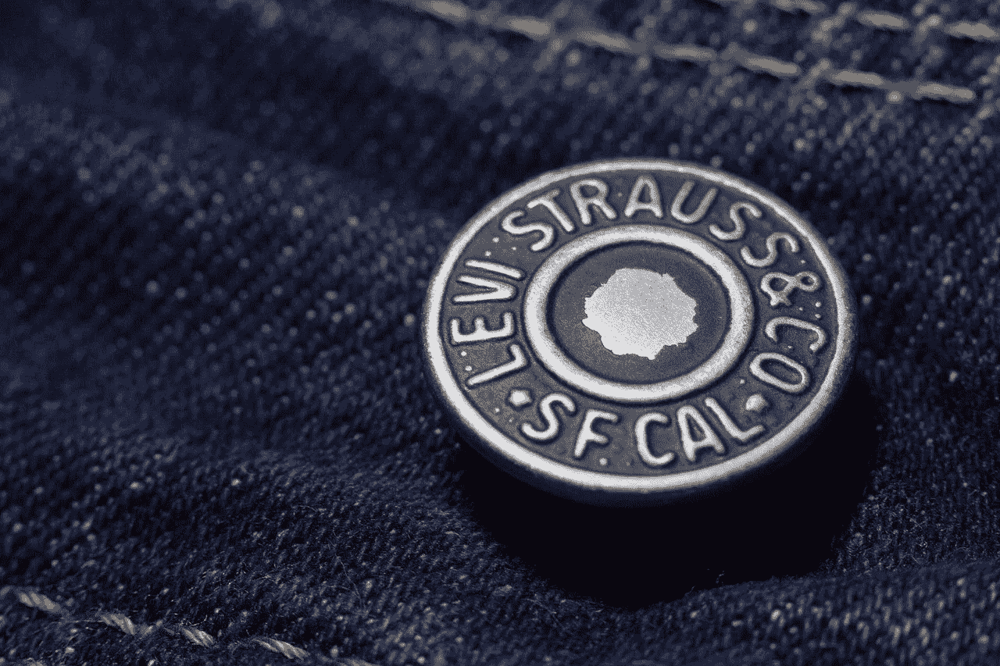
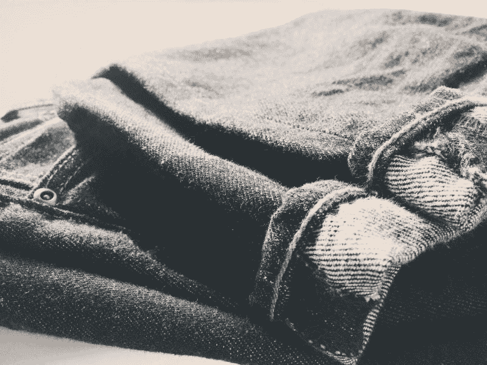
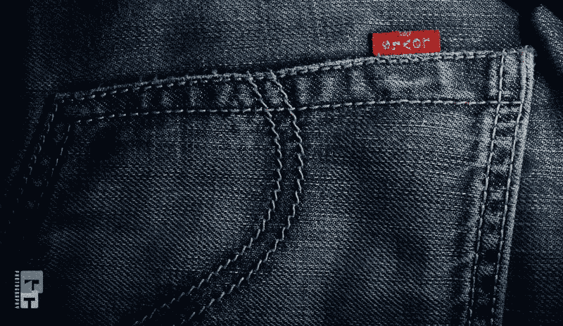
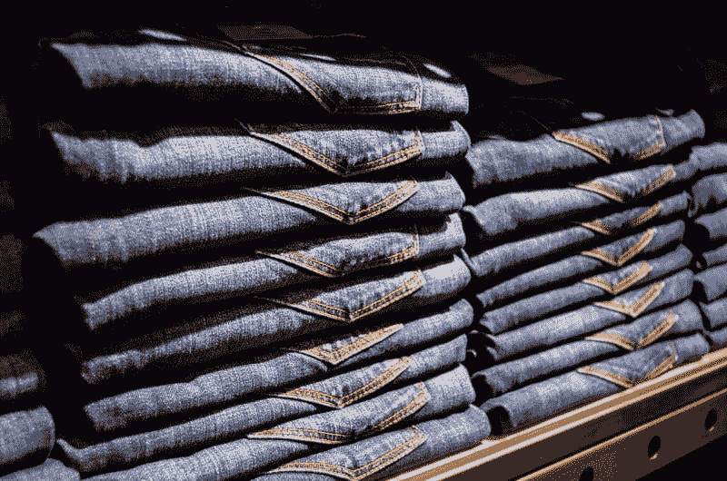
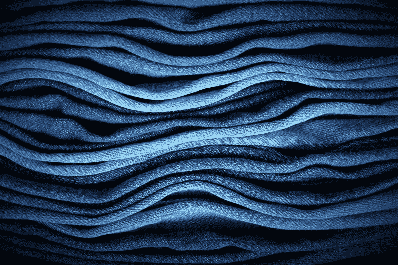
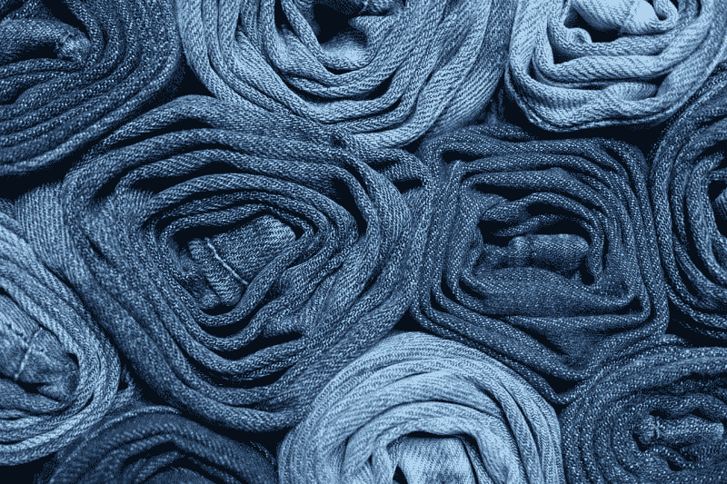
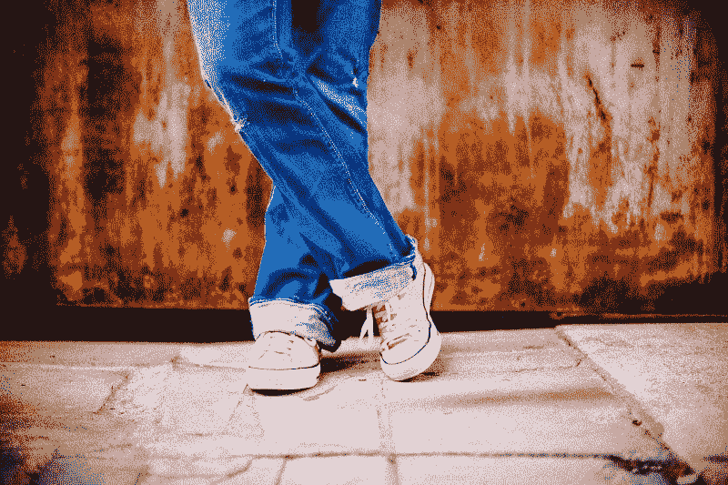

# 李维·施特劳斯注定要失败吗？—市场疯人院

> 原文：<https://medium.datadriveninvestor.com/is-levi-strauss-doomed-market-mad-house-c4c382d54c5d?source=collection_archive---------39----------------------->

Levi Strauss 公司展示了冠状病毒如何摧毁许多零售和时尚品牌。

例如， **Levi Strauss (LEVI** )在 2020 年 5 月 31 日报告了 4.4824 亿美元的季度运营亏损。相比之下，Levi Strauss 报告 2020 年 8 月 31 日的营业收入为 9233 万美元。

类似地，Stockrow 估计 Levi Strauss 的收入增长在截至 2020 年 8 月 31 日的季度收缩了 [28.54%。在截至 2020 年 5 月 31 日的季度中，季度收入增长缩减了-62.10%。](https://stockrow.com/LEVI/financials/income/quarterly)

# 冠状病毒如何杀死李维·斯特劳斯

因此，李维斯可能是疫情最脆弱的公司之一。我认为李维斯亏损是因为新冠肺炎关闭了工作场所和零售店。

解释一下，蓝色牛仔裤是许多美国人的标准工作服，包括大多数办公室职员。然而，蓝色牛仔裤会让人不舒服。因此，许多人不穿牛仔裤是因为他们在家工作。相反，这些人会穿更舒适的衣服，比如运动衫、短裤或瑜伽裤。

此外，大多数人在冠状病毒关闭的商场和百货公司购买牛仔裤。因此，李维斯面临着一场零售崩溃和需求下降的完美风暴。

# 李维斯赚钱了吗？

李维·施特劳斯赚了一些钱。Levi Strauss 报告 2020 年 8 月 31 日季度利润总额为 5.774 亿美元。

季度毛利从 2020 年 2 月 29 日的 8.3933 亿美元下降至 2020 年 5 月 31 日的 1.6965 亿美元。同样，季度营业收入从 2020 年 2 月 29 日的 1.7871 亿美元降至 2020 年 5 月 31 日的-4.4824 亿美元。

李维斯的季度收入从 2020 年 2 月 29 日的 15.06 亿美元下降到 2020 年 5 月 31 日的 4.9754 亿美元。最终，2020 年 8 月 31 日，季度收入增至 10.63 亿美元。

# 李维·斯特劳斯能产生多少现金

李维斯(纽约证券交易所代码:李维斯)正在创造一些现金。截至 2020 年 8 月 31 日，该公司报告的季度运营现金流为 1.995 亿美元。

2020 年，季度运营现金流从 2020 年 2 月 29 日的 1.9788 亿美元下降至 2020 年 5 月 31 日的-1.5652 亿美元。然而，季度期末现金流从 2020 年 2 月 29 日的 8.7407 亿美元降至 2020 年 5 月 31 日的 5.7497 亿美元和 2020 年 8 月 31 日的-9，554 万美元。

我认为李维·施特劳斯不得不借钱度过 2020 年。为了解释这一点，Levi Strauss 报告了 2020 年 5 月 31 日融资所得的 7.2761 亿美元现金。2020 年 8 月 31 日，融资现金降至-2.8707 亿美元。Levi Strauss 在 2020 年 2 月 29 日以 1.3802 亿澳元的运营现金流开始了 2020 年。

值得注意的是，李维斯的长期债务从 2020 年 2 月 29 日的 4.1639 亿美元增长到 2020 年 5 月 31 日的 5.0412 亿美元。2020 年 8 月 31 日，长期债务降至 5.0070 亿美元。

# 李维斯有什么价值？

截至 2020 年 8 月 31 日，Levi 拥有 14.25 亿美元的现金和短期投资。

截至 2020 年 8 月 31 日，李维斯的总资产为 55.47 亿美元。总资产从 2020 年 2 月 29 日的 511.15 亿美元。因此，李维斯在 2020 年增加了一些价值。

因此，我认为李维斯唯一的价值就是它的‘标志性品牌’。说得详细点，很多公司都做蓝色牛仔裤，但只有这家公司有李维斯的标签。然而，有许多消费者并不在乎李维斯的标签。

# Levi Strauss 能和亚马逊竞争吗？

尤其是所有从美国最受欢迎的百货商店**亚马逊**购买服装的人。值得注意的是，杰夫·贝索斯在 2020 年 8 月告诉国会，亚马逊的自有品牌[占亚马逊服装](https://www.marketplacepulse.com/articles/9-of-amazons-sales-in-clothing-are-from-its-private-label-brands)、鞋、&配件部门销售额的 9%。

因此，我认为亚马逊现在是李维斯最大和最危险的竞争对手。事实上，我认为美国最受欢迎的蓝色牛仔裤品牌可能很快就会成为亚马逊品牌。

李维斯将很难与亚马逊品牌竞争，因为懒人会先订购亚马逊品牌。请记住，你可以在几秒钟内找到手机上的亚马逊品牌，并让 UPS 明天送货上门。

同样，所有因为新的、更具传染性的新冠肺炎菌株而害怕进入实体店的人将在**亚马逊**购物。因此，我认为李维斯的未来可能是成为亚马逊的供应商。

因此，李维·斯特劳斯将受到亚马逊的摆布。我不明白利瓦伊·施特劳斯如何在这种现实中生存。

# 李维斯是好股票吗？

Levi Strauss 公司是一只便宜的股票。2021 年 1 月 28 日，Market 先生为 LEVI 支付了 20.74 美元。

这一价格高于 2020 年 1 月 27 日的 20.25 美元。值得注意的是，李维斯的股价在 2020 年 8 月 3 日跌至 9.51 美元的低点。我认为 Market 先生对 Levi Strauss 的定价是现实的，因为它对亚马逊有敞口。

详细来说，我认为暴露于亚马逊给李维斯一个低的安全边际。因此，我认为李维·施特劳斯可能会垮台。

相反，李维斯在 2020 年 4 月 23 日支付了 8 英镑的季度股息。然而，自那以后，李维·施特劳斯没有支付过股息。

我认为李维·施特劳斯是一个崩溃行业中的危险股票；投资者需要避免的实体时尚。我预测李维斯唯一的未来将是成为一家更大公司的一部分。比如亚马逊。

*原载于 2021 年 1 月 28 日 https://marketmadhouse.com**的* [*。*](https://marketmadhouse.com/is-levi-strauss-doomed/)