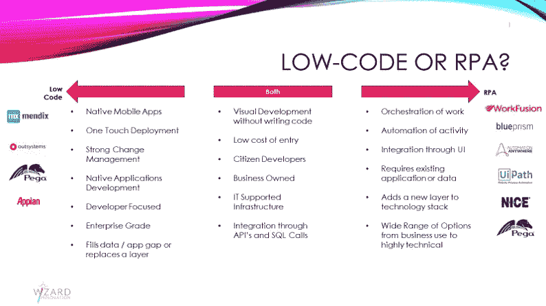
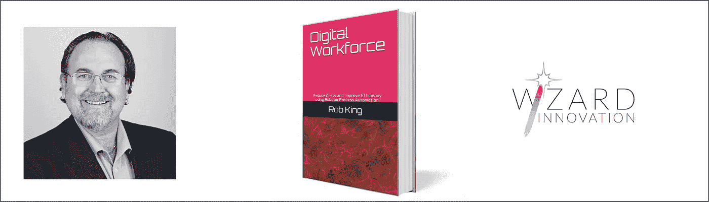

# 低代码是机器人流程自动化(RPA)的替代方案还是附加方案？

> 原文：<https://medium.datadriveninvestor.com/is-low-code-an-alternative-or-an-addition-to-robotic-process-automation-rpa-3fb5158ed869?source=collection_archive---------1----------------------->

Photo by [Jonathan Francisca](https://unsplash.com/@jonathan_francisca?utm_source=medium&utm_medium=referral) on [Unsplash](https://unsplash.com?utm_source=medium&utm_medium=referral)

去年，我参加了欧洲有史以来最大的低代码会议。由鹿特丹的 Mendix 主办，两天内吸引了约 5000 名参观者。

根据 Gartner 的研究，到 2024 年，低代码将负责 65%的应用程序开发活动，四分之三的大型企业将在 IT 开发和公民开发活动中使用多种低代码开发工具。

> 到 2024 年，低代码将负责 65%的应用程序开发活动

# 那么什么是低代码，它与 RPA 有什么关系呢？

在这个栅栏的两边工作，使用低代码 ***应用程序开发平台*** 的开发人员似乎对 RPA 知之甚少，反之亦然。

术语“低级代码”的使用并不一致，但从最广泛的意义上来说，它只是描述了一种使用可视化建模和配置而不是传统编程来创建应用程序的开发方法。许多 RPA 工具被随意地称为低代码，因为它们遵循这个简单的原则。

 [## 不管准备好了没有，革命就在我们面前|数据驱动的投资者

### “对于技术如何影响我们的生活和重塑经济，我们必须形成全面的全球共识……

www.datadriveninvestor.com](https://www.datadriveninvestor.com/2019/02/12/ready-or-not-the-revolution-is-upon-us/) 

这些产品的目标用户进一步强化了 RPA 和 Low-Code 的相似性。他们通常是业务而不是 IT。Mendix 将这些受众称为公民开发者或“*制造者*”，类似地，RPA 团队受益于技术背景之上的业务经验。

低代码和 RPA 市场也非常活跃，据预测，仅低代码市场规模将在未来 3 年内达到 210 亿美元，RPA 市场规模仍将达到 39 亿美元。似乎令人惊讶的是，没有更快地对低代码进行更多的讨论。

Low-code 和 RPA 还在独立的应用程序之间提供了高水平的集成，因此您首先可以理解为什么会有这样的假设，即它们做同样的事情，因为它们都可以提供将多个其他服务和解决方案链接在一起的粘合剂。

但是，细节是魔鬼，在这一点上 ***低代码应用平台*** (LCAP 和他们应该更正确地被称为)和 RPA 分歧，并在他们选择的专业领域变得强大。

*LCAP 提供了跨多种平台交付全功能 IT 应用的能力，包括构建整个数据库的能力，并拥有强大的变更管理、版本控制和应用部署能力作为核心组件。以 10 倍于传统编程工具的速度构建全新的应用程序是 LCAP 的核心。*

> *RPA 模拟人类与现有 IT 系统的交互，以提供数字人类*

*相比之下，RPA 模拟人类与现有 IT 系统的交互，以提供数字人类层(而非应用层)，主要关注基于 windows 和浏览器的应用程序，仅使用底层应用程序中的数据，并协调您的数字工作人员团队的行动。*

**

*Low Code or RPA?*

*虽然开发方法和目标受众有许多相似之处，但拥有低代码和 RPA 来交付一个全面的*数字转型计划有许多好处。利用每种工具的优势将为开发集成解决方案开辟新的机会。**

**如果 Gartner 的预测是正确的，到 2024 年，四分之三的组织的投资组合中将有至少四个低代码解决方案。前两个可能是 LCAP 和爱国军。**

**抢劫**

****