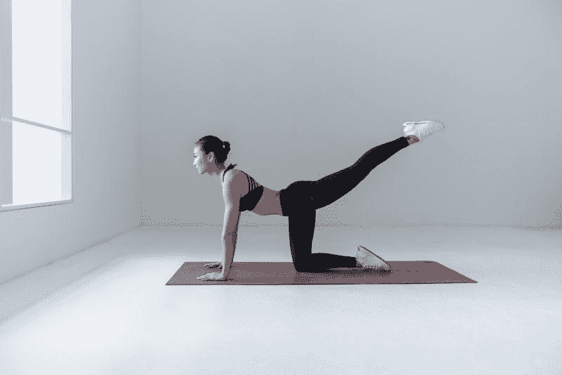

# Lululemon Athletica 赚钱了吗？—市场疯人院

> 原文：<https://medium.datadriveninvestor.com/is-lululemon-athletica-making-money-market-mad-house-6e7cadbd4899?source=collection_archive---------43----------------------->

Lululemon Athletica Inc(纳斯达克代码:LULU) 是 2020 年的股票惊喜之一。这家以瑜伽裤闻名的服装制造商是一只高价股。

例如，市场先生在 2020 年 1 月 5 日为**Lululemon Athletica**支付了 366.50 美元。相比之下，市场先生在同一天为**支付了 19.75 美元。**

2020 年，Lululemon 的股价从 1 月 6 日的 235.43 美元涨到 12 月 31 日的 348.03 美元。因此，在不到一年的时间里，Lululemon 的价格上涨了 112.60 美元。

因此，Lululemon 是当今时尚零售业为数不多的成功案例之一。Lululemon 成功的一个显而易见的原因是，该公司销售人们可以在家穿着的舒适休闲服装。

# Lululemon Athletica 公司如何从冠状病毒中获利

自从冠状病毒开始以来，许多人都在家里度过了全部或大部分时间。

值得注意的是，Stockrow 估计在截至 2020 年 10 月 31 日的季度，Lululemon 的收入增长了 21.97%。然而，Lululemon 的收入在截至 2020 年 4 月 30 日的季度下降了-16.66%，在截至 2020 年 7 月 31 日的季度上升了 2.22%。

例如，一个职业女性不再需要裙子、衬衫和高跟鞋，因为她在客厅工作。因此，这位女士可能穿着瑜伽裤，这对 Lululemon (LULU)来说是件好事，对百货公司来说却是件坏事。

帮助 Lululemon 成长的环境可能会持续几个月或一年。值得注意的是,*纽约时报*报道称“[病毒数量激增](https://www.nytimes.com/2021/01/01/nyregion/nyc-covid-vaccine-rollout.html)”同样的，纽约时报称疫苗推广缓慢。

# 冠状病毒会变得更糟

同样，华盛顿邮报声称 2020 年新年前夕，2000 万剂新冠肺炎疫苗还没有到达各州政府手中。2020 年 10 月，美国卫生与公众服务部部长亚历克斯·阿扎尔声称，到 2020 年底，将有 1 亿剂疫苗可供使用。

因此，我预测疫情及其影响包括隔离和在家工作在可预见的未来仍将持续。值得注意的是，世界计量机构估计，2021 年 1 月 3 日，美国当局报告了 108，055 例新型冠状病毒病例。

随着疫苗分发的滞后，冠状病毒将变得更糟。我预测，这种情况将导致更多的远程工作和对瑜伽裤的需求。

# Lululemon Athletica 赚钱吗？

**Lululemon Athletica(露露)**异人异人。例如，2020 年 10 月 31 日，Lululemon Athletica 报告季度营业收入为 2.0492 亿美元，季度毛利为 6.2735 亿美元。

季度毛利从 2020 年 7 月 31 日的 4.895 亿美元和 2020 年 4 月 30 日的 3.344 亿美元上升。季度营业收入从 2020 年 4 月 30 日的 1.2441 亿美元上升至 3，275 万美元。

然而，2020 年 1 月 31 日，Lululemon Athletica 的季度毛利为 8.1083 亿美元，季度营业收入为 4.1649 亿美元。

# Lululemon Athletica 能产生多少现金？

**Lululemon(露露)**产生一些现金。该公司报告的季度运营现金流在 2020 年 10 月 31 日为 2534 万美元，在 2020 年 7 月 31 日为 1.8131 亿美元。季度营业收入从 2020 年 4 月 30 日的-1.2124 亿美元上升至 2020 年 1 月 31 日的 5.7421 亿美元。

相比之下，Lululemon Athletica 报告在 2020 年 10 月 31 日和 2020 年 1 月 31 日结束了-4142 万美元和-30001 万美元的负季度末现金流。季度期末现金流从 2020 年 3 月 31 日的 8.2301 亿美元下降到 2020 年 1 月 31 日的 5.0735 亿美元。

积极的一面是，Lululemon Athletica 报告 2020 年 10 月 31 日和 2020 年 7 月 31 日的季度融资现金流较低，分别为 75 万美元和 843 万美元。季度融资现金流从 2020 年 3 月 31 日的-9059 万美元。

因此，我认为 Lululemon Athletica 没有借很多钱。然而，截至 2020 年 7 月 31 日，Lululemon Athletica 的长期债务为 6.3265 亿美元。Stockrow 没有报告 Lululemon 在 2020 年 10 月 31 日的债务，但在同一天报告了该公司和 7.3088 亿美元的流动负债。截至 2020 年 10 月 31 日，Lululemon 的总负债为 14.65 亿美元。

2020 年 10 月 31 日，Lululemon 有 4.8158 亿美元的现金和短期投资。2020 年，Lululemon 的现金和短期投资从 2020 年 1 月 31 日的 10.94 亿美元下降。

因此，Lululemon 不是一家现金充裕的公司，但我认为它有现金充裕的潜力。

# 市场高估先生 Lululemon

我认为市场先生在 2020 年 1 月 5 日高估了 **Lululemon Athletica Inc(纳斯达克代码:LULU)**366.50 美元。

我认为市场先生高估了，因为它在 2020 年 10 月 31 日的总资产为 36.28 亿美元。我认为 36.28 亿美元的总资产不足以支撑 10 美元的股价

此外，我不认为 2020 年 2 月运营的 491 家 Lululemon Athletica 商店的股价会达到每股 366.50 美元。最后，竞争对手很容易模仿 Lululemon 的招牌产品；瑜伽裤。因此,“市场先生”严重高估了 Lululemon Athletica。

我认为投资者需要避开 Lululemon Athletica 的股票，因为它不支付股息。归根结底，买 Lululemon Athletica 瑜伽裤有意义，买 LULU 没意义。

**进入专家视角—** [**订阅 DDI 英特尔**](https://datadriveninvestor.com/ddi-intel)

*原载于 2021 年 1 月 5 日 https://marketmadhouse.com**[*。*](https://marketmadhouse.com/is-lululemon-athletica-making-money/)*