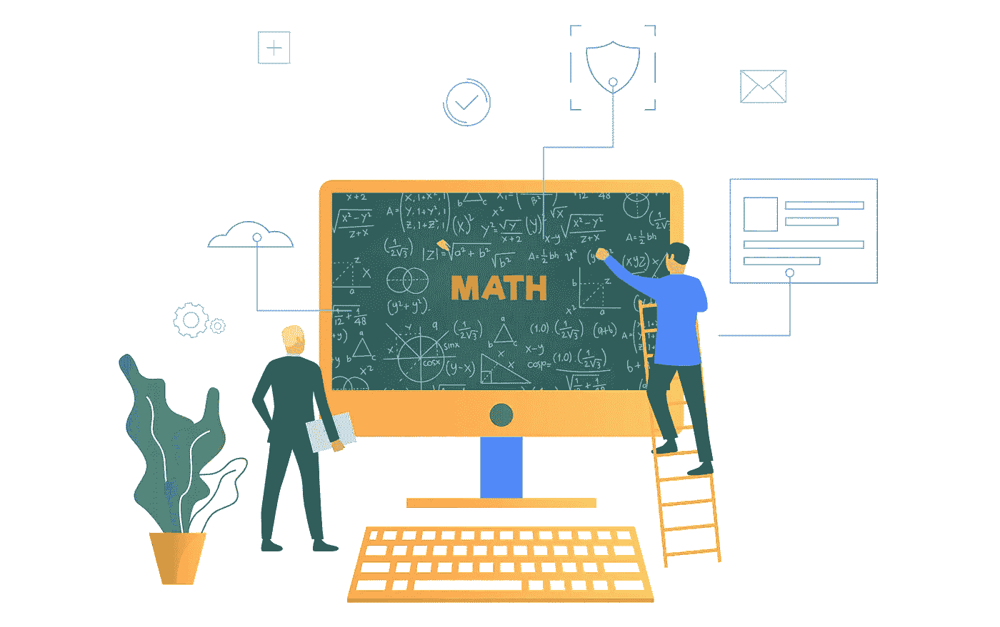

# 数学对计算机专业和机器学习重要吗？

> 原文：<https://medium.datadriveninvestor.com/is-mathematics-important-to-the-computer-profession-and-machine-learning-8bfdbe7e258f?source=collection_archive---------10----------------------->

我经常听到人们说，为了学好计算机，他们必须学习数学。我觉得这个句子很难理解。数学在编程中有用吗？

机器学习中统计学和矩阵理论是最重要的

学习机器学习凸优化测度理论和泛函是不可绕过的，凸优化可以说是机器学习的入门问题。但不代表学的完全深入。从零开始完整的学习一门理论，可以说是中国高等教育的普遍做法，但实际上，仅仅需要达到一个工程师的水平，那就太浪费时间了。但是如果你不学，你也必须理解理论。如果不学凸优化，很多相关论文都不会看。所以我在德国研究生水平上的凸优化课就是这种形式。老师在前半学期介绍了测量理论和泛函，以弄清楚基本概念。理论介绍完了，学生之前没学过。然后开始讲凸优化和相关算法。期末结束时，我们能够证明一些简单的问题，并理解将使用凸优化的论文。如果要我简单介绍一下测度论和泛函，我说不出来。而且即使是研究计算机视觉的博士和博士后，他们的数学能力也大多一般。绝对没有数学家这种东西。相关理论都是暂时的。毕竟他们是在研究现实世界的问题。数学只是一个工具，他们关注的领域很窄。只要他们学过相关理论，基本都会全部拿下。下面只说很多可能性。例如，微分几何用于 3D 曲面分析。关注这方面(如游戏、3D 渲染器、人脸识别、3D 重建)的研究人员或工程师只需要学好就可以了。微分几何就够了，群论图论不用懂。实际上，一个研究者需要学习的数学还是有限的，远不是一个数学家。

感觉数学总是不够用。为了解决这几天研究中的一些问题，在图书馆里拿起了数学课本。从大学到现在，课堂和自学学到的数学已经不小了，但是在研究的过程中，我总是发现需要补充新的数学知识。**学习与视野**是多种数学的交集。看不同理论体系的交集，对于一个研究者来说，往往是一件很享受的事情。然而，这也意味着很难完全理解这一领域并取得有意义的进展。记得两年前在一篇博客里提到过与学习相关的数学。今天我似乎对数学在这个领域的作用有了新的思考。对于学习的研究，

1、**线性代数(Linear algorithm)和统计学(Statistics)是最重要和不可缺少的。**这代表了机器学习中两种主要方法的基础。一种是**代数方法**，侧重于**研究函数和变换**，如**降维、特征提取、核、**等。一种是以研究统计模型**和样本分布**为主的**统计方法**，如**图形模型、**信息论模型等。虽然他们的侧重点不同，但他们经常被共同使用。**对于代数方法，往往需要统计解释。对于统计模型，具体计算需要借助代数**。以代数和统计为起点，再进一步，会发现我们需要更多的数学。

2.**微积分(Calculus)只是数学分析系统的基础。**其基础作用不言而喻。学习研究中的大多数问题都是在连续度量空间中进行的。无论代数还是统计，**对** **映射的微分或梯度的分析是**研究最优化问题时总是不可避免的。在统计学中，**边缘化和积分**更是密不可分——然而，很少以解析形式推导出积分。

3.**偏微分方程(偏微分方程)**，主要用于**描述动态过程**，或者**模拟动态过程**。这门学科更多用于视觉而非学习，主要用于**描述连续场的运动或扩散过程**。例如，**水平集，光流**就是这方面的典型例子。

4、**泛函分析(Functional Analysis)，用**外行人的话来说，可以理解为**微积分从有限维空间到无限维空间的拓展**——当然，在这个地方其实远不止于此，函数与其所作用的对象之间的对偶性起着非常重要的作用。时至今日，学习也延伸到了无限维——从研究**有限维向量**的问题，到研究**无限维**的函数。核学习和高斯过程就是典型的例子——核心概念是核。很多学学习的人把内核简单理解为内核招数的使用，严重弱化了内核的意义。在**泛函**中，**核(内积)**是整个代数系统的**基础，从**度规，变换**到**谱**。**

5.**测度论(Measure Theory)，**这是一门与实分析有着密切关系的学科。但是测量理论并不局限于此。从某种意义上说，真正的分析是从**勒贝格测度(Lebesgue measure)** 推导出来的，但实际上，还有许多其他的测度体系——**概率本身就是一种测度**。测度论对于学习的意义是根本的，而**现代统计学是建立在测度论**的基础上的——虽然概率论的初级教材一般不会介绍这一点。当你看一些统计学的文章时，你可能会发现他们会用统计量来表达他们的公式。这有两个优点:对于连续分布和离散分布，所有的推导和结论都不需要单独编写。这两个东西可以用同一个测度形式表示:**连续分布的积分是基于勒贝格测度的**，**离散分布的和是基于计数测度的**，也可以推广到一个既不是连续也不是离散的分布(这种东西不是数学家的游戏，而是已经很实用的东西，你会经常在 Dirichlet 过程或者 Pitman-Yor 过程中看到)。此外，即使对于连续积分，如果它不是在欧几里得空间中进行，而是在更一般的拓扑空间(如微分流形或变换群)中进行，那么传统的黎曼积分即行不通，你可能需要对它们进行一些推广，如**哈尔测度**或**勒贝格-斯蒂尔切斯点**。

6.**拓扑学(Topology)，**这是学术上非常基础的学科。它一般不直接提供方法，但它的许多概念和定理是其他数学分支的基石。在看很多其他数学的时候，你会经常接触到这样的概念:**开集/闭集，集基，Hausdauf，连续函数，度量空间，柯西序列，邻域，紧性，连通性**。其中很多可能是在大学一年级的时候，基于极限的概念习得的。如果，在看了拓扑学之后，对这些概念的理解会从根本上扩大。比如当时用 epison 法定义连续函数。无论正ε有多小，都有 xxx，使得 xxx。需要的是度量距离的度量，在一般拓扑中，即使对于连续函数定义，也不需要坐标和距离——如果**一个将原始开集分隔开的地图使得**是**连续的**in——因为开集是基于集合论定义的，而不是通常意义上的**开区间**。这只是一个最简单的例子。当然，我们在学习的研究中可能不需要深究这些数学概念背后的公理体系，但在很多问题上，打破原有定义的局限是必要的——尤其是当你研究一些不在欧几里得时空中的东西时——**正交矩阵、变换群、流形、概率分布空间**，都属于此。

7.**微分流形(Differential Manifold)，用**俗人的话来说就是研究光滑曲面。一个直接的印象就是能不能用来拟合一个曲面什么的——当然这是一个应用，但这是非常初步的。**本质上**，**微分流形研究光滑拓扑结构**。**空间形成微分流形**的基本元素是局部光滑:从**拓扑学**的角度看，是它的任何部分在欧氏空间都是同胚的，从**分析**的角度看，是相容的局部坐标系。当然，从全局来看，并不要求与欧氏空间同胚。除了用来描述集合上的光滑曲面，更重要的是它可以用来研究许多重要的集合。n 维线性空间(k)的所有 k 维子空间

8、**李群论(李群论)，其**一般意义的群论不用于学习，群论更多用于学习的一个重要方向是其**李群**。定义在光滑流形上的一个群，它的群运算是光滑的，那么这叫做李群。因为学习和编码不一样，更注重连续空间，因为李群对于各种群的学习特别重要。各种子空间、线性变换、非奇异矩阵，都构成通常意义上的基于矩阵乘法的李群。映射、变换、度量、除法等。李群对于学习中代数方法的研究具有重要的指导意义。

9、**图论(Graph Theory)、**图，因其强大的表达各种关系的能力、优雅的理论、高效的算法，越来越受到学习领域的欢迎。经典图论在学习中最重要的应用之一是图形模型，它已被成功地用于分析统计网络的结构和规划统计推断的过程。图形模型的成功可以归功于图论。在视觉领域，最大流(图割)算法也广泛用于图像分割、立体和各种能量优化。图论的另一个重要分支是代数图论，主要用于图的谱分析。众所周知的应用包括标准化切割和谱聚类。近年来，它在半监督学习中受到了特别的关注。