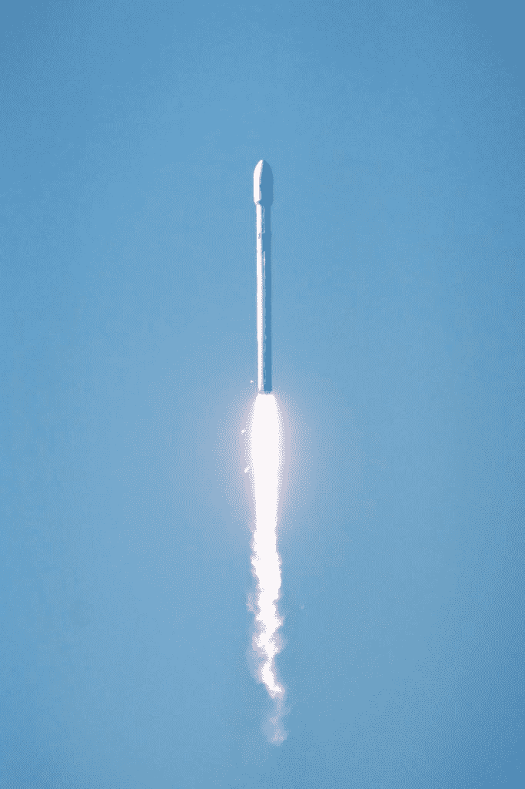
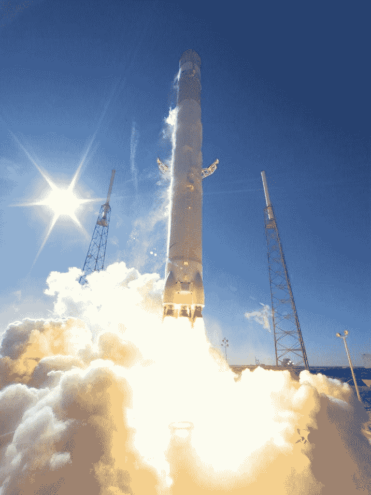
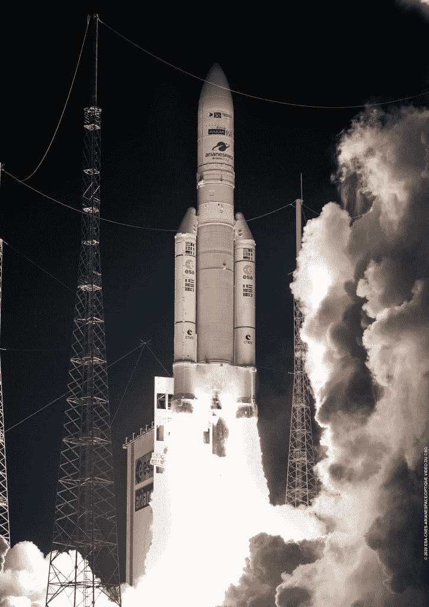
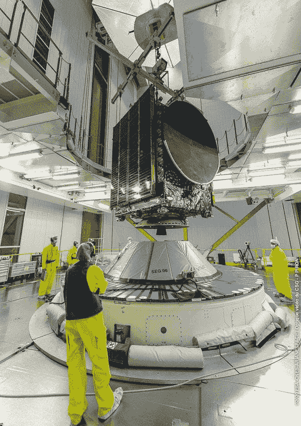
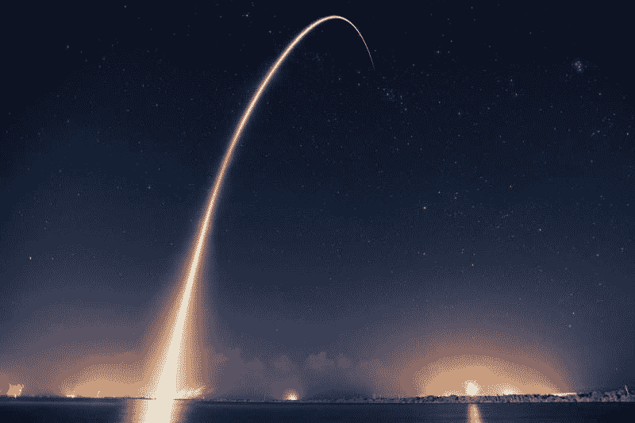

# Maxar 科技公司在太空赚钱吗？—市场疯人院

> 原文：<https://medium.datadriveninvestor.com/is-maxar-technologies-making-money-in-space-market-mad-house-68b9d4416678?source=collection_archive---------7----------------------->

卫星制造商 Maxar 科技公司(纽约证券交易所代码:MAXR)已经成为一只值得关注的股票。2020 年，Maxar 的股价从 1 月 2 日的 16.60 美元涨到 11 月 23 日的 27.25 美元。

我认为所有关于 SpaceX 和蓝色起源发射的宣传推动了人们对太空股票的兴趣。例如，SpaceX 的宇航员 Dragon 刚刚将四名宇航员带到了国际空间站(ISS)。此外， [SpaceX 的猎鹰 9 号火箭降落在海洋中的驳船上](https://www.clickorlando.com/news/local/2020/11/19/expedition-64-crew-holds-briefing-on-iss/)。

此外，蓝色起源与美国宇航局有几份合同，包括努力开发一个[太空机器人操作系统](https://techcrunch.com/2020/11/09/nasa-partners-with-spacex-rocket-lab-blue-origin-and-others-for-test-flights-and-research/)， *Techcrunch* 报道。一份新闻稿显示，蓝色起源公司还在开发集成着陆车，这是下一代月球着陆器，也是美国宇航局[人类着陆系统(HLS)计划](https://techcrunch.com/2020/11/09/nasa-partners-with-spacex-rocket-lab-blue-origin-and-others-for-test-flights-and-research/)的一部分。蓝色起源声称已经用它的新谢泼德火箭[测试了精确的月球着陆技术](https://www.blueorigin.com/news/new-shepard-mission-ns-13-launch-updates)。

# 抱歉，SpaceX 和蓝色起源不会很快上市

然而，蓝色起源和 SpaceX 都是私营公司。此外，我怀疑这些公司的亿万富翁没有动力进行首次公开发行(IPO)。解释一下，世界首富杰夫·贝索斯拥有蓝色起源。贝佐斯不需要钱。

此外，我认为贝佐斯和 SpaceX 的所有者埃隆·马斯克担心股东可能会让他们放弃殖民太空的梦想。然而，这两个亿万富翁在私人公司的太空中并不为所欲为，只要他们花自己的钱。

于是，想投资太空但又想远离 [**诺斯罗普·格鲁曼(NOC)**](https://marketmadhouse.com/is-northrop-grumman-noc-making-money-in-space/) 等国防承包商的人，就看 **Maxar (MAXR)** 。

# 什么是 Maxar 技术公司？

Maxar Technologies (MAXR) 制造太空飞行器，如[银河 37 号地球同步通信卫星](https://www.maxar.com/press-releases/maxar-awarded-contract-to-build-sixth-geostationary-communications-satellite-for-intelsat-in-2020)。Maxar 是国际通信卫星组织最近从 Maxar 购买的四颗卫星之一。

Maxar 负责空间项目交付的高级副总裁 Megan Fitzgerald 称，自 20 世纪 70 年代以来，Intelsat 已经从 Maxar 购买了 59 艘航天器。国际通信卫星组织正在与 Maxar 公司签订下一代 40 地球静止通信卫星的合同。

Maxar 还为广播卫星系统公司建造了 [BSAT-4B 卫星](https://en.wikipedia.org/wiki/BSAT-4b)。BSAT-4B 可以向地球播放 4K 和 8K 超高清电视。

Maxar 已经建造了 60 多年的卫星。Maxar 声称在那段时间里已经建造了 90 多颗通信卫星。Maxar 卫星的用途包括通信、测绘、监视、[情报收集](https://www.washingtonpost.com/brand-studio/wp/2020/09/16/feature/solving-our-earthly-problems-with-images-from-space/)和图像。

因此，Maxar 出售公司愿意付钱购买的空间产品。相比之下，SpaceX 和蓝色起源的业务都是理论上的。例如，没有人会为太空栖息地或火星殖民地付钱，除非这些东西存在。

 [## 蓝色起源能摧毁 SpaceX 的垄断吗？数据驱动的投资者

### 争夺太空主导权的战争即将升级吗？距离第一枚 SpaceX 猎鹰 9 号火箭升空已经过去 7 年了…

www.datadriveninvestor.com](https://www.datadriveninvestor.com/2020/11/26/could-blue-origin-demolish-the-spacex-monopoly/) 

# Maxar 科技公司赚钱了吗？

Maxar (MAXR) 赚了点钱。截至 2020 年 9 月 30 日，该公司报告季度营业收入为 700 万美元。

此外，截至 2020 年 9 月 30 日，Maxar 的季度收入为 4.36 亿美元，季度毛利为 1.06 亿美元。2020 年 Maxar 赚钱更少。Maxar 报告的季度毛利为 1.22 亿美元，2019 年 12 月 31 日的季度毛利为 2.52 亿美元。

此外，Maxar 的季度收入从 2019 年 12 月 31 日的 4.1 亿美元上升。Stockrow 估计，截至 2020 年 9 月 30 日的季度，Maxar 的收入增长率为 5.57%。

# Maxar 有什么价值？

**Maxar(纽约证券交易所代码:MAXAR)** 产生一些现金，它在 2020 年 9 月 30 日报告了 9600 万美元的季度运营现金流。季度运营现金流从 2020 年 6 月 30 日的 5100 万美元上升至 2019 年 12 月 31 日的 1.71 亿美元。

值得注意的是，Maxar 的季度期末现金流从 2020 年 6 月 30 日的 1.52 亿美元降至 2020 年 9 月 30 日的-1.19 亿美元。截至 2020 年 9 月 30 日，Maxar 有 6000 万美元的现金和短期投资。现金和短期投资从 2020 年 6 月 30 日的 1.77 亿美元。

Maxar 在 2020 年 9 月 30 日提供了 45.65 亿美元的总资产。Maxar 的总资产从 2019 年 12 月 31 日的 51.57 亿美元下降。

# Maxar 是价值投资吗？

Maxar 将于 2020 年 12 月 31 日支付 1₵的小额季度股息。因此，Maxar 是一只支付股息的廉价太空技术公司股票。

但是，我觉得红利太少，对普通人来说没什么作用。因此，Dividend.com 估计 Maxar 股票在 2020 年 11 月 23 日提供了 4₵年度股息和 0.14%的股息。

如果你在寻找空间技术的廉价价值投资，我认为 Maxar 值得一看。但是，如果你想要一只赚钱的股票，你需要避开 **Maxar (NYSE: MAXR)** 。

*原载于 2020 年 11 月 23 日*[*【https://marketmadhouse.com】*](https://marketmadhouse.com/is-maxar-technologies-making-money-in-space/)*。*

## 访问专家视图— [订阅 DDI 英特尔](https://datadriveninvestor.com/ddi-intel)