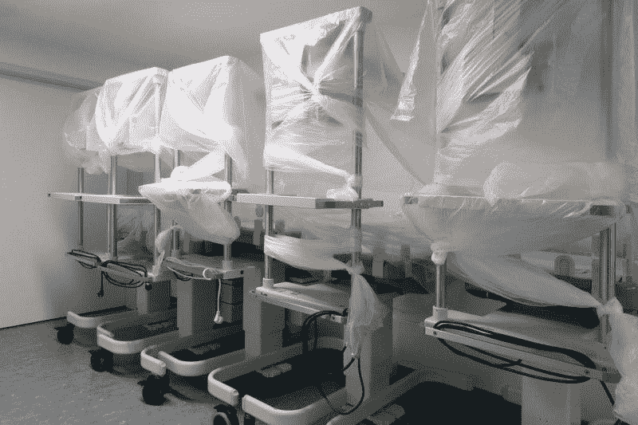
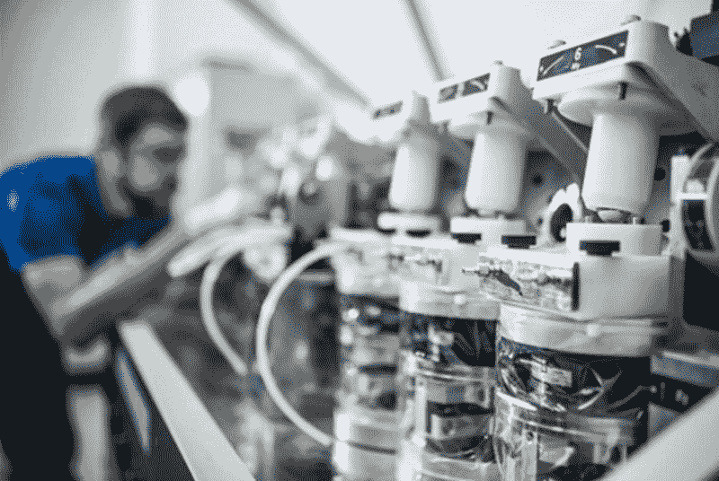
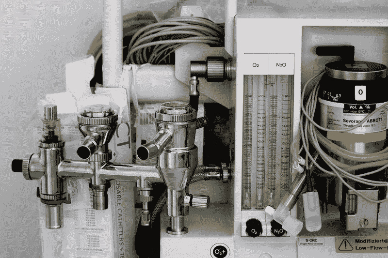
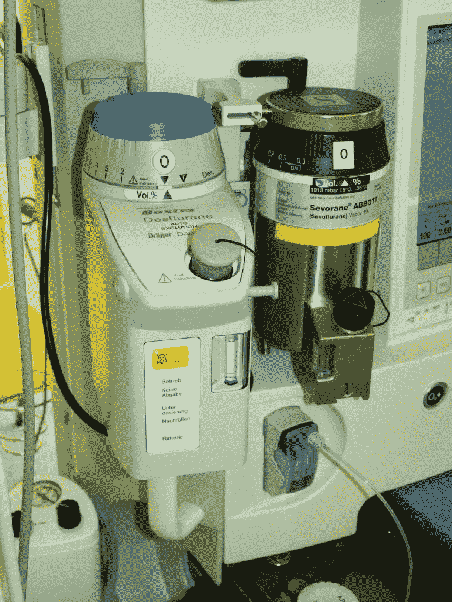
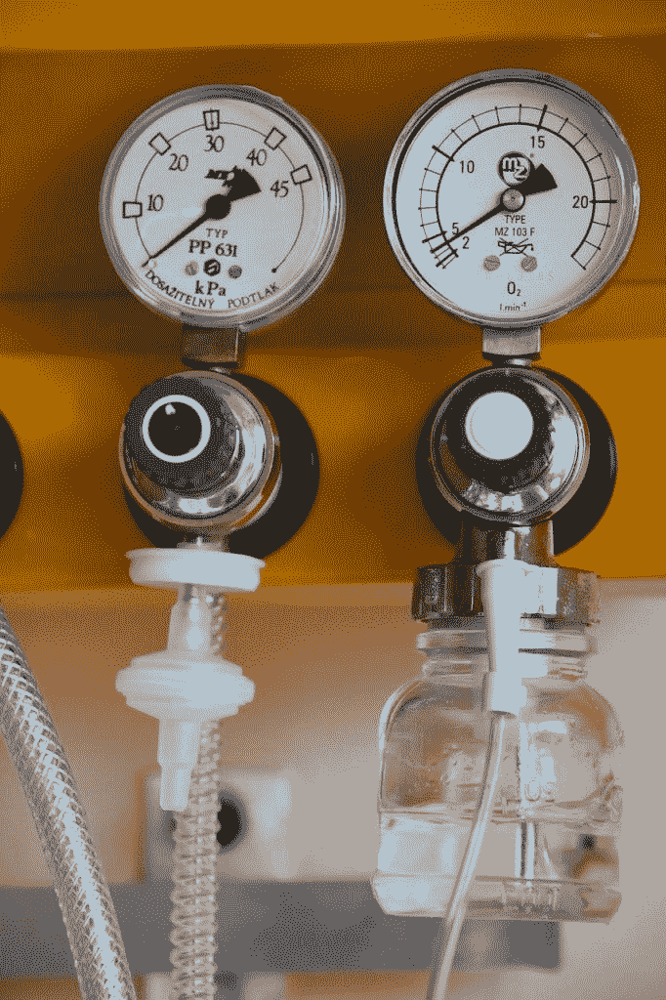

# 美敦力(MDT)赚钱了吗？—市场疯人院

> 原文：<https://medium.datadriveninvestor.com/is-medtronic-mdt-making-money-market-mad-house-4dc267b84008?source=collection_archive---------27----------------------->

医疗保健股现在很火，但是很多热门的医疗保健公司，比如 **Regeneron (REGN)** 都不赚钱。**美敦力**然而赚钱。

【2020 年 7 月 31 日，美敦力公司(纽约证券交易所代码:MDT) 报告季度毛利为 40.02 亿美元，季度营业收入为 6.73 亿美元。值得注意的是，美敦力的季度毛利从 2020 年 4 月 30 日的 37.33 亿美元。然而，美敦力的季度毛利从 2020 年 1 月 31 日的 53.17 亿美元下降。

此外，美敦力的季度营业收入从 2020 年 1 月 31 日的 16.39 亿美元下降，但从 2020 年 4 月 30 日的 3.16 亿美元上升。因此，美敦力在 2020 年赚的钱更少了。

此外，美敦力的季度收入从 2020 年 1 月 31 日的 77.17 亿美元降至 2020 年 4 月 30 日的 59.97 亿美元。然而，截至 2020 年 7 月 31 日，美敦力的季度收入回升至 65.07 亿美元。

# 医疗保健在 2020 年会增长吗？

因此，生产许多手术设备的美敦力公司在 2020 年的收入和利润都下降了。因此，我认为美敦力否定了医疗保健将在 2020 年增长的流行观点。

2020 年整体来看，美敦力的股价从 1 月 2 日的 114.56 美元跌至 10 月 16 日的 110.13 美元，再跌至 10 月 18 日的 108.48 美元。因此，市场先生对基础医疗的增长能力没有多少信心。

相反，市场先生喜欢试验冠状病毒疗法的公司，如 Regeneron Pharmaceuticals。Regeneron 制造了一种实验性药物鸡尾酒[，沃尔特·里德陆军医疗中心的医生将这种鸡尾酒给了唐纳德·j·特朗普总统(佛罗里达州共和党)。然而，这种药物鸡尾酒缺乏食品药品管理局(FDA)的批准，所以 Regeneron 不能向公众销售。](https://marketmadhouse.com/is-regeneron-nasdaq-regn-making-money/)

2020 年，Regeneron 的股价从 1 月 2 日的 373.35 美元涨到 10 月 16 日的 599.74 美元，10 月 19 日跌至 583.14 美元。我认为 Regeneron 等生物科技类股存在泡沫，但 Meditronic 等基础医疗公司则没有。

# Meditronic 能产生多少现金？

**Meditronic**产生的现金较少。Meditronic 的季度运营现金流从 2020 年 1 月 31 日的 24.07 亿美元降至 2020 年 4 月 30 日的 14.5 亿美元，再降至 2020 年 7 月 31 日的 2.78 亿美元。

相比之下，Meditronic 的季度期末现金流从 2020 年 1 月 31 日的-2.53 亿美元上升到 2020 年 4 月 30 日的 4.31 亿美元，再上升到 2020 年 7 月 31 日的 64.99 亿美元。Meditronic 最后一个季度以巨额现金结束。

然而，Meditronic 正在借入更多现金，因为其期末现金流从 2020 年 4 月 30 日的-13.10 亿美元上升至 2020 年 7 月 31 日的 19.59 亿美元。因此，我认为 Meditronic 在截至 2020 年 7 月 31 日的季度中借款 19.59 亿美元。

截至 2020 年 1 月 31 日，Meditronic 以 116.28 亿美元的现金和短期投资开始了 2020 年。2020 年 4 月 30 日，这一数额降至 109.48 亿美元，2020 年 7 月 31 日增至 130.12 亿美元。因此，Meditronic 是一家现金充裕的公司。

 [## 为什么大多数人在日内交易中亏损(以及如何不成为他们中的一员)|数据驱动的投资者

### 日内交易很难，大多数人都赔钱。我确实有。事实上，我曾经在一个单一的损失更多的钱…

www.datadriveninvestor.com](https://www.datadriveninvestor.com/2020/09/23/why-most-people-lose-money-day-trading-and-how-to-not-be-one-of-them/) 

# 美敦力有什么价值？

2020 年 7 月 31 日，Meditronic(纽约证券交易所代码:MDT) 的总资产价值高达 939.06 亿美元。

我认为市场先生在 2020 年 10 月 16 日对美敦力的准确估价是 110.10 美元。这个价值是正确的，因为它有现金和总资产。

Meditronic 是很好的分红股票。该公司于 2020 年 10 月 16 日向 58₵支付了季度股息。总体而言，Dividend.com 估计，2020 年 10 月 16 日，Meditronic 股票的年化股息为 2.32 美元，股息率为 2.16%。

我认为 Meditronic 是医疗保健领域的一项价值投资，因为它股息丰厚，现金充裕。此外，Meditronic 依赖枯燥但重要的外科产品，而不是未经证实的生物技术突破来获取收入。

# 什么是 Meditronic？

此外， **Meditronic (MDT)** 生产人们想要生活就需要使用的产品。例如，心脏监护仪、电外科硬件、胰岛素泵系统、子宫镜检查系统和内窥镜产品。

对其中一些产品的需求，包括用于糖尿病患者的胰岛素泵系统，可能会增长。疾病控制和预防中心(CDC)估计[3420 万美国人](https://www.cdc.gov/diabetes/library/features/diabetes-stat-report.html#:~:text=34.2%20million%20Americans%E2%80%94just%20over,1%20in%203%E2%80%94have%20prediabetes.)，2020 年超过十分之一的人患有糖尿病。

此外，2020 年，8800 万美国人或三分之一的人患有糖尿病前期。患有糖尿病前期的人更容易患糖尿病。

# Meditronic 的高安全系数

因此，Meditronic 的产品市场不断增长。此外， **Meditronic(纽约证券交易所代码:MDT)** 有一个客户群，他们的账单保险和政府支付。

美国人口普查局估计，2018 年 91.5%的美国人都有一些医疗保险。我认为健康保险给了 Meditronic 很高的安全边际，可以帮助它度过经济衰退。

解释一下，Meditronic 生产人们需要使用的产品，这些产品由政府和健康保险公司支付。记住，政府总是可以增加税收或借钱来支付公民的医疗费用。

我认为投资者需要研究 Meditronic，因为它是支付股息的医疗保健领域的安全股票。我认为 Meditronic 显示了医疗保健行业中有优秀的股票。

*原载于 2020 年 10 月 19 日*[*【https://marketmadhouse.com】*](https://marketmadhouse.com/is-medtronic-mdt-making-money/)*。*

## 访问专家视图— [订阅 DDI 英特尔](https://datadriveninvestor.com/ddi-intel)