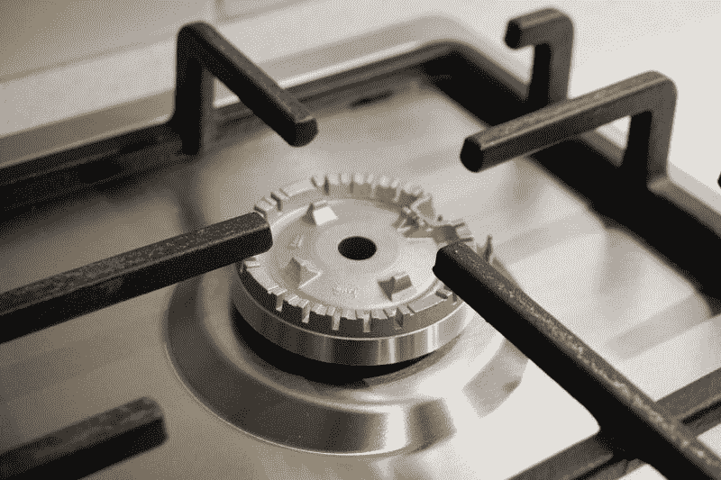
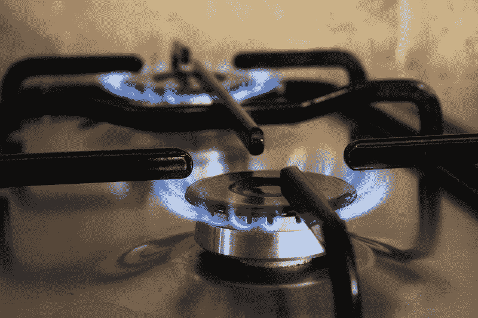
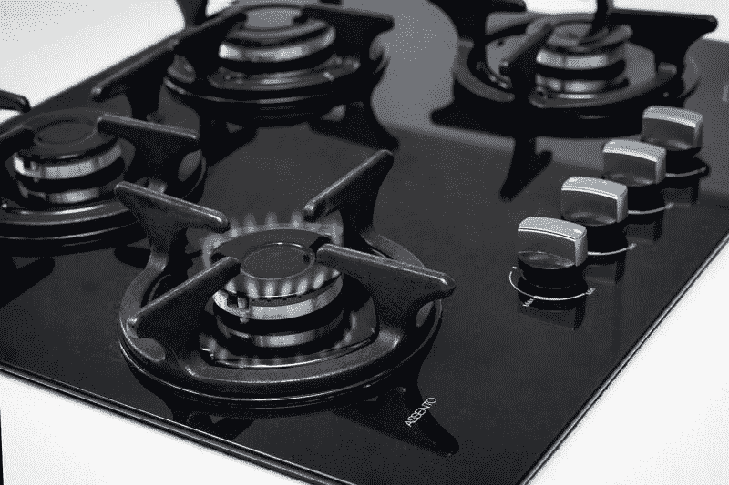
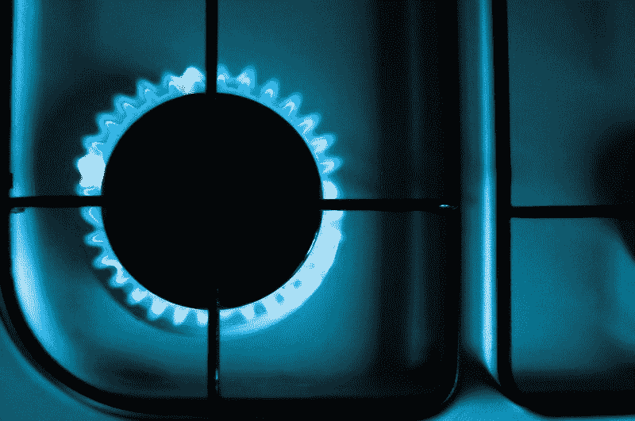

# 切萨皮克能源公司的天然气正在消亡吗？—市场疯人院

> 原文：<https://medium.datadriveninvestor.com/is-natural-gas-dying-at-chesapeake-energy-corporation-market-mad-house-6086a570864c?source=collection_archive---------25----------------------->

切萨皮克能源公司(纽约证券交易所代码:CHK) 要么是当今市场上最有价值的投资，要么是最差的股票。

事实上，市场先生在 2020 年 3 月 3 日在 25.72₵给切萨皮克能源公司的股票定价。令人难以置信的是，切萨皮克能源公司的股价如此之低，以至于该公司正在计划“反向股票分割”，*市场观察的*孙铁麟·基尔戈[声称](https://www.marketwatch.com/story/chesapeake-energys-very-low-stock-price-prompts-reverse-split-plans-2020-02-26)。澄清一下，在反向股票分割中，一家公司希望通过合并股票来提高股价。

因此，切萨皮克公司的管理层认为股价太低。作为回应，管理层希望通过减少市场上的股票数量来提高股价。

 [## 算法交易的机器学习|数据驱动的投资者

### 当你的一个朋友在脸书上传你的新海滩照，平台建议给你的脸加上标签，这是…

www.datadriveninvestor.com](https://www.datadriveninvestor.com/2019/01/30/machine-learning-for-stock-market-investing/) 

# 切萨皮克能源赚钱了吗？

奇怪的是，切萨皮克能源公司正在赚钱。切萨皮克报告称，2019 年 12 月 31 日，季度收入为 19.26 亿美元，季度毛利为 21.12 亿美元。

然而，切萨皮克报告了截至 2019 年 12 月 31 日的季度负共同净收入为-3.46 亿美元。然而，切萨皮克报告同期运营收入为负 1.73 亿美元。

此外，切萨皮克报告截至 2019 年 12 月 31 日的季度运营现金流为 4.41 亿美元，期末现金流为-800 万美元。相反，切萨皮克报告同期融资现金流为 9600 万美元。我认为融资现金流表明切萨皮克能源公司正在借款为一些业务融资。

# 切萨皮克能源有什么价值？

在截至 2019 年 12 月 31 日的季度，切萨皮克公司几乎没有现金，但价值很大。例如，**切萨皮克能源公司(纽约证券交易所:CHK)** 在 2019 年 12 月 31 日报告了 600 万美元的现金和短期投资。

然而，切萨皮克报告的总资产为 149.42 亿美元；总负债为 117.92 亿美元，长期债务为 97.3 亿美元。因此，切萨皮克能源公司提供了低价和大量的潜在价值。

2018 年 12 月 31 日，切萨皮克能源公司声称拥有 14.48 亿桶石油当量的石油和天然气储量。然而，Chesapeake 承认，在 2018 年新年前夕，其产量仅为 496，000 桶石油当量(496 mboe/d)。*

# 天然气市场在增长

目前，切萨皮克公司在美国四个州拥有石油和天然气储备；德克萨斯州、俄克拉荷马州、怀俄明州和宾夕法尼亚州。重要的是，北美对天然气的需求巨大。

特别是，美国能源部估计，超过 47%的美国家庭依赖天然气作为他们的主要取暖燃料。此外，美国能源信息署[估计，天然气发电厂提供了美国 42%的电力。](https://www.eia.gov/todayinenergy/detail.php?id=34172)

此外，天然气市场正在增长，因为燃煤电厂正在迅速关闭。路透社[估计](https://www.reuters.com/article/us-usa-coal-decline-graphic/u-s-coal-fired-power-plants-closing-fast-despite-trumps-pledge-of-support-for-industry-idUSKBN1ZC15A)事实上，美国公司关闭了 2019 年发电量为 15.1 兆瓦或百万瓦的燃煤电厂。

关闭煤电厂对切萨皮克有利，因为公用事业需要燃烧其他东西来发电。天然气是许多公用事业公司的首选燃料，因为它比煤便宜，产生的温室气体更少。

值得注意的是，向发电厂供应天然气只需要一根管子。相比之下，你需要一条铁路线、卡车、许多工人和重型设备来运煤。

因此，即使埃隆·马斯克让北美的每辆车都通电，切萨皮克公司也能赚钱。解释一下，公用事业公司可能需要燃烧更多的天然气来生产电力，为所有电动汽车提供动力。

# 沃伦·巴菲特会收购切萨皮克能源公司吗？

可以预见的是，切萨皮克能源公司不支付股息。然而，**切萨皮克能源公司(纽约证券交易所股票代码:CHK)** 可能有收购目标的价值。

切萨皮克便宜；2020 年 3 月 3 日，其市值为 5.05346 亿美元。然而，Chesapeake 在 2019 年 12 月 31 日的总资产为 149.42 亿美元。因此，切萨皮克可能是一项价值投资。

因此，沃伦巴菲特可以看看切萨皮克公司。值得注意的是，**伯克希尔哈撒韦公司(纽约证券交易所代码:BRK。B)** 自 2016 年花费 320 亿美元购买精密铸件以来，尚未进行重大收购，CNN Business [观察到](https://www.cnn.com/2020/01/07/investing/warren-buffett-berkshire-hathaway-acquisitions/index.html)。

与此同时，伯克希尔·哈撒韦公司在 2019 年 12 月 31 日拥有 641.75 亿美元的现金和短期投资。因此，**伯克希尔哈撒韦公司(纽约证券交易所代码:BRK。A)** 可以收购切萨皮克公司，并有大量现金剩余。

记住，巴菲特有购买困境公司的习惯。众所周知，2001 年，伯克希尔·哈撒韦公司以 8.35 亿美元从债权人手中收购了内衣品牌 Fruit of the Loom。

# 切萨皮克能源股票有什么价值？

我认为切萨皮克公司很适合伯克希尔能源公司。值得注意的是，伯克郡能源[拥有](https://www.brkenergy.com/our-businesses/)天然气管道公司北方天然气和[克恩河天然气输送公司](https://www.kernrivergas.com/)。此外，伯克希尔能源公司拥有两家主要的美国电力公司 MidAmerican Energy 和 NV Energy。

因此，我认为巴菲特购买一些天然气储备是有意义的。收购切萨皮克能源公司可能是获取这些天然气储备的一种廉价方式。

归根结底，我认为**切萨皮克能源公司(纽约证券交易所代码:CHK)** 只具有投机股票的价值。解释一下，我认为切萨皮克能源公司目前唯一的价值是被大公司作为收购目标。因此，投资者可以通过购买切萨皮克股票并希望它们获得一些价值来赚钱。

*资料来源:切萨皮克能源公司概况介绍:[http://www . chk . com/documents/operations/Corporate-Fact-Sheet . pdf](http://www.chk.com/documents/operations/corporate-fact-sheet.pdf)

*原载于 2020 年 3 月 3 日 https://marketmadhouse.com***。**