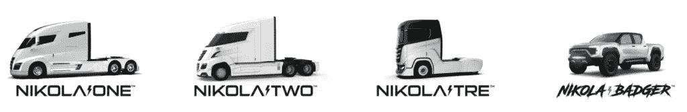
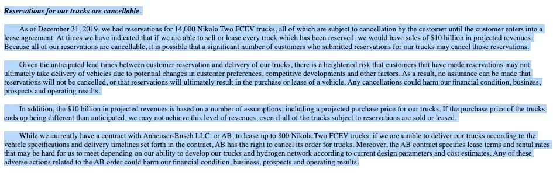
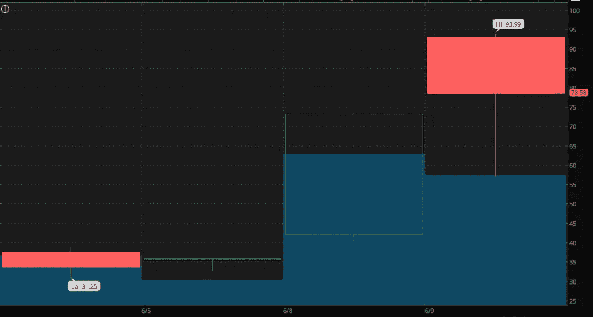

# 尼古拉公司(NKLA)是一个定价过高的仙股还是真正的交易？

> 原文：<https://medium.datadriveninvestor.com/is-nikola-corp-nkla-an-overpriced-penny-stock-or-the-real-deal-ccf98b65a2fb?source=collection_archive---------5----------------------->

# NKLA 股票史诗般的攀升引发了更多的问题；只是一只定价过高的仙股吗？

仙股通常被认为是交易价格低于 5 美元的股票。当你第一次看到 Nikola 公司( [NKLA 股票分析](https://pennystocks.com/ticker/?symbol=NKLA))时，你可能会想知道它和这个公司有什么关系。让我首先说，我绝不是说 NKLA 股票是一只低价股。

根据可公开获得的信息，特别是公司自己的财务状况，所使用的声明类似于一家初创公司；没有一个价值超过 10 亿美元的。

**【阅读更多】** [学习保证让你成为更赚钱的交易者的 5 个关键课程](https://webinar.truetradinggroup.com/signup/?utm_source=PS_Art&utm_medium=PS_Art&utm_campaign=PS_Art&utm_term=PS_Art&utm_content=PS_Art)

如果你还没听说过尼古拉，让我们来回顾一下一些基本情况。该公司与 VectoIQ 收购公司(f/k/a VTIQ)合并后上市。用 Vecto 自己的话来说，其背后的整个目的是“为了实现与一个或多个企业的合并、股份交换、资产收购、股票购买、资本重组或其他类似的企业合并。”

# 尼古拉公司上市

本质上，我们已经在谈论一家“空白支票”公司了。我敢肯定，许多有经验的交易者都会同意，空白支票公司通常是在场外交易中发现的。尼古拉没有进行传统的公开募股，而是在 3 月 3 日同意与 VTIQ 合并。它还从投资者那里筹集了超过 7 亿美元。除此之外，一个简单的管道交易或“公众股权中的私人投资”的一些细节显示了其他一些东西。

买家能够以 10 美元的价格获得特殊目的公司(VTIQ)的股票。PIPE 投资者包括 Black Rock、Fidelity Investments 和 ValueAct Capital，它们购买了 5000 万股 VectoIQ 股票。这些股票于 6 月 4 日转换为 Nikola 股票。

 [## 使用谷歌搜索趋势预测首次申请失业救济人数|数据驱动的投资者

### 几年来，我的重点一直是使用多种替代数据来预测宏观经济统计数据…

www.datadriveninvestor.com](https://www.datadriveninvestor.com/2020/03/25/using-google-search-trends-to-predict-initial-jobless-claims/) 

考虑到当时股价并没有比 13 美元高多少，30%的折扣看起来并没有那么糟糕。但同样，这也是我们经常看到的低价股做管道交易的情况。不用说，在 NKLA 股票上市之前，VTIQ 的交易价格高达 38 美元。

# NKLA 股票发现早期成功；但是未来的前景呢？

毫无疑问，NKLA 股票是许多人的大赢家。在今天的股票市场上，交易者似乎是在短期投机的基础上抛售股票，而不是采取更基本的方法。没有人可以否认股票产生了显著的短期收益。但是有人在调查这家公司的具体情况吗？甚至有人我会认为是公牛的公牛，吉姆克拉默评论说，VectoIQ(在当时)是“太热了”。

还有一个事实是，该公司表示，它已经与 Anheuser-Busch LLC 达成协议，租赁多达 800 辆“Nikola Two FCEV”卡车。你还会听到类似“期望 100 亿美元的销售额”这样的话。但有趣的是，截至去年年底，其尼古拉·FCEV 信托基金有 14000 个预订，这些预订是可以隐藏的。此外，这些是预订，而不是实际的现金订单。

此外，该公司从 3 月 13 日提交的[原始 S-4 文件称，其卡车的交付预计要到“2021 年我们的 Nikola Tre BEV 和 2023 年我们的 Nikola Two FCEV 才会开始，可能会更晚。”我们说的是 Anheuser-Busch LLC 同意租赁的同一辆 Nikola Two FCEV 卡车吗？他们真的要等 3 年吗？](https://pennystocks.com/ticker/?symbol=NKLA#tabs-7)

> *“即使我们能够成功开发、销售或租赁我们的卡车，也不能保证它们在商业上成功。我们的潜在盈利能力取决于我们的卡车和氢气站平台的成功开发和成功商业引入和接受，但这可能不会发生。”*

# 对尼古拉来说，风险是否会严重影响长期回报？

除此之外，该公司还担心，如果出现机械问题，它可能甚至不知道如何修理卡车:“我们目前没有参考框架来评估我们业务前景所依赖的卡车的性能，”以及“因为我们最早在 2021 年之前不计划开始生产我们的卡车， ***，我们没有维修或修理我们车辆的经验*** 。”

此外，其他监管机构可能会造成问题。这关系到能否实现 2021/2023 年的目标。在一篇关于运输主题的文章( [ttnews](https://www.ttnews.com/articles/suppliers-input-helped-shape-nikolas-class-8-vision) )“供应商的意见帮助塑造了 Nikola 的 8 级愿景”中，有一段有趣的引言值得注意。记者罗杰·吉尔罗伊写道，“温斯科特说，尼古拉在准备生产时面临着几个障碍。最大的挑战是获得必要的美国交通部认证。"

在同一篇文章中，他引用了汤普森机械公司下属的汤普森卡车中心总经理艾伦·温斯科特的经验。他提到温斯科特记得“收到一封来自米尔顿的群发邮件，说尼古拉正在考虑建造一辆燃气涡轮电动卡车”。没有来自该公司的关于 DOT 流程的更新，这是可以预料的。如果没有实际的卡车，任何此类过程的程度如何？

> *“保险业也希望获得一些关于碰撞测试和翻车的信息。所以这需要一些时间，也可能会有一些延迟。[米尔顿]必须先经历这一点，才能明白他必须纠正什么，如果他必须纠正什么的话。”*
> 
> *汤普森卡车中心*总经理艾伦·温斯科特

# NKLA 是下一个特斯拉还是只是一个崇拜者？

这不全是关于厄运和黑暗，而是事实。其中包括，尼古拉最早也要到 2021 年才会将产品推向市场。尽管债务很少，但通过 VTIQ 交易仍有大量折价股票在流通。它们会给散户投资者带来风险吗？

谈到交易便士股票，这种股价折扣风险并不少见。大多数普通交易者都会理解这些机制以及如何在这些水域航行。但对于那些“玩”波动性较大、市值超过 10 亿美元的公司来说，这可能令人震惊。

当然，在这样一只尖端股票中，波动性是可以预料的。我们只想指出初始申请中列出的一些因素。NKLA 股票可能是现在值得关注的股票。但是风险和潜在的回报也需要权衡。该公司能否在适当管理资产负债表的同时，实现 100 亿美元的收入？如果是这样，那么这显然是一件大事。但是，如果像安海斯-布希这样的公司认为等到 2023 年不是最佳时机，会发生什么？

> *“有时我们会表示，如果我们能够出售或租赁每辆预留的卡车，我们预计将获得 100 亿美元的销售收入。因为我们所有的预订都是可以取消的，所以可能有大量为我们的卡车提交了预订的客户会取消这些预订。”*
> 
> *2020 年 3 月 13 日 S-4*

如果尼古拉能够经营自己的业务，投资者会对其“会有销售”的想法抱有多大的信心？这也是初创公司将面临的一个持续问题。但在现阶段，16 亿美元的纳斯达克股票应该是什么呢？

# 对尼古拉来说，隧道尽头有光吗？

对尼古拉公司来说，现在显然还为时过早，需要消化很多东西。考虑到特斯拉( [TSLA 股票分析](https://pennystocks.com/ticker/?symbol=TSLA))上市并停产 3-5 年，我们可以了解一些情况。尼古拉是不是一只定价过高的仙股？在这一点上，市场不这么认为，抛物线运行目前可能表明投资者正在购买该公司的未来。未来是否真的光明取决于许多活动部件，其中许多我们在上面讨论过。

但是该公司已经向前迈进了一步。除了保留意见，该公司已经开始发展。CNH Industrial N.V. ( [CNHI 股票分析](https://pennystocks.com/ticker/?symbol=CNHI))的商用车和动力总成品牌依维柯和 FPT Industrial 以及尼古拉汽车公司将在德国乌尔姆制造尼古拉 TRE。

# 欧洲会成为试验场吗？

通过他们的欧洲合资企业，卡车将在依维柯制造厂生产。Nikola 就是这样绕过交通部的某些要求的吗？此外，它会在美国采取类似的做法吗？例如，它的尼古拉 TRE 是基于依维柯 S-WAY 设计的，集成了尼古拉的技术。

不用说，在这次投资中，CNH Industrial 还获得了 Nikola 2.5 亿美元的股份。该公司再次表示，基于同一平台的燃料电池电动版本将在 2021 年在 EU-资助的 H2Haul 项目下进行测试，预计将于 2023 年上市。在此之前，美国能源部授予该公司 170 万美元的资助，以推进其对燃料电池膜电极组件的研究。

鉴于市场的势头和企业背景，你怎么看？NKLA 股票值市值吗？随着科技巨头的所有创新都在进行中，像 Nikola 这样的公司肯定会吸引当今规避风险的投资者。就像这样，NKLA 在你 2020 年关注的股票名单上吗？下面评论。

*原载于 2020 年 6 月 9 日 https://pennystocks.com***。**