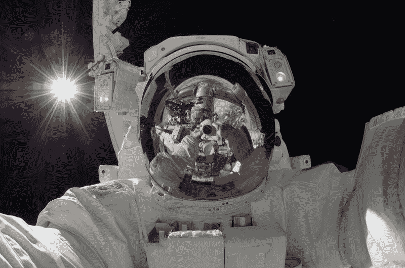

# 诺斯罗普·格鲁曼公司(NOC)在太空赚钱吗？—市场疯人院

> 原文：<https://medium.datadriveninvestor.com/is-northrop-grumman-noc-making-money-in-space-market-mad-house-86bf9b89aee5?source=collection_archive---------11----------------------->

航空航天、太空探索和军事工业综合体是很好的投资。诺斯罗普·格鲁曼公司于 2020 年 8 月 28 日支付了 1.45 美元的季度股息。

股息从 2020 年 2 月 21 日的 1.32 美元。总的来说，诺斯罗普·格鲁曼公司(NOC)在 2020 年 11 月 9 日提供了 5.16 美元的年度股息和 1.68%的股息收益率。此外，Dividend.com 将 12 年的股息增长归功于诺斯罗普·格鲁曼公司。

该股息可能是安全的，因为 Stockrow 估计诺斯罗普·格鲁曼公司在截至 2020 年 9 月 30 日的季度实现了 7.17% 的[收入增长率。此外，诺斯罗普·格鲁曼公司的季度收入从 2020 年 6 月 30 日的 88.84 亿美元增长到 2020 年 9 月 30 日的 90.83 亿美元。](https://stockrow.com/NOC/financials/income/quarterly)

# 诺斯罗普·格鲁曼公司赚了很多钱

**诺斯罗普·格鲁曼公司(NOC)** 在 2020 年 9 月 30 日报告了 18.4 亿美元的季度毛利。季度毛利从 2020 年 6 月 30 日的 18.26 亿美元和 2020 年 3 月 31 日的 17.72 亿美元增长。

然而，诺斯罗普·格鲁曼公司的季度营业收入从 2020 年 6 月 30 日的 9.94 亿美元下降到 2020 年 9 月 30 日的 9.85 亿美元。令人印象深刻的是，诺斯罗普·格鲁曼公司在 2020 年 6 月 30 日报告了 23.37 亿美元的季度运营现金流。2020 年 9 月 30 日，该季度运营现金流降至 13.59 亿美元。

诺斯罗普·格鲁曼公司报告，截至 2020 年 9 月 30 日，季度末现金流为 8.17 亿美元。季度期末现金流从 2020 年 6 月 30 日的 9 亿美元和 2020 年 3 月 31 日的 32.78 亿美元下降。

# 诺斯罗普·格鲁曼公司提供了巨大的价值

诺斯罗普·格鲁曼公司提供了巨大的价值。截至 2020 年 9 月 30 日，该公司总资产为 447.72 亿美元。总资产从 2019 年 9 月 30 日的 405.53 亿美元上升。

诺斯罗普·格鲁曼公司报告 2020 年 3 月 31 日的季度末现金流为 32.78 亿美元。该季度末现金流在 2020 年 6 月 30 日降至 9 亿美元，在 2020 年 9 月 30 日降至 8.17 亿美元。

截至 2020 年 9 月 30 日，诺斯罗普·格鲁曼公司拥有 49.95 亿美元的现金和短期投资。2020 年，诺斯罗普·格鲁曼公司的现金和短期投资从 2019 年 12 月 31 日的 22.45 亿美元增长到 2020 年 9 月 30 日的 49.95 亿美元。

然而，我不认为诺斯罗普·格鲁曼公司是价值投资，因为我认为市场先生在 2020 年 11 月 11 日将其定价过高，为 306.23 美元。此外，诺斯罗普·格鲁曼公司的股价在 2020 年下跌。NOC 于 2020 年 1 月 2 日以 355.70 美元的价格开始 2020 年。

# 诺斯罗普·格鲁曼公司是寡妇和孤儿的股票

然而，我认为诺斯罗普·格鲁曼公司是一个寡妇和孤儿的股票，因为它有大量的现金和支付巨额股息。诺斯罗普·格鲁曼公司是寡妇和孤儿的股票，因为它是一个安全的赚钱机器。

不幸的是，诺斯罗普·格鲁曼公司的大部分收入来自武器。诺斯罗普·格鲁曼公司的产品包括火炮、迫击炮、导弹、军用机器人和洲际弹道导弹(ICBMs)。因此，诺斯罗普·格鲁曼公司为核武器建造运载系统。

许多人会因为这些武器而对诺斯罗普·格鲁曼公司产生严重的道德异议。

# 带美国重返月球

诺斯罗普·格鲁曼公司在太空探索方面有着令人印象深刻的遗产。事实上，它的前身之一在 1969 年建造了将阿波罗 13 号宇航员送上月球的登月舱。

今天[诺斯罗普·格鲁曼公司可以为美国宇航局提出的月球网关设计和建造](https://www.northropgrumman.com/space/human-spaceflight-and-logistics/)居住和后勤前哨，或光环，模块。月球网关是美国宇航局阿尔特弥斯项目的一部分，旨在让美国人重返月球。光环将使用诺斯罗普·格鲁曼公司的天鹅座太空舱飞往月球并返回。

此外，诺斯罗普·格鲁曼公司是国家团队的一部分，该团队正在为美国宇航局开发人类着陆系统。[人类登陆系统](https://www.nasa.gov/press-release/nasa-names-companies-to-develop-human-landers-for-artemis-moon-missions)将是下一代登月舱，用于载宇航员重返月球。

诺斯罗普公司正与杰夫·贝索斯的蓝色起源公司和洛克希德·马丁公司合作开发人类着陆系统。美国国会已经拨款 6 亿美元用于开发人类着陆系统项目。该计划将使用蓝色起源的蓝月月球着陆器将宇航员和货物带到月球表面。

据 Techcrunch 报道，国家团队已经向美国宇航局交付了一个全尺寸工程原型或蓝月亮着陆器的模型。他们正在德克萨斯州休斯顿的美国宇航局约翰逊航天中心测试蓝月亮。

目前的计划是在 2024 年登月。然而，当选总统乔·拜登(特拉华州民主党人)可能会终止这一计划。登月计划是唐纳德·j·特朗普总统(R-Florida)的举措之一。特朗普输掉了 2020 年总统大选，将于 2021 年 1 月离任。

# 投资太空探索

诺斯罗普·格鲁曼公司的其他太空探索项目包括太空后勤和任务扩展飞行器。

他们设计由子公司 SpaceLogistics LLC 制造的车辆，以维护和服务轨道上的卫星。如果它像宣传的那样工作，任务扩展运载工具(MEV-1)将延长另一颗卫星在轨道上的寿命。

此外，诺斯罗普·格鲁曼公司只是将向国际空间站(ISS)提供货物补给服务的两家商业公司之一。).诺斯罗普·格鲁曼公司的天鹅座太空舱将货物运进和运出国际空间站。

# 投资诺斯罗普·格鲁曼公司的太空探索

因此，如果你想投资太空探索，诺斯罗普·格鲁曼公司是一个极好的选择。不像两家最著名的太空探索公司；杰夫·贝索斯的蓝色起源和埃隆马斯克的 SpaceX，诺斯罗普是一家上市公司。

此外，诺斯罗普·格鲁曼公司可能成为终极成长型公司，因为它投资于太空。此外，诺斯罗普·格鲁曼公司是卫星的主要制造商。诺斯罗普·格鲁曼公司的卫星项目包括 Milstar 通信网络和 R3D2 小型卫星。

诺斯罗普·格鲁曼公司的科学太空探索项目包括詹姆斯·韦伯太空望远镜、钱德拉 X 射线天文台和黎明号小行星探测器。

人们在寻找一家安全的赚钱公司，这家公司可能有巨大的未来，他们需要调查一下**诺斯罗普·格鲁曼公司(NOC)** 。此外，想投资太空旅行的人需要调查诺斯罗普·格鲁曼公司。诺斯罗普是一家支付高额股息的太空探索公司。

*原载于 2020 年 11 月 12 日 https://marketmadhouse.com**[*。*](https://marketmadhouse.com/is-northrop-grumman-noc-making-money-in-space/)*