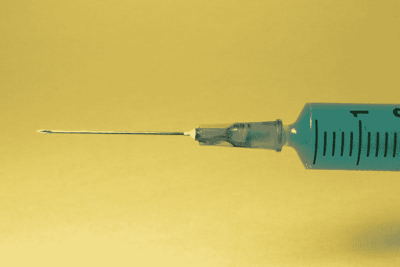
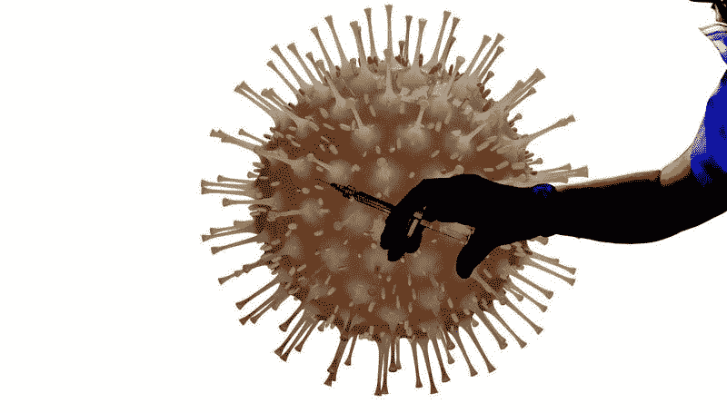
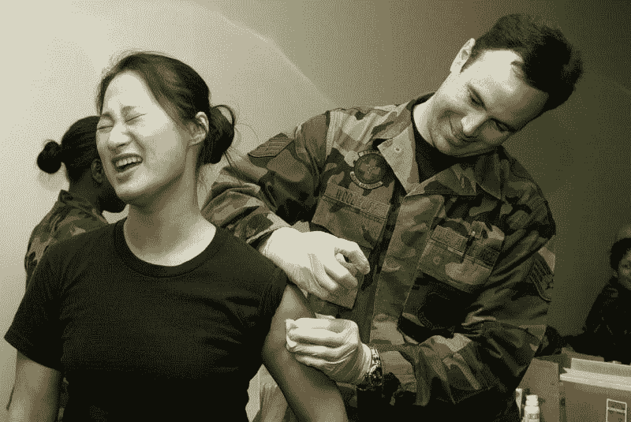

# Novavax (NVAX)赚钱了吗？—市场疯人院

> 原文：<https://medium.datadriveninvestor.com/is-novavax-nvax-making-money-market-mad-house-4c63e9289fb1?source=collection_archive---------13----------------------->

没有一只股票的增长或萎缩速度超过 Novavax (NVAX) 。Novavax 的股价在 2020 年 1 月 2 日从 4.49 美元开始，在 2020 年 8 月 20 日升至 142.87 美元，但在 2020 年 8 月 24 日跌至 119.26 美元。

令人难以置信的是，**诺瓦瓦克斯公司(NASDAQ: NVAX)** 在 2020 年 8 月 10 日创下了 178.51 美元的股价新高。市场先生喜欢诺华克斯，因为 T4 声称他们的 NVX-CoV2373 疫苗可以提高猕猴的冠状病毒免疫力。

反常的是，没有证据表明 NVX-CoV2373 有助于人类对抗新冠肺炎。详细说，猕猴是猴子的一种。因此，Novavax 没有冠状病毒疫苗。相反，Novavax 有一种疫苗可以预防猴子身上的冠状病毒。

# Novavax 有冠状病毒疫苗吗？

然而， **Novavax (NASDAQ: NVAX)** 是在南非对 NVX-CoV2373 进行观察者盲法、安慰剂对照疗效研究或 2b 期试验的[。具体来说，Novavax 正在 2665 名健康志愿者中测试该疫苗。Novavax 还计划在 240 名医学上稳定的艾滋病患者(艾滋病毒阳性成年人)中测试 NVX-CoV2373。](https://finance.yahoo.com/news/study-may-insights-novavax-covid-220704878.html)

比尔和梅林达·盖茨基金会给诺瓦瓦克斯提供了 1500 万美元资助南非的测试，雅虎！财务索赔。 [NVX-CoV2373 模拟了新型冠状病毒病毒中的一种关键蛋白](https://www.statnews.com/2020/08/04/novavaxs-covid-19-vaccine-shows-promising-immune-response-early-data-show/)。Novavax 的希望是，被模仿的蛋白质将模拟感染，欺骗身体产生可以对抗冠状病毒的抗体。

Stat News 声称，Novavax 在澳大利亚进行了一次小型 NVX-CoV2373 测试，显示了有希望的结果。所以 Novavax 没有冠状病毒疫苗。相反，Novavax 正在测试一种可能的冠状病毒疫苗。

# 诺瓦瓦克斯赚钱了吗？

诺瓦瓦克斯公司经历了令人难以置信的收入增长。事实上， [Stockrow 估计 Novavax 在 2020 年第二季度的收入增长率为 958.62%](https://stockrow.com/NVAX/financials/income/quarterly) 。

这一收入增长听起来令人印象深刻，直到你检查诺瓦瓦克斯的财务数字。Novavax 报告 2020 年 3 月 31 日的收入为 338 万美元。2020 年 6 月 30 日，这些收入增至 3 554 万美元。

这一收入增长听起来令人印象深刻，直到你检查诺瓦瓦克斯的财务数字。Novavax 报告 2020 年 3 月 31 日的收入为 338 万美元。2020 年 6 月 30 日，这些收入增至 3 554 万美元。

此外，Novavax 报告 2020 年 6 月 30 日季度普通净亏损为-1752 万美元。季度共同净亏损从 2019 年 12 月 31 日的 3183 万美元下降到 2020 年 3 月 31 日的-2586 万美元。

然而，Novax 的季度毛利从 2020 年 3 月 31 日的 338 万美元增长到 2020 年 6 月 30 日的 3554 万美元。因此，Novavax 不赚钱。事实上，Stockrow 认为 Novavax 已经连续五个季度出现运营亏损。

# 诺瓦瓦克斯正在产生现金吗？

从积极的方面来看，Novavax 于 2020 年 6 月 30 日报告了其首个正运营现金流。Novavax (NASDAQ: NVAX) 报告 2020 年 3 月 31 日运营现金流为负 2311 万美元，2020 年 6 月 30 日增长至 1.1563 亿美元。

Novavax 的季度期末现金流从 2019 年 12 月 31 日的 625 万美元增长至 2020 年 3 月 31 日的 1.8719 亿美元以及 2020 年 6 月 30 日的 3.4438 亿美元。不幸的是，大部分现金来自融资。

Novavax 报告 2019 年 12 月 31 日的季度融资现金流为 3017 万美元，2020 年 3 月 31 日增长至 1.8592 亿美元，2020 年 6 月 30 日增长至 4.1962 亿美元。因此，Novavax 的赚钱能力并没有增加。相反，诺瓦瓦克斯借钱和积累巨额债务的能力正在增强。

# 为什么 Novavax 会破产

因此，如果 NVX-CoV2373 疫苗有效，Novavax 可能是一项重大投资。如果 NVX-CoV2373 失败，我认为 Novavax 会崩溃破产。解释一下，诺瓦瓦克斯目前的希望是政府和富有的慈善家；比如比尔·盖茨会花大价钱买它的疫苗。没有疫苗，就没有钱。

我认为 Novavax 可能会很快崩溃，因为它在 2020 年 6 月 30 日报告了 6.0906 亿美元的现金和短期投资。然而，现金和短期投资从 2020 年 3 月 31 日的 2.4425 亿美元增加到 2020 年 12 月 31 日的 8 177 万美元。问题是，现金和短期投资来自借贷，而不是出售疫苗。

有趣的是，Novavax 的总资产从 2020 年 12 月 31 日的 1.7296 亿美元增长到 2020 年 3 月 31 日的 3.2807 亿美元，再到 2020 年 6 月 30 日的 9.3223 亿美元。因此，Novavax 的价值在增加？

# Novavax 是什么？

**诺瓦瓦克斯公司(NASDAQ: NVAX)** 开发疫情病疫苗。例如，Novavax 正在开发季节性流感、呼吸道[合胞病毒](https://marketmadhouse.com/is-novavax-nvax-making-money/Respiratory%20Syncytial%20Virus%20(RSV))、伊波拉病毒[、中东呼吸综合征](https://www.cdc.gov/coronavirus/mers/index.html) (MERS)和[严重急性呼吸综合征](https://www.cdc.gov/sars/index.html) (SARS)的疫苗。

任何看新闻的人都知道，流行病是一个可以扰乱整个世界的巨大问题。因此，冠状病毒疫情验证了诺瓦瓦克斯的商业模式。相反，没有证据表明诺瓦瓦克斯的疫苗有效。

例如，据世界计量机构(world ometers)2020 年 8 月 24 日估计，自 2019 年 11 月以来，世界已经历了[2375.8 万例冠状病毒病例和 815，337 例死亡](https://www.worldometers.info/coronavirus/)。令人震惊的是，Worldometers 估计，美国在 2020 年 8 月 24 日检测到超过 36，035 例新冠状病毒病例。此外，世界计量机构估计，2020 年 8 月 24 日，180，966 名美国人死于新冠肺炎。

# 诺瓦瓦克斯(NVAX)是一个纯粹的投机性投资

因此，Novavax 的产品可能会有巨大的市场。此外，Novavax 可以满足巨大的需求。

但是，我认为 **Novavax (NVAX)** 是纯粹的投机投资，没有价值。因此，投资者需要避开 Novavax，直到它展示出可以大规模生产的有效疫苗。归根结底，我认为诺瓦瓦克斯是一场永远不会有回报的赌博。

*原载于 2020 年 8 月 24 日 https://marketmadhouse.com***。**