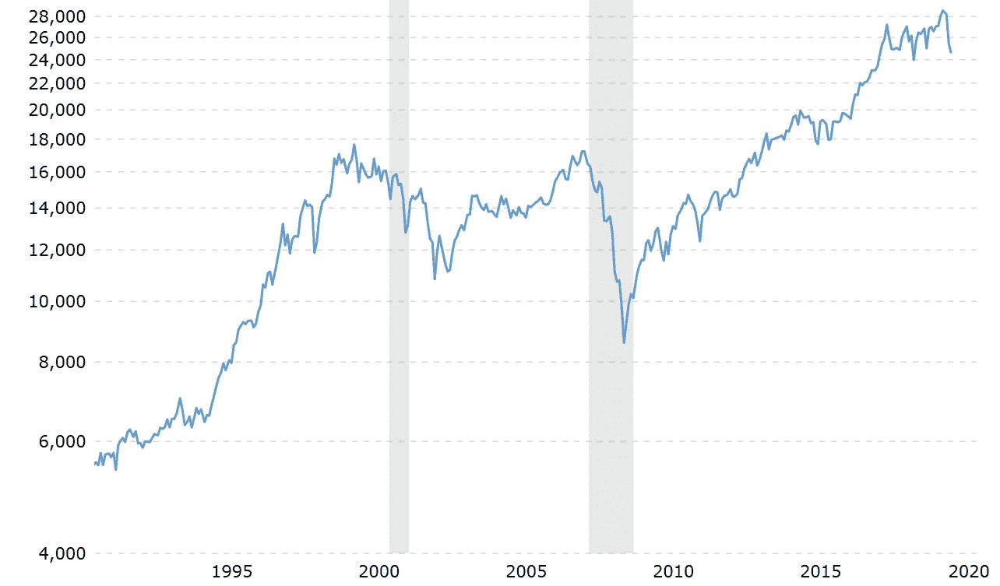

# “现在”是投资的好时机吗？

> 原文：<https://medium.datadriveninvestor.com/is-now-a-good-time-to-invest-a877bbc31099?source=collection_archive---------19----------------------->

## 直到几个月前，我已经制定了一些投资股票市场的计划。但是有了最近的消息，我觉得不确定。

Photo by [Austin Distel](https://unsplash.com/@austindistel?utm_source=medium&utm_medium=referral) on [Unsplash](https://unsplash.com?utm_source=medium&utm_medium=referral)

提醒你一下，我不是财务顾问。我在大学时上过金融课，也读过很多关于金融的书(因为和我们大多数人一样，我也在努力赚些外快)，但仅此而已。

> 一个人并非生来就有能力做出合理的财务决策，这种能力来自于教育、阅读正确的材料以及训练
> 
> — —奋斗的马西伊瓦，商人、企业家和慈善家

接下来的内容是基于我所读到的和我的个人经验，但主要是基于常识。

## 1.你不需要很富有才能见到理财顾问，但你需要有好奇心并提出问题

最近，我和丈夫决定去见一位独立的财务顾问。当你读到这里时，你们中的一些人可能会想:“好吧，你是百万富翁，还是什么？”。一点也不！

我向你保证远非如此。但是我们存了一些钱，我们把它看作是一个学习更多东西的机会。我们年轻时并没有真正了解金钱([这就是为什么我最近写了一篇关于向孩子教授金融概念的重要性的文章](https://medium.com/the-capital/is-it-okay-to-talk-about-money-with-your-children-b6601054ff94))，所以我们想向专家学习。

事实上，与你想象的相反，与财务顾问的会面都是免费的**。我们可以谈论我们的财务状况和未来计划，并提出我们的问题，所有这些都是免费的。**

**有些财务顾问会根据你决定投资的产品收取费用，有些会根据你的投资结果收取费用，有些会按小时收费，但一般来说，第一次会议是免费的。**

** [## 数据驱动投资的兴起|数据驱动投资者

### 当 JCPenney 报告其 2015 年 2Q 的财务结果时，市场感到非常震惊。美国零售巨头…

www.datadriveninvestor.com](https://www.datadriveninvestor.com/2019/02/28/the-rise-of-data-driven-investing/) 

当然，我猜想，越有信誉的财务顾问收费越高(有时甚至在第一次见面时)，但由于我们不想预先支付一些费用，我们选择了一个只有在我们决定投资时才会收费的财务顾问。

然而，请注意，一些财务顾问可能比其他人更不道德，并小心翼翼地总是检查凭证。这是你通过努力工作赚来的钱，所以最好自己去调查。做你的作业。我做到了，和我的财务顾问交谈时，我感觉不那么不安了。

> 你必须为你自己的钱负责，因为没有人比你更在乎它。

我们认为财务顾问可以给我们一些建议，并告诉我们“现在”是否是将我们的钱投资到一些市场基金的好时机。他向我们展示了一些历史图表，问了我们一些问题来评估我们的“风险偏好”，并回答了我们的问题。

然后冠状病毒疫情就发生了。

## 2.你不需要认为对你来说投资的好时机和每个人都一样

根据大多数书籍所说的“低买高卖”，和[巴菲特的建议是一样的](https://www.investopedia.com/articles/investing/012116/warren-buffett-be-fearful-when-others-are-greedy.asp):

> “在别人贪婪的时候恐惧，在别人恐惧的时候贪婪。”—沃伦·巴菲特

目前，由于冠状病毒的流行，市场正在下跌，每个人都很害怕。我也是，*很担心。*

如果我们按照上面的建议去做，现在不正是投资的好时机吗？

但我们不知道市场是否会走低。以及它们可能持续走低多长时间。

让我们来看看过去三十年道琼斯工业平均指数(DJIA)股票市场指数(供您参考，链接指向一个互动图表)的[历史值:](https://www.macrotrends.net/1319/dow-jones-100-year-historical-chart)

Dow Jones Industrial Average (DJIA) stock market index for the last 30 years — inflation-adjusted values

我们可以清楚地看到 2007 年经济衰退的影响，价格大幅下跌。

直到 2014 年，价格才恢复到危机前的初始水平，这意味着如果你决定将危机前投资的资金套现，将会有七年的时间亏损。

当我看着这张图表时，我告诉自己:现在，我们是处于衰退的开端，还是正在经历一场轻微的波动？

假设我现在投资，价格持续短期下跌，但之后又上涨，我会发现一个好的市场机会。

但是，假设我们正在进入衰退，并且价格持续下降几年，我将无法兑现投资的钱(除非我承担损失)。

> “投资世界的底部不会以四年低点结束；它们以 10 年或 15 年的低点结束。”—吉姆·罗杰

你不知道这段时间跨度内可能会发生什么人生大事。

所以，我要说，投资股市与否也要看你自己的个人情况。在我看来，投资的最佳时机是当你确保自己存了一些钱作为应急基金，以防万一发生不好的事情。

## 3.当价格低的时候，你不需要为投资感到难过…如果你没有投资，你也不需要难过

当我与人讨论投资时，我觉得这个话题会带来很多不好的感觉:

“所以你想在市场低迷的时候投资？我感觉是投机不道德的……”，

或者“我后悔多年前没有投资……看看现在的市场！”,

或者“我后悔没有在市场低的时候多投资，我慌了，过早地卖掉了我的股票……”，

或者“我做了一个错误的投资选择，亏了很多钱…”

每个人对投资都有自己的看法。

我相信，只要你坚持自己的信念，并对投资方向做足功课，向经济中重新注入资金并不可耻。

你也不需要后悔没有早点投资，因为当我们已经知道过去是如何展开的时候，做回顾性分析会容易得多。但是没有人有水晶球来预测金融危机的后果。

我非常理解一个人在面临投资或不投资的决定时可能会经历的恐惧，混合着渴望和犹豫。

> "在投资中，舒适的东西很少会盈利."
> 
> 罗伯特·阿诺特** 

**感谢你阅读我的故事。欢迎在下面评论！**