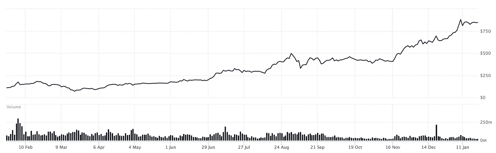
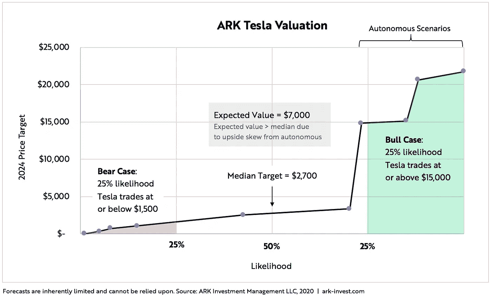

# 现在是投资特斯拉的最佳时机吗？

> 原文：<https://medium.datadriveninvestor.com/is-now-the-perfect-time-to-invest-in-tesla-e1b183475383?source=collection_archive---------5----------------------->

## 这些数字对投资者意味着什么。

Photo by [Vlad Tchompalov](https://unsplash.com/@tchompalov?utm_source=medium&utm_medium=referral) on [Unsplash](https://unsplash.com?utm_source=medium&utm_medium=referral)

在上市 10 年后，特斯拉终于在 2020 年 1 月公布了第一份年度利润。

是的，你没看错。这家电动汽车制造商花了 10 年时间才真正实现盈利。对于任何其他上市公司来说，十年未能盈利都会吓跑投资者。一家公司如何在不盈利的情况下运营 10 年，仍然避免破产？

然而，对于埃隆·马斯克的公司来说，对研究和设计的大量投资被忽视了，因为他们预计这些投资在未来会有回报。投资者仍然乐观地警惕这家耗油量大的公司，希望马斯克的全电动未来计划能够获得回报。

正如 CNN [在 2018](https://money.cnn.com/2018/03/28/news/companies/tesla-model-3-cash-crunch/index.html) 报道的那样，“随着特斯拉成长为汽车行业的一支主要力量，它从未实现全年盈利。但投资者、贷款人和客户一直非常信任其魅力非凡的首席执行官埃隆马斯克，至少在这一点上是如此。他们为他提供了挑战业内老牌企业所需的现金。”

2020 年，特斯拉的未来开始看起来有点光明。在该公司公布上一财年的首次年度利润后，股价上涨了 11.5%。围绕特斯拉的乐观情绪持续了一整年。该公司比 2020 年第四季度的预测多生产了 15，000 辆汽车，使汽车总产量达到 499，550 辆。

现在，当我们展望 2021 年时，埃隆·马斯克相信特斯拉将继续取得成功。然而，对投资者来说，成功并不那么明显。许多问题仍然围绕着特斯拉的盈利能力和未来成功的能力。公司已经耗尽了他们的好运了吗？或者特斯拉真的会留下来吗？

让我们来看看围绕特斯拉的定性和定量因素。

# 制造业扩张

埃隆·马斯克(Elon Musk)已经明确表示，他希望在 2040 年之前控制汽车行业。亿万富翁[最近表示](https://www.businessinsider.com/elon-musk-tesla-likely-20-million-electric-vehicles-year-2030-2020-9)他的目标是特斯拉在未来十年内每年生产 2000 万辆电动汽车——坦率地说，这是一个投资者认为可笑的提议。

尽管有人怀疑特斯拉能否在一年内生产 2000 万辆电动汽车，但投资者认为，该公司在制造能力方面比竞争对手略胜一筹。

正如 Wedbush 分析师 Dan Ives 告诉《投资者商业日报》的记者:“特斯拉在制造电动汽车方面遥遥领先于竞争对手，这是唯一的竞争。目前在电动汽车市场，这是特斯拉的天下，其他人都在支付租金。”

特斯拉目前有两家制造工厂，正在德国柏林建设第三家工厂，预计 2021 年 3 月完工。第四家制造厂计划在德克萨斯州建造，将于今年年底完工。

假设特斯拉的两个新制造厂的计划实现了，投资者可能会看好这家电动汽车公司。随着产量增加，特斯拉汽车变得更加实惠，有理由预计该公司的增长将继续下去。

# 新兴竞争对手

尽管特斯拉在开始电动汽车生产方面已经超过了其竞争对手，但其他公司并没有远远落后。通用、大众、宝马、奔驰都有自己的电动汽车。福特最近发布了野马 Mach E，这是一款电动跑车，旨在与特斯拉的豪华车型竞争。

随着电动汽车市场的不断扩大，特斯拉的竞争对手将继续加速生产。来自[彭博新能源财经](https://about.bnef.com/electric-vehicle-outlook/)的一份报告发现，“汽车制造商正在加速他们的电动汽车投放计划，部分是为了遵守欧洲和中国日益严格的法规。”

该报告继续指出，“新冠肺炎将推迟一些[生产]，但到了 2022 年，全球将有超过 500 种不同的电动汽车型号。消费者的选择和有竞争力的价格将是吸引新买家进入市场的关键。”

该报告称，2015 年售出了 45 万辆电动汽车。这一数字在 2020 年升至 170 万，预计到 2040 年将达到 5400 万。在短短 20 年内，电动汽车销量将占所有新车购买量的 58%。

这些数字对电动汽车市场来说是积极的，投资者应该对特斯拉的销售将持续到未来充满信心。令人担忧的是，竞争对手将进入这个市场，并可能在未来超过特斯拉的市场份额，但埃隆·马斯克的公司可以通过积极推动创新和扩大制造能力来继续阻止竞争。

# 强大的量化指标

虽然定性研究让我们了解了特斯拉所处的市场，但定量数据更好地预示了特斯拉股票的未来。

尽管新冠肺炎的蔓延造成了混乱，但特斯拉的股票在过去一年中一直稳步上涨:

Image courtesy of [WSJ.com](https://www.wsj.com/market-data/quotes/TSLA/advanced-chart)

许多定量分析师使用的在线工具《投资者商业日报》(IBD)在其[综合评级](https://education.investors.com/financial-dictionary/general/composite-rating-cma--smartselect-rgr-)中给特斯拉股票打了 99 分。这一评级“意味着在最重要的基本面和技术面选股标准方面，特斯拉股票目前的表现优于 99%的股票。”

IBD 还给特斯拉的[相对强势评级](https://www.investors.com/ibd-university/find-evaluate-stocks/exclusive-ratings/)为 98，这意味着在过去一年中，就相对股价表现而言，特斯拉的表现优于 98%的股票。

[方舟投资](https://ark-invest.com)——美国目前最受欢迎的投资基金之一——已经确定了特斯拉股票在未来五年的概率分布:

Image courtesy of [ark-invest.com](https://ark-invest.com/articles/analyst-research/tesla-price-target/)

这个图表是什么意思？Ark Investments 认为，到 2024 年，特斯拉股票有 25%的可能性达到或超过 15，000 美元。出于同样的原因，有 25%的可能性特斯拉的股价在 1500 美元或以下。这使得到 2024 年，特斯拉股票的预期价值为 7000 美元。如果 Ark Investments 的分析是正确的，投资特斯拉的潜在好处超过了可能的风险。

# 这对你意味着什么？

投资特斯拉——或者任何一家公司——都是有风险的。埃隆·马斯克对全电动未来的愿景有可能失败；特斯拉可能再也不会盈利了。

但定性和定量的数字表明，特斯拉有一个光明的未来。该公司横扫竞争对手，超越其他公司，成为世界上最大的电动汽车制造商。如果特斯拉继续表现出色，满足消费者的期望，很难看到该公司不会保持领先地位的未来。

亚伦·施诺尔 2021 年

*本文仅供参考，不应视为财务或法律建议。并非所有信息都是准确的。在做任何重大财务决定之前，先咨询财务专家。*