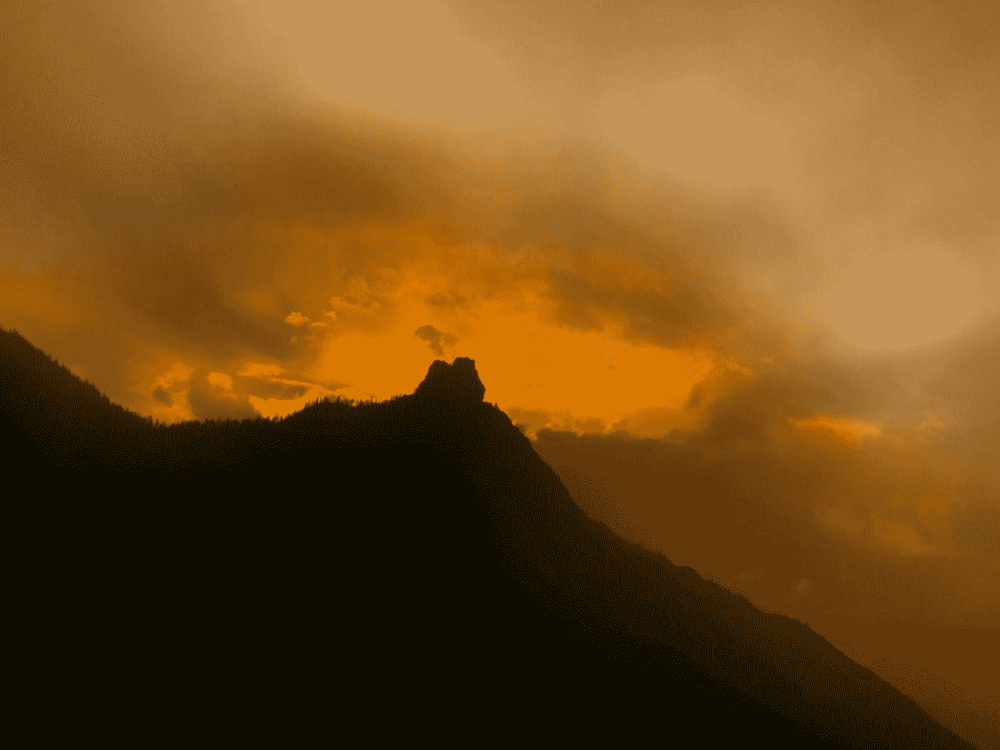
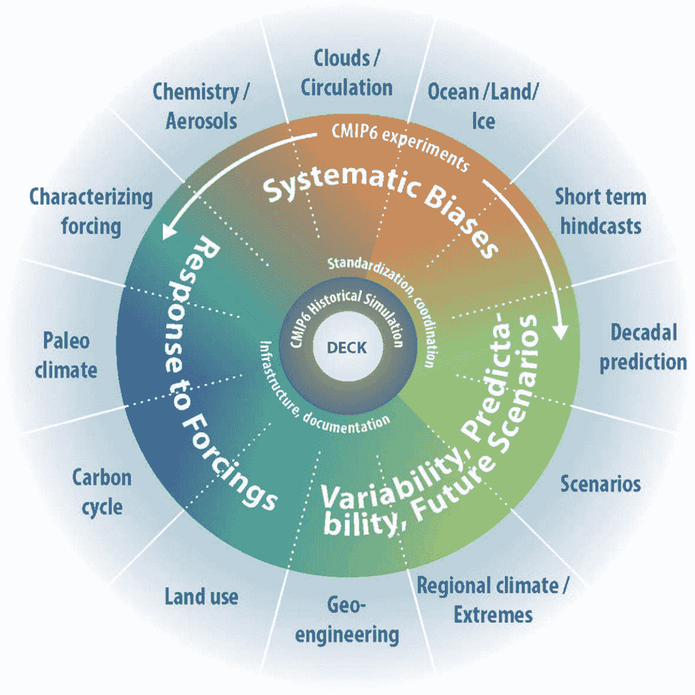
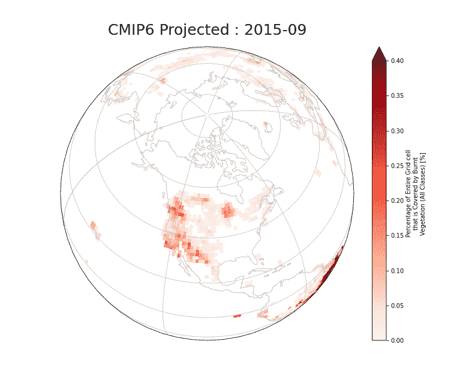
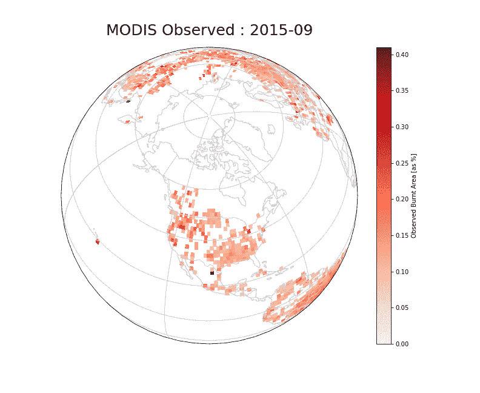
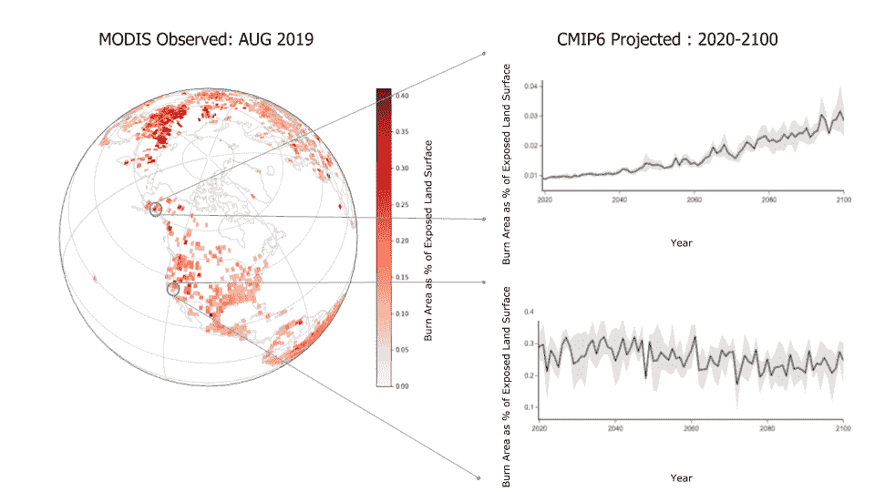

# 我们的房子着火了吗？

> 原文：<https://medium.datadriveninvestor.com/is-our-house-on-fire-98919692259c?source=collection_archive---------5----------------------->

***探索未来气候变化的情景***

Wildfires in the Pacific NorthWest. Photo by [Jeremy Perkins](https://unsplash.com/@jeremyperkins?utm_source=medium&utm_medium=referral) on [Unsplash](https://unsplash.com?utm_source=medium&utm_medium=referral)

越来越多的高强度急性物理灾害，如野火和洪水，已成为公众和商业利益日益担忧和关注的一个来源。目前，来自地理空间数据源的全球气象测量数据激增，产生了大量关于气候变化的可操作情报。分析师和决策者可以利用这些新信息，在气候相关政策、规划和可持续投资方面做出更好的决策。大规模数据分析和建模的创新导致了基本气候变量的高保真度模型。最近，基于最新的[气候评估报告(AR6)](https://www.ipcc.ch/assessment-report/ar6/) (来自[政府间气候变化专门委员会(IPCC)](https://www.ipcc.ch/) )的第六阶段气候建模承诺创建一个共同框架，以评估未来八十年不同情景下的前瞻性气候模式。如果你对所有这些创新如何让你更好地理解气候和你的邻居可能面临的危险感到好奇，请继续阅读。

**气候情景:以下是其中的内容**

Components of DECK (Diagnostic, Evaluation and Characterization of Klima) From [An overview of CMIP6 Experimental Design and organization](https://gmd.copernicus.org/articles/9/1937/2016/gmd-9-1937-2016.pdf)

气候变化并不局限于某个郊区、城市或地区——它是一种影响地球表面的根本性全球现象。准确模拟气候变化需要深入了解地球系统的不同组成部分，包括大气、海洋、陆地和冰冻圈。这些系统中的每一个都由一组基本变量来表示:

*   空气温度
*   大气的湿度和降水量
*   海水温度
*   海水盐度
*   海洋的水循环
*   碳吸收
*   森林和土地利用类型
*   土壤结构
*   陆地系统的土地利用类型
*   冰冻圈的海冰和冰川

由于这些系统在本质上是相互关联的，模拟气候变化需要假设这些子系统在不同的人类活动情景下将如何演变。为了使这些复杂、相互关联的方面以及与它们相关的大量数据更具可操作性，IPCC 定义了两个关键组成部分。IPCC 定义了代表社会和经济活动的[共享社会经济路径](https://www.carbonbrief.org/explainer-how-shared-socioeconomic-pathways-explore-future-climate-change) (SSPs)，以及代表 GHG 气体排放浓度的代表性浓度路径(RCPs)。作为补充，SSP-RCP 组合允许对场景进行有意义的高层解释。这些情景已被明确定义，以简化和概括我们作为一个社会如何应对气候问题的基本假设:

 [## 气候变化辩论中的科学与金钱|数据驱动的投资者

### 没有关于气候变化的公开辩论。在我发布文章的媒体上，有成千上万的文章是关于…

www.datadriveninvestor.com](https://www.datadriveninvestor.com/2020/01/30/science-and-money-in-the-climate-change-debate/) 

*   ***SSP5-RCP8.5*** 表示可能的*照常**【BAU】*场景。在这种情况下，社会经济定义了缓解和持续化石燃料依赖的硬挑战，导致相对于工业化前的条件，到本世纪末全球可能增加 8.5 瓦/平方米的能源。
*   ***SSP2-RCP4.5*** 表示可能出现的*中路**【MOR】*场景。在这种情况下，社会经济学定义了适应和缓解的中度挑战以及实现[联合国可持续发展目标](https://www.un.org/sustainabledevelopment/sustainable-development-goals/)的缓慢进展。这可能会导致到本世纪末全球能源消耗增加 4.5 瓦/平方米。

模拟地球系统是复杂的！这是一项让我们这一代最聪明的头脑忙碌的任务，并将继续挑战后代。

**解码近期气候预测**

使用最先进的气候模型，在不同的 SSP 情景下，我们可以对未来几十年的基本变量进行预测。由于这些是复杂的情况，气候科学家在进行预测时，通常会使用一组模型，称为模型集合，而不是单一的模型。气候科学家也创造未来物理危害的模型。在估计基本变量和物理风险结果时，每个模型都做出不同的假设。

考虑到这些是复杂的系统，气候科学家通常使用一组 CMIP6 气候模型(称为 [*气候模型集合*](https://en.wikipedia.org/wiki/Climate_ensemble) )或一组来自单个模型的模拟来预测未来情景。来自模型集合的最简单的可操作输出是集合平均值和集合方差。像基本变量的模型集合一样，可以为物理风险创建模型集合。这种灾害模型还可以说明和量化气候模型中的相关不确定性:参数不确定性反映了模型对基本变量数值的怀疑，结构不确定性反映了对基本变量和模型输入之间关系的怀疑。

Projections of burned area fractions from a collection of CMIP6 Models from CNRM-ESM2–1 under the SSP5-RCP8.5 Business as Usual climate scenario

这种灾害的模型输出的集合平均值可以被设计成月度、年度或十年的地图。为简单起见，这里我展示了一个来自 CMIP6 模型之一的地图示例，即*国家气象研究中心地球系统模型**(*[*CNRM-ESM v2–1*](https://agupubs.onlinelibrary.wiley.com/doi/full/10.1029/2019MS001791)*)*，地图本身是该模型的 5 个独立投影的平均值。该地图显示了根据 ssp 5–8.5，2020 年 8 月和 2030 年 8 月的预计燃烧面积分数，即被燃烧面积覆盖的土地表面百分比的估计值。总的来说，我们看到，虽然野火发生的地区和估计的燃烧面积基本相同，但这些地区的火灾强度或燃烧面积却有很大的不同。我们也看到了一些新区域的投影，如马来西亚西部和北欧，那里过去有有限的火灾，显示了更高密度的投影燃烧区域。

通过模拟最近一段时间内模型集合的输出，我们还可以评估它们对观察到的野火时空模式的模拟有多接近。

Animation of the monthly estimated burned area fraction from wildfires over North America and Siberia from a collection of CMIP6 models over the past 5 years. Note that the range here is from 0 to 0.4% burned area as a fraction of the exposed land surface. Using an orthographic projection allows us to more closely explore the patterns in these two regions which have seen an increasing incidence of wildfires in recent years

在这里，我们仔细观察了北美和西伯利亚上空燃烧区域的模式，我们可以看到燃烧区域的范围在不断扩大。然后我们可以探索他们如何密切跟踪观察到的火灾。

**用观测值拉平投影**

虽然有不同的危险暴露指标非常有用，但很难确定哪些是有用的。进入观察的世界。由美国航天局运营的 MODIS TERRA 卫星通过提供低空间分辨率的日常地球观测数据，为更好地了解陆地景观的变化提供了巨大的数据来源。科学家们利用这些数据来评估土地覆盖的长期变化，并绘制美国和世界其他地区的野火地图。美国林务局的遥感应用中心、加州消防和救援援助计划以及多种商业火灾风险产品不断分析 MODIS 图像，为野火的管理和扑灭提供信息。3 级处理的 MODIS 每月活跃火灾档案( [MOD14A1](https://neo.sci.gsfc.nasa.gov/view.php?datasetId=MOD14A1_M_FIRE) )提供了每 1000 平方公里地表的火灾数量的估计。利用一个地区的火灾统计数据和相关的测量燃烧面积，我们可以将 MODIS 的活跃火灾图转换为卫星观测的估计燃烧面积图。请注意过去几年中通过 MODIS 在西伯利亚观察到的越来越多的火灾。俄罗斯的野火目前已经烧毁了比希腊还大的面积。自 2020 年 1 月以来，估计西伯利亚有 1900 万公顷的森林、草原和田野被烧毁。这些地区大约有 1000 万公顷遭受森林火灾。

Animation of the monthly estimated burned area from wildfires over North America and Siberia from a collection of satellite observations using the NASA MODIS Active Fires L3 product over the past 5 years. Note that the range here is from 0 to 0.4% burned area as a fraction of the exposed land surface. Using an orthographic projection allows us to more closely explore the patterns in these two regions which have seen an increasing incidence of wildfires in recent years

**揭示气候变化的未来**

A zoomed-in view on the temporal risk profile of burned area fraction estimated over specific regions of the world under the Business as Usual scenario (SSP5-RCP8.5) between 2020 and the close of the century. Starting with two specific regions in North America, Northern California and Alaska, both of which experienced wildfires in the summer of 2019\. Top Right: Estimated risk in Anchorage, Alaska and Los Angeles County, California

通过探索不同时期气候模型的估计燃烧面积，我们可以看到全球特定地区潜在野火危害的变化模式。在这里，我们看看 2019 年发生大量野火的两个特定地点:南加州和阿拉斯加。持续的干旱、温暖的天气和大量的植树造林使得南加州每年都容易发生严重的野火。2019 年也不例外。我们可以谨慎地看待在本世纪剩余时间里预测的类似燃烧区轮廓的前瞻性趋势。

相反，阿拉斯加并不以温暖或干燥的环境闻名，但近年来野火也有所增加。更仔细地观察估计的燃烧区域的时间剖面，会发现一个更尖锐的故事。2019 年，北极火灾创纪录地激增，该地区变暖的速度是世界其他地区的两倍多。北极的土壤中含有大量的碳和其他导致地球变暖的温室气体，包括泥炭地和被称为永久冻土的冻土，它们可以通过燃烧释放出来。据阿拉斯加野火专家称，2019 年带来了过去 40 年来最极端的火灾情况。CMIP6 模型预测，到本世纪末，由于这些变化，总燃烧面积将增加 400%。

**关键要点**

> 了解未来的风险敞口让我们有机会适应不断变化的气候。

以上是关于我们如何利用气候模型的数据来探索未来几十年气候和极端物理灾害的预期变化模式的一些早期探索步骤。这仅仅是前瞻性风险评估和与观测数据相关的交叉验证的可能性的冰山一角。以下是一些值得记住的细节:

*   **空间尺度至关重要。**气候模型预测了全球范围内的长期风险。然而，决策往往侧重于区域和地方空间尺度。
*   我们可以开始比较估计值和观测值。使用卫星观测及其衍生工具，我们可以将观测到的时空模式与最近几年的气候模型预测进行比较。
*   **位置，位置，位置。**风险分析表明，并非所有地区都以相同的方式发展，位置至关重要。在未来几十年，不同的地区在野火风险暴露方面可能会表现出非常不同的演变，正如在南加州和阿拉斯加预计燃烧区的时间分布图中所看到的那样。

[*Sust Global*](https://www.sustglobal.com/)*提供可操作的气候风险情报，量化全球最大的金融机构和关键供应链面临的日益加剧的气候影响。在接下来的几周里，我将更多地讲述如何将前沿气候科学转化为基于位置的见解。如果你觉得这份材料很有趣，并且关心气候变化，我会很感激你转发给朋友或者留下评论。*

*订阅*[*Sust Insights*](https://www.sustglobal.com/insights)*及时了解前沿气候科学的最新分析和趋势。如果您想评估您的资产和业务因暴露于未来极端物理风险而面临的风险，* [*联系*](https://www.sustglobal.com/contact) *我们将向您展示我们的* [*气候情景分析产品*](https://www.sustglobal.com/about-us) *。*

# 相关阅读

 [## 当它在你的后院时就很重要了

### 气候风险情报，告知特定位置现在和未来的物理风险。

medium.com](https://medium.com/datadriveninvestor/it-matters-when-its-in-your-backyard-e3f93953e282)  [## 当地行动

### 气候风险情报如何促进地方一级的可持续行动

medium.com](https://medium.com/datadriveninvestor/act-local-85428f674eda) 

## 获得专家观点— [订阅 DDI 英特尔](https://datadriveninvestor.com/ddi-intel)