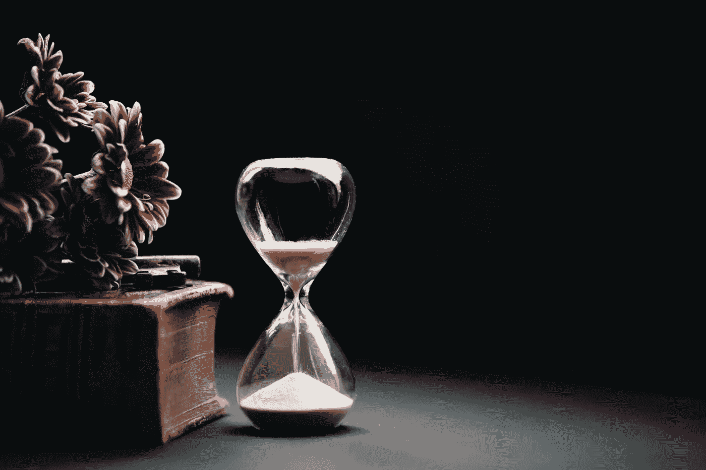

# 耐心重要吗？

> 原文：<https://medium.datadriveninvestor.com/is-patience-important-a25fcdca9121?source=collection_archive---------45----------------------->

你在排队，你前面的人花了很长时间，你注意到你后面的队伍越来越长。

这个人一直在他们的口袋里摆弄东西，看起来很悠闲。

在你的脑海中，你对自己说，此时你可以去任何地方。

你可以在家享受与家人在一起的时光，玩你最喜欢的游戏，或者只是睡在沙发上。

但是没有，你没有做那些好事，而是在这里，因为一个愚蠢的人站在一个愚蠢的商店里排着愚蠢的队。

它让你愤怒。

你不耐烦地跺着脚，看了十几次表，最后整个晚上都在抱怨。

**然后呢？**

最终你回到家，倒在沙发上，打开电视，滚动频道，心想你没什么可看的。

我们很多人变得非常不耐烦，因为我们觉得我们需要去某个地方。

这在我们的日常生活中是真实的，就像它在我们的生活中在更大范围内一样。

我不想马上回答这个问题，而是想问你相反的问题:

***不耐烦有什么收获？***

无论你多频繁地跺跺脚、看表或抱怨延误，都不会让你更快地到达任何地方。

现在，我也想让你看看你自己的生活，并回答以下问题:

从更大的意义上来说，你是否也对生活失去了耐心？

意思是:当你没有足够快地实现你的目标，当你没有达到你想要达到的目标，或者当事情花了比预期更长的时间，你是否也会变得不耐烦？

看看你曾经有过的最大目标。你什么时候放弃的？

你的新年决心是什么？你已经放弃了吗？如果有，为什么？

**要明白，你培养的耐心或不耐烦影响的不仅仅是你生活中的小瞬间。**

你不需要在今年达到所有的目标，不需要在接下来的 5 年里达到，也不需要在接下来的 10 年里达到。你有时间。

但是你越不耐烦，你对自己的期望就越高。你对自己的期望越高，你就越不能接受自己的缺点。你越不接受这些缺点，你就越自责，你的生活就变得越糟糕。

你没有花时间去做必要的事情，而是要求生活马上给你想要的一切。

你在 25 岁之前上大学、结婚、买房子、生孩子，就像一场比赛，获胜者将获得一些惊人的奖励。

你想比任何人都快，当你到了他们的年龄时，你想“遥遥领先”，并认为这是一场巨大的竞争。

但事实是，不管你什么时候达到目标，你仍然会以那种方式度过你的余生*。*

*重要的不是你什么时候到达的*，而是你到达*的*。**

*你会在生活中经历一些奇怪的转折；毕竟，这根本不是一条笔直的道路。*

*只要你有耐心继续磨，你最终会成功的。*

*但是如果你放弃了，如果你不耐烦了，如果你一直问你什么时候能最终达到你的目标，那么你只会把自己推向痛苦。*

*耐心是平静地接受事情可能会以不同于你想象的顺序发生—未知*

***访问专家视图—** [**订阅 DDI 英特尔**](https://datadriveninvestor.com/ddi-intel)*