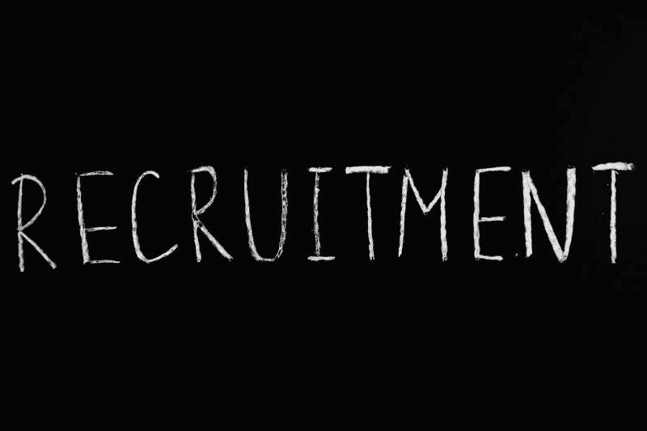

# Paychex 赚钱了吗？—市场疯人院

> 原文：<https://medium.datadriveninvestor.com/is-paychex-making-money-market-mad-house-d3b5e9f71c7a?source=collection_archive---------29----------------------->

人力资源外包公司 Paychex Inc. (NASDAQ: PAYX) 受益于冠状病毒疫情。

投资者认为 Paychex 的业务可能会因为疫情而增长。2021 年 1 月 68 日，市场先生以 92.14 美元的价格购买了 **Paychex (PAYX)** 股票。Paychex 的股价从 2020 年 1 月 6 日的 84.81 美元上涨。

我怀疑投资者认为 Paychex 会增长，因为冠状病毒导致更多员工在家工作。解释一下，雇主需要外包，因为他们办公室里没有人力资源人员。然而，他们的劳动力比以往任何时候都更加分散。

# Paychex 赚钱更少

相反，Paychex 的收入、利润和收入在 2020 年下降。为了解释这一点， **Paychex (PAYX)** 从 2020 年 2 月 29 日开始，其季度收入为 11.42 亿美元。

2020 年 11 月 30 日，季度收入降至 9.837 亿美元。同样，Paychex 的季度毛利从 2020 年 2 月 29 日的 8.024 亿美元降至 2020 年 11 月 30 日的 6.638 亿美元。

最后，Paychex 的季度营业收入从 2020 年 2 月 29 日的 4.7010 亿美元降至 2020 年 11 月 30 日的 3.5430 亿美元。因此，Paychex 的收入和收益在疫情期间下降。

同样，Stockrow 估计 Paychex 的[收入增长率在截至 2020 年 5 月 31 日的季度下降了-6.63%](https://stockrow.com/PAYX/financials/income/quarterly) 。季度收入增长率在 2020 年 8 月 31 日降至-6.03%，在 2020 年 11 月 30 日降至-0.71%。

# 疫情期间，Paychex 的业务萎缩

财务数据显示，疫情期间，Paychex 的业务出现萎缩。然而，该业务在 2020 年晚些时候再次增长。例如，Paychex 的收入从 2020 年 5 月 31 日的 9.15 亿美元增长到 2020 年 11 月 30 日的 9.837 亿美元。

同样，Paychex 的季度运营现金流从 2020 年 2 月 29 日的 4.881 亿美元降至 2020 年 11 月 30 日的 2.157 亿美元。因此，Paychex 的季度运营现金流下降了一半。

此外，Paychex 的季度期末现金流从 2020 年 2 月 29 日的 6.525 亿美元降至 2020 年 11 月 30 日的-1.18 亿美元。然而，Paychex 的季度运营现金流在 2020 年 8 月 31 日上升至 12.56 亿美元。

最后，Paychex 的总资产从 2020 年 2 月 29 日的 94.66 亿美元降至 2020 年 11 月 30 日的 86.15 亿美元。因此，Paychex 现在的业务规模比疫情成立之初要小。

# Paychex 赚钱吗？

有趣的是， **Paychex(纳斯达克代码:PAYX)** 在疫情期间赚了一些钱。

例如，Paychex 在 2020 年 2 月 29 日报告了 9.131 亿美元的现金和短期投资。2020 年 11 月 30 日，这一数字升至 927.40 美元。

此外，Paychex 在 2020 年没有报告任何运营亏损。具体来说，Paychex 报告 2020 年 2 月 29 日的季度营业收入为 4.701 亿美元。这一数字在 2020 年 5 月 31 日降至 2.996 亿美元，在 2020 年 8 月 31 日降至 2.84 亿美元。然而，2020 年 11 月 30 日，季度营业收入增至 3.543 亿美元。

# 佩克斯疫情有抵抗力吗？

我认为这些数字表明，Paychex (PAYX) 可能会有一项抵制疫情的业务。

解释一下， [Paychex 提供组织保持运营所需的服务](https://www.paychex.com/)——即使在疫情期间。Paychex 提供的服务包括薪资服务、人力资源服务、商业保险、员工福利和考勤记录。

组织需要支付员工工资，提供福利和保险，并在疫情期间记录时间。但是，冠状病毒可以关闭总部和人力资源部门。因此，更多的组织需要将人力资源外包给像 Paychex 这样的公司。

在家工作的人仍然需要薪水，在家工作的人仍然想要健康保险。因此，Paychex 可以在疫情期间增长。

这对 Paychex 来说可能是个好消息，因为疫情正在恶化。例如，世界计量机构估计[在 2020 年 1 月 8 日，美国有 205824 例新的冠状病毒病例](https://marketmadhouse.com/is-paychex-making-money/there%20were%20205,824%20fresh%20cases)。因此，尽管有疫苗，疫情仍在增长。

# Paychex 是好股票吗？

我不认为 Paychex (PAYX)每股价值 92.14 美元，因为它的收入缩水了。

然而，Paychex 有一些吸引人的功能，包括 62₵季度股息，上次支付是在 2020 年 10 月 30 日。总体而言，Paychex 在 2020 年 1 月 6 日提供了 2.48 美元的年化股息和 2.74%的股息收益率。因此，我认为 Paychex 是一个有吸引力的股息股票。

如果你在寻找一只具有安全边际的廉价金融服务股票，那会有回报。 **Paychex (NASDAQ: PAYX)** 值得研究。

*原载于 2021 年 1 月 8 日 https://marketmadhouse.com***。**