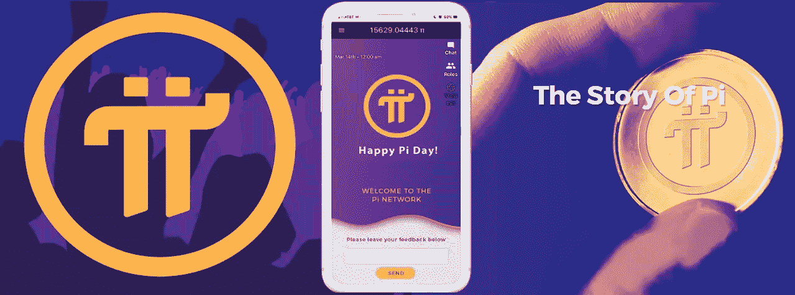

# Pi 网络是加密货币的未来吗？

> 原文：<https://medium.datadriveninvestor.com/is-pi-network-the-future-of-cryptocurrency-5a4fdaa577c2?source=collection_archive---------0----------------------->

在这个现代世界，技术在我们日常生活中的使用越来越多，这让我们总是想寻找更好的选择。加密货币是货币进化的下一个自然步骤。我们已经看到了比特币对世界的影响，以及其他更小的硬币。他们正在彻底改变我们每天生活的世界，即使是一点一点地改变。接受新技术的新用户推动我们走向更美好的世界。圆周率是第一种面向普通人的数字货币，代表着加密货币在全球范围内的应用向前迈出了一大步。他们的使命是“建立一个由普通人安全操作的加密货币和智能合约平台。”

我坚信“金钱越自由，人民越自由”这句话。同样的概念也适用于圆周率。他们想让它成为世界上最自由的加密货币，让每一个拥有智能手机的人都能使用。这是一个巨大的新闻，因为现在我们已经看到，世界上主要的密码是在大型工厂用 ASIC 设备制造的。这限制了硬币的可用性，并使普通用户更难接触到它。

硬币的开发者创造了一种新的算法来验证交易，称为恒星共识协议。(SCP)是由斯坦福大学计算机科学教授 David Mazieres 设计的，他也是恒星发展基金会的首席科学家。 SCP 使用一种称为联邦拜占庭协议的机制来确保恒星区块链上的更新准确可靠。

# 作为 Pi 挖掘者，Pi 用户可以扮演四种角色。

Pi 网络还没有到达 Mainnet，所以当那发生的时候一些特性可能会改变。现在第二阶段已经展开，开发者有机会将 Pi 添加到他们的程序中。我一直在使用网络的每个角色，有些角色可能会改变，例如节点。在我写这篇文章的时候，它不会因为你所做的服务而奖励你 Pi，但是，开发者会考虑这些数据，到时候会做出改变。

*   **先锋**。Pi 移动应用程序的用户每天都在确认他们不是“机器人”。该用户每次登录应用程序时都会验证其存在。他们还可以打开应用程序请求交易(例如，用 Pi 向在第二阶段添加的另一个先锋付款)
*   **撰稿人**。Pi 移动应用程序的用户通过提供他或她认识和信任的先驱列表来做出贡献。总的来说，Pi 贡献者将构建一个全局信任图。
*   **大使**。Pi 移动应用程序的用户正在将其他用户引入 Pi 网络。
*   **节点**。用户是使用 Pi 移动应用程序的先驱和贡献者，并且还在其台式机或笔记本电脑上运行 Pi node 软件。Pi 节点软件是运行核心 SCP 算法的软件，考虑了贡献者提供的信任图信息。

# 工作证明 vs 恒星共识协议

所有的比特币节点都在相互竞争解决一个密码难题。因为解决方案是随机找到的，所以首先找到解决方案的节点会被选举为产生下一个块的一轮的领导者。这种算法被称为“工作证明”,会导致大量的能量消耗。

Pi 使用另一种类型的一致性算法，并基于 Stellar Consensus Protocol (SCP)和一种称为联邦拜占庭协议(FBA)的算法。这种算法没有能量浪费，但它们需要交换许多网络消息，以便节点就下一个块应该是什么达成“共识”。每个节点可以基于加密签名和交易历史独立地确定交易是否有效，例如进行转移和重复消费的权限。然而，对于计算机网络来说，要就在块中记录哪些事务以及这些事务和块的顺序达成一致，它们需要相互发送消息并进行多轮投票以达成共识。

对 BFT 系统的一个批评是，它有一个集中点，因为涉及到投票，参与投票的一组节点“法定人数”是由系统的创造者在开始时确定的。SCP 节点通过保证网络中的其他节点可信来保护共享记录，而不是像比特币的工作证明共识算法那样消耗能量。网络中的每个节点构建一个法定切片，由网络中它们认为可信的其他节点组成。

# Pi 采矿评论

我已经使用他们的应用程序一个多月了，在我使用这个设备的过程中，我没有发现任何缺点。我继续把手机作为我工作甚至玩游戏的主要场所，我甚至没有注意到性能、电池消耗或网络速度有什么不同。你只需要记得在 24 小时结束时按下按钮开始采矿。该应用程序也不会向您发送垃圾通知或任何东西，只是坐在那里为您生成 PI。郑重声明，我有一部三星 Galaxy A70。

你获得的团队越大，你得到的奖励就越多，所以如果你们中的任何人有兴趣加入我，跳到未来，这是我的邀请码:FuturaGuy