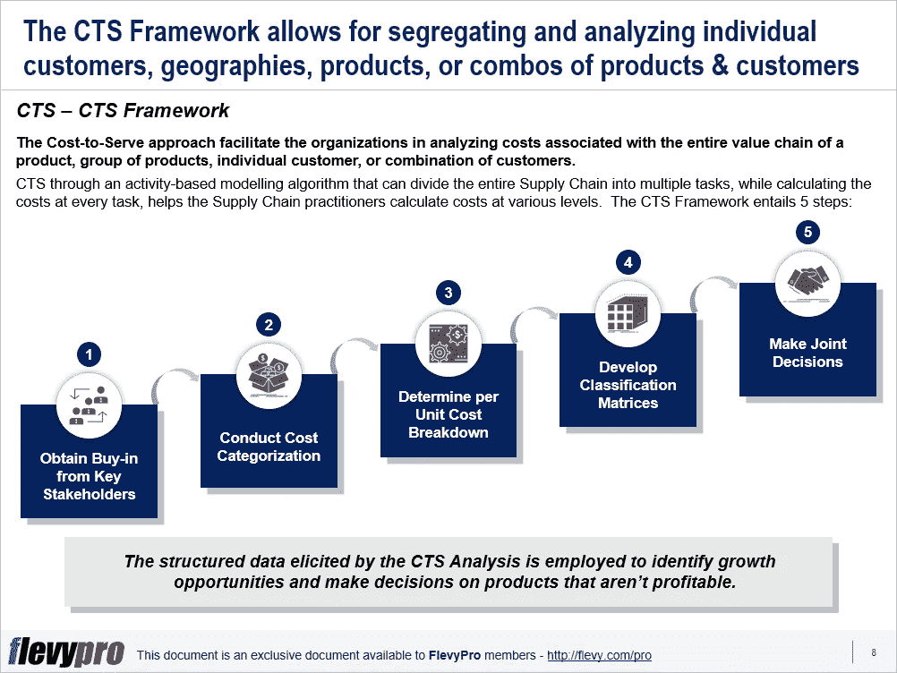

# “利润泄露”在您的组织中是一个持续的问题吗？使用服务成本(CTS)分析来防止它们

> 原文：<https://medium.datadriveninvestor.com/is-profit-leaks-a-consistent-issue-in-your-organization-8bfe7df38a34?source=collection_archive---------16----------------------->

[供应链管理](https://flevy.com/browse/stream/supply-chain)由于技术的发展，各行各业都在快速变革。通过实施技术系统，供应链组织渴望消除浪费，以合理的成本满足客户的需求，并确保盈利。[企业资源规划](https://flevy.com/business-toolkit/enterprise-resource-planning)系统有助于在聚合级别处理非结构化数据。然而，在工作流程或微观层面，通过企业资源规划系统产生的数据需要进一步细化，以了解成本。

供应链专家需要查看他们的非结构化数据，并了解提供产品的成本；知道他们应该推广哪种产品组合；并评估服务水平对运输成本、利润和定价策略的影响。

供应链管理人员可以使用[服务成本(CTS)分析](https://flevy.com/browse/flevypro/cost-to-serve-cts-analysis-5395)方法来控制分销成本，识别负利润产品，并防止利润流失。CTS 分析为组织提供了在产品和客户层面确定服务客户的总成本的方法，包括产品价值链(从原材料到交付)中的所有成本。该方法帮助领导者划分和评估单个客户、地理位置、产品、产品系列或产品/客户的组合。

可以进行服务成本分析，以确定与供应链、物流、配送、仓储或运输相关的成本。CTSA 将间接成本分配给产品——间接成本或固定成本，这些成本不容易直接归属于一个订单、一批货物或一项活动。

[成本核算](https://flevy.com/business-toolkit/costing)的 CTS 模型需要对流程中所有增值和非增值活动进行详细建模。这种方法在确定“假设”预算时比其他方法更精确，因为它考虑了所有活动，并将它们与相关的成本库联系起来。CTS 采用一种基于活动的建模算法——将整个供应链分成多个任务，同时计算每个任务的成本——来帮助供应链从业者计算各个层面的成本。

CTS 框架包含 5 个基本步骤:

1.  **获得关键利益相关方的认可**
2.  **进行成本分类**
3.  **确定单位成本明细**
4.  **开发分类矩阵**
5.  **共同决策**

让我们更深入地研究 CTS 框架的前两个步骤。

# 1.获得关键利益相关方的认可

实施服务成本框架的第一步包括达成全面协议和利益相关方的认可。计算服务成本对收入的影响的决策需要公司多个部门的参与和协作。多个成本中心在整个价值链中合作，因此损益责任不能归属于某个特定的单位。

例如，削减服务一个客户(或各种客户)的成本的决策必须得到以下利益相关者的同意:

*   销售和市场部计算服务水平协议的影响。
*   计算成本影响的物流功能。
*   [走向市场战略](https://flevy.com/business-toolkit/go-to-market)，以确保与[公司战略](https://flevy.com/browse/stream/strategy-development)保持一致。
*   仓储单位，以确保资源规划和分配。

# 2.进行成本分类

服务成本框架的第二步涉及与整个供应链相关的成本分类。供应链通常有不同的成本中心(或功能):例如，采购、制造、仓储和物流。这些成本中心还有多个流程，这些流程都有相关的成本。CTS 要求在流程和活动级别自上而下地估计成本，然后将这些成本汇总回成本中心级别。

这种对供应链各种功能及其相关流程的成本分类有助于在微观层面上进行精确计算和估算。

有兴趣进一步了解服务成本框架的其他步骤吗？您可以在 [Flevy 文档市场](https://flevy.com/browse)上的处下载[一份关于服务成本分析的可编辑 PowerPoint 演示文稿。](https://flevy.com/browse/flevypro/cost-to-serve-cts-analysis-5395)

## 你在这个框架中找到价值了吗？

您可以从 [FlevyPro 库](https://flevy.com/pro/library)下载关于这个和数百个类似业务框架的深入介绍。 [FlevyPro](https://flevy.com/pro) 受到 1000 名管理顾问和企业高管的信任和使用。有些人不得不说:

> “我的 FlevyPro 订阅为我提供了当今市场上最受欢迎的框架和平台。它们不仅增加了我现有的咨询和辅导产品和服务，还让我跟上了最新的趋势，为我的实践激发了新产品和服务，并以其他解决方案的一小部分时间和金钱教育了我。我强烈推荐 FlevyPro 给任何认真对待成功的顾问。”

–战略商业建筑师事务所创始人比尔·布兰森

> “作为一家利基战略咨询公司，Flevy 和 FlevyPro 框架和文件是一个持续的参考，有助于我们为客户构建我们的调查结果和建议，并提高他们的清晰度、力度和视觉效果。对我们来说，这是增加我们影响力和价值的宝贵资源。”

–Cynertia Consulting 的咨询区域经理 David Coloma

> “作为一个小企业主，FlevyPro 提供的资源材料已被证明是非常宝贵的。根据我们的项目事件和客户要求按需搜索材料的能力对我来说很棒，并证明对我的客户非常有益。重要的是，能够针对特定目的轻松编辑和定制材料有助于我们进行演示、知识共享和工具包开发，这是整个计划宣传材料的一部分。虽然 FlevyPro 包含任何咨询、项目或交付公司都必须拥有的资源材料，但它是小公司或独立顾问工具箱中必不可少的一部分。”

–变革战略(英国)董事总经理迈克尔·达夫

> “作为一名独立的成长顾问，FlevyPro 对我来说是一个很好的资源，可以访问大量的演示知识库来支持我与客户的合作。就投资回报而言，我从下载的第一个演示文稿中获得的价值是我订阅费用的好几倍！这些资料的质量让我能够打出超出自己体重的水平，这就像是用很小一部分开销就能获得四大咨询公司的资源一样。”

–Roderick Cameron，SGFE 有限公司的创始合伙人

> “我每个月都会浏览几次 FlevyPro，寻找与我面临的工作挑战相关的演示文稿(我是一名顾问)。当主题需要时，我会进一步探索，并从 Flevy 市场购买。在所有场合，我都阅读它们，分析它们。我采纳与我的工作最相关和最适用的想法；当然，所有这些都转化为我和我的客户的利益。"

量子 SFE 公司首席执行官奥马尔·埃尔南·蒙特斯·帕拉

在 [**管理和企业咨询**](https://app.ddichat.com/category/management-and-corporate-consulting) **:** 中安排一个 DDIChat 会话

 [## 专家-管理和企业咨询- DDIChat

### DDIChat 允许个人和企业直接与主题专家交流。它使咨询变得快速…

app.ddichat.com](https://app.ddichat.com/category/management-and-corporate-consulting) 

在此申请成为 DDIChat 专家[。
与 DDI 合作:](https://app.ddichat.com/expertsignup)[https://datadriveninvestor.com/collaborate](https://datadriveninvestor.com/collaborate)在此订阅 DDIntel [。](https://ddintel.datadriveninvestor.com/)