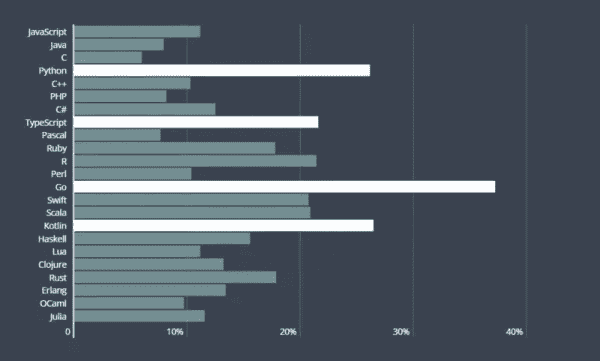

# Python 是过去式吗？Golang 是未来吗？Python vs Go 2023

> 原文：<https://medium.datadriveninvestor.com/is-python-past-tense-is-golang-the-future-python-vs-go-2020-98af0b4311f8?source=collection_archive---------1----------------------->

Go 诞生于 Google，由 Rob Pike、Ken Thompson 和 Robert Griesemer 编写。由于其受欢迎程度，Go 从诞生之初就吸引了众多开发者的关注。

自 10 年前诞生以来，出现了许多基于围棋的应用。不久前，知乎抛弃 python，用 go 重建推荐系统。前谷歌员工杰克·威尔逊(Jake wilson)认为，与人们熟悉的 Python 相比，Go 语言有很多好的特性，在很多情况下可以取代 Python。对于很多任务，他都是用 Go 代替 Python。那么围棋的独特魅力是什么呢？什么比 Python 好？让我们一起来了解。

# 程序员想在 2023 年学会的编程语言:

## **围棋语言:**

对于一门只有十年历史的新语言来说，围棋正在快速进化。作为容器行业的把手，Docker 是用 Go 编写的，很多顶尖的科技公司都广泛使用 Go。最近，Hackrank 发起了一项关于程序员技能的社区调查，涉及 100 多个国家的 7 万多名开发人员。调查结果显示，2019 年，程序员最想学习的三种编程语言分别是 Go、Kotlin、Python。围棋排名第一，占比 37.2%。

 [## 创建折衷书架的程序员指南|数据驱动的投资者

### 每个开发者都应该有一个书架。他的内阁中可能的文本集合是无数的，但不是每一个集合…

www.datadriveninvestor.com](https://www.datadriveninvestor.com/2019/03/25/a-programmers-guide-to-creating-an-eclectic-bookshelf/) 

但是，20 年的时间，无疑难以撼动 Java 在编程界常青树的地位。来自 HackerRank 的数据显示，2018 年，Java 仍然排名第二，在最受欢迎的编程语言开发者中，Python 排名第四，Go 排名第 13，与 JavaScript # 1 还有很大差距。
但对我来说，围棋虽然“年轻”，但已经具备了很多优秀的特性。
围棋有什么了不起的？
对于许多任务，我已经用 Go 代替了 Python，仅举几个例子:

**处理存储在 S3 上的云日志**

在 S3 上的存储桶和/或区域之间移动太字节大小的文件
匹配 S3 上的本地数据库记录和文件，以确保文件同步

这些任务大多是一次性的，所以使用脚本语言操作会更合适。这些任务需要快速编程，代码通常在使用一次后就被丢弃。一般来说，这类任务的需求相对较新，而且比较专业，它们的代码很少需要重用。下面介绍一下为什么可以用 Go 语言代替 Python 来完成这个任务。

## 有编译器很方便

我写 Python 的时候经常犯非常低级的错误。我会错误地命名变量或函数，或者给它们传递错误的参数。这些错误中的一些可以通过调试工具找到，但是这些工具通常需要特殊的设置。我从来没有能够轻松地配置 pylint，我也不喜欢使用配置起来更麻烦的笨重的 ide。最坏的情况下，你可能会不小心把变量名打错了，不太好找。在遇到这个错误之前，您的脚本可能会运行几个小时，然后一切都崩溃了，您必须从头开始再次运行脚本。这些错误大部分可以通过单元测试检测出来，但是单元测试很少覆盖 100%的代码，我不想浪费时间为一个只有一次的脚本编写单元测试。带有编译器的语言可以解决所有这些问题。编译器可以检测出你犯的所有低级错误。由于这个原因，当我写数百行代码时，我倾向于使用像 Go 这样的语言。

# **发展速度**

但是需要编译的语言有一个缺点就是你的开发速度一般会降低。这在 C / C ++和 Java 等语言中尤为明显。Go 是一门非常简单的语言，我发现它的开发速度并没有被放慢多少。不要误会，我不是说比 Python 快，而是想说 Go 比 Python 慢不了多少，用 Python 一般达到 85%的开发速度就可以了。相对于编译器可以避免的低级错误，我认为牺牲 15%的开发速度是值得的。

# 更好的并行性

你可能已经知道，Go 语言是为并行而生的。在我的团队中，我经常需要并行程序，因为我们想在 S3 上操作数据库中的大量数据。如果任务是 IO 密集型的(事实上很多任务都是)，我们可以很容易地部署 Python 线程。但是如果任务是 CPU 密集型的，Python 就不那么方便了，因为全局解释器锁的存在。我真的很喜欢 Go 语言中的简单代码可以不加修改直接多线程运行。不知道大家在 Python 中有没有遇到过这样的问题:直接复制粘贴多线程代码根本不行。这在围棋中不是问题。

# **简单部署**

我个人更喜欢将所有的依赖项保存在一个二进制文件中。我经常在 EC2 服务器上运行我自己的脚本，使环境更接近我们在 S3 的服务器。如果使用 Python，我需要确保服务器上安装了所有需要的包，我的同事不能在服务器上安装任何可能导致冲突的包。虚拟环境可以解决大多数问题，但我仍然发现使用 Go 更方便。我一般在 Mac 和 Linux 上交叉编译我的代码，复制到远程服务器，然后让它运行。我的代码所需的所有依赖项都在一个二进制文件中。

# **一贯风格**

一开始 Go 的格式化工具 gofmt 让我哭了，尤其是它需要 tab 而不是空格来缩进的时候。我觉得这太痛苦了。但是过了一段时间，我就开始“真香”了。当我写代码时，我可以用一种格式做任何事情。格式化工具将帮助我做所有的事情。我所有的代码风格都是一致的，即使我正在编写不同的项目。这是因为格式化是标准 Go 工具的一个特性。但如果我想在 Python 中实现这一点，我必须努力。我需要正确配置 pylint 工具，并确保它在每个项目中都得到使用。

# **更便捷的工具**

Gofmt 只是众多 Go 工具中的一个小例子。我喜欢使用的所有编辑器——vs code、vim、Sublime Text，都有针对 Go 语言的相应扩展，让我可以轻松享受 Go 工具的优势。这样，我可以在不实际使用 IDE 的情况下获得编写 Java 时的智能体验。我在使用 Python 时从未有过这种体验

围棋和 Python 你更喜欢谁？