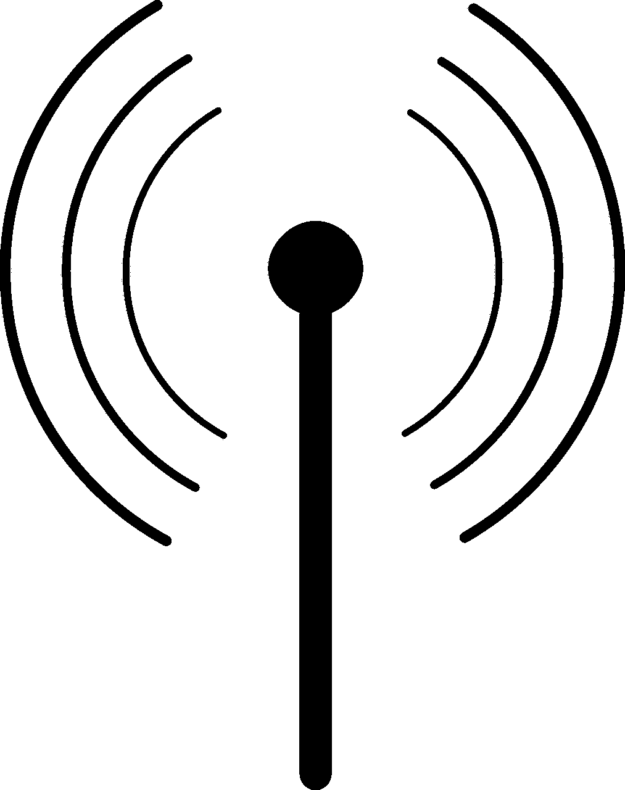
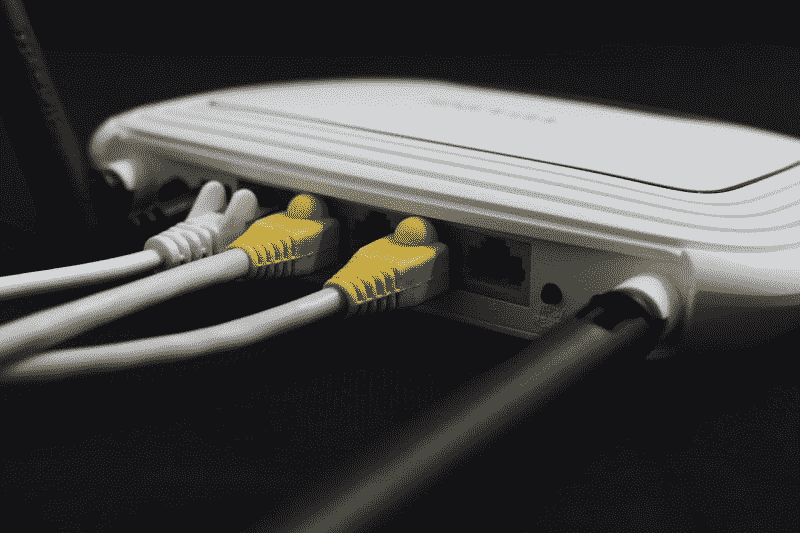
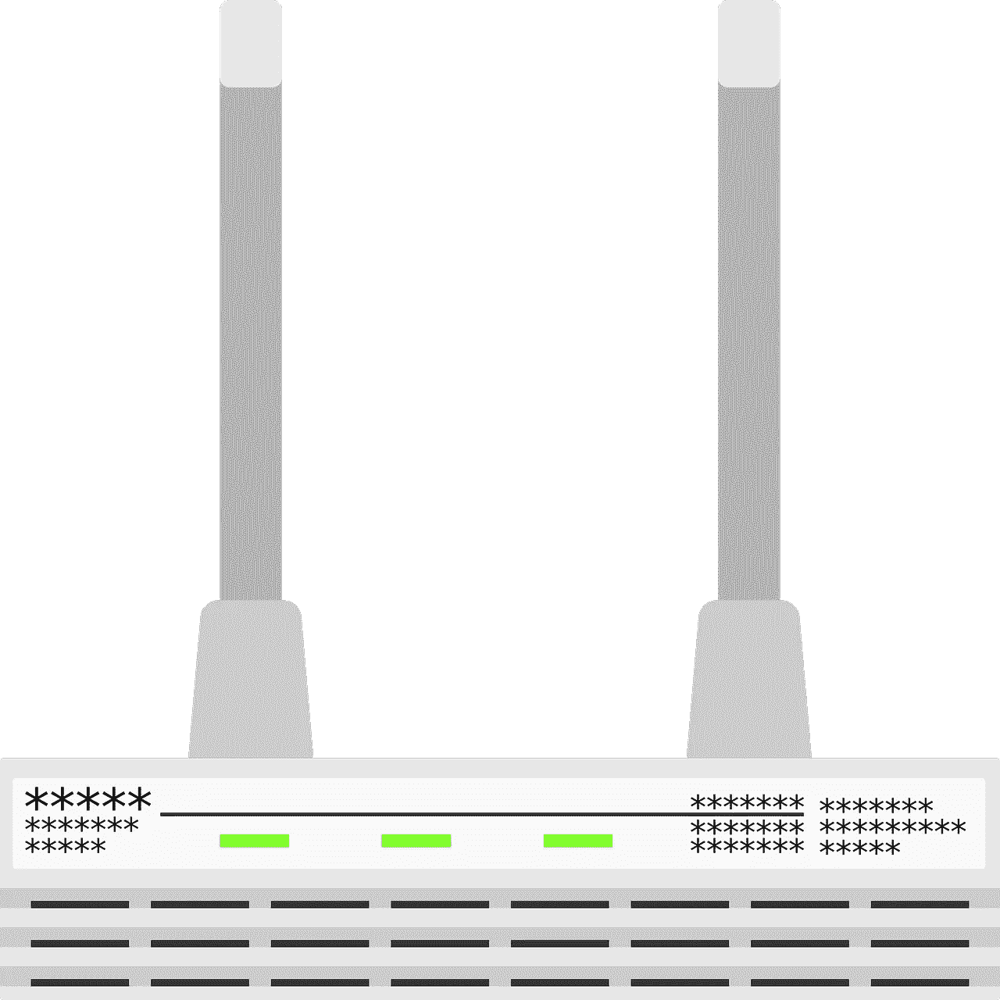
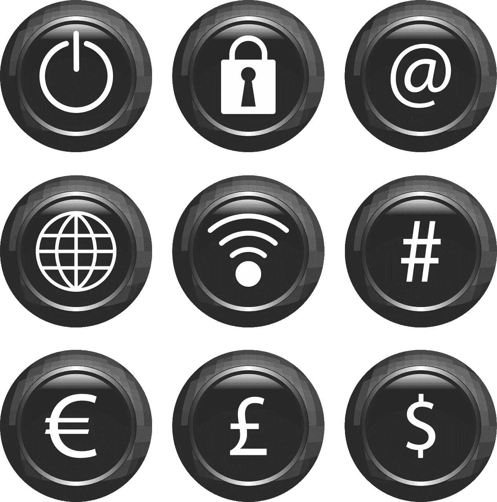

# Qorvo 靠 Wi-Fi 赚钱吗？—市场疯人院

> 原文：<https://medium.datadriveninvestor.com/is-qorvo-making-money-from-wi-fi-market-mad-house-a02d3527f2c1?source=collection_archive---------16----------------------->

Qorvo Inc. (NASDAQ: QRVO) 由于 Wi-Fi 令人难以置信的普及，它可能成为一只成长股。Wi-Fi 连接；通过无线信号连接设备的技术是 Qorvo 的专长。

例如，美国消费者新闻与商业频道[估计](https://www.cnbc.com/2019/06/27/what-is-wi-fi-6.html)地球上每个人可能有 6.68 个网络连接(Wi-Fi)设备。此外，美国消费者新闻与商业频道估计世界上可能有近 5000 万台无线设备。

由于 5G 和 6G 无线系统以及物联网(IoT)，Wi-Fi 越来越受欢迎。物联网通过 Wi-Fi 将物理设备连接到互联网并相互连接。自动驾驶汽车、智能电器、智能恒温器、无人机和机器人都依赖于物联网来运行。

# Qorvo 如何利用物联网赚钱

Qorvo 为物联网提供基础设施。例如，其[产品阵容](https://www.qorvo.com/innovation/wi-fi)包括放大器、物联网控制器、集成产品、变频器和信号源以及开关。

Qorvo bandBoost 系统为家庭提供高速 5G 无线连接。相比之下，Qorvo coexBootst 为家庭或企业中的每台设备提供高速 5G 无线连接。同时，Qorvo EdgeBoost 可在您的室内和室外提供 Wi-Fi。

Qurvo 的分布式 Wi-Fi 系统可让您将家中的每个房间都变成 Wi-Fi 热点。因此，你可以在任何地方通过蓝牙耳机收听你最喜欢的播客。

 [## 在自动驾驶汽车发生事故的情况下，谁应该承担法律责任？数据驱动的投资者

### 我仍然认为自动驾驶汽车是一种奢侈品，而不是必需品…

www.datadriveninvestor.com](https://www.datadriveninvestor.com/2018/11/02/who-is-legally-accountable-in-the-case-of-an-autonomous-vehicle-accident/) 

对于业务，Qurvo 根据公司的需求定制客户驻地设备(CPE)和企业系统。Qurvo 可以创建一个企业系统来支持一个零售商在商场上的无线支付系统。因此，顾客可以在商店的任何地方通过 Apple Pay 或 Google Pay 支付。

# Qorvo 赚钱吗？

目前，Qorvo 正在从无线业务中赚钱。Qorvo 于 2019 年 9 月 30 日报告季度毛利为 3.2358 亿美元，季度收入为 8.067 亿美元。

然而，Qorvo 的季度毛利和季度收入分别从 2018 年 9 月 30 日的 3.5351 亿美元和 8.8444 亿美元下降。另一方面，截至 2019 年 6 月 30 日，本季度毛利和收入分别为 2.9429 亿美元和 7.756 亿美元。

Qorvo 很难维持其收入和毛利。然而，Qorvo 正从其业务中获得更多收入。

例如，Qorvo 于 2019 年 9 月 30 日报告了 1.1277 亿美元的季度营业收入。这一数字高于 2019 年 6 月 30 日的 5523 万美元和 2018 年 9 月 30 日的 9048 万美元。

此外，Qorvo 报告的季度共同净收入为 8304 万美元。这一数字从 2019 年 6 月 30 日的 3954 万美元和 2018 年 9 月 30 日的 3208 万美元有所增加。

# Qorvo 产生了多少现金？

Qorvo 的业务产生的现金很少。例如，Qorvo 在 2019 年 9 月 30 日报告了负的期末现金流-4271 万美元。这一数字低于 2019 年 6 月 30 日的 6.2995 亿美元。

此外，Qorvo 的经营现金流从 2019 年 6 月 30 日的 2.5712 亿美元下降至 2019 年 9 月 30 日的 1.7341 亿美元。因此，Qovoro 产生的现金较少。

因此，Qorvo 在 2019 年 9 月 30 日拥有 5.8679 亿美元的现金和短期投资。这一数字低于 2019 年 6 月 30 日的 6.296 亿美元。

# Qorvo 是成长股吗？

在截至 2019 年 6 月 30 日的季度，Qorvo 的收入大幅萎缩。

Stockrow [报道](https://stockrow.com/QRVO/financials/income/quarterly) Qorvo 的收入在该季度以 8.79%的速度增长。相比之下，截至 2019 年 9 月 30 日的季度，这些收入的增长率为 11.97%。

因此，我认为 Qorovo 可能不是成长股。在这种情况下，我认为市场先生在 2020 年 1 月 28 日高估了 qo rvo 113.56 美元的价格。依我看，那个价格太高了。

# Qorvo 是收益股吗？

我认为 **Qorvo(纽约证券交易所代码:QRVO)** 是一只糟糕的股票，因为它不支付股息。因此，它没有安全边际，也没有收入。

我相信 Qorvo 太贵了，不是一个好的投机股票。因此，我认为投资者需要回避 Qorvo，直到它支付股息或表现出更大的增长。

*原载于 2020 年 1 月 28 日 https://marketmadhouse.com***。**