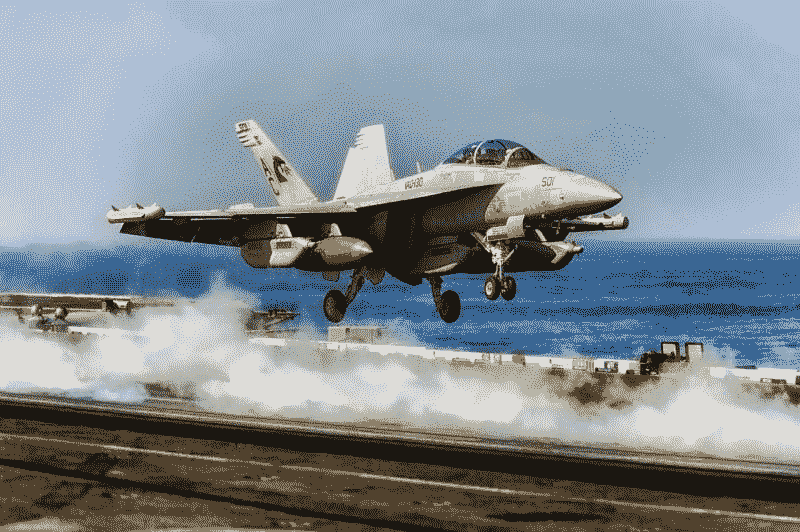

# 雷神赚钱了吗？—市场疯人院

> 原文：<https://medium.datadriveninvestor.com/is-raytheon-making-money-market-mad-house-cc505ee49479?source=collection_archive---------18----------------------->

随着战争阴云在中东聚集，许多人都在问国防承包商，如雷神公司(纽约证券交易所代码:RTN) 是否在赚钱。

*今日美国* [标签](https://www.usatoday.com/story/money/2019/02/21/military-spending-defense-contractors-profiting-from-war-weapons-sales/39092315/)雷神公司 2018 年以 239 亿美元的军售价值成为世界第三大国防承包商。我认为雷神可以从一场中东战争中获利，因为它的产品线。

 [## 数据驱动投资的兴起|数据驱动投资者

### 当 JCPenney 报告其 2015 年 2Q 的财务结果时，市场感到非常震惊。美国零售巨头…

www.datadriveninvestor.com](https://www.datadriveninvestor.com/2019/02/28/the-rise-of-data-driven-investing/) 

解释一下，如果美国和伊朗打一场战争，他们将使用的主要武器是导弹和无人机。雷声公司的主要产品包括雷达、导弹拦截器、空对地导弹、地对空导弹、制导导弹和地对地导弹。

# 雷神公司将为下一场战争制造武器

值得注意的是，伊朗对少将·少将·卡西姆·索莱曼尼遇刺事件的第一次重大回应是 2020 年 1 月 8 日对驻伊美军基地的导弹袭击。因此，雷神公司制造了战争的首选武器以及针对这些武器的防御系统。

此外，雷神公司还制造各种部队在战场上使用的电子设备。[回旋镖 III](https://www.raytheon.com/capabilities/products/boomerang)；例如，是一种用于敌方狙击手的车载跟踪系统。此外，[回旋镖战士-X](https://www.raytheon.com/capabilities/products/boomerang_warriorx) 是一个可穿戴式射手检测系统，适用于战场上的个人射手。

重要的是，雷神[建造](https://www.raytheon.com/capabilities/products/counter-uas)防御无人机。最近的事件，如索莱马尼将军遇刺，表明无人机将是下一场战争的主要武器。例如，2019 年 9 月 14 日，胡塞武装无人机严重损坏了沙特的两个主要设施。

# 雷神公司如何从无人机战争中获利

《纽约时报》 [称](https://www.nytimes.com/2019/09/14/world/middleeast/saudi-arabia-refineries-drone-attack.html)伊朗伊斯兰革命卫队一直在训练其中东盟友使用无人机。因此，如果美国军队想在中东作战，他们将需要针对无人机的防御。

雷声公司声称其毒刺地对空导弹可以摧毁无人机。此外，雷神公司的[郊狼](https://www.raytheon.com/capabilities/products/coyote)是一种小型的、管射无人机，士兵可以在战场上开火。例如，坦克、突击队或步兵可以用郊狼干掉狙击手或敌人的炮兵。

此外，郊狼可以与敌人的无人机缠斗。因此，郊狼可以成为陆军反无人机防御的首选。记住一句老话，最好的进攻就是好的进攻。郊狼是一种攻击敌人无人机的进攻性武器。

无人驾驶飞机，如郊狼，在现代战争中可能变得像战斗机在二战中一样重要。记住，战斗机，比如[超级海上喷火](https://en.wikipedia.org/wiki/Supermarine_Spitfire)，赢得了英国[战役](https://marketmadhouse.com/two-disruptive-battles-that-changed-history/)。在战争后期，P-51 野马战斗机摧毁了德国空军的战斗机，使得德国的失败成为可能。

雷神公司还制造了第二种无人机，他们称之为银狐。我认为雷神公司可以从无人机战争中获利，因为它制造无人机和探测无人机的雷达。

# 雷神赚钱了吗？

**雷神公司(NYSE: RTN)** 正在赚钱。例如，雷神公司报告截至 2019 年 9 月 30 日的季度毛利为 19.47 亿美元。

此外，雷神公司报告称，截至 2019 年 9 月 30 日的季度收入为 74.46 亿美元，季度净收入为 8.6 亿美元。此外，雷神公司同期的营业收入为 10.36 亿美元。

此外，雷神公司的季度毛利从 2019 年 6 月 30 日的 52.05 亿美元增长到 2019 年 9 月 30 日的 54.99 亿美元。因此，雷神公司从无人机战争中赚了更多的钱。

此外，雷神公司报告 2019 年 9 月 30 日的运营现金流为 12.77 亿美元，期末现金流为 4.76 亿美元。因此，雷神公司在 2019 年 9 月 30 日拥有 26.46 亿美元的现金和短期投资。

# 雷神是价值投资吗？

我认为雷神公司(NYSE: RTN) 被高估了，因为其股票在 2020 年 1 月 14 日的交易价格是 227.40 美元。在我看来，雷神每股价值不超过 150 美元。

相比较而言，雷神是一只不错的分红股票。例如，雷神公司在 2020 年 1 月 7 日支付了 94.25₵季度股息。因此，我认为你可以从雷神公司赚钱，即使市场先生高估了 RTN。

总的来说，雷神公司在 2020 年 1 月 14 日提供的股息收益率为 1.73%，年化派息为 3.77 美元，派息率为 31.73%。令人印象深刻的是，[Dividend.com](https://www.dividend.com/dividend-stocks/industrial-goods/aerospace-defense-major-diversified/rtn-raytheon-co/)将 14 年的股息增长归功于雷神公司。

# 雷神是成长股吗？

在我的分析中，雷神是一只定价过高的股票，是一种很好的股息和收入投资。此外，中东最近的事件表明，雷神公司可能是一个成长型投资。

紧张、动荡和战争的可能性正在增加。与此同时，雷神公司制造了我认为将成为战争主导武器的无人机。

再加上雷神的主要客户，五角大楼有更多的钱可以花。*余额* [估计【2019 年 10 月 1 日至 2020 年 9 月 30 日财年，美国军费开支可能增长至 9.89 亿美元。*余额*估计 2018 至 2019 财年美国军费为 9565 亿美元。](https://www.thebalance.com/u-s-military-budget-components-challenges-growth-3306320)

可惜雷神是当今世界的成长股。因此，那些对无人机战争没有道德异议的人可以通过持有雷神公司的股票来赚钱。

*原载于 2020 年 1 月 14 日 https://marketmadhouse.com***。**