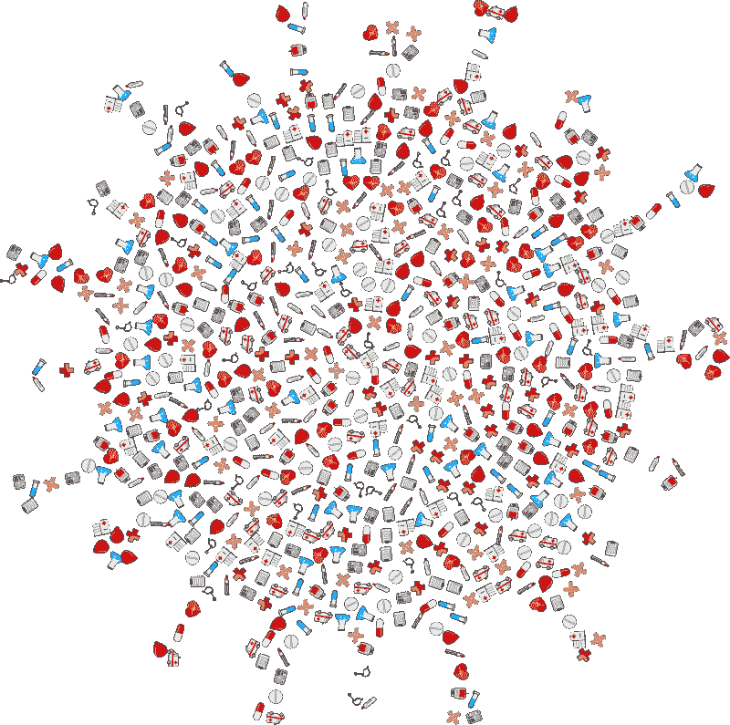
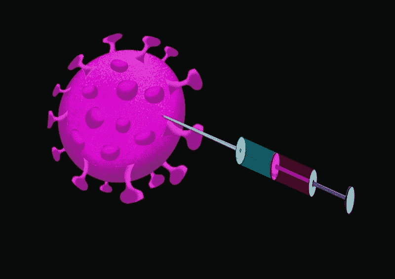
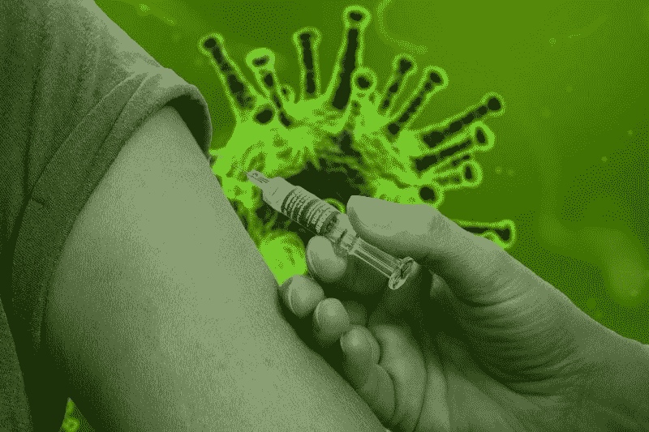
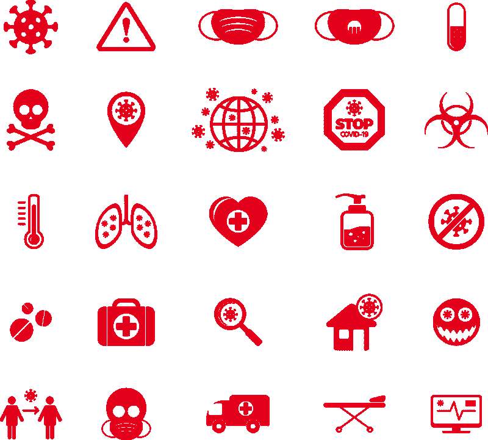

# Regeneron(纳斯达克代码:REGN)赚钱了吗？—市场疯人院

> 原文：<https://medium.datadriveninvestor.com/is-regeneron-nasdaq-regn-making-money-market-mad-house-1994359f17df?source=collection_archive---------16----------------------->

当医生用 Regeneron (NASDAQ: REGN) 的一种药物治疗总统时，命运给了它意想不到的帮助。

为了解释这一点，白宫声称唐纳德·川普总统(佛罗里达州共和党)接受了八克剂量的 regene Ron poyclonian 抗体鸡尾酒治疗冠状病毒[。*](https://www.technologyreview.com/2020/10/02/1009278/what-drug-treatments-will-president-trump-get/)[REGN-cov 2](https://www.regeneron.com/covid19)鸡尾酒模拟了一种强大的免疫反应，可以清除体内的冠状病毒，*麻省理工科技评论*报道。

麻省理工科技评论声称，鸡尾酒中的抗体类似于冠状病毒幸存者血液中的抗体。特朗普的医生希望 Regeneron 鸡尾酒可以重新编程总统的免疫系统，以摧毁冠状病毒。

# Regeneron 有冠状病毒治疗吗？

总统的悲剧提升了 Regeneron 的股价。市场先生于 2020 年 10 月 2 日为 **Regeneron (REGN)** 支付了 564.80 美元，于 2020 年 10 月 5 日为 REGN 支付了 610.70 美元。Regeneron 的股价在 2020 年 10 月 6 日跌至 581.64 美元。

特朗普于 2020 年 10 月 2 日前往沃尔特里德军事医疗中心接受冠状病毒治疗。10 月 5 日是特朗普住院后炒股的第一天。

Regeneron pharma ceuticals Inc .(NASDAQ:REGN)这一年过得很好。Market 先生于 2020 年 1 月 2 日为 Regeneron 支付了 373.35 美元，于 2020 年 10 月 5 日支付了 607 美元。2020 年 1 月 30 日，Regeneron 的股价跌至 336.18 美元。

有趣的是，*《今日美国》*声称特朗普在 2017 年财务披露表上列出了 Regeneron 股票的 5 万至 10 万美元资本利得。因此，特朗普本可以在 2016 年拥有 Regeneron 的股票。

此外，Regeneron 赢得了一份价值 4.5 亿美元的联邦合同，作为“曲速行动”的一部分，制造和分发 REGN-COV2，今日美国声称。“曲速行动”是美国政府开发冠状病毒疗法和疫苗的努力。

然而，美国食品和药物管理局(FDA)尚未批准 REGN-COV2 用于一般用途。美国食品和药物管理局给予特朗普的医生特别许可，用鸡尾酒治疗总统。

# Regeneron (REGN)赚钱吗？

与一些健康股冠状病毒助推不同，**regen Ron pharma ceuticals(REGN)**赚钱。

例如，Regeneron 在 2020 年 6 月 30 日报告了 6.564 亿美元的季度收入和 16.77 亿美元的季度毛利。此外，Regeneron 报告 2020 年 6 月 30 日的季度共同净收入为 8.97 亿美元。

Regeneron 赚了更多的钱。例如，Regeneron 的季度毛利从 2020 年 3 月 31 日的 16.11 亿美元。然而，季度毛利从 2019 年 12 月 31 日的 26.27 亿美元下降。

相比之下，季度营业收入从 2020 年 3 月 31 日的 7.001 亿美元和 2019 年 12 月 31 日的 6.751 亿美元下降。另一方面，Regeneron 的季度营业收入从 2019 年 6 月 30 日的 3.156 亿美元上升。

 [## 为什么我们投资 Totient，也就是人工智能如何帮助我们生产抗癌药物和 Covid | Data…

### 9 月 10 日，一家人工智能驱动的药物研发公司宣布与……建立关键合作伙伴关系，从此悄然出现

www.datadriveninvestor.com](https://www.datadriveninvestor.com/2020/09/13/why-we-invested-in-totient-aka-how-ai-can-help-us-produce-drugs-against-cancer-and-covid/) 

# regen Ron(REGN)产生多少现金？

Regeneron 也产生现金。例如，**regen oron(REGN)**报告 2020 年 6 月 30 日的季度运营现金流为 9.434 亿美元。

Regeneron 的季度运营现金流从 2019 年 6 月 30 日的 1.88 亿美元、2019 年 12 月 31 日的 7.874 亿美元和 2020 年 3 月 31 日的 6.98 亿美元增长。然而，Regeneron 报告称，截至 2020 年 6 月 30 日，季度末现金流为负-2.16 亿美元。

有趣的是，季度末现金流从 2020 年 3 月 31 日的 22.21 亿美元下降。季度期末现金流从 2020 年 12 月 31 日的 2.33 亿美元和 2019 年 6 月 30 日的-6.63 亿美元增长。

# Regeneron 产生现金

此外，Regeneron 报告称，截至 2020 年 6 月 30 日，季度投资现金流为 14.53 亿美元。季度投资现金流从 2020 年 3 月 31 日的-4.432 亿美元增长到 2019 年 6 月 30 日的-8.36 亿美元。

因此，Regeneron 可以产生大量的现金。此外，Regeneron 在 2020 年 6 月 30 日报告了 26.13 亿澳元的季度融资现金流。具体来说，我认为 Regeneron 在截至 2020 年 6 月 30 日的季度可能支付了 26.13 亿美元的债务。

因此，Regeneron 在 2020 年 6 月 30 日拥有 31.44 亿美元的现金和短期投资。这一数字从 2020 年 3 月 31 日的 40.03 亿美元和 2019 年 6 月 30 日的 26.7 亿美元下降。因此 Regeneron 产生了大量的现金。

# Regeneron (REGN)有什么值？

**Regeneron(纽约证券交易所代码:REGN)** 在 2020 年 6 月 30 日拥有 144.29 亿美元的总资产。因此，Regeneron 有一些价值，但是，我认为市场先生在 2020 年 10 月 5 日将 Regeneron 定价过高，为 607 美元，在 2020 年 10 月 6 日为 581.64 美元。

我认为市场先生高估了再生，因为它没有红利。然而，Regeneron 正在研发一些有趣的药物。特朗普的治疗表明，对这些药物可能会有一些需求。

Regeneron 的潜在有价值的药物包括正在进行四项晚期临床试验和两项住院冠状病毒治疗的 2/3 期试验。此外，英国国家医疗服务体系(NHS)正在英国对冠状病毒患者进行 REGN-COV2 的开放标签第[三期恢复试验](https://investor.regeneron.com/news-releases/news-release-details/recovery-covid-19-phase-3-trial-evaluate-regenerons-regn-cov2)。

# 对 REGN-COV2 的需求增长

如果成功，对 REGN-COV2 的需求可能会很大，因为冠状病毒感染很常见。例如，Worldometer 估计，截至 2020 年 10 月 5 日，全球已有[3563.1 万](https://investor.regeneron.com/news-releases/news-release-details/recovery-covid-19-phase-3-trial-evaluate-regenerons-regn-cov2)冠状病毒感染和 104.5 万冠状病毒死亡。

此外，冠状病毒在一些国家已经失控，包括美国。事实上，Worldometer 估计，美国当局在 2020 年 10 月 5 日检测到 30，905 例新型冠状病毒病例。此外，Worldometer 估计，在 2020 年 10 月 5 日之前，冠状病毒已经感染了 766.8 万美国人，并导致 214，884 名美国人死亡。

因此，REGN-COV2 很快就会有成千上万的新客户。此外，政府和保险公司将支付这些人的大部分治疗费用。

# Regeneron 不仅仅是冠状病毒

除了冠状病毒，医生还可以使用 REGN-COV2 或类似的鸡尾酒疗法来治疗其他新感染。Regeneron 可以开发抗体鸡尾酒来治疗患有新型流感和热带疾病(例如和)的人。

此外，Regeneron 还生产了几种药物，包括 [ARCALYST(利洛奈普)](https://www.regeneron.com/arcalyst-injection)、[特应性皮炎:DUPIXENT](https://www.regeneron.com/dupixent-injection) 和 [PRALUENT (alirocumab)](https://www.regeneron.com/praluent-injection) 。此外，Regeneron 似乎正在从这些药物中赚钱。

尽管如此，我还是建议投资者避免再生龙，因为市场先生高估了它。我建议投资者关注 Regeneron，如果股价跌破 100 美元，就买入该股。

*[https://pbs.twimg.com/media/EjWY2xtWoAAFboD.png](https://pbs.twimg.com/media/EjWY2xtWoAAFboD.png)

*原载于 2020 年 10 月 6 日 https://marketmadhouse.com***。**

## *访问专家视图— [订阅 DDI 英特尔](https://datadriveninvestor.com/ddi-intel)*