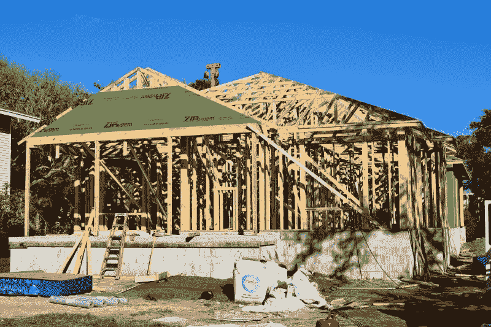

# 火箭抵押贷款是从房地产泡沫中赚钱吗？—市场疯人院

> 原文：<https://medium.datadriveninvestor.com/is-rocket-mortgage-making-money-from-a-housing-bubble-market-mad-house-e99fc9b7538d?source=collection_archive---------5----------------------->

危险的房地产泡沫可能是火箭抵押贷款公司(纽约证券交易所:RKT)股票上涨的原因。

2020 年，**火箭公司(纽约证券交易所:RKT)** 于 2020 年 8 月 6 日以 21.51 美元开始交易；其首次公开募股(IPO)日期[。Rocket 的股价在 2020 年 8 月 24 日涨至 29.11 美元，在 2020 年 8 月 28 日跌至 28.79 美元。](https://www.investors.com/market-trend/stock-market-today/dow-jones-jumps-250-points-fueled-by-boeing-stock-rocket-surges/)

可怕的是，房地产泡沫可能会推动火箭的增长。例如, *MarketWatch* 声称[美国新独栋房屋的销量](https://www.marketwatch.com/story/new-home-sales-surged-to-highest-level-since-2006-in-july-but-builders-could-soon-face-headwinds-2020-08-25)升至 2006 年以来的最高水平。换句话说，美国新屋销售正处于 2007—2008 年房地产大崩盘之前以来的最高水平。

# 美国的房地产泡沫

美国人口普查局估计，详细来说，美国人在 2020 年 7 月购买了 901，000 套新房，售价中值为 330，600 美元。*

我估计，2020 年 7 月新屋销售增长了 11.1 万套，高于 2020 年 6 月的 79.1 万套。值得注意的是，HUD [从 776，000，市场观察报告修正了 6 月新屋销售估计](https://www.marketwatch.com/story/new-home-sales-surge-in-june-and-are-now-above-previous-cycle-high-hit-at-start-of-2020-2020-07-24?mod=article_inline)。

市场观察声称，2020 年 6 月至 2020 年 7 月间，新房销售增长了 36%。此外，2019 年 7 月至 2020 年 7 月期间，新房价格上涨了 7%。

# 美国的住房短缺

我认为房价高是因为住房短缺。例如，美国住房和发展部(HUD)估计，2020 年 7 月有 299，000 套新房出售，但美国人购买了 901，000 套新房。*

房价高只是因为他们没有建造足够的房屋。所以，我认为住房需求的增加很少，是由住房行业的问题推动的。

解释一下，我认为房地产行业没有能力满足对其产品的需求。解释一下，美国的房屋建筑效率低下、管理不善、陈旧过时、投资不足，无法满足需求。

# 冠状病毒住房泡沫

具有讽刺意味的是，我认为住房需求只是因为冠状病毒而增加。解释一下，数千万人大部分时间都呆在家里，他们想要更多的空间。

事实上，2020 年 8 月，纽约市的主要雇主仅将 8%的员工带回办公室。此外，纽约合作伙伴组织估计，到 2021 年，只有 26%的纽约员工会回到办公室。

说的详细一点，可以出去工作一整天或者星巴克休息的时候，小户型就可以了。此外，当孩子们上学时，一家人可以住在小公寓里。

然而，当妈妈、爸爸和孩子们整天在家时，他们想要更多的空间。当你整天呆在阁楼里时，一个院子和几个额外的房间听起来就像天堂。

此外，困在家里的人是那些有钱和信贷买房的人。例如，软件工程师、律师、银行家、投资银行家和投资分析师。因此，成千上万的美国人正在寻找房子，新的房屋供应量很低。

# 冠状病毒房产泡沫是不可持续的

可怕的是，我认为冠状病毒房产泡沫是不可持续的。我认为房地产市场是不可持续的，因为美国正在同时经历萧条和房地产泡沫。

我预测房地产泡沫会崩溃，因为美国经济正在崩溃。经济分析局估计，2020 年第二季度，美国国内生产总值(GDP)下降了 32.9%。具体而言，2020 年第二季度，美国的现值美元 GDP 下降了 34.3%，即 2.15 万亿美元。

因此，经济学家 Joe Brusuelas 估计，2020 年 6 月，超过 3100 万美国人申请失业救济。此外，2020 年 7 月，美国的[失业率为 10.2%](https://tradingeconomics.com/united-states/unemployment-rate) 。

值得注意的是，美国劳工统计局估计，在 2020 年 8 月 15 日这一周，首次失业保险申请人数增加了 135，000+人。事实上，那一周有 117.5 万美国人申请失业救济。

因此，大多数美国人缺乏买房的钱。相反，数千万破产的美国人正面临丧失抵押品赎回权或被驱逐。例如，美国人口普查局的数据显示，22%的美国人无法支付他们的租金或抵押贷款。

# 冠状病毒会继续

我预测，如果疫情持续到 2021 年，房地产泡沫将崩溃成比 2008 年更严重的房地产危机。令人害怕的是，专家预计冠状病毒疫情将持续到 2021 年 11 月或更晚。

例如，沃顿医疗保健管理教授 Ezekiel (Zeke) Emanuel 认为疫情将持续到 2021 年 11 月。伊曼纽尔认为，到 2020 年底，T2 将有 25 万美国人死于冠状病毒。可怕的是，伊曼纽尔认为冠状病毒测试是无效的。

 [## 金钱:冠状病毒疫情期间的投资|数据驱动的投资者

### 在我将近 20 年的金融服务生涯中，我曾经负责监督整个…

www.datadriveninvestor.com](https://www.datadriveninvestor.com/2020/07/29/money-investing-during-the-coronavirus-pandemic/) 

因此，冠状病毒和冠状病毒抑郁症将在可预见的未来继续存在。结果，房地产泡沫将会破裂，因为人们将没有钱买房。相反，未售出的房屋将充斥市场，房地产经纪人将在食物银行排队。

# 火箭抵押贷款(RKT)将崩溃

我预测**火箭抵押(RKT)** 会因为冠状病毒的萧条而崩溃。

此外，我预测 Rocket 的收入和股价将在 2020 年第三和第四季度增长，并在 2021 年第一季度崩溃。我认为，当人们因为冠状病毒而停止搬到更大的房子时，Rocket 的收入将开始下降。

解释一下，能在家工作的专业人士只有这么多。当所有这些人都买房时，房屋销售将会收缩。此外，驱逐可能会将成千上万的空置房屋推向市场。

# 房地产市场将会崩溃

相反，如果房价随着 GDP 一起崩溃，我们可以看到房屋销售和新抵押贷款的增加。

我认为房价可能下跌 33%；2021 年 GDP 崩溃的速度。另一方面，美联储或国会可以找到一些方法来支撑住房市场。因此，房地产崩溃并非不可避免。

我认为房地产崩溃会增加对房屋的需求，因为有数百万美国人因为过热的市场而买不起房子。然而，所有止赎权进入市场还需要时间。

# 火箭抵押贷款将崩溃

我怀疑**火箭(RKT)** 会崩溃，因为它的资源很少。例如，Rocket 在 2019 年 12 月 31 日报告的年收入为 42.44 亿美元，年度税前收入为 898，371 美元。

目前，Rocket 可以通过 2020 年 8 月 28 日报告的 571.9 亿美元的市值来增加这些收入。但是，我认为当住房市场萎缩时，火箭的市值将会崩溃。

总之，我认为投资者需要远离 **Rocket Companies Inc. (RKT)** ，因为我认为冠状病毒萧条会摧毁住房市场。因此，冠状病毒将摧毁火箭抵押贷款的价值。

*[https://www.census.gov/construction/nrs/pdf/newressales.pdf](https://www.census.gov/construction/nrs/pdf/newressales.pdf)

+【https://www.dol.gov/ui/data.pdf 

*原载于 2020 年 8 月 28 日 https://marketmadhouse.com***。**

## *访问专家视图— [订阅 DDI 英特尔](https://datadriveninvestor.com/ddi-intel)*