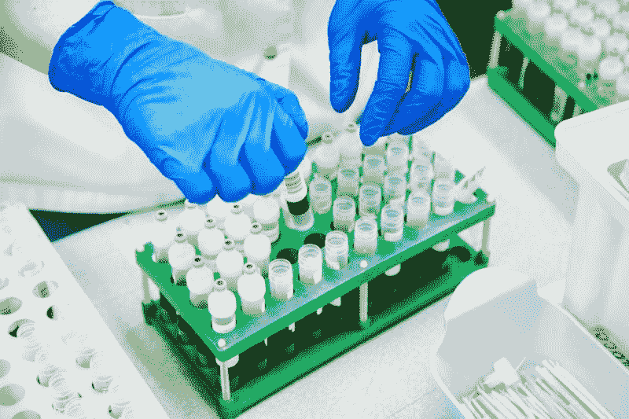

# 沙瑞普塔治疗公司赚钱了吗？—市场疯人院

> 原文：<https://medium.datadriveninvestor.com/is-sarepta-therapeutics-making-money-market-mad-house-1795291cf453?source=collection_archive---------28----------------------->

Sarepta Therapeutics(纳斯达克股票代码:SRPT) 显示了投资依赖突破性药物的医学研究公司的危险性。

据 *Barron 的*报道，在公司首席执行官道格·英格拉姆[承认其杜氏肌营养不良症的基因疗法不起作用](https://www.barrons.com/articles/sarepta-stock-gains-as-ceo-explains-setback-for-gene-therapy-51610395871)后，Sarepta 的市值损失了 50%。从本质上说，一种药物的失败可以毁灭一家公司，比如 SRPT 的萨雷普塔公司。

具体而言，Market 先生在 2021 年 1 月 7 日为 Sarepta 支付了 168.95 美元，在 2021 年 1 月 14 日为 Sarepta 支付了 90.18 美元。我认为 Sarepta 的股价暴跌表明，生物技术股正处于由对生物技术的普遍信任所驱动的泡沫之中。如果生物技术失败了，投资者就会抛售股票。

我不得不怀疑，随着投资者对 Moderna(纳斯达克股票代码:MRNA) 等公司失去信心，我们是否会看到更多的 Sareptas。记住，Moderna 的成功来自于一种冠状病毒疫苗。如果疫苗失败，莫德娜就会死亡。

# 萨雷普塔赔钱了

我认为**萨雷普塔(纳斯达克股票代码:SRPT)** 是一只糟糕的股票，因为它赔钱。例如，Sarepta 报告 2020 年 9 月 30 日的季度运营亏损为-1.3707 亿美元。

Sarepta 已经连续六个季度出现运营亏损。事实上，Sarepta 在 2020 年的每个季度都报告了季度运营亏损。

同样，Sarepta 报告的毛利润和收入也很少。例如，2020 年 9 月 30 日，Sarepta 报告季度收入为 1.4392 亿美元，季度毛利为 1.2891 亿美元。因此，Sarepta 的季度运营亏损为-1.3707 亿美元，高于季度毛利。

# Sarepta 能产生多少现金？

另外，**萨勒普塔(SRPT)** 报告 2020 年 9 月 30 日运营现金流为负 2.3819 亿美元。负经营流量从 2020 年 6 月 30 日的-1.076 亿美元增长。

值得注意的是，Sarepta 在过去 18 个月中报告了五次负的运营现金流。Sarepta 最近一次报告的正现金流是 2020 年 3 月 31 日的 6.2719 亿美元。

此外，Sarepta 报告 2020 年 9 月 30 日的期末现金流为-1879 万美元。这一数字从 2020 年 6 月 30 日的-1.2425 亿美元。

# 萨雷帕有多少债务？

相反，**萨雷帕治疗公司(SRPT)** 可以产生巨额现金。Sarepta 报告称，截至 2020 年 3 月 31 日，季度末现金流为 17.73 亿美元。

融资现金流显示 Sarepta 没有偿还债务。值得注意的是，Sarepta 报告称，2019 年 9 月至 2020 年 9 月，连续七个季度融资现金流为正。

Sarepta 报告 2020 年 9 月 30 日的长期债务为 7.0047 亿美元。2020 年，长期债务从 2019 年 12 月 31 日的 6.819 亿美元增长。

# 萨雷帕有什么价值？

目前，**萨雷帕(SRPT)** 的值很小。例如，2020 年 9 月 30 日，Sarepta 的总资产为 27.81 亿美元。

总资产从 2020 年 6 月 30 日的 28.82 亿美元和 2020 年 3 月 31 日的 29.47 亿美元下降。因此，萨雷帕的资产现在没有在疫情时值钱了。

因此，我认为 Sarepta 的估值过高，市场先生在 2020 年 1 月 14 日支付了 89.90 美元。我认为 Sarepta 崩溃是因为它的价值是纯理论的。

# 萨雷普塔可疑的商业模式

为了解释这一点，Sarepta 正试图创建一个基因治疗引擎、一个 RNA 平台和基因编辑疗法。那些工具的目的是治疗四种罕见的疾病；[腓骨肌萎缩症](https://www.sarepta.com/disease-areas/charcot-marie-tooth-disease)、[议员 IIIA:一种罕见的遗传性神经退行性疾病](https://www.sarepta.com/disease-areas/mps-iiia)、 [LGMD:一组具有多种亚型的神经肌肉疾病](https://www.sarepta.com/disease-areas/limb-girdle-muscular-dystrophy)，以及[杜氏肌营养不良症:一种罕见的遗传性神经肌肉疾病](https://www.sarepta.com/disease-areas/duchenne-muscular-dystrophy)。

治疗这些疾病是一项崇高的事业。然而，没有证据表明，萨雷帕能通过治疗这些疾病赚钱。

我认为这些疾病的罕见性限制了 Sarepta 的赚钱能力。例如，Sarepta 自己承认杜氏肌营养不良症只影响 3500 到 5000 个男孩中的一个。

因此，我认为 Sarepta 是一家慈善机构，而不是一家公司。是的，治疗这些疾病是一项美妙的活动。然而，由纳税人或慈善捐赠来资助这样的研究可能更好。

聪明的投资者需要远离萨勒普塔，明白这家公司是一家慈善企业，永远不可能赚钱。我认为投资罕见疾病的理论治疗是浪费金钱的一个很好的方式。因此，我建议只有那些能够承受损失并想帮助罕见病患者的人才能购买 SRPT 的股票。

*原载于 2021 年 1 月 14 日 https://marketmadhouse.com***。**