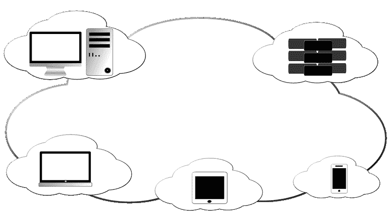

# 希捷科技赚钱了吗？—市场疯人院

> 原文：<https://medium.datadriveninvestor.com/is-seagate-technology-making-money-market-mad-house-4f7cf9c02365?source=collection_archive---------25----------------------->

**希捷科技(NASDAQ: STX)** 是少有的赚钱的云计算公司。希捷通过公司可以用来托管云的存储系统从云中获利。

例如，**希捷(STX)** 在 2020 年 12 月 31 日报告季度毛利为 6.96 亿美元，季度营业收入为 3.48 亿美元。此外，截至 2020 年 12 月 31 日，希捷报告的季度收入为 26.23 亿美元。

另一方面，希捷的营收、收入和毛利在 2020 年缩水。例如，希捷报告 2019 年 12 月 31 日的季度毛利为 7.58 亿美元，季度营业收入为 3.84 亿美元。此外，希捷的季度收入从 2019 年 12 月 31 日的 27.18 亿美元下降。

我认为冠状病毒正在伤害希捷。值得注意的是，Stockrow 估计希捷的[收入增长在截至 2020 年 12 月 31 日的季度收缩了-2.71%](https://stockrow.com/STX/financials/income/quarterly) 。截至 2020 年 9 月 30 日的季度，收入增长减少了-10.24%。

# 希捷如何在云中赚钱

**希捷科技(STX)** 通过超大规模架构和[私有云解决方案](https://www.seagate.com/solutions/cloud/private-cloud/)从云中获益。

具体来说，希捷构建了存储解决方案，允许公司在自己的系统中托管私有云。这样，公司可以允许员工在家工作，而无需将云外包给第三方。

希捷的技术允许公司存储敏感或专有数据，但却可以在私有云中使用。希捷与软件提供商合作，如 IBM 的 Red Hat Data Services 帮助客户构建私有云。

希捷技术的其他用途包括备份和恢复、人工智能和机器学习的大数据分析、视频监控和高性能计算。希捷服务的行业包括自动驾驶汽车、媒体和娱乐、电信、医疗保健以及监控和安全。

# 希捷科技产生了多少现金？

我认为希捷创造了极好的现金流。例如，希捷报告 2020 年 12 月 31 日的季度运营现金流为 4.73 亿美元。季度运营现金流从 2019 年 12 月 31 日的 4.8 亿美元略有下降。

此外，希捷报告称，截至 2020 年 12 月 31 日，季度末现金流为 1.35 亿美元。季度期末现金流从 2019 年 12 月 31 日的-4000 万美元上升，但从 2020 年 9 月 30 日的 16.66 亿美元下降。

有趣的是，我认为希捷正在偿还债务，因为希捷在 2020 年报告了负四个季度的负融资现金流。例如，希捷报告 2020 年 12 月 31 日的季度融资现金流为-1.79 亿美元。相反，希捷的长期债务从 2019 年 12 月 31 日的 41.35 亿美元上升至 2020 年 12 月 31 日的 51.2 亿美元。

# 希捷科技有哪些价值观？

截至 2020 年 12 月 31 日，希捷的现金和短期投资价值约为 17.99 亿美元。希捷在同一天还拥有 88.96 亿美元的总资产。

希捷在 2020 年获得了一些价值。例如，总资产从 2019 年 12 月 31 日的 89.32 亿美元。此外，现金和短期投资从 2019 年 12 月 31 日的 17.44 亿美元上升。

我认为市场先生在 2021 年 1 月 27 日将希捷科技(Seagate Technology)的股价定为 71.72 美元是合理的。因此，希捷比其他云计算股票更便宜，它赚钱。

引人注目的是，希捷支付了令人印象深刻的股息。例如，希捷将在 2021 年 3 月 23 日支付 67 英镑的季度股息。到了 2020 年，股息从 9 月 22 日的 65 英镑上升到了 2020 年的 65 英镑。总的来说，希捷在 2020 年 1 月 27 日提供了 2.68 美元的远期年化股息和 4.38%的前言股息收益率。

归根结底，我不觉得希捷有吸引力。然而，我建议那些正在寻找支付股息的廉价云股票的人调查一下希捷。

*原载于 2021 年 1 月 27 日*[*【https://marketmadhouse.com】*](https://marketmadhouse.com/is-seagate-technology-making-money/)*。*