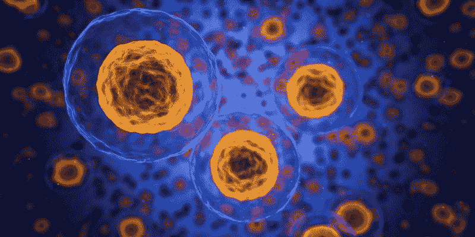
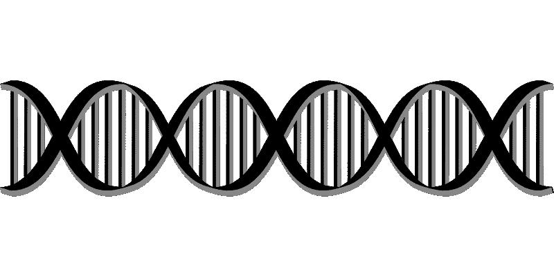

# Seagen (SGEN)赚钱了吗？—市场疯人院

> 原文：<https://medium.datadriveninvestor.com/is-seagen-sgen-making-money-market-mad-house-f45403d5c2aa?source=collection_archive---------30----------------------->

这家名为 Seattle Genetics 的公司已经更名为 **Seagen Inc .(纳斯达克股票代码:SGEN)** 并成为市场先生的最爱。

2020 年，Seagen 的股价从 1 月 2 日的 112.41 美元涨到 10 月 13 日的 211.93 美元。2020 年 10 月 15 日，Seagen 的股价跌至 204.49 美元。因此，到 2020 年为止，Seagen 的股票上涨了近 100 美元，但它赚钱了吗？

《普吉特湾商业杂志》报道，市场先生喜欢 **Seagen (SGEN)** ，因为[联邦药品管理局【FDA】在过去的 12 个月里](https://www.bizjournals.com/seattle/news/2020/10/12/seattle-genetics-rebrands-to-seagen-inc.html)批准了 Seagen 的两种新抗癌药物*。此外， **Seattle Genetics (SGEN)** 和 **Merck & Co. (MRK)** 签署了一份[45 亿美元的交易](https://www.bizjournals.com/seattle/news/2020/09/14/seattle-genetics-strikes-cancer-drug-deal.html)来销售 ladiratuzumab vedotin 一种新的癌症药物，2020 年 9 月 14 日。*

# Seagen 与默克公司签署 45 亿美元的交易

**普吉特湾商业杂志称，默克(MRK)** 将向 Seagen 支付 6 亿美元，并以 10 亿美元购买 500 万股 SGEN 股票。根据该协议，默克将向 Seagen 支付 8.5 亿美元的开发里程碑费用和 17.5 亿美元的销售里程碑费用。

Seagen 首席执行官兼总裁 Clay Siegell 声称，Ladiratuzumab vedotin 可以与默克公司的 KEYTRUDA 联合使用，摧毁乳腺癌等实体肿瘤。西雅图基因公司将在北美销售 ladiratuzumab vedotin，而默克公司将在欧洲和其他地方销售该药物。

此外，Seagen 还授予默克独家许可，在中东、亚洲和拉丁美洲将 Tukysa 商业化。(化学名:tucatinib)是另一种乳腺癌治疗方法。患者每月服用一片 Tukysa 药丸。

医生使用 Tukysa 治疗转移性乳腺癌。转移性乳腺癌是一种已经扩散到乳房附近其他组织的癌症。

# Seagen 能靠乳腺癌赚钱吗？

乳腺癌治疗的市场越来越大。Breastcancer.org 估计 12%的美国女性会患上浸润性乳腺癌。

此外，Breastcancer.org 估计，医生每年在美国女性中诊断出 276，480 例新的浸润性乳腺癌病例。此外，医生每年诊断出 48，530 名美国妇女患有非侵袭性乳腺癌。

Breastcancer.org 声称，2020 年 1 月，美国共有 350 万名女性有乳腺癌病史。此外，乳腺癌是美国女性中诊断最多的癌症。

 [## 为什么大多数人在日内交易中亏损(以及如何不成为他们中的一员)|数据驱动的投资者

### 日内交易很难，大多数人都赔钱。我确实有。事实上，我曾经在一个单一的损失更多的钱…

www.datadriveninvestor.com](https://www.datadriveninvestor.com/2020/09/23/why-most-people-lose-money-day-trading-and-how-to-not-be-one-of-them/) 

# Seagen 赚钱了吗？

然而， **Seagen(纳斯达克股票代码:SGEN)** 并没有从其抗癌药物中赚钱。例如，2020 年 6 月 30 日，Seagen 报告季度运营亏损-9397 万美元。

此外，2020 年 6 月 30 日，Seagen 报告季度共同亏损-2119 万美元。相比之下，Seagen 在同一天公布了 2.2975 亿美元的季度毛利。

有趣的是，Seagen 的季度运营亏损从 2019 年 12 月 31 日的-3841 万美元增长到 2020 年 6 月 30 日的-9397 万美元。加上同期 Seagen 的季度毛利从 2.7788 亿美元下滑至 2.2975 亿美元。

同样，Seagen 的季度收入从 2019 年 12 月 31 日的 2.898 亿美元缩减至 2020 年 6 月 30 日的 2.78 亿美元。因此，Seagen 的销售额在下降，赚钱也少了。然而，Seagen 的股价正在飙升。

# 医疗保健股存在泡沫吗？

我认为，Seagen 的财务数据和股价显示，医疗保健股存在泡沫。解释一下，投资者将资金投入一些医疗保健股，因为他们认为这些公司可能有利润丰厚的新药或新产品。

最近几个月，市场先生一直在为 [**Regeneron(纳斯达克代码:REGN)**](https://marketmadhouse.com/is-regeneron-nasdaq-regn-making-money/) **等药企支付高价。令人震惊的是，Regeneron 的股价从 2020 年 1 月 2 日的 373.35 美元涨到了 2020 年 10 月 13 日的 607.98 美元。2020 年 10 月 15 日，Regeneron 的股价跌至 585.18 美元。**

市场先生正在购买 Regeneron，因为它制造了一种抗体鸡尾酒，医生在 2020 年 10 月给唐纳德·j·特朗普总统(R-Florida)服用了这种抗体鸡尾酒。特朗普声称在接受鸡尾酒后已经从冠状病毒中康复。然而，总统的声明没有任何文件证明。

然而，Regeneron 的鸡尾酒缺乏 FDA 的批准。为了解释，特朗普的医生获得了 FDA 的特别许可，可以在总统身上使用这种鸡尾酒。因此，Regeneron 没有可以合法销售的产品。然而，市场先生为其股票支付了一大笔钱。

# 健康股泡沫

我们在 Seagen 周围看到了类似的泡沫，它亏损并销售未经证实的产品。

事实上，Seagen 让我想起了上世纪 90 年代 dot.com 泡沫时期的科技公司。在 dot.com 泡沫时期，人们购买互联网股票，因为他们有一天可以赚钱。如今，投资者购买 REGN 和 Seagen 等医疗保健股，因为它们可能有一天会赚钱。

我认为，美国食品和药物管理局拒绝批准一种畅销药物，如 Regeneron 的抗体鸡尾酒，就足以打破医疗保健泡沫。同样，从市场上撤回 Seagen 的一种药物可能会摧毁该公司。

我预测，当一两种超级明星药物失败时，医疗保健泡沫将会破裂。因此，投资者需要避开医疗类股票，除非他们在寻求做空的东西。

# Seagen 产生了多少现金？

Seagen (SGEN) 没有产生现金。Seagen 报告称，2020 年 6 月 30 日的季度运营现金流为负 8628 万美元。Seagen 的负季度运营现金流从 2019 年 12 月 31 日的-1185 万美元增长。

此外，2020 年 6 月 30 日，Seagen 报告了 3148 万美元的季度融资现金流。我认为融资现金流表明 Seagen 正在借钱为其运营融资。

最后，2020 年 6 月 30 日，Seagen 报告了 1.318 亿澳元的季度末现金流。季度期末现金流从 2019 年 12 月 31 日的 8110 万美元下降。相比之下，Seagen 报告 2020 年 3 月 31 日的季度末现金流为 2.4912 亿美元。

# 为什么你需要避免 Seagen

总体而言，截至 2020 年 6 月 30 日，Seagen 拥有 8.9567 亿美元的现金和短期投资。Seagen 的现金和短期百万投资从 2019 年 12 月 31 日的 8.1105 亿美元下降。

然而，Seagen 在 2020 年 6 月 30 日的总资产中有 21.64 亿美元的价值。Seagen 的总资产从 2019 年 12 月 31 日的 20.6 亿美元缩水。因此，尽管 Seagen 的股价在上涨，但它的价值却在下降。

我认为投资者需要避开**希捷(SGEN)** ，因为它的股价随着价值的缩水而上涨。我认为 Seagen 是一个典型的例子，它是构成不断增长的医疗保健泡沫的危险股票，可能会导致市场崩溃。因此，我建议投资者远离 Seagen 和其他热门的医疗保健股。

*原载于 2020 年 10 月 15 日***。**

## *访问专家视图— [订阅 DDI 英特尔](https://datadriveninvestor.com/ddi-intel)*