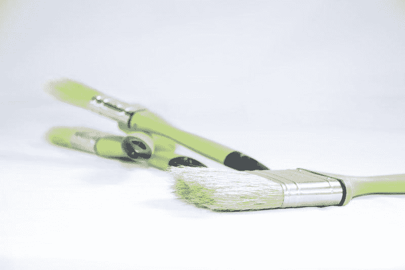
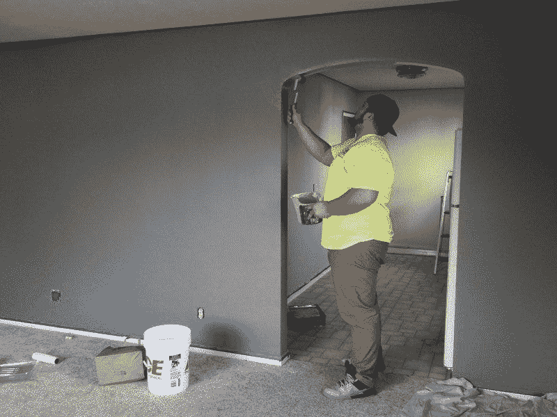
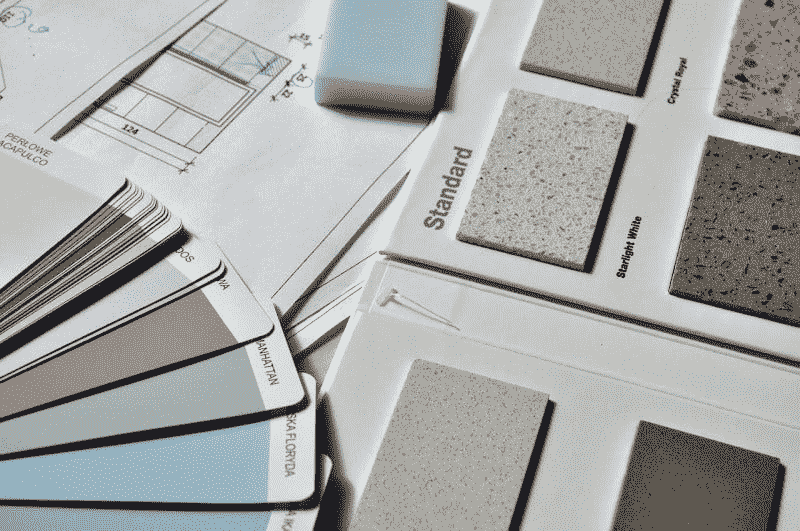

# 舍温-威廉姆斯赚钱了吗？—市场疯人院

> 原文：<https://medium.datadriveninvestor.com/is-sherwin-williams-making-money-market-mad-house-552e45cf3a64?source=collection_archive---------25----------------------->

油漆回报丰厚。Sherwin-Williams Company(纽约证券交易所代码:SHW)2020 年 10 月 5 日，股票交易价格为 689.60 美元。

此外，**舍温-威廉姆斯(SHW)** 季度运营收入从 2020 年 3 月 31 日的 5.003 亿美元增长至 2020 年 6 月 30 日的 8.413 亿美元。此外，舍温-威廉姆斯公司同期的季度毛利从 18.9 亿美元增长到 22.09 亿美元。

引人注目的是，舍温-威廉姆斯的季度收入从 2020 年 3 月 31 日的 41.47 亿美元增长到 2020 年 6 月 30 日的 46.04 亿美元。此外，舍温-威廉姆斯的季度共同净收入同期从 3.217 亿美元增长到 5.959 亿美元。

# 舍温-威廉公司(SHW)的业务蒸蒸日上

我认为**舍温-威廉姆斯(纽约证券交易所代码:SHW)** 的业务正在蓬勃发展，因为冠状病毒将人们困在家里无事可做。Porch.com 估计，大约 59%的美国人承认自从疫情豆事件以来，他们花更多的时间在家里。

那些人有的是时间，他们不得不看看他们的墙。因此，许多人开始重塑。最简单快捷的改造就是粉刷房子。因此，舍温-威廉姆斯的销售在疫情期间有所增长。

重塑在 2020 年的美国蓬勃发展。Porch.com 估计，自疫情开始以来，76%的美国房主已经开始了至少一个家庭装修项目。此外，58%的美国房主对室内进行了改善，这通常需要油漆。大约 55%的美国房主表示，疫情给了他们更多的时间来改造房屋。

所有这些对舍温-威廉姆斯来说都是好事，因为美国人在他们的房子上花了一大笔钱。Statista 估计，2019 年最后一个季度，美国人在家庭装修项目上花费了 3280 亿美元。Statista 预测这一数字将在 2020 年增长到 3330 亿美元。

# 舍温-威廉姆斯赚多少钱？

令人印象深刻的是，舍温-威廉姆斯的季度运营现金流从 2020 年 3 月 31 日的 5490 万美元增长至 2020 年 6 月 30 日的 10.2 亿美元。相比之下，舍温-威廉姆斯在 2019 年 12 月 31 日以 6.5989 亿美元的季度运营现金流开始了 2020 年。

然而，舍温-威廉姆斯报告 2020 年 6 月 30 日的季度末现金流为负-5040 万美元。这一数字低于 2020 年 3 月 31 日的 2.385 亿美元。

 [## 为什么大多数人在日内交易中亏损(以及如何不成为他们中的一员)|数据驱动的投资者

### 日内交易很难，大多数人都赔钱。我确实有。事实上，我曾经在一个单一的损失更多的钱…

www.datadriveninvestor.com](https://www.datadriveninvestor.com/2020/09/23/why-most-people-lose-money-day-trading-and-how-to-not-be-one-of-them/) 

令人印象深刻的是，舍温-威廉姆斯在 2020 年 6 月 30 日报告了 10.02 亿美元的负季度运营现金流。这意味着舍温-威廉姆斯可能在 6 月份支付了 10.02 亿美元的债务。然而，截至 2020 年 6 月 30 日，舍温-威廉姆斯拥有 82.89 亿美元的长期债务。

舍温-威廉姆斯公司报告称，截至 2020 年 6 月 30 日，现金和短期投资仅为 1.881 亿美元。这一数字从 2020 年 3 月 31 日的 2.385 亿美元和 2019 年 12 月 31 日的 1.618 亿美元下降。

因此，我认为，尽管舍温-威廉姆斯在 2020 年 6 月 30 日的总资产为 48.83 亿美元，但它没有提供任何价值。此外，这些资产从 2020 年 3 月 31 日的 49.28 亿美元。

# 市场先生高估了舍温·威廉姆斯

因此，我认为以每股 689.60 美元的价格收购舍温-威廉姆斯(SHW) 是愚蠢的。舍温-威廉姆斯表明市场先生完全疯了。

然而，我认为市场先生长期以来高估了舍温-威廉姆斯公司的股票。舍温-威廉姆斯在 2020 年 1 月 2 日以 571.85 美元开始 2020 年。另外，市场先生在 2020 年 9 月 15 日为舍温·威廉姆斯支付了 715.12 美元。

在我看来，舍温-威廉姆斯公司 2020 年 8 月 20 日支付的每季度 1.34 美元的股息都不足以支撑其股价。总的来说，Dividend.com 在 2020 年 10 月 5 日给予舍温-威廉姆斯 0.65%的股息收益率，每年 4.52 美元的股息。

我认为舍温-威廉姆斯被高估了，因为它现金量少，安全边际低。解释一下，我认为任何只有 1.881 亿美元现金和短期投资的公司都没有安全边际。事实上，我认为舍温-威廉姆斯公司可能会资金告罄而倒闭。

此外，我认为舍温-威廉姆斯可能无法增长。事实上，Stockrow 估计舍温-威廉姆斯的收入增长在截至 2020 年 6 月 30 日的季度收缩了-5.61%。相比之下，舍温-威廉姆斯公司上一季度的收入增长率为 2.62%。

# 舍温-威廉姆斯是什么？

**Sherwin-Williams(纽约证券交易所代码:SHW)** 制造和分销油漆和工业涂料。

舍温威廉姆斯的品牌包括威士伯、舍温威廉姆斯、明瓦克斯、克龙、荷兰男孩、卡伯特、华帝、汤普森水封和龙封。舍温-威廉姆斯声称经营着【4,900 家公司商店和设施。此外，主要零售商如 [Lowe's(纽约证券交易所代码:LOW)](https://marketmadhouse.com/is-the-retail-apocalypse-coming-to-lowes/) 出售舍温-威廉姆斯品牌，包括威士伯。

总之，我建议投资者建议**舍温-威廉姆斯(SHW)** 公司，因为其股价荒唐可笑。我认为家装领域有更好、更安全的股票，包括**家得宝(纽约证券交易所代码:HD)** 、劳氏(Lowe’s)**沃尔玛(纽约证券交易所代码:WMT)** 和**伯克希尔哈撒韦(纽约证券交易所代码:BRK。B)** 。投资者需要调查这些股票，避开舍温-威廉姆斯。

*原载于 2020 年 10 月 5 日 https://marketmadhouse.com**的* [*。*](https://marketmadhouse.com/is-sherwin-williams-making-money/)

## 访问专家视图— [订阅 DDI 英特尔](https://datadriveninvestor.com/ddi-intel)