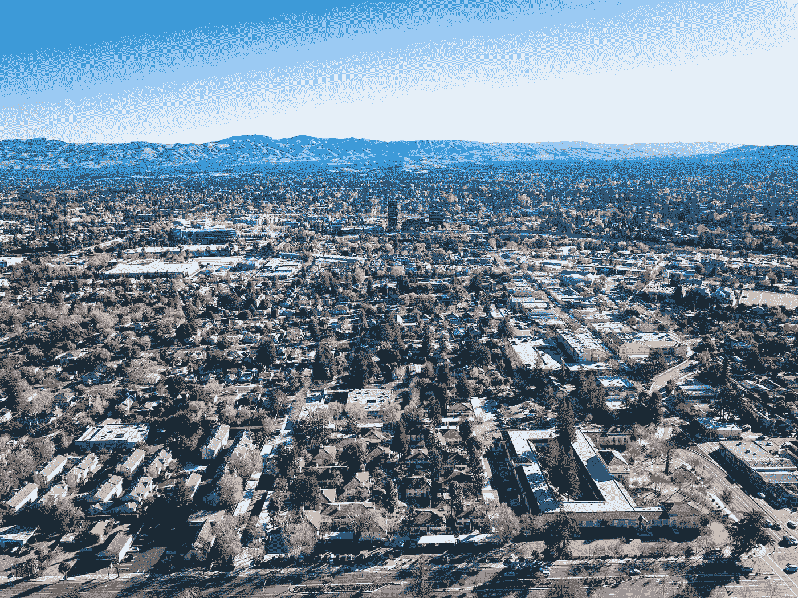
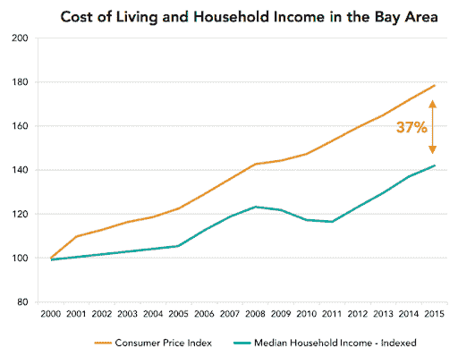
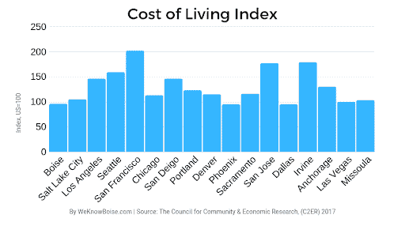
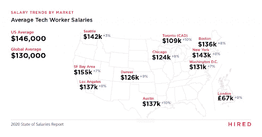
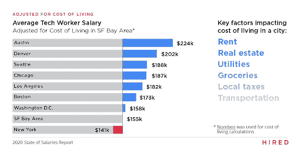
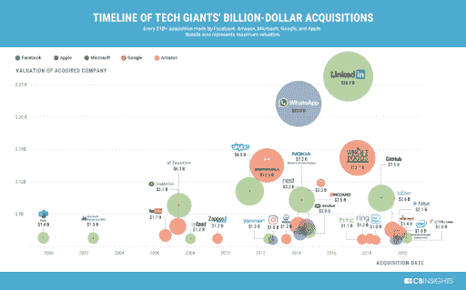
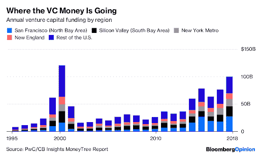

# 硅谷要死了吗？没有，为什么它对企业家仍然有意义

> 原文：<https://medium.datadriveninvestor.com/is-silicon-valley-dying-no-and-why-it-still-makes-sense-for-entrepreneurs-84c276cae104?source=collection_archive---------8----------------------->

有这样的标题:

2020 年 8 月 26 日:[帕兰蒂尔的湾区搬迁使丹佛成为硅谷外流人群中值得关注的城市](https://www.cnbc.com/2020/08/26/palantir-makes-denver-the-city-to-watch-amid-silicon-valleys-exodus.html)

2020 年 12 月 1 日:[惠普企业将总部搬离硅谷](https://www.sfgate.com/bayarea/article/Hewlett-Packard-Enterprise-moving-headquarters-15767751.php)

2020 年 12 月 12 日:[甲骨文将总部从湾区迁至德克萨斯](https://www.mercurynews.com/2020/12/11/oracle-to-move-headquarters-from-bay-area-to-texas/)

然后是这些头条新闻:

2020 年 12 月 11 日:[是的，最大的出口仍然是湾区公司](https://news.crunchbase.com/news/sf-bay-area-silicon-valley-startup-hq-exits/)

2020 年 12 月 24 日:[忽略技术上的反对者——旧金山不会死](https://www.cnbc.com/2020/12/24/san-francisco-isnt-dying-despite-tech-departures.html)

2020 年 12 月 28 日:[加州可能失去一些明星。但是硅谷是永远的。](https://www.nytimes.com/2020/12/28/opinion/silicon-valley-exodus.html)

那到底是哪一个？

每隔几年，就会有一连串的头条新闻，比如“硅谷正在消亡/已经消亡/无可挽回地消亡”。令人难忘的例子:2001 年互联网崩盘[、2008 年红杉资本的美好时光](https://en.wikipedia.org/wiki/Dot-com_bubble)[以及现在的 2020 / 21 年疫情。](https://www.sequoiacap.com/article/rip-good-times)

我们甚至不能完全同意硅谷是什么，大多数人说它是圣克拉拉和圣马特奥县，但我们经常把旧金山甚至所有 9 个县都归入旧金山湾区。但本着简洁实用的一贯宗旨，这篇文章没有重复各种经过长时间辩论的论点，而是基于硅谷 20 多年的经验，重点讨论为什么事情会对硅谷有利。

**1)生活又名你愿意去多便宜？**硅谷居民自己会特别提到两个原因:生活成本高，尤其是在住房方面；通勤时间长，而公共交通的低可用性又加剧了这一问题。此外，当地消费者也有很多抱怨，无论是过于强调科技、过于自由主义，还是[甚至进入学前教育的竞争过于激烈。由于我们无法就不同指标的权重达成一致，对硅谷状况的决策变得更加困难——有完全合理的理由让某些数据比其他数据更受重视。说了这么多，是的，如果你想对数据或网络迁移有一个真正的了解，看看 https://siliconvalleyindicators.org 的](https://thebolditalic.com/the-san-francisco-preschool-popularity-contest-the-bold-italic-san-francisco-9a350c64affe)。

在 Tau Ventures，毫无疑问，硅谷在这方面已经严重恶化。没有不同的社会选择和更好的治理，巨大的挑战将进一步加剧。因此，我们提醒所有现有的和潜在的企业家——在 covid 之前是这样，我们很痛心地看到它变得更加严重。

为了找到优秀的人才，你愿意付出多少时间和金钱？这在很多方面都是对第一条的延伸。在招聘方面，硅谷确实像一台永不停息的跑步机，因为与世界其他地区相比，工程师的工资特别高。这部分反映了这里对顶级工程师的需求非常高。但这并不意味着没有高供应量，也不意味着工程师实际上得到了适当的报酬，如下图所示。

在 Tau Ventures，我们仍然相信硅谷将继续吸引足够多的顶尖人才——成熟的冒险文化、相对宜人的天气(尽管有火灾)、像斯坦福和伯克利这样培养优秀人才的学术机构。即使现任者提供了更好的待遇(工资、股权、奖金、福利等)，在薪酬方面也存在(合理的)系统性不满。最后，如果你有一个想法，并愿意为之努力，一个企业家在湾区获得的那种接受度，在世界的某些地方仍然很难获得。

竞争又名你有多害怕大灰狼？大型科技公司一直在蓬勃发展，尽管有 covid 和法律审查，2020 年第三季度的恰当例子[仅谷歌、脸书和亚马逊就增加了 1630 亿美元的市值](https://www.theguardian.com/technology/2020/oct/29/google-facebook-apple-amazon-third-quarter-earnings)(亚马逊总部在西雅图，谷歌和脸书在世界各地都有员工，重要的是大型科技公司的很大一部分财富聚集在湾区)。但是让我们回顾一下 2020 年十大 IPO 中的三个[，包括 AirBnB、Snowflake 和 DoorDash，它们都在硅谷。这仅仅是一种滞后效应，创业公司的未来会有问题吗？](https://www.morningstar.com/articles/1014850/the-10-biggest-ipos-of-2020)

在 Tau Ventures，我们实际上看到了完全相反的情况，并不相信硅谷的成功扼杀了自己的创新。已经有许多其他的好地方，有些正在以更快的速度增长，只是它们和硅谷之间的差距正在变小。我们的观点是，我们正在走向一个多极世界，少数几个地方将成为重要的创新集群，在这些地方之间进行协调变得越来越容易。这对企业家来说是个好消息，他们可以雇佣硅谷最优秀的技术人才，从其他地方补充人才，并让资金充足的收购者准备好应对各种规模的收购。

**4)风险投资(Venture Funding)又名你有多在乎与风投的关系？**硅谷是世界上风险资本最集中的地方，我们认为这种情况将会持续下去。离风投很近确实更容易得到介绍和会面，尤其是在早期阶段。在 Tau Ventures，我们相信在后 covid 世界中，这一点将基本保持不变。2019 年，我们完成了七项新投资，在大多数情况下，我们从未见过这位企业家，在一些情况下，我们仍然没有见过。但根据许多投资者的谈话，我们是少数，因为大多数基金告诉我们，在条件允许的情况下，他们正在寻求更多的面对面交流。客观地说，美国大约一半的风险资本都在湾区，而且这种集中程度如此之高，我们认为这种优势在未来几年不会发生显著变化。

*原载于* [*数据驱动投资人*](https://www.datadriveninvestor.com/2021/01/19/is-silicon-valley-dying-no-and-why-it-still-makes-sense-for-entrepreneurs/) *，《我很乐意在其他平台上辛迪加。我是*[*Tau Ventures*](https://www.linkedin.com/pulse/announcing-tau-ventures-amit-garg/)*的管理合伙人和联合创始人，在硅谷工作了 20 年，涉足企业、创业公司和风险投资基金。这些都是专注于实践见解的有目的的短文(我称之为 GL；dr —良好的长度；确实读过)。我的许多文章都在*[*https://www . LinkedIn . com/in/am garg/detail/recent-activity/posts*](https://www.linkedin.com/in/amgarg/detail/recent-activity/posts/)*上，如果它们能让人们对某个话题产生足够的兴趣，从而进行更深入的探讨，我会感到非常兴奋。如果这篇文章有对你有用的见解，请评论和/或给文章和* [*Tau Ventures 的 LinkedIn 页面*](https://www.linkedin.com/company/tauventures) *点赞，感谢你对我们工作的支持。这里表达的所有观点都是我自己的。*