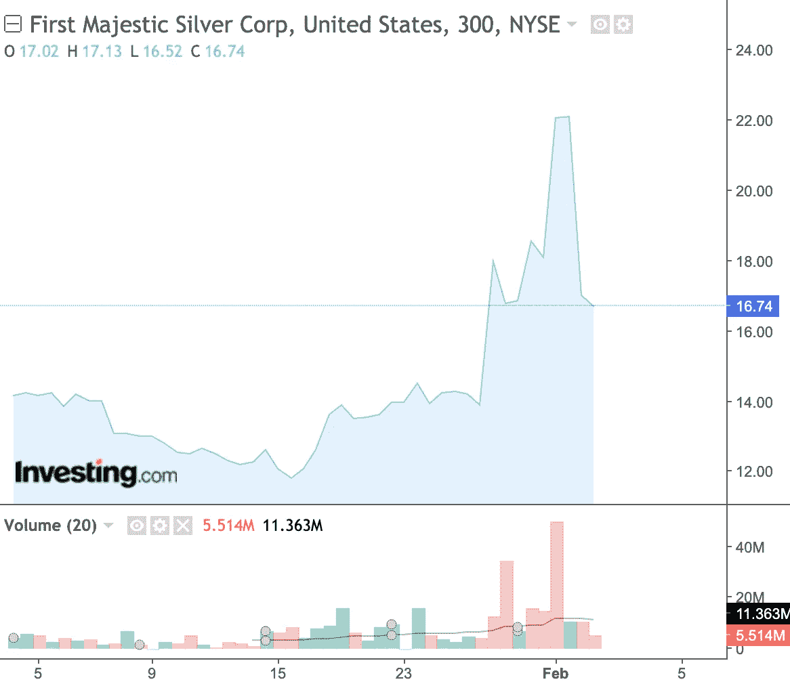
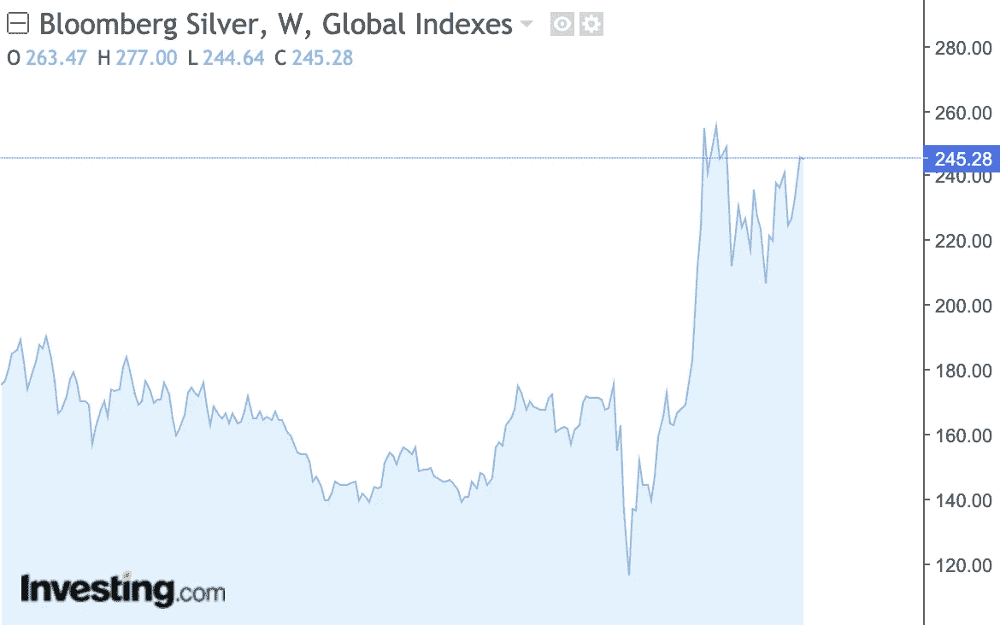

# 2021 年白银投资好吗？

> 原文：<https://medium.datadriveninvestor.com/is-silver-a-good-investment-in-2021-e94fc8d55082?source=collection_archive---------2----------------------->

Photo by [Pineapple Supply Co.](https://unsplash.com/@pineapple?utm_source=unsplash&utm_medium=referral&utm_content=creditCopyText) on [Unsplash](https://unsplash.com/s/photos/silver?utm_source=unsplash&utm_medium=referral&utm_content=creditCopyText)

市场最近关注的焦点是华尔街投资者 Reddit 和对冲基金之间的争斗，对冲基金在一些美国小盘股上持有大量空头头寸。

疯狂可能会进入下一轮。

感觉有点像价格海啸。

个人投资者有了一个新主意:推高相对便宜的白银价格。

**现在的问题是，白银的反弹是否真的会发生？**

为了预测可能的结果，让我们回顾一下过去，看看这样的白银市场现象是否会在未来出现。

1980 年，亨特兄弟通过涉及实物交割的期货合约，成为全球约 1/3 实物白银持有量的所有者。

 [## 亨特兄弟是如何垄断白银市场，然后全部输光的

### 曾是世界首富的纳尔逊·邦克·亨特直到 2014 年去世前，一直否认他和他的……

priceonomics.com](https://priceonomics.com/how-the-hunt-brothers-cornered-the-silver-market/) 

> 他们的行动将银价从每盎司 5 美元推高至近 50 美元。

因此，期货交易方式的后续变化——通过增加保证金——导致白银市场出现大规模抛售。

# 2021 年个人投资者对于白银的投资策略是什么？

> 投资持有实物商品的白银 ETF。

人们的预期是，购买这些 ETF 的股票将迫使投资者购买实物白银，推高价格。**与其他商品相比，白银和黄金一样具有强劲的基本面，由于需求上升和供应有限，白银前景稳定。**

此外，价格朝着 20 世纪 80 年代或 21 世纪 10 年代的高点升值的可能性接近 100%。相比之下，金价去年达到了历史最高水平。

 [## 我对长期投资者的黄金白银理论

### 我早期的白银经验引发了几十年的观察，形成了我关于价格周期的理论…

wolfstreet.com](https://wolfstreet.com/2018/09/04/my-theory-about-gold-and-silver-for-long-term-investors/) 

> 购买一盎司黄金需要 100 多盎司的白银。

从历史上看，这是一个非常高的值。仅仅因为一些东西便宜，比如银(与黄金相比)，并不意味着它不能变得更便宜。

尽管如此，这一比率在中期内应该会下降。因此白银可能会弥补估值的不足。

顺便说一下，我最近创建了一个新的免费迷你课程**,内容是如何利用各种高回报、先进和创新的投资工具每月投资 500 美元并从中获利。**在此获得您的即时访问权限:

 [## 如何投资获利每月 500 美元-仅限严肃投资者

### 10 种行之有效的投资方式每月 500 美元开始独立投资，无需银行、基金和…

seriousinvestorsonly.com](https://seriousinvestorsonly.com/how-to-invest-profitably-500-a-month/) 

在细价股或故事被大肆炒作之后，这股热潮现在正蔓延到贵金属领域。但是，用个股来实现价格的强势上涨还是比用实物白银要好。

ETF 目前持有约 9.08 亿盎司白银，去年白银需求增加了约 3 亿盎司。

> “另一方面，对白银交易所交易基金的需求——主要用于对冲通胀(最近也用作华尔街赌注的目标)——一直很有弹性，去年攀升了 47%。交易所交易基金持有的白银量为 9050 亿金衡盎司，接近历史最高水平。”根据彭博的说法

因此， [First Majestic Silver](https://finance.yahoo.com/quote/AG) 的股票(华尔街投资者最近关注的股票之一)在过去 5 天的交易中上涨了约 20 %- 25 %,目前交易价格为 17-22 美元。对 First Majestic Silver 股票的短期兴趣超过自由流通股的 20%。

**不过，应该注意的是，购买 ETF 份额并不会导致基金立即购买白银。**

购买白银是由专门的公司进行的，这些公司用白银交易大宗股票。然后基金份额在交易所出售给投资者。

> 这意味着散户投资者必须向市场注入数十亿美元，才能引发重大的价格波动。

你已经注意到华尔街投资者(WSB)特别瞄准股票，其中有相当一部分流通股被卖空。

据股票市场门户 Seeking Alpha 报道，WSB 的一篇帖子在 Twitter 上流传，称白银市场是“世界上最受操纵的市场之一”

因此，存在这样一种风险，即当卖空者的个人亏损达到阈值时，他们将不得不回购股票，以加强之前故意强行推动的上涨。

然而，在第一雄伟的职位和价格爆炸也是显而易见的，在其他银矿业股票以削弱的方式。相比之下，在随后的几天或几周内，银价几乎没有变化。

> ETF 和实物白银购买只是金融市场的一部分。

不要忘了期权市场，它显示了可能的运动范围。过去几天，白银市场的波动指数(基于 ETF 期权)从约 40%升至 70%。

反向比率指数(reverse ratio index，1 个月价外看涨期权和看跌期权的价格之差)跃升至 18 点区间的创纪录高位，表明许多投资者开始建立头寸，准备对白银市场发起最后攻击。现在它的价格大幅下跌。

看着这样的波动，我发现白银更多的是投机而不是投资。

从价格走势来看，很明显，有买入白银的时候，也有退出白银的时候，这是大多数时候的情况。

尽管如此，过去人们还是把银作为实际货币使用。如果你今天选择投资白银，在这种情况下，你应该以投机者的心态对待它，因为它不会产生产品或服务。

> 白银本身仍然有价值。这是一种货币金属。因此，战胜通货膨胀或货币贬值是相对稳定的。这是用来拿东西的。

**有趣的事实，如果你决定做进一步的研究，你会发现黄金和白银的价格一前一后地下跌和上涨。**

是的，黄金仍然被认为是比白银更常见的商品投资。这是因为世界上大多数中央银行都持有大量黄金储备。但对于个人投资者来说，这意味着一件事:

> 在市场金融动荡时期，无论应该持有哪一种股票:两者都遵循相同的市场趋势。

一件特别的事情是，白银不应该成为头号长期增长资产。只有当股市下跌或交易者积极投机时，它才会表现良好。

正因为如此，银价可能会像火箭一样迅速崩溃！因此，最好将你的投资组合限制在不超过你全部投资组合的 5-10%。

**永远不要在价格大幅上涨时买入白银，因为普通投资者可能会根据外界的警告买入白银。你可能会面临大幅下跌。**

这使得白银成为更难获利的大宗商品之一。很难预测何时买入何时卖出；另外，不包括股息。

毕竟，如果你仍然愿意购买该商品，那么最好的方式可能是通过白银 ETF。

 [## 3 只 Q1 2021 白银 ETF

### 自 2021 年 2 月初以来，白银商品期货一直是大量投机的主题，并且…

www.investopedia.com](https://www.investopedia.com/articles/etfs/top-silver-etfs/) 

优势在于购买金属本身，然后通过低费用的经纪人迅速卖出。因此，你不需要担心获得金属或处理银矿股票的不确定性。

*免责声明:作者的观点仅代表其个人观点，不以任何方式构成财务建议。作者发布的任何内容都不构成投资建议，作者发布的任何数据或内容也不应作为任何投资活动的依据。*