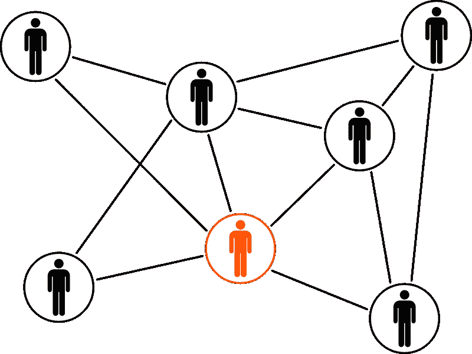

# Slack 赚钱了吗？—市场疯人院

> 原文：<https://medium.datadriveninvestor.com/is-slack-making-money-market-mad-house-84c9153ded10?source=collection_archive---------15----------------------->

很多人会认为 **Slack Technologies Inc .(纽交所代码:WORK)** 是价值投资，因为价格低。

例如，2020 年 1 月 22 日，市场先生以每股 22.14 美元的价格收购 Slack。然而，与**【脸书(纳斯达克代码:FB)** 相比，Slack 的平台很小。

Slack 声称在 2019 年 9 月，其平台上的日活跃用户超过 1200 万，一份新闻稿[声称](https://www.businesswire.com/news/home/20191010005813/en/Daily-Active-Users-Created-Equal-Work-Fueled)。此外，Slack 声称这些用户在同一时期每周执行超过 50 亿次操作。

Slack 声称其平均用户每天在平台上花费超过 90 分钟。此外，Slack 声称其普通用户每天的连接时间超过 9 个小时。

# Slack 不可思议的增长率

如果 Slack 的说法是真的，那么它的平台正在以不可思议的速度增长。例如，Slack 承认，截至 2014 年，该平台的活跃用户还不到 100 万。

此外，Stockrow [估计](https://stockrow.com/WORK/financials/income/quarterly) Slack 的收入在截至 2019 年 10 月 31 日的季度增长率为 59.7%。另外，Stockrow 计算出 Slack 上市后第一季度的增长率达到了惊人的 66.61%。该季度截至 2019 年 4 月 30 日。

Slack 增长如此之快的一个原因是，它声称拥有 60 万名每日活跃的注册开发者。因此，Slack 拥有庞大的开发者基础，可以通过新应用为其平台增值。

# Slack 与微软

懈怠；然而，可能会面临一个不可能的挑战，与微软(纳斯达克股票代码:MSFT)竞争。

微软宣称其 Slack 杀手；微软团队在 2020 年 1 月拥有超过 1300 万日活跃用户和超过 1900 万周活跃用户， *The Verge* [报道](https://www.theverge.com/2019/7/11/20689143/microsoft-teams-active-daily-users-stats-slack-competition)。因此，微软团队的平台可能比 Slack 的更大。

此外，微软有更多的开发人员。微软的软件存管子公司 Github 声称，2019 年在其 [Octoverse](https://octoverse.github.com/) 中拥有超过 4000 万开发者。

Github 开发者在 2019 年收到了超过 8700 万个拉请求，并关闭了超过 2000 万个问题。八分体正以惊人的速度增长。Github 声称，2019 年有超过 1000 万开发者加入了 Octoverse。

# Slack 能和微软抗衡吗？

我认为 Slack(纽约证券交易所代码:WORK) 不可能因为现金而与微软竞争。

为了解释这一点，Slack 在 2019 年 10 月 31 日报告了 7.7411 亿美元的现金和短期投资。这一数字低于 2019 年 1 月 31 日报告的 8.4107 亿美元。

相比之下，**微软公司(纽约证券交易所:MSFT)** 在 2019 年 9 月 30 日拥有 1366.36 亿美元的现金和短期投资。此外，微软在同一天报告了 138.18 亿美元的季度运营现金流和 131.77 亿美元的期末现金流。因此，微软有无限量的现金来解决社交媒体中的商业合作问题。

例如，微软可以为新应用向开发者支付远高于 Slack 的费用。此外，微软有能力让微软团队去让组织使用它。

# Slack 赚了多少钱？

我认为无法赚钱注定了 Slack。例如，Slack 报告 2019 年 10 月 31 日净亏损 8777 万美元。

同一天，Slack 还报告了-9500 万美元的季度运营亏损。然而，Slack 报告称，截至 2019 年万圣节的季度收入为 1.6872 亿美元，季度毛利为 1.4559 亿美元。

让这些钱闲置就是烧钱。Slack 报告上一季度运营现金流为-910 万美元，期末现金流为-2180 万美元。

Slack 还报告了同期 1116 万美元的融资现金流。我认为融资现金流表明 Slack 正在借钱为其运营融资。

所以我认为 Slack 不赚钱，也没有表现出赚钱的潜力。鉴于这些见解，我建议投资者远离 Slack。

# 远离懈怠

可以预见的是， **Slack(纽约证券交易所代码:WORK)** 不支付股息，因为它不产生收入。

因此，我认为 Slack 的唯一潜在价值是被微软或脸书(纳斯达克代码:FB)这样的公司收购的可能性。由于 Slack 在 2019 年 1 月 17 日的市值为 126.4 亿美元，微软可以用现金收购它，还剩下 1239.96 亿美元。

我预测 Slack 不会作为一个独立的公司生存下来，因为它的资金如此之少。因此，我认为 Slack 能够为投资者提供的唯一潜在价值是收购股票所产生的更高的股价。因此，我认为 Slack 是投机者的股票；或者做空股票，而不是普通人的股票。

*原载于 2020 年 1 月 22 日 https://marketmadhouse.com**[*。*](https://marketmadhouse.com/is-slack-making-money/)*