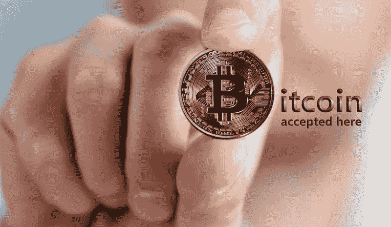
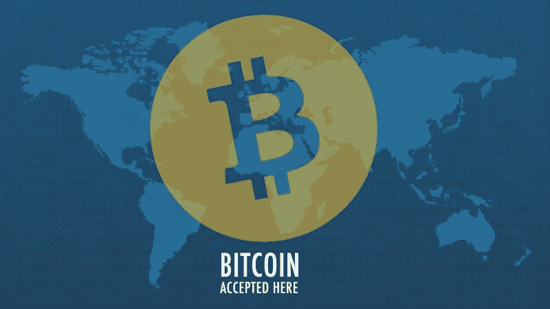
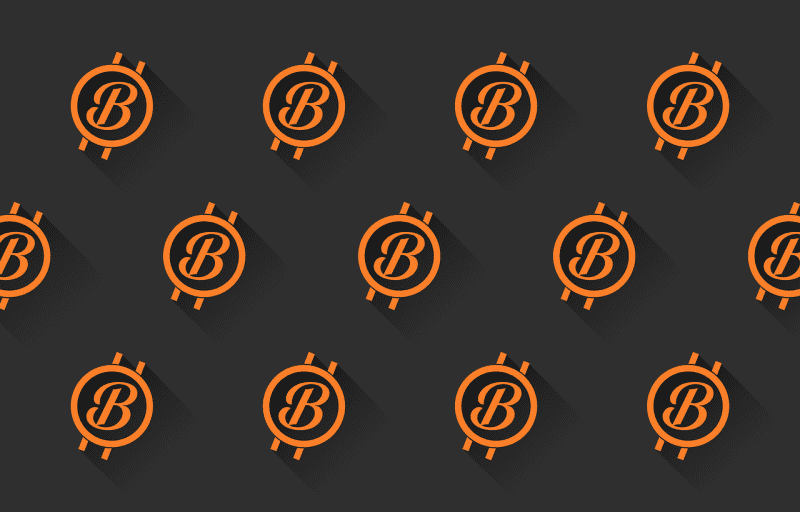

# Square (SQ)是在用比特币赚钱吗？—市场疯人院

> 原文：<https://medium.datadriveninvestor.com/is-square-sq-making-money-from-bitcoin-market-mad-house-ba58b8f6b7fe?source=collection_archive---------12----------------------->

**Square (SQ)** 证明了金融科技公司可以从加密货币中赚钱。

**Square Inc .(纽约证券交易所代码:SQ)** 声称其现金应用程序在 2020 年第二季度为**比特币(BTC)** 创造了 8.75 亿美元的收入。此外，Bitcoin.com 报道称，Square 声称现金应用的比特币收入在 2020 年第二季度增长了 600%。

令人印象深刻的是，Square 声称现金应用比特币的毛利在 2020 年第二季度增长了 711%。然而，2020 年第二季度，Cash 应用的比特币毛利为 1700 万美元。

因此，Square 表明加密货币可以为金融科技公司带来巨额收入。如果 Square 可以销售价值 8.75 亿美元的像比特币一样缓慢而笨重的东西，我认为 Cash App 可以销售 50 亿美元或 100 亿美元的好加密货币。

 [## 稳定币会危及比特币在加密领域的地位吗？数据驱动的投资者

### Stablecoin 是一种加密货币，主要用于维持稳定的市场价值。它可以通过…

www.datadriveninvestor.com](https://www.datadriveninvestor.com/2020/06/08/can-a-stablecoin-jeopardize-the-position-of-bitcoin-in-the-crypto-space/) 

# 为什么现金 App 卖这么多比特币？

对于那些不熟悉它的人来说，Cash 应用程序结合了数字钱包、点对点(P2P)转账工具和财富管理工具。这款现金应用很快，而且很好用——不像其他的数字钱包。

我认为 Cash 应用程序很受欢迎，因为它允许用户购买少量的股票和加密货币。值得注意的是，2020 年第二季度，Cash 应用的非比特币收入为 3.25 亿美元，比 2019 年第二季度增长 140%。

奇怪的是，播客王乔·罗根可以推动现金应用的成功。解释一下，罗根所谓的“他妈的现金应用”是乔罗根秀的大赞助商。在他的播客中，罗根告诉他的大批听众，他们可以使用现金应用程序购买比特币。

# 恐惧推动了现金应用的增长吗？

除了罗根，我认为恐惧正在推动 Cash App 的比特币收入。解释一下，我认为普通人害怕冠状病毒会摧毁美元和美国经济。因此，他们正在寻找替代资产，而比特币(BTC)是一种美元替代品。

人们购买**比特币(BTC)** 是因为他们担心法定货币和传统投资会崩溃。Square 从恐惧中获利，因为现金应用是普通人购买比特币最便捷的方式之一。

因此，我认为冠状病毒推动了现金应用的收入增长。除了比特币，现金应用程序还让人们无需银行就能收到付款。

# Square 令人难以置信的收入增长

除了现金应用，Square 正在经历令人难以置信的收入增长。

事实上，Stockrow 估计在截至 2020 年 6 月 30 日的季度中，Square 的收入增长了 63.82%。此外，截至 2020 年 3 月 31 日的季度，Square 的收入增长了 43.96%，2019 年第四季度增长了 40.85%。

具体而言，Square 的季度收入从 2020 年 3 月 31 日的 13.81 亿美元上升至 2020 年 6 月 30 日的 19.24 亿美元。此外，Square 的季度毛利从 2020 年 3 月 31 日的 5.385 亿美元增长至 2020 年 6 月 30 日的 5.9676 亿美元。

# 平方(SQ)赔钱

因此， **Square(纽约证券交易所代码:SQ)** 像野草一样疯长，但它赚钱了吗？不，最新的财务数据显示 Square 在亏损。

2020 年 6 月 30 日，Square 报告了 2305 万美元的季度运营亏损。值得注意的是，该季度运营亏损从 2020 年 3 月 31 日的-9029 万美元缩减至 2020 年 3 月 31 日的-9029 万美元。

此外，2020 年 3 月 31 日，Square 报告了 1.0589 亿美元的季度普通净亏损。2020 年 6 月 30 日，季度共同净亏损降至-1148 万美元。

# Square (SQ)正在产生现金吗？

**Square (SQ)** 是在燃烧现金而不是产生现金。2020 年 6 月 30 日，Square 报告的季度运营现金流为负 2.7313 亿美元。季度经营现金流从 2020 年 3 月 31 日的 1.213 亿美元。

此外，Square 报告称，截至 2020 年 6 月 30 日，季度末现金流为负-371 万美元。期末现金流从 2020 年 3 月 31 日的 20.10 亿美元下降。

可以预见的是，Square 正在为其扩张融资。截至 2020 年 3 月 31 日，Square 报告了 918.12 美元的融资现金流。2020 年 6 月 30 日，融资现金流降至 4.4869 亿美元。

因此，我认为 Square 正在遵循经典的硅谷战略，即借钱为增长融资。然后，希望你能快速成长，从运营中获得大量现金。

不幸的是，这个策略现在不起作用，但我认为 Square 的收入增长足够快，足以让这个策略奏效。Square 面临的明显危险是，在收入恢复之前，增长可能会停止。

# 平方(SQ)有什么值？

我认为 **Square (SQ)** 现在提供了一些价值。例如，截至 2020 年 6 月 30 日，Square 拥有 26.87 亿美元的现金和短期投资。

Square 的现金和短期投资从 2020 年 3 月 31 日的 24.84 亿美元增长到 2020 年 6 月 30 日的 12.21 亿美元。因此，尽管 Square 产生的现金很少，但它的现金却在增长。

此外，截至 2020 年 6 月 30 日，Square 的总资产为 78.12 亿美元。因此，我认为市场先生在 2020 年 8 月 19 日高估了 Square 151.73 美元。

然而，Square 在疫情经历了股价的大幅增长。市场先生于 2020 年 1 月 2 日支付了 63.83 美元购买 Square 股票，并于 2020 年 8 月 21 日支付了 155.10 美元。

# 正方形没有价值

因此，我认为 Square 现在提供了巨大的安全边际，因为它有着天文数字的增长率。然而，这种增长可能会在一夜之间消失。

鉴于这一现实，我建议投资者避开 Square Inc .(纽约证券交易所代码:SQ) 。我认为市场先生在 2020 年 8 月 21 日严重高估了 Square 155.10 美元。我认为投资者需要避开 Square，因为目前它只能带来增长。

比如 Square 亏损，不分红。因此，我认为投资者需要远离 Square，直到将这种增长转化为金钱。

然而，Square 证明了普通人会购买加密货币，这为我们所有人提供了一个很好的服务。现在，Square 需要证明它可以通过加密货币赚钱。

*原载于 2020 年 8 月 21 日*[*【https://marketmadhouse.com】*](https://marketmadhouse.com/is-square-sq-making-money-from-bitcoin/)*。*

**访问专家视图—** [**订阅 DDI 英特尔**](https://datadriveninvestor.com/ddi-intel)